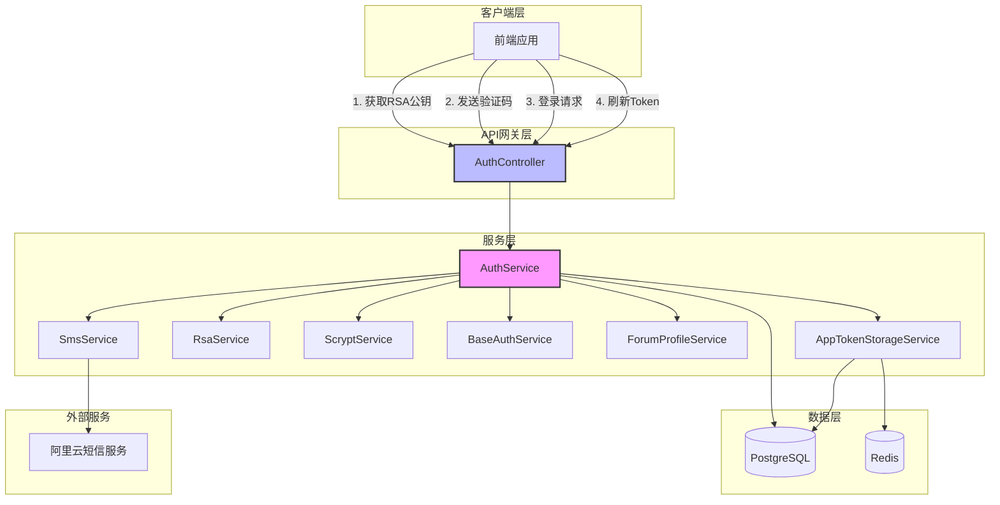
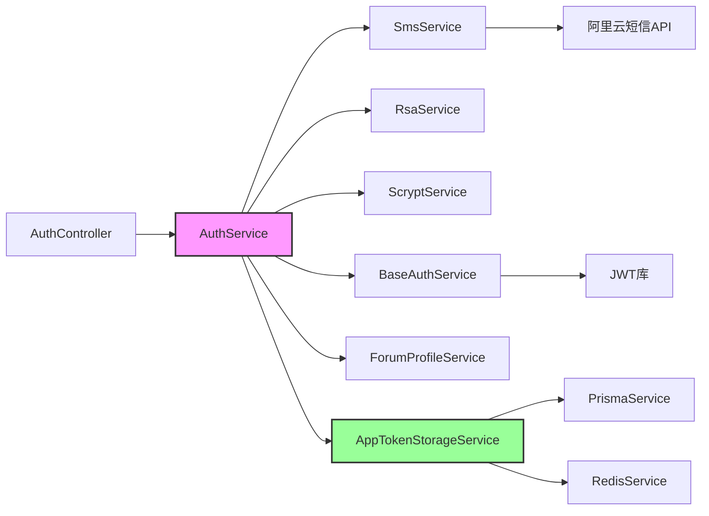
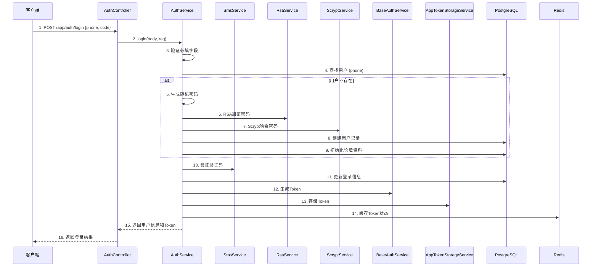
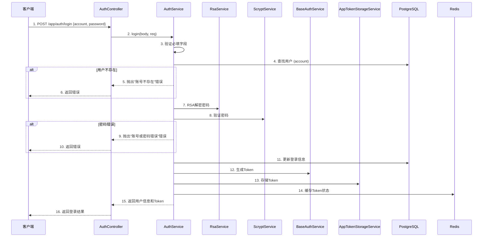
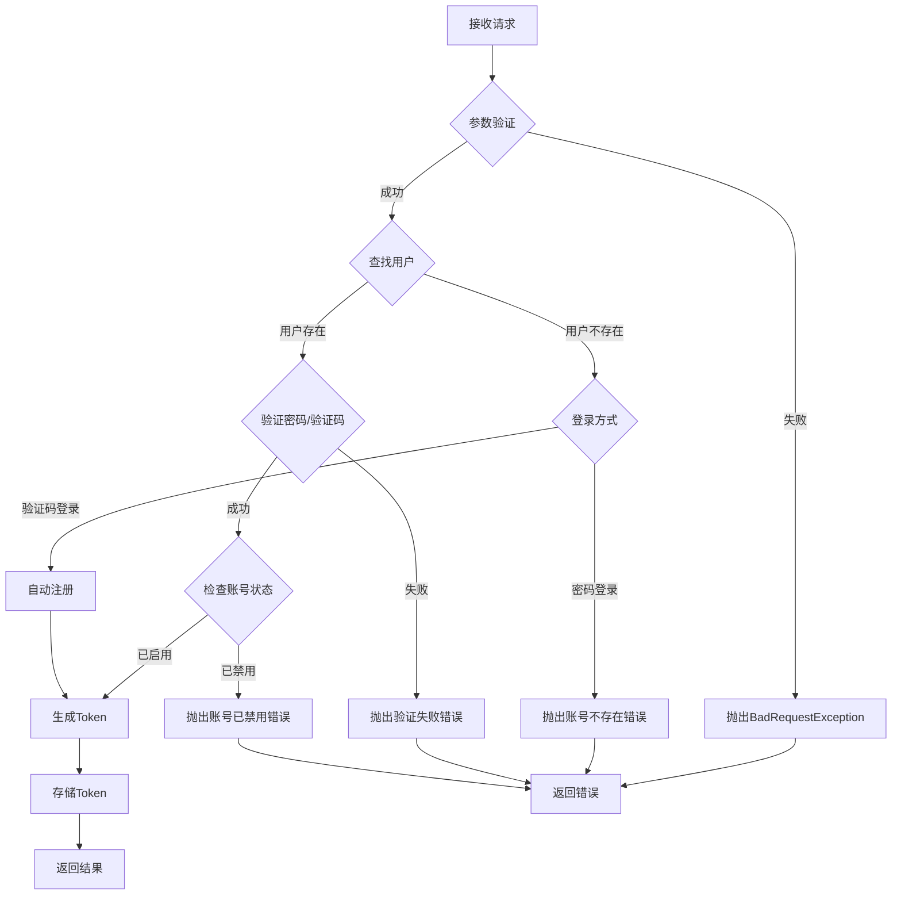

# DESIGN_优化用户认证系统

## 1. 整体架构图



## 2. 分层设计和核心组件

### 2.1 控制器层 (Controller Layer)

#### AuthController
**职责**: 接收HTTP请求，参数验证，调用服务层

**主要接口**:
- `POST /app/auth/public-key` - 获取RSA公钥
- `POST /app/auth/send-verify-code` - 发送验证码
- `POST /app/auth/login` - 用户登录
- `POST /app/auth/logout` - 用户退出登录
- `POST /app/auth/refresh-token` - 刷新访问令牌

### 2.2 服务层 (Service Layer)

#### AuthService
**职责**: 核心业务逻辑，协调各个服务完成认证流程

**主要方法**:
- `login(body: LoginDto, req: FastifyRequest)` - 用户登录
- `register(body: LoginDto)` - 用户注册
- `generateSecureRandomPassword()` - 生成安全的随机密码
- `loginWithVerifyCode(phone: string, code: string, req: FastifyRequest)` - 验证码登录
- `loginWithPassword(accountOrPhone: string, password: string, req: FastifyRequest)` - 密码登录

#### SmsService
**职责**: 发送和验证短信验证码

**主要方法**:
- `sendSmsRequest(dto: SendVerifyCodeDto)` - 发送验证码
- `checkVerifyCode(dto: VerifyCodeDto)` - 验证验证码

#### RsaService
**职责**: RSA加密和解密

**主要方法**:
- `getPublicKey()` - 获取RSA公钥
- `decryptWith(encryptedData: string)` - 解密数据

#### ScryptService
**职责**: 密码哈希和验证

**主要方法**:
- `encryptPassword(password: string, salt?: string)` - 加密密码
- `verifyPassword(inputPassword: string, storedPassword: string)` - 验证密码

#### BaseAuthService
**职责**: JWT Token生成和管理

**主要方法**:
- `generateTokens(payload: any)` - 生成Token
- `decodeToken(token: string)` - 解码Token
- `refreshAccessToken(refreshToken: string)` - 刷新Token

#### ForumProfileService
**职责**: 论坛资料管理

**主要方法**:
- `initForumProfile(tx: any, userId: number)` - 初始化论坛资料

#### AppTokenStorageService
**职责**: Token存储和管理

**主要方法**:
- `createTokens(tokens: CreateTokenDto[])` - 创建Token
- `revokeByJtis(jtis: string[], reason: string)` - 撤销Token
- `revokeAllByUserId(userId: number, reason: string)` - 撤销用户所有Token

### 2.3 数据层 (Data Layer)

#### PostgreSQL
- 存储用户信息 (AppUser表)
- 存储Token信息 (AppUserToken表)
- 存储论坛资料 (ForumProfile表)

#### Redis
- 缓存活跃Token状态
- 缓存验证码（可选）

## 3. 模块依赖关系图



## 4. 接口契约定义

### 4.1 登录接口

#### 请求
```typescript
interface LoginDto {
  account?: string;      // 账号（可选）
  phone?: string;         // 手机号（可选）
  password?: string;      // 密码（RSA加密，可选）
  code?: string;         // 验证码（可选）
}
```

**验证规则**:
- account和phone至少提供一个
- password和code至少提供一个
- 如果提供code，必须提供phone
- 如果提供password，必须提供account或phone

#### 响应
```typescript
interface LoginResponseDto {
  user: {
    id: number;
    account: number;
    nickname: string;
    phone: string;
    avatar?: string;
    email?: string;
    isEnabled: boolean;
    gender: GenderEnum;
    birthDate?: Date;
    isSignedIn: boolean;
    lastLoginAt?: Date;
    lastLoginIp?: string;
  };
  tokens: {
    accessToken: string;
    refreshToken: string;
  };
}
```

### 4.2 发送验证码接口

#### 请求
```typescript
interface SendVerifyCodeDto {
  phoneNumber: string;
  templateCode?: string;
}
```

#### 响应
```typescript
type SendVerifyCodeResponse = string; // "验证码发送成功"
```

### 4.3 获取RSA公钥接口

#### 响应
```typescript
interface RsaPublicKeyDto {
  publicKey: string;
}
```

## 5. 数据流向图

### 5.1 手机号验证码登录流程



### 5.2 账号密码登录流程



## 6. 异常处理策略

### 6.1 异常类型

| 异常类型 | HTTP状态码 | 错误信息 | 处理方式 |
|---------|-----------|---------|---------|
| BadRequestException | 400 | 手机号或账号不能为空 | 参数验证失败 |
| BadRequestException | 400 | 密码或验证码不能为空 | 参数验证失败 |
| BadRequestException | 400 | 验证码错误或已过期 | 验证码验证失败 |
| BadRequestException | 400 | 账号不存在 | 账号密码登录时账号不存在 |
| BadRequestException | 400 | 账号或密码错误 | 密码验证失败 |
| BadRequestException | 400 | 账号已被禁用 | 用户被禁用 |
| BadRequestException | 400 | 密码解密失败 | RSA解密失败 |
| Error | 500 | 系统错误 | 未知错误 |

### 6.2 异常处理流程



### 6.3 错误提示规范

1. **参数验证错误**:
   - "手机号或账号不能为空"
   - "密码或验证码不能为空"
   - "手机号格式不正确"

2. **验证码错误**:
   - "验证码错误或已过期"

3. **账号错误**:
   - "账号不存在"
   - "账号已被禁用，请联系管理员"

4. **密码错误**:
   - "账号或密码错误"

5. **系统错误**:
   - "系统错误，请稍后重试"

## 7. 安全设计

### 7.1 密码安全

#### 随机密码生成规则
- **长度**: 16位
- **字符组成**:
  - 大写字母: 2位 (A-Z)
  - 小写字母: 2位 (a-z)
  - 数字: 2位 (0-9)
  - 特殊字符: 2位 (!@#$%^&*)
  - 随机字符: 8位 (混合所有字符类型)

#### 密码存储流程
1. 生成随机密码
2. 使用RSA加密（传输层）
3. 使用Scrypt哈希（存储层）
4. 存储到数据库

### 7.2 传输安全

#### RSA加密
- **算法**: RSA-OAEP
- **哈希**: SHA-256
- **填充**: RSA_PKCS1_OAEP_PADDING
- **密钥长度**: 2048位

### 7.3 会话安全

#### JWT Token
- **Access Token**: 有效期15分钟
- **Refresh Token**: 有效期7天
- **签名算法**: HS256
- **Payload包含**: sub, phone, jti, exp, iat

#### Token管理
- 存储到数据库 (AppUserToken表)
- 缓存到Redis (活跃Token状态)
- 支持撤销 (按jti或userId)
- 设备信息记录 (deviceInfo, ipAddress, userAgent)

### 7.4 防护措施

1. **防时序攻击**: 使用常量时间比较密码
2. **防暴力破解**: 验证码有效期限制
3. **防重放攻击**: Token使用jti唯一标识
4. **防SQL注入**: 使用Prisma ORM参数化查询
5. **防XSS攻击**: 输入验证和输出转义

## 8. 性能优化

### 8.1 缓存策略

#### Redis缓存
- **缓存内容**: 活跃Token状态
- **缓存时间**: Token有效期
- **缓存更新**: 异步更新，不阻塞主流程
- **缓存失效**: Token撤销时立即失效

### 8.2 数据库优化

#### 索引设计
- AppUser表:
  - account字段: 唯一索引
  - phone字段: 唯一索引
  - email字段: 唯一索引
  - isEnabled字段: 普通索引

- AppUserToken表:
  - userId字段: 普通索引
  - jti字段: 唯一索引
  - expiresAt字段: 普通索引

#### 查询优化
- 使用事务保证数据一致性
- 批量操作使用Promise.all并行执行
- 避免N+1查询问题

### 8.3 并发处理

#### 异步操作
- Token存储到Redis: 异步执行
- 设备信息解析: 同步执行
- 论坛资料初始化: 同步执行（事务内）

## 9. 可扩展性设计

### 9.1 登录方式扩展

当前支持:
- 手机号 + 验证码
- 账号 + 密码
- 手机号 + 密码

未来可扩展:
- 邮箱 + 密码
- 第三方登录（微信、QQ、GitHub等）
- 生物识别登录

### 9.2 验证方式扩展

当前支持:
- 短信验证码

未来可扩展:
- 邮箱验证码
- 图形验证码
- 滑动验证码
- 行为验证

### 9.3 安全策略扩展

当前实现:
- RSA加密
- Scrypt哈希
- JWT双Token

未来可扩展:
- 多因素认证（2FA）
- 设备指纹识别
- 异地登录检测
- 登录风险评估

## 10. 监控和日志

### 10.1 日志记录

#### 登录日志
- 登录时间
- 登录IP
- 登录设备
- 登录方式
- 登录结果

#### 异常日志
- 异常类型
- 异常信息
- 异常堆栈
- 请求参数（脱敏）

### 10.2 监控指标

#### 业务指标
- 登录成功率
- 注册成功率
- 验证码发送成功率
- Token刷新成功率

#### 性能指标
- 登录接口响应时间
- 注册接口响应时间
- 验证码发送响应时间
- Token刷新响应时间

#### 安全指标
- 异常登录次数
- 账号锁定次数
- 验证码错误次数
- 密码错误次数
