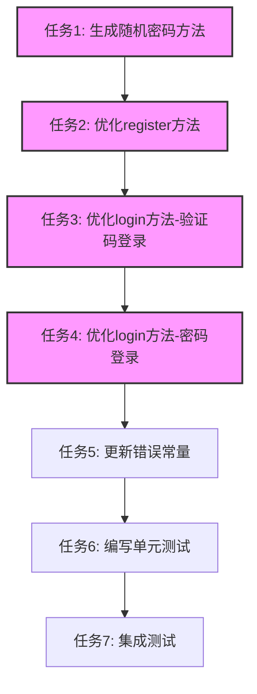

# TASK_优化用户认证系统

## 任务依赖图



## 任务1: 生成随机密码方法

### 输入契约
- **前置依赖**: 无
- **输入数据**: 无
- **环境依赖**: AuthService类

### 输出契约
- **输出数据**: 返回16位随机密码字符串
- **交付物**: `generateSecureRandomPassword()` 方法
- **验收标准**:
  - 密码长度为16位
  - 包含至少2位大写字母
  - 包含至少2位小写字母
  - 包含至少2位数字
  - 包含至少2位特殊字符(!@#$%^&*)
  - 密码字符随机分布

### 实现约束
- **技术栈**: TypeScript, Node.js crypto模块
- **接口规范**: 私有方法，返回string类型
- **质量要求**: 
  - 使用crypto.randomBytes生成随机数
  - 确保密码复杂度符合安全要求
  - 添加JSDoc注释

### 依赖关系
- **后置任务**: 任务2
- **并行任务**: 无

### 实现细节
```typescript
private generateSecureRandomPassword(): string {
  const uppercase = 'ABCDEFGHIJKLMNOPQRSTUVWXYZ';
  const lowercase = 'abcdefghijklmnopqrstuvwxyz';
  const numbers = '0123456789';
  const special = '!@#$%^&*';
  
  let password = '';
  
  // 确保每种类型至少有2位
  for (let i = 0; i < 2; i++) {
    password += uppercase[Math.floor(Math.random() * uppercase.length)];
    password += lowercase[Math.floor(Math.random() * lowercase.length)];
    password += numbers[Math.floor(Math.random() * numbers.length)];
    password += special[Math.floor(Math.random() * special.length)];
  }
  
  // 剩余8位随机字符
  const allChars = uppercase + lowercase + numbers + special;
  for (let i = 0; i < 8; i++) {
    password += allChars[Math.floor(Math.random() * allChars.length)];
  }
  
  // 打乱密码顺序
  return password.split('').sort(() => Math.random() - 0.5).join('');
}
```

---

## 任务2: 优化register方法

### 输入契约
- **前置依赖**: 任务1完成
- **输入数据**: LoginDto { phone, code?, password? }
- **环境依赖**: 
  - AuthService类
  - SmsService
  - RsaService
  - ScryptService
  - ForumProfileService
  - Prisma客户端

### 输出契约
- **输出数据**: LoginResponseDto { user, tokens }
- **交付物**: 优化后的register方法
- **验收标准**:
  - 支持验证码注册（无需password）
  - 支持密码注册（需要password）
  - 验证码注册时自动生成随机密码
  - 密码使用RSA加密和Scrypt哈希
  - 生成唯一账号
  - 初始化论坛资料
  - 生成JWT Token
  - 返回用户信息和Token

### 实现约束
- **技术栈**: TypeScript, NestJS, Prisma
- **接口规范**: public async register(body: LoginDto): Promise<LoginResponseDto>
- **质量要求**:
  - 使用事务保证数据一致性
  - 遵循现有代码规范
  - 添加JSDoc注释
  - 错误处理完善

### 依赖关系
- **后置任务**: 任务3
- **并行任务**: 无

### 实现细节
```typescript
async register(body: LoginDto) {
  if (body.phone && body.code) {
    await this.smsService.checkVerifyCode({
      phoneNumber: body.phone,
      verifyCode: body.code,
    });
  }

  let password: string;
  
  if (body.password) {
    password = this.rsaService.decryptWith(body.password);
  } else {
    password = this.generateSecureRandomPassword();
  }

  const hashedPassword = await this.scryptService.encryptPassword(password);

  const user = await this.prisma.$transaction(async (tx) => {
    const uid = await this.generateUniqueAccount();
    const newUser = await tx.appUser.create({
      data: {
        account: uid,
        nickname: `用户${uid}`,
        password: hashedPassword,
        phone: body.phone,
        gender: GenderEnum.UNKNOWN,
        isEnabled: true,
      },
    });

    await this.profileService.initForumProfile(tx as any, newUser.id);

    return newUser;
  });

  const tokens = await this.baseJwtService.generateTokens({
    sub: String(user.id),
    phone: user.phone,
  });

  return {
    user: this.sanitizeUser(user),
    tokens,
  };
}
```

---

## 任务3: 优化login方法-验证码登录

### 输入契约
- **前置依赖**: 任务2完成
- **输入数据**: LoginDto { phone, code }
- **环境依赖**:
  - AuthService类
  - SmsService
  - RsaService
  - ScryptService
  - BaseAuthService
  - AppTokenStorageService
  - Prisma客户端
  - FastifyRequest对象

### 输出契约
- **输出数据**: LoginResponseDto { user, tokens }
- **交付物**: 优化后的login方法（验证码登录部分）
- **验收标准**:
  - 验证手机号和验证码必填
  - 查找用户（通过phone）
  - 如果用户不存在，自动注册（调用register方法）
  - 如果用户存在，验证验证码
  - 更新登录信息（lastLoginAt, lastLoginIp）
  - 生成JWT Token
  - 存储Token到数据库和Redis
  - 返回用户信息和Token

### 实现约束
- **技术栈**: TypeScript, NestJS, Prisma, Redis
- **接口规范**: public async login(body: LoginDto, req: FastifyRequest): Promise<LoginResponseDto>
- **质量要求**:
  - 遵循现有代码规范
  - 添加JSDoc注释
  - 错误处理完善
  - 使用现有工具函数（extractIpAddress, parseDeviceInfo）

### 依赖关系
- **后置任务**: 任务4
- **并行任务**: 无

### 实现细节
```typescript
async login(body: LoginDto, req: FastifyRequest) {
  if (!body.phone && !body.account) {
    throw new BadRequestException(ErrorMessages.PHONE_OR_ACCOUNT_REQUIRED);
  }

  if (!body.code && !body.password) {
    throw new BadRequestException(ErrorMessages.PASSWORD_OR_CODE_REQUIRED);
  }

  const user = await this.appUser.findFirst({
    where: {
      OR: [{ phone: body.phone }, { account: body.account }],
    },
  });

  if (!user) {
    if (body.code) {
      return this.register(body);
    }
    throw new BadRequestException(ErrorMessages.ACCOUNT_NOT_FOUND);
  }

  if (body.code) {
    await this.smsService.checkVerifyCode({
      phoneNumber: user.phone!,
      verifyCode: body.code,
    });
  }

  if (!user.isEnabled) {
    throw new BadRequestException(ErrorMessages.ACCOUNT_DISABLED);
  }

  await this.updateUserLoginInfo(user.id, req);

  const tokens = await this.baseJwtService.generateTokens({
    sub: String(user.id),
    phone: user.phone,
  });

  await this.storeTokens(user.id, tokens, req);

  return {
    user: this.sanitizeUser(user),
    tokens,
  };
}
```

---

## 任务4: 优化login方法-密码登录

### 输入契约
- **前置依赖**: 任务3完成
- **输入数据**: LoginDto { account, password } 或 { phone, password }
- **环境依赖**:
  - AuthService类
  - RsaService
  - ScryptService
  - BaseAuthService
  - AppTokenStorageService
  - Prisma客户端
  - FastifyRequest对象

### 输出契约
- **输出数据**: LoginResponseDto { user, tokens }
- **交付物**: 优化后的login方法（密码登录部分）
- **验收标准**:
  - 验证账号/手机号和密码必填
  - 查找用户（通过account或phone）
  - 如果用户不存在，抛出"账号不存在"错误
  - 如果用户存在，验证密码
  - 检查账号状态
  - 更新登录信息（lastLoginAt, lastLoginIp）
  - 生成JWT Token
  - 存储Token到数据库和Redis
  - 返回用户信息和Token

### 实现约束
- **技术栈**: TypeScript, NestJS, Prisma, Redis
- **接口规范**: public async login(body: LoginDto, req: FastifyRequest): Promise<LoginResponseDto>
- **质量要求**:
  - 遵循现有代码规范
  - 添加JSDoc注释
  - 错误处理完善
  - 使用现有工具函数（extractIpAddress, parseDeviceInfo）

### 依赖关系
- **后置任务**: 任务5
- **并行任务**: 无

### 实现细节
```typescript
async login(body: LoginDto, req: FastifyRequest) {
  if (!body.phone && !body.account) {
    throw new BadRequestException(ErrorMessages.PHONE_OR_ACCOUNT_REQUIRED);
  }

  if (!body.code && !body.password) {
    throw new BadRequestException(ErrorMessages.PASSWORD_OR_CODE_REQUIRED);
  }

  const user = await this.appUser.findFirst({
    where: {
      OR: [{ phone: body.phone }, { account: body.account }],
    },
  });

  if (!user) {
    if (body.code) {
      return this.register(body);
    }
    throw new BadRequestException(ErrorMessages.ACCOUNT_NOT_FOUND);
  }

  if (body.code) {
    await this.smsService.checkVerifyCode({
      phoneNumber: user.phone!,
      verifyCode: body.code,
    });
  } else {
    const password = this.rsaService.decryptWith(body.password!);
    const isPasswordValid = await this.scryptService.verifyPassword(
      password,
      user.password,
    );
    if (!isPasswordValid) {
      throw new BadRequestException(ErrorMessages.ACCOUNT_OR_PASSWORD_ERROR);
    }
  }

  if (!user.isEnabled) {
    throw new BadRequestException(ErrorMessages.ACCOUNT_DISABLED);
  }

  await this.updateUserLoginInfo(user.id, req);

  const tokens = await this.baseJwtService.generateTokens({
    sub: String(user.id),
    phone: user.phone,
  });

  await this.storeTokens(user.id, tokens, req);

  return {
    user: this.sanitizeUser(user),
    tokens,
  };
}
```

---

## 任务5: 更新错误常量

### 输入契约
- **前置依赖**: 任务4完成
- **输入数据**: 无
- **环境依赖**: auth.constant.ts文件

### 输出契约
- **输出数据**: 更新后的ErrorMessages对象
- **交付物**: 更新后的auth.constant.ts文件
- **验收标准**:
  - 添加"验证码错误或已过期"错误信息
  - 保持现有错误信息不变
  - 错误信息清晰明确

### 实现约束
- **技术栈**: TypeScript
- **接口规范**: 导出ErrorMessages常量对象
- **质量要求**:
  - 遵循现有代码规范
  - 错误信息使用中文

### 依赖关系
- **后置任务**: 任务6
- **并行任务**: 无

### 实现细节
```typescript
export const ErrorMessages = {
  ACCOUNT_OR_PASSWORD_ERROR: '账号或密码错误',
  ACCOUNT_DISABLED: '账号已被禁用，请联系管理员',
  ACCOUNT_NOT_FOUND: '账号不存在',
  PHONE_EXISTS: '手机号已注册',
  EMAIL_EXISTS: '邮箱已注册',
  DEFAULT_LEVEL_NOT_FOUND: '系统配置错误：找不到默认论坛等级',
  IP_ADDRESS_UNKNOWN: 'unknown',
  PHONE_OR_ACCOUNT_REQUIRED: '手机号或账号不能为空',
  PASSWORD_OR_CODE_REQUIRED: '密码或验证码不能为空',
  VERIFY_CODE_INVALID: '验证码错误或已过期',
};
```

---

## 任务6: 编写单元测试

### 输入契约
- **前置依赖**: 任务5完成
- **输入数据**: 无
- **环境依赖**:
  - Jest测试框架
  - 测试数据库
  - Mock服务

### 输出契约
- **输出数据**: 测试用例文件
- **交付物**: auth.service.spec.ts文件
- **验收标准**:
  - 测试覆盖率 > 80%
  - 所有测试用例通过
  - 测试用例包含正常流程和异常流程

### 实现约束
- **技术栈**: Jest, TypeScript
- **接口规范**: 使用Jest测试框架
- **质量要求**:
  - 测试用例独立可运行
  - 使用Mock隔离依赖
  - 测试数据使用seed脚本生成

### 依赖关系
- **后置任务**: 任务7
- **并行任务**: 无

### 测试用例列表
1. `generateSecureRandomPassword()` - 测试密码生成
   - 验证密码长度
   - 验证密码复杂度
   - 验证密码随机性

2. `register()` - 测试注册功能
   - 验证码注册成功
   - 密码注册成功
   - 手机号已存在时抛出错误
   - 验证码验证失败时抛出错误

3. `login()` - 测试登录功能
   - 手机号验证码登录成功
   - 手机号验证码登录自动注册
   - 账号密码登录成功
   - 手机号密码登录成功
   - 账号不存在时抛出错误
   - 密码错误时抛出错误
   - 账号已禁用时抛出错误

### 实现细节
```typescript
describe('AuthService', () => {
  let service: AuthService;
  let prisma: PrismaClient;

  beforeEach(async () => {
    const module: TestingModule = await Test.createTestingModule({
      providers: [
        AuthService,
        // Mock dependencies
      ],
    }).compile();

    service = module.get<AuthService>(AuthService);
    prisma = module.get<PrismaClient>(PrismaClient);
  });

  describe('generateSecureRandomPassword', () => {
    it('should generate a 16-character password', () => {
      const password = (service as any).generateSecureRandomPassword();
      expect(password).toHaveLength(16);
    });

    it('should contain at least 2 uppercase letters', () => {
      const password = (service as any).generateSecureRandomPassword();
      const uppercaseCount = (password.match(/[A-Z]/g) || []).length;
      expect(uppercaseCount).toBeGreaterThanOrEqual(2);
    });

    it('should contain at least 2 lowercase letters', () => {
      const password = (service as any).generateSecureRandomPassword();
      const lowercaseCount = (password.match(/[a-z]/g) || []).length;
      expect(lowercaseCount).toBeGreaterThanOrEqual(2);
    });

    it('should contain at least 2 numbers', () => {
      const password = (service as any).generateSecureRandomPassword();
      const numberCount = (password.match(/[0-9]/g) || []).length;
      expect(numberCount).toBeGreaterThanOrEqual(2);
    });

    it('should contain at least 2 special characters', () => {
      const password = (service as any).generateSecureRandomPassword();
      const specialCount = (password.match(/[!@#$%^&*]/g) || []).length;
      expect(specialCount).toBeGreaterThanOrEqual(2);
    });
  });

  describe('register', () => {
    it('should register a new user with verify code', async () => {
      const body: LoginDto = {
        phone: '13800000000',
        code: '123456',
      };

      const result = await service.register(body);

      expect(result.user).toBeDefined();
      expect(result.tokens).toBeDefined();
      expect(result.user.phone).toBe(body.phone);
    });

    it('should register a new user with password', async () => {
      const body: LoginDto = {
        phone: '13800000001',
        password: 'encryptedPassword',
      };

      const result = await service.register(body);

      expect(result.user).toBeDefined();
      expect(result.tokens).toBeDefined();
      expect(result.user.phone).toBe(body.phone);
    });
  });

  describe('login', () => {
    it('should login with phone and verify code', async () => {
      const body: LoginDto = {
        phone: '13800000000',
        code: '123456',
      };

      const req = createMock<FastifyRequest>();

      const result = await service.login(body, req);

      expect(result.user).toBeDefined();
      expect(result.tokens).toBeDefined();
    });

    it('should auto-register if user not found with verify code', async () => {
      const body: LoginDto = {
        phone: '13800000002',
        code: '123456',
      };

      const req = createMock<FastifyRequest>();

      const result = await service.login(body, req);

      expect(result.user).toBeDefined();
      expect(result.tokens).toBeDefined();
    });

    it('should throw error if account not found with password', async () => {
      const body: LoginDto = {
        account: '999999',
        password: 'encryptedPassword',
      };

      const req = createMock<FastifyRequest>();

      await expect(service.login(body, req)).rejects.toThrow(
        BadRequestException,
      );
    });

    it('should throw error if password is incorrect', async () => {
      const body: LoginDto = {
        account: '123456',
        password: 'wrongPassword',
      };

      const req = createMock<FastifyRequest>();

      await expect(service.login(body, req)).rejects.toThrow(
        BadRequestException,
      );
    });
  });
});
```

---

## 任务7: 集成测试

### 输入契约
- **前置依赖**: 任务6完成
- **输入数据**: 无
- **环境依赖**:
  - Jest测试框架
  - 测试数据库
  - 测试Redis
  - 测试环境配置

### 输出契约
- **输出数据**: 集成测试用例文件
- **交付物**: auth.e2e-spec.ts文件
- **验收标准**:
  - 所有集成测试用例通过
  - 测试覆盖主要业务流程
  - 测试环境与生产环境一致

### 实现约束
- **技术栈**: Jest, TypeScript, Supertest
- **接口规范**: 使用Jest和Supertest测试框架
- **质量要求**:
  - 测试用例独立可运行
  - 测试数据使用seed脚本生成
  - 测试完成后清理数据

### 依赖关系
- **后置任务**: 无
- **并行任务**: 无

### 测试用例列表
1. 完整的验证码登录流程
   - 发送验证码
   - 验证码登录（用户存在）
   - 验证码登录（用户不存在，自动注册）

2. 完整的密码登录流程
   - 账号密码登录（用户存在）
   - 手机号密码登录（用户存在）
   - 账号密码登录（用户不存在）

3. Token管理流程
   - 登录获取Token
   - 使用Token访问受保护接口
   - 刷新Token
   - 退出登录

### 实现细节
```typescript
describe('AuthController (e2e)', () => {
  let app: INestApplication;
  let prisma: PrismaClient;

  beforeAll(async () => {
    const moduleFixture: TestingModule = await Test.createTestingModule({
      imports: [AppModule],
    }).compile();

    app = moduleFixture.createNestApplication();
    await app.init();

    prisma = new PrismaClient();
  });

  afterAll(async () => {
    await app.close();
    await prisma.$disconnect();
  });

  describe('POST /app/auth/login', () => {
    it('should login with phone and verify code', async () => {
      const response = await request(app.getHttpServer())
        .post('/app/auth/login')
        .send({
          phone: '13800000000',
          code: '123456',
        })
        .expect(201);

      expect(response.body.user).toBeDefined();
      expect(response.body.tokens).toBeDefined();
    });

    it('should auto-register if user not found with verify code', async () => {
      const response = await request(app.getHttpServer())
        .post('/app/auth/login')
        .send({
          phone: '13800000002',
          code: '123456',
        })
        .expect(201);

      expect(response.body.user).toBeDefined();
      expect(response.body.tokens).toBeDefined();
    });

    it('should throw error if account not found with password', async () => {
      await request(app.getHttpServer())
        .post('/app/auth/login')
        .send({
          account: '999999',
          password: 'encryptedPassword',
        })
        .expect(400);
    });
  });
});
```

---

## 辅助方法提取

在实现任务3和任务4时，可以提取以下辅助方法以提高代码复用性：

### updateUserLoginInfo
```typescript
private async updateUserLoginInfo(userId: number, req: FastifyRequest) {
  await this.prisma.appUser.update({
    where: { id: userId },
    data: {
      lastLoginAt: new Date(),
      lastLoginIp: extractIpAddress(req) || ErrorMessages.IP_ADDRESS_UNKNOWN,
    },
  });
}
```

### storeTokens
```typescript
private async storeTokens(userId: number, tokens: any, req: FastifyRequest) {
  const accessPayload = await this.baseJwtService.decodeToken(tokens.accessToken);
  const refreshPayload = await this.baseJwtService.decodeToken(tokens.refreshToken);

  const accessTokenExpiresAt = new Date(accessPayload.exp * 1000);
  const refreshTokenExpiresAt = new Date(refreshPayload.exp * 1000);

  const deviceInfo = parseDeviceInfo(req.headers['user-agent']);

  await this.tokenStorageService.createTokens([
    {
      userId,
      jti: accessPayload.jti,
      tokenType: 'ACCESS',
      expiresAt: accessTokenExpiresAt,
      deviceInfo,
      ipAddress: extractIpAddress(req) || ErrorMessages.IP_ADDRESS_UNKNOWN,
      userAgent: req.headers['user-agent'],
    },
    {
      userId,
      jti: refreshPayload.jti,
      tokenType: 'REFRESH',
      expiresAt: refreshTokenExpiresAt,
      deviceInfo,
      ipAddress: extractIpAddress(req) || ErrorMessages.IP_ADDRESS_UNKNOWN,
      userAgent: req.headers['user-agent'],
    },
  ]);
}
```
