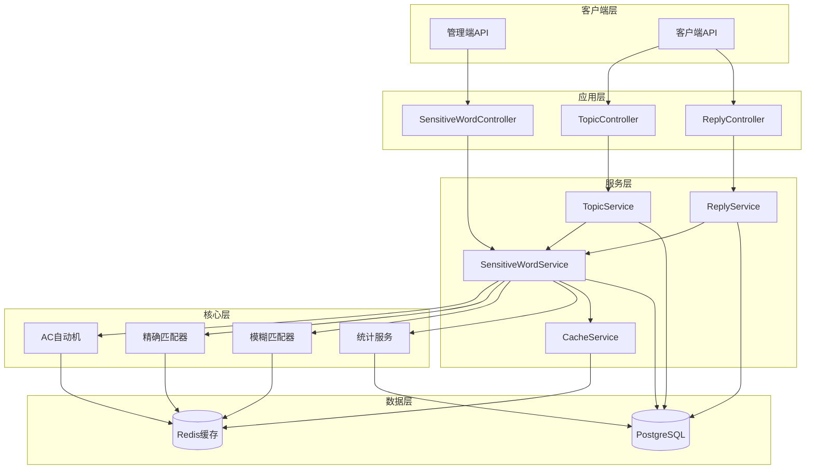
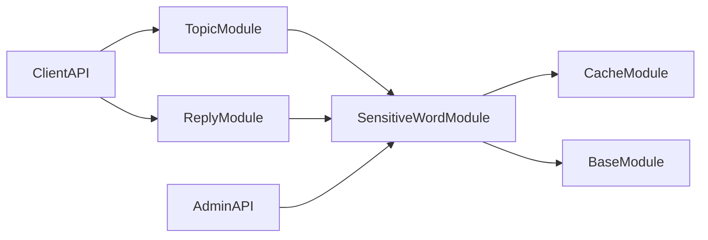
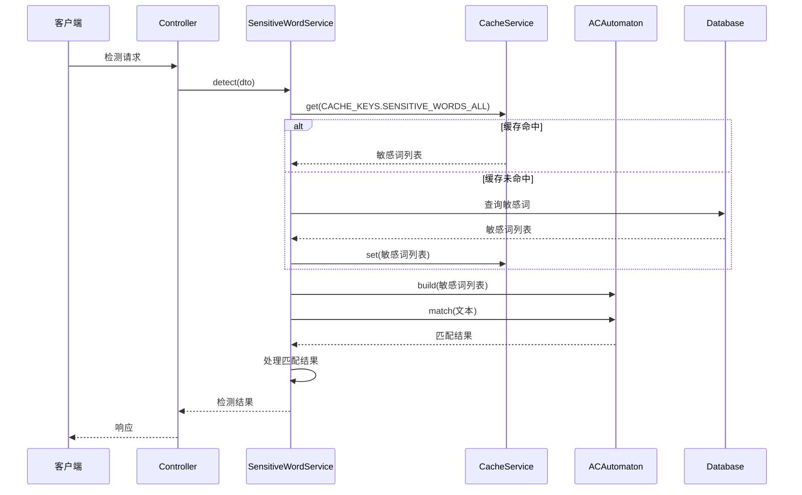
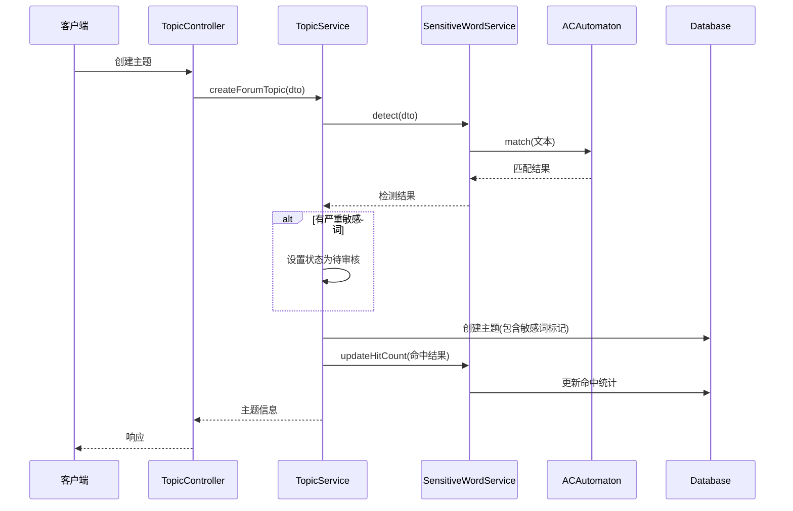
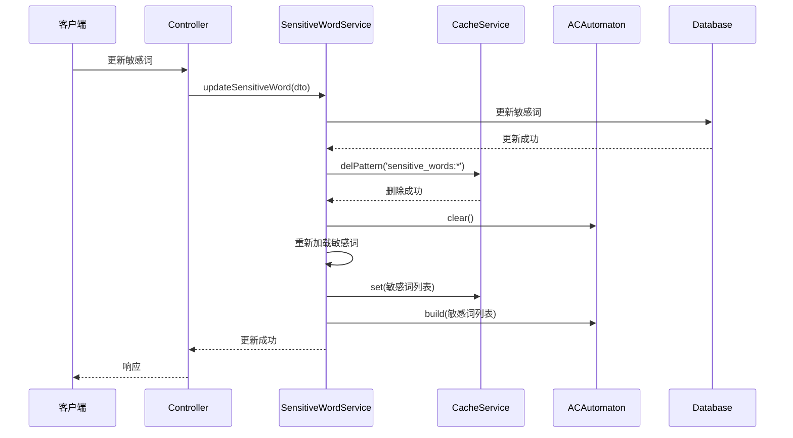
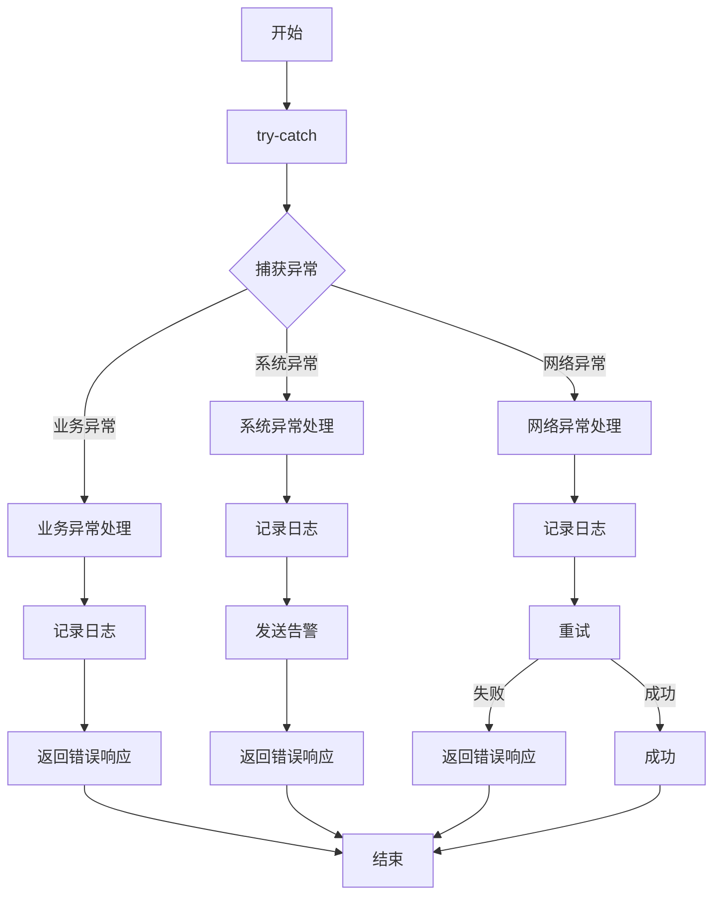

# 敏感词模块优化 - 设计文档

## 1. 整体架构设计

### 1.1 架构图



### 1.2 分层设计

**客户端层:**
- 管理端API: 敏感词管理、批量导入导出、统计查询
- 客户端API: 主题创建、回复创建(自动集成敏感词检测)

**应用层:**
- SensitiveWordController: 敏感词管理控制器
- TopicController: 主题管理控制器
- ReplyController: 回复管理控制器

**服务层:**
- SensitiveWordService: 敏感词核心服务
- TopicService: 主题业务服务
- ReplyService: 回复业务服务
- CacheService: 缓存管理服务

**核心层:**
- ACAutomaton: AC自动机算法实现
- ExactMatcher: 精确匹配器
- FuzzyMatcher: 模糊匹配器
- StatisticsService: 统计服务

**数据层:**
- Redis: 缓存存储
- PostgreSQL: 持久化存储

## 2. 核心组件设计

### 2.1 AC自动机组件

**类设计:**
```typescript
class ACAutomaton {
  private root: TrieNode
  private built: boolean
  
  constructor()
  
  build(words: SensitiveWord[]): void
  match(text: string): MatchResult[]
  clear(): void
  isBuilt(): boolean
}

class TrieNode {
  children: Map<string, TrieNode>
  fail: TrieNode | null
  output: SensitiveWord | null
  depth: number
  
  constructor()
}
```

**接口定义:**
```typescript
interface SensitiveWord {
  word: string
  level: number
  type: number
  matchMode: number
}

interface MatchResult {
  word: string
  position: number
  level: number
  type: number
  matchMode: number
}
```

**核心算法:**
```typescript
build(words: SensitiveWord[]): void {
  // 1. 构建Trie树
  for (const word of words) {
    this.insert(word)
  }
  
  // 2. 构建失败指针(BFS)
  this.buildFailPointers()
  
  this.built = true
}

match(text: string): MatchResult[] {
  const results: MatchResult[] = []
  let current = this.root
  
  for (let i = 0; i < text.length; i++) {
    const char = text[i]
    
    // 沿着失败指针回溯
    while (current !== this.root && !current.children.has(char)) {
      current = current.fail!
    }
    
    if (current.children.has(char)) {
      current = current.children.get(char)!
    }
    
    // 收集匹配结果
    let temp = current
    while (temp !== this.root) {
      if (temp.output) {
        results.push({
          word: temp.output.word,
          position: i - temp.output.word.length + 1,
          level: temp.output.level,
          type: temp.output.type,
          matchMode: temp.output.matchMode
        })
      }
      temp = temp.fail!
    }
  }
  
  return results
}
```

### 2.2 敏感词服务组件

**类设计:**
```typescript
class SensitiveWordService extends BaseService {
  private acAutomaton: ACAutomaton
  private exactMatcher: ExactMatcher
  private fuzzyMatcher: FuzzyMatcher
  private statisticsService: StatisticsService
  private cacheService: CacheService
  
  constructor(
    private cacheService: CacheService,
    private statisticsService: StatisticsService
  ) {
    super()
    this.acAutomaton = new ACAutomaton()
    this.exactMatcher = new ExactMatcher()
    this.fuzzyMatcher = new FuzzyMatcher()
  }
  
  async detect(dto: DetectDto): Promise<DetectResult>
  async detectText(text: string): Promise<DetectResult>
  async batchDetect(texts: string[]): Promise<BatchDetectResult>
  async refreshCache(): Promise<void>
  async updateHitCount(hits: MatchResult[]): Promise<void>
  async getStatistics(dto: StatisticsDto): Promise<StatisticsResult>
  async import(file: Express.Multer.File): Promise<ImportResult>
  async export(dto: ExportDto): Promise<Buffer>
}
```

**接口定义:**
```typescript
interface DetectDto {
  title?: string
  content?: string
  fields?: string[]
}

interface DetectResult {
  hasSensitive: boolean
  hasSevere: boolean
  hits: MatchResult[]
  fieldHits: Record<string, MatchResult[]>
}

interface BatchDetectResult {
  results: DetectResult[]
  totalHits: number
}

interface StatisticsDto {
  startDate?: Date
  endDate?: Date
  type?: number
  level?: number
}

interface StatisticsResult {
  totalHits: number
  byType: Record<number, number>
  byLevel: Record<number, number>
  byDate: Record<string, number>
  topWords: Array<{
    word: string
    hitCount: number
  }>
}

interface ImportResult {
  success: number
  failed: number
  errors: Array<{
    word: string
    error: string
  }>
}

interface ExportDto {
  type?: number
  level?: number
  format?: 'excel' | 'csv'
}
```

### 2.3 精确匹配器组件

**类设计:**
```typescript
class ExactMatcher {
  private acAutomaton: ACAutomaton
  
  constructor()
  
  match(text: string): MatchResult[]
  build(words: SensitiveWord[]): void
}
```

### 2.4 模糊匹配器组件

**类设计:**
```typescript
class FuzzyMatcher {
  private pinyinDict: Map<string, string[]>
  private threshold: number
  
  constructor(threshold: number = 0.8)
  
  match(text: string, words: SensitiveWord[]): MatchResult[]
  loadPinyinDict(dict: Map<string, string[]>): void
  calculateSimilarity(text1: string, text2: string): number
  toPinyin(text: string): string[]
}
```

### 2.5 统计服务组件

**类设计:**
```typescript
class StatisticsService {
  async updateHitCount(hits: MatchResult[]): Promise<void>
  async getStatistics(dto: StatisticsDto): Promise<StatisticsResult>
  async getTopWords(limit: number): Promise<Array<{word: string, hitCount: number}>>
  async getHitsByType(startDate: Date, endDate: Date): Promise<Record<number, number>>
  async getHitsByLevel(startDate: Date, endDate: Date): Promise<Record<number, number>>
  async getHitsByDate(startDate: Date, endDate: Date): Promise<Record<string, number>>
}
```

### 2.6 缓存服务组件

**类设计:**
```typescript
class CacheService {
  private cacheManager: Cache
  
  constructor(@Inject(CACHE_MANAGER) cacheManager: Cache)
  
  async get(key: string): Promise<any>
  async set(key: string, value: any, ttl?: number): Promise<void>
  async del(key: string): Promise<void>
  async delPattern(pattern: string): Promise<void>
}
```

**缓存键设计:**
```typescript
const CACHE_KEYS = {
  SENSITIVE_WORDS_ALL: 'sensitive_words:all',
  SENSITIVE_WORDS_BY_TYPE: (type: number) => `sensitive_words:type:${type}`,
  SENSITIVE_WORDS_BY_LEVEL: (level: number) => `sensitive_words:level:${level}`,
  SENSITIVE_WORDS_STATS: 'sensitive_words:stats',
  SENSITIVE_WORDS_TOP_WORDS: 'sensitive_words:top_words'
}
```

## 3. 模块依赖关系

### 3.1 依赖关系图



### 3.2 模块导入关系

**SensitiveWordModule:**
```typescript
@Module({
  imports: [CacheModule],
  providers: [
    SensitiveWordService,
    ACAutomaton,
    ExactMatcher,
    FuzzyMatcher,
    StatisticsService
  ],
  exports: [SensitiveWordService],
  controllers: [SensitiveWordController]
})
export class SensitiveWordModule {}
```

**TopicModule:**
```typescript
@Module({
  imports: [SensitiveWordModule],
  providers: [TopicService],
  controllers: [TopicController]
})
export class TopicModule {}
```

**ReplyModule:**
```typescript
@Module({
  imports: [SensitiveWordModule],
  providers: [ReplyService],
  controllers: [ReplyController]
})
export class ReplyModule {}
```

## 4. 接口契约定义

### 4.1 敏感词检测接口

**请求:**
```typescript
POST /api/sensitive-word/detect
Content-Type: application/json

{
  "text": "这是一段测试文本",
  "fields": ["title", "content"]
}
```

**响应:**
```typescript
{
  "hasSensitive": true,
  "hasSevere": false,
  "hits": [
    {
      "word": "测试",
      "position": 3,
      "level": 2,
      "type": 5,
      "matchMode": 1
    }
  ],
  "fieldHits": {
    "title": [],
    "content": [
      {
        "word": "测试",
        "position": 3,
        "level": 2,
        "type": 5,
        "matchMode": 1
      }
    ]
  }
}
```

### 4.2 批量导入接口

**请求:**
```typescript
POST /api/sensitive-word/import
Content-Type: multipart/form-data

file: sensitive_words.xlsx
```

**响应:**
```typescript
{
  "success": 95,
  "failed": 5,
  "errors": [
    {
      "word": "测试词",
      "error": "敏感词已存在"
    }
  ]
}
```

### 4.3 批量导出接口

**请求:**
```typescript
GET /api/sensitive-word/export?type=1&level=2&format=excel
```

**响应:**
```
Content-Type: application/vnd.openxmlformats-officedocument.spreadsheetml.sheet
Content-Disposition: attachment; filename="sensitive_words.xlsx"

[二进制文件内容]
```

### 4.4 统计接口

**请求:**
```typescript
GET /api/sensitive-word/statistics?startDate=2026-01-01&endDate=2026-01-31&type=1&level=2
```

**响应:**
```typescript
{
  "totalHits": 1234,
  "byType": {
    "1": 500,
    "2": 300,
    "3": 200,
    "4": 100,
    "5": 134
  },
  "byLevel": {
    "1": 400,
    "2": 600,
    "3": 234
  },
  "byDate": {
    "2026-01-01": 40,
    "2026-01-02": 35,
    "2026-01-03": 50
  },
  "topWords": [
    {
      "word": "测试词1",
      "hitCount": 100
    },
    {
      "word": "测试词2",
      "hitCount": 80
    }
  ]
}
```

## 5. 数据流向设计

### 5.1 敏感词检测流程



### 5.2 主题创建流程



### 5.3 缓存刷新流程



## 6. 异常处理策略

### 6.1 异常分类

**业务异常:**
- SensitiveWordAlreadyExists: 敏感词已存在
- SensitiveWordNotFound: 敏感词不存在
- InvalidSensitiveWordFormat: 敏感词格式无效
- SensitiveWordDetectionFailed: 敏感词检测失败

**系统异常:**
- CacheError: 缓存错误
- DatabaseError: 数据库错误
- ACAutomatonError: AC自动机错误

**网络异常:**
- NetworkError: 网络错误
- TimeoutError: 超时错误

### 6.2 异常处理流程



### 6.3 异常处理代码

```typescript
class SensitiveWordService extends BaseService {
  async detect(dto: DetectDto): Promise<DetectResult> {
    try {
      const words = await this.getSensitiveWords()
      this.acAutomaton.build(words)
      
      const hits = this.acAutomaton.match(dto.text)
      return this.processHits(hits)
    } catch (error) {
      if (error instanceof SensitiveWordDetectionFailed) {
        throw new BadRequestException('敏感词检测失败')
      }
      
      this.logger.error('敏感词检测异常', error)
      throw new InternalServerErrorException('系统错误,请稍后重试')
    }
  }
  
  async updateSensitiveWord(dto: UpdateSensitiveWordDto): Promise<void> {
    try {
      await this.prisma.$transaction(async (tx) => {
        await tx.forumSensitiveWord.update({
          where: { id: dto.id },
          data: dto
        })
        
        await this.refreshCache()
      })
    } catch (error) {
      if (error instanceof Prisma.PrismaClientKnownRequestError) {
        if (error.code === 'P2002') {
          throw new ConflictException('敏感词已存在')
        }
      }
      
      this.logger.error('更新敏感词异常', error)
      throw new InternalServerErrorException('系统错误,请稍后重试')
    }
  }
}
```

### 6.4 错误响应格式

```typescript
{
  "statusCode": 400,
  "message": "敏感词检测失败",
  "error": "Bad Request",
  "timestamp": "2026-01-09T10:00:00.000Z",
  "path": "/api/sensitive-word/detect"
}
```

## 7. 性能优化设计

### 7.1 缓存策略

**L1缓存(内存):**
- 存储AC自动机实例
- 应用启动时构建
- 敏感词更新时重建
- 无TTL,手动刷新

**L2缓存(Redis):**
- 存储敏感词列表
- 缓存键: `sensitive_words:all`
- TTL: 1小时
- 敏感词更新时清除

**缓存预热:**
- 应用启动时从数据库加载敏感词
- 构建AC自动机实例
- 写入Redis缓存

### 7.2 批量处理优化

**批量检测:**
```typescript
async batchDetect(texts: string[]): Promise<BatchDetectResult> {
  const words = await this.getSensitiveWords()
  this.acAutomaton.build(words)
  
  const results = texts.map(text => this.acAutomaton.match(text))
  
  return {
    results,
    totalHits: results.reduce((sum, r) => sum + r.length, 0)
  }
}
```

**批量更新统计:**
```typescript
async updateHitCount(hits: MatchResult[]): Promise<void> {
  const wordCounts = new Map<string, number>()
  
  hits.forEach(hit => {
    const count = wordCounts.get(hit.word) || 0
    wordCounts.set(hit.word, count + 1)
  })
  
  await this.prisma.$transaction(
    Array.from(wordCounts.entries()).map(([word, count]) =>
      this.prisma.forumSensitiveWord.updateMany({
        where: { word },
        data: {
          hitCount: { increment: count },
          lastHitAt: new Date()
        }
      })
    )
  )
}
```

### 7.3 并发处理优化

**并发检测:**
```typescript
async concurrentDetect(texts: string[]): Promise<BatchDetectResult> {
  const chunks = this.chunkArray(texts, 10)
  const results = await Promise.all(
    chunks.map(chunk => this.batchDetect(chunk))
  )
  
  return {
    results: results.flatMap(r => r.results),
    totalHits: results.reduce((sum, r) => sum + r.totalHits, 0)
  }
}
```

## 8. 安全设计

### 8.1 权限控制

**敏感词管理:**
- 需要管理员权限
- 使用装饰器: `@Roles('admin')`

**敏感词检测:**
- 需要认证
- 使用装饰器: `@UseGuards(JwtAuthGuard)`

**统计数据:**
- 需要管理员权限
- 使用装饰器: `@Roles('admin')`

### 8.2 数据加密

**敏感词存储:**
- 可选加密存储
- 使用AES-256加密

**缓存加密:**
- Redis数据可选加密
- 使用Redis加密模块

### 8.3 审计日志

**操作日志:**
- 记录敏感词的创建、更新、删除操作
- 记录操作人、操作时间、操作类型

**检测日志:**
- 记录敏感词的命中情况
- 记录检测时间、检测文本(脱敏)、命中结果

## 9. 监控设计

### 9.1 性能监控

**指标:**
- 检测响应时间
- 检测QPS
- 缓存命中率
- AC自动机构建时间

**告警:**
- 检测响应时间 > 200ms
- 检测QPS < 500
- 缓存命中率 < 80%

### 9.2 业务监控

**指标:**
- 敏感词命中次数
- 敏感词命中类型分布
- 敏感词命中级别分布
- 敏感词命中趋势

**告警:**
- 严重敏感词命中次数 > 100/小时
- 敏感词命中次数异常增长

---

**文档版本**: v1.0
**创建时间**: 2026-01-09
**最后更新**: 2026-01-09
