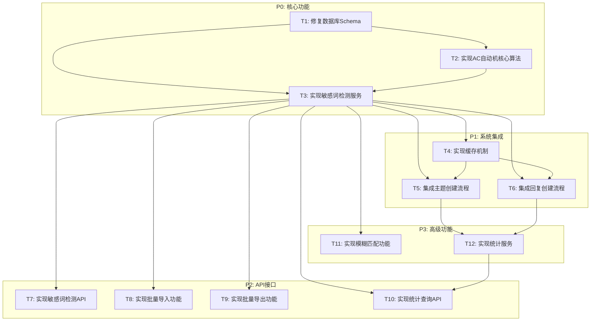

# 敏感词模块优化 - 任务拆分文档

## 1. 任务依赖图

## 2. 原子任务列表

### 任务 T1: 修复数据库Schema

**优先级**: P0  
**预计工时**: 2小时

**输入契约:**
- 前置依赖: 无
- 输入数据: 现有Prisma模型文件、迁移SQL文件
- 环境依赖: PostgreSQL数据库、Prisma CLI

**输出契约:**
- 输出数据: 更新后的Prisma模型文件、新的迁移文件
- 交付物: 
  - 修复后的 `forum-sensitive-word.prisma` 模型文件
  - 新增的迁移SQL文件
  - 数据库Schema更新脚本
- 验收标准:
  - Prisma模型包含所有必需字段（id, word, replaceWord, isEnabled, remark, createdAt, updatedAt, level, type, version, matchMode, hitCount, lastHitAt, createdBy, updatedBy）
  - 迁移SQL文件能够成功执行
  - 数据库Schema与Prisma模型一致
  - 所有索引正确创建

**实现约束:**
- 技术栈: Prisma ORM、PostgreSQL
- 接口规范: 遵循Prisma模型定义规范
- 质量要求: 字段类型、默认值、约束与设计文档一致

**依赖关系:**
- 后置任务: T2, T3
- 并行任务: 无

**实现步骤:**
1. 读取现有Prisma模型文件
2. 添加缺失字段（matchMode, hitCount, lastHitAt, createdBy, updatedBy）
3. 创建新的迁移文件
4. 生成并执行迁移
5. 验证数据库Schema

---

### 任务 T2: 实现AC自动机核心算法

**优先级**: P0  
**预计工时**: 4小时

**输入契约:**
- 前置依赖: T1（数据库Schema修复）
- 输入数据: 敏感词数据结构定义
- 环境依赖: Node.js环境、TypeScript

**输出契约:**
- 输出数据: AC自动机实现代码
- 交付物:
  - `ac-automaton.ts` 核心算法文件
  - `trie-node.ts` Trie节点定义文件
  - 单元测试文件
- 验收标准:
  - AC自动机能够正确构建Trie树
  - 失败指针构建正确
  - 多模式匹配算法准确
  - 时间复杂度O(n+m)，n为文本长度，m为模式串总长度
  - 单元测试覆盖率 > 90%

**实现约束:**
- 技术栈: TypeScript、Jest
- 接口规范: 符合DESIGN文档中的接口定义
- 质量要求: 代码清晰、注释完整、性能优化

**依赖关系:**
- 后置任务: T3
- 并行任务: 无

**实现步骤:**
1. 定义TrieNode类
2. 实现Trie树构建方法
3. 实现失败指针构建（BFS）
4. 实现多模式匹配方法
5. 编写单元测试
6. 性能测试和优化

---

### 任务 T3: 实现敏感词检测服务

**优先级**: P0  
**预计工时**: 6小时

**输入契约:**
- 前置依赖: T1, T2
- 输入数据: AC自动机实现、数据库Schema
- 环境依赖: NestJS框架、Prisma ORM

**输出契约:**
- 输出数据: 敏感词检测服务实现
- 交付物:
  - 更新后的 `sensitive-word.service.ts`
  - DTO定义文件
  - 单元测试文件
- 验收标准:
  - 能够检测文本中的敏感词
  - 支持精确匹配和模糊匹配
  - 支持批量检测
  - 能够处理匹配结果（分级处理）
  - 单元测试覆盖率 > 85%

**实现约束:**
- 技术栈: NestJS、TypeScript、Prisma、Jest
- 接口规范: 符合DESIGN文档中的服务接口定义
- 质量要求: 代码符合项目规范、异常处理完善

**依赖关系:**
- 后置任务: T4, T5, T6, T7, T8, T9, T10, T11
- 并行任务: 无

**实现步骤:**
1. 定义DTO接口
2. 实现敏感词加载方法
3. 实现检测方法
4. 实现批量检测方法
5. 实现结果处理方法
6. 集成AC自动机
7. 编写单元测试

---

### 任务 T4: 实现缓存机制

**优先级**: P1  
**预计工时**: 3小时

**输入契约:**
- 前置依赖: T3
- 输入数据: 敏感词检测服务、现有缓存模块
- 环境依赖: Redis、NestJS Cache模块

**输出契约:**
- 输出数据: 缓存实现代码
- 交付物:
  - 缓存服务实现
  - 缓存键定义文件
  - 缓存策略文档
- 验收标准:
  - 敏感词列表能够缓存到Redis
  - 缓存命中率 > 80%
  - 缓存更新时能够正确失效
  - 缓存预热功能正常

**实现约束:**
- 技术栈: Redis、NestJS Cache Manager
- 接口规范: 符合DESIGN文档中的缓存设计
- 质量要求: 缓存一致性、性能优化

**依赖关系:**
- 后置任务: T5, T6
- 并行任务: 无

**实现步骤:**
1. 定义缓存键常量
2. 实现缓存加载方法
3. 实现缓存刷新方法
4. 实现缓存失效方法
5. 集成到敏感词服务
6. 编写缓存测试

---

### 任务 T5: 集成主题创建流程

**优先级**: P1  
**预计工时**: 3小时

**输入契约:**
- 前置依赖: T3, T4
- 输入数据: 主题服务、敏感词检测服务
- 环境依赖: NestJS框架

**输出契约:**
- 输出数据: 集成后的主题服务代码
- 交付物:
  - 更新后的 `forum-topic.service.ts`
  - 集成测试文件
- 验收标准:
  - 主题创建时自动检测敏感词
  - 严重敏感词触发待审核状态
  - 轻微敏感词标记敏感词触发
  - 记录敏感词命中信息

**实现约束:**
- 技术栈: NestJS、TypeScript
- 接口规范: 不破坏现有主题创建接口
- 质量要求: 向后兼容、异常处理完善

**依赖关系:**
- 后置任务: T12
- 并行任务: T6

**实现步骤:**
1. 分析现有主题创建流程
2. 集成敏感词检测
3. 实现分级处理逻辑
4. 更新数据库字段
5. 编写集成测试

---

### 任务 T6: 集成回复创建流程

**优先级**: P1  
**预计工时**: 3小时

**输入契约:**
- 前置依赖: T3, T4
- 输入数据: 回复服务、敏感词检测服务
- 环境依赖: NestJS框架

**输出契约:**
- 输出数据: 集成后的回复服务代码
- 交付物:
  - 更新后的 `forum-reply.service.ts`
  - 集成测试文件
- 验收标准:
  - 回复创建时自动检测敏感词
  - 严重敏感词触发待审核状态
  - 轻微敏感词标记敏感词触发
  - 记录敏感词命中信息

**实现约束:**
- 技术栈: NestJS、TypeScript
- 接口规范: 不破坏现有回复创建接口
- 质量要求: 向后兼容、异常处理完善

**依赖关系:**
- 后置任务: T12
- 并行任务: T5

**实现步骤:**
1. 分析现有回复创建流程
2. 集成敏感词检测
3. 实现分级处理逻辑
4. 更新数据库字段
5. 编写集成测试

---

### 任务 T7: 实现敏感词检测API

**优先级**: P2  
**预计工时**: 2小时

**输入契约:**
- 前置依赖: T3
- 输入数据: 敏感词检测服务
- 环境依赖: NestJS框架

**输出契约:**
- 输出数据: API控制器代码
- 交付物:
  - `sensitive-word.controller.ts` 控制器文件
  - API文档
  - 接口测试文件
- 验收标准:
  - 提供检测接口
  - 支持单文本检测
  - 支持多字段检测
  - 返回格式符合规范
  - 接口测试通过

**实现约束:**
- 技术栈: NestJS、TypeScript
- 接口规范: RESTful API、Swagger文档
- 质量要求: 参数验证、异常处理、权限控制

**依赖关系:**
- 后置任务: 无
- 并行任务: T8, T9, T10

**实现步骤:**
1. 定义路由和控制器
2. 实现检测接口
3. 添加参数验证
4. 添加权限控制
5. 编写接口测试
6. 生成API文档

---

### 任务 T8: 实现批量导入功能

**优先级**: P2  
**预计工时**: 4小时

**输入契约:**
- 前置依赖: T3
- 输入数据: 敏感词服务
- 环境依赖: NestJS框架、Excel处理库

**输出契约:**
- 输出数据: 批量导入实现代码
- 交付物:
  - 导入服务实现
  - 导入接口
  - 导入模板文件
  - 测试文件
- 验收标准:
  - 支持Excel格式导入
  - 支持CSV格式导入
  - 批量导入性能 > 1000条/分钟
  - 错误处理完善
  - 返回导入结果统计

**实现约束:**
- 技术栈: NestJS、xlsx库、csv-parser
- 接口规范: RESTful API、文件上传
- 质量要求: 错误处理、性能优化、数据验证

**依赖关系:**
- 后置任务: 无
- 并行任务: T7, T9, T10

**实现步骤:**
1. 设计导入数据格式
2. 实现Excel解析
3. 实现CSV解析
4. 实现批量插入逻辑
5. 实现错误处理
6. 创建导入接口
7. 编写测试

---

### 任务 T9: 实现批量导出功能

**优先级**: P2  
**预计工时**: 3小时

**输入契约:**
- 前置依赖: T3
- 输入数据: 敏感词服务
- 环境依赖: NestJS框架、Excel处理库

**输出契约:**
- 输出数据: 批量导出实现代码
- 交付物:
  - 导出服务实现
  - 导出接口
  - 测试文件
- 验收标准:
  - 支持Excel格式导出
  - 支持CSV格式导出
  - 支持按类型、级别筛选
  - 导出性能 > 1000条/分钟
  - 文件格式正确

**实现约束:**
- 技术栈: NestJS、xlsx库、csv-writer
- 接口规范: RESTful API、文件下载
- 质量要求: 性能优化、格式正确

**依赖关系:**
- 后置任务: 无
- 并行任务: T7, T8, T10

**实现步骤:**
1. 设计导出数据格式
2. 实现Excel生成
3. 实现CSV生成
4. 实现筛选逻辑
5. 创建导出接口
6. 编写测试

---

### 任务 T10: 实现统计查询API

**优先级**: P2  
**预计工时**: 4小时

**输入契约:**
- 前置依赖: T3, T12
- 输入数据: 统计服务、敏感词服务
- 环境依赖: NestJS框架

**输出契约:**
- 输出数据: 统计API实现代码
- 交付物:
  - 统计控制器
  - 统计接口
  - API文档
  - 测试文件
- 验收标准:
  - 提供命中次数统计
  - 提供按类型统计
  - 提供按级别统计
  - 提供按日期统计
  - 提供热门敏感词排行
  - 支持时间范围查询
  - 接口测试通过

**实现约束:**
- 技术栈: NestJS、TypeScript、Prisma
- 接口规范: RESTful API、Swagger文档
- 质量要求: 性能优化、数据准确性

**依赖关系:**
- 后置任务: 无
- 并行任务: T7, T8, T9

**实现步骤:**
1. 定义统计查询接口
2. 实现统计查询逻辑
3. 实现数据聚合
4. 添加缓存优化
5. 创建API端点
6. 编写测试

---

### 任务 T11: 实现模糊匹配功能

**优先级**: P3  
**预计工时**: 6小时

**输入契约:**
- 前置依赖: T3
- 输入数据: 敏感词服务
- 环境依赖: Node.js环境、拼音库

**输出契约:**
- 输出数据: 模糊匹配实现代码
- 交付物:
  - 模糊匹配器实现
  - 拼音字典
  - 相似度计算算法
  - 单元测试文件
- 验收标准:
  - 支持拼音匹配
  - 支持相似度匹配
  - 相似度阈值可配置
  - 模糊匹配准确率 > 85%
  - 单元测试覆盖率 > 80%

**实现约束:**
- 技术栈: TypeScript、pinyin库、编辑距离算法
- 接口规范: 符合DESIGN文档中的模糊匹配设计
- 质量要求: 算法准确、性能优化

**依赖关系:**
- 后置任务: 无
- 并行任务: 无

**实现步骤:**
1. 实现拼音转换
2. 实现相似度计算算法
3. 实现模糊匹配器
4. 集成到敏感词服务
5. 编写单元测试
6. 性能优化

---

### 任务 T12: 实现统计服务

**优先级**: P3  
**预计工时**: 4小时

**输入契约:**
- 前置依赖: T5, T6
- 输入数据: 主题和回复命中数据
- 环境依赖: NestJS框架、Prisma ORM

**输出契约:**
- 输出数据: 统计服务实现代码
- 交付物:
  - 统计服务实现
  - 统计数据模型
  - 单元测试文件
- 验收标准:
  - 能够更新命中统计
  - 能够查询命中统计
  - 能够生成统计报表
  - 数据准确性高
  - 单元测试覆盖率 > 85%

**实现约束:**
- 技术栈: NestJS、TypeScript、Prisma
- 接口规范: 符合DESIGN文档中的统计服务设计
- 质量要求: 数据准确性、性能优化

**依赖关系:**
- 后置任务: T10
- 并行任务: 无

**实现步骤:**
1. 定义统计数据模型
2. 实现命中统计更新
3. 实现统计查询方法
4. 实现数据聚合
5. 编写单元测试
6. 性能优化

---

## 3. 任务执行计划

### 第一阶段: P0核心功能（预计12小时）

**任务顺序:**
1. T1: 修复数据库Schema（2小时）
2. T2: 实现AC自动机核心算法（4小时）
3. T3: 实现敏感词检测服务（6小时）

**里程碑:**
- 数据库Schema修复完成
- AC自动机算法实现并测试通过
- 敏感词检测服务实现并测试通过

### 第二阶段: P1系统集成（预计9小时）

**任务顺序:**
1. T4: 实现缓存机制（3小时）
2. T5: 集成主题创建流程（3小时）
3. T6: 集成回复创建流程（3小时）

**里程碑:**
- 缓存机制实现并测试通过
- 主题创建流程集成完成
- 回复创建流程集成完成

### 第三阶段: P2 API接口（预计13小时）

**任务顺序:**
1. T7: 实现敏感词检测API（2小时）
2. T8: 实现批量导入功能（4小时）
3. T9: 实现批量导出功能（3小时）
4. T10: 实现统计查询API（4小时）

**里程碑:**
- 敏感词检测API实现并测试通过
- 批量导入导出功能实现并测试通过
- 统计查询API实现并测试通过

### 第四阶段: P3高级功能（预计10小时）

**任务顺序:**
1. T12: 实现统计服务（4小时）
2. T11: 实现模糊匹配功能（6小时）

**里程碑:**
- 统计服务实现并测试通过
- 模糊匹配功能实现并测试通过

## 4. 风险评估

### 高风险任务

**T2: 实现AC自动机核心算法**
- 风险: 算法复杂度高，性能优化困难
- 缓解措施: 参考成熟实现，充分测试，性能基准测试

**T8: 实现批量导入功能**
- 风险: 大数据量导入性能问题，数据格式兼容性
- 缓解措施: 分批处理，数据验证，错误处理

### 中风险任务

**T3: 实现敏感词检测服务**
- 风险: 业务逻辑复杂，异常处理不完善
- 缓解措施: 充分单元测试，边界条件测试

**T11: 实现模糊匹配功能**
- 风险: 模糊匹配准确率不高，性能问题
- 缓解措施: 相似度阈值可配置，性能优化

### 低风险任务

**T1: 修复数据库Schema**
- 风险: Schema变更影响现有数据
- 缓解措施: 备份数据，充分测试

**T4: 实现缓存机制**
- 风险: 缓存一致性问题
- 缓解措施: 缓存失效策略，缓存预热

## 5. 验收标准总览

### 功能验收

- [ ] 数据库Schema修复完成，所有字段正确
- [ ] AC自动机算法实现正确，性能达标
- [ ] 敏感词检测服务功能完整
- [ ] 缓存机制工作正常，命中率达标
- [ ] 主题创建流程集成完成
- [ ] 回复创建流程集成完成
- [ ] 所有API接口实现并测试通过
- [ ] 批量导入导出功能正常
- [ ] 统计查询功能正常
- [ ] 模糊匹配功能正常（P3）

### 性能验收

- [ ] 敏感词检测响应时间 < 100ms
- [ ] 批量检测性能 > 1000条/分钟
- [ ] 缓存命中率 > 80%
- [ ] 批量导入性能 > 1000条/分钟
- [ ] 批量导出性能 > 1000条/分钟

### 质量验收

- [ ] 单元测试覆盖率 > 85%
- [ ] 集成测试通过
- [ ] 代码符合项目规范
- [ ] API文档完整
- [ ] 异常处理完善

---

**文档版本**: v1.0
**创建时间**: 2026-01-09
**最后更新**: 2026-01-09
