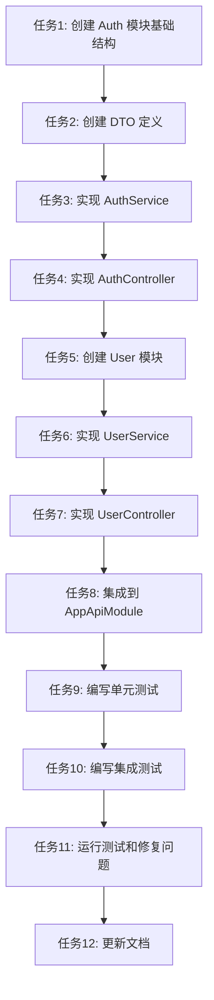

# TASK_移动端用户注册登录系统

## 任务依赖图

## 任务列表

### 任务1: 创建 Auth 模块基础结构

**输入契约**:
- 前置依赖: 无
- 输入数据: 无
- 环境依赖: NestJS 项目已初始化

**输出契约**:
- 输出数据: auth.module.ts 文件
- 交付物: Auth 模块基础结构
- 验收标准:
  - [ ] auth.module.ts 文件已创建
  - [ ] 模块正确导入 JwtAuthModule 和 BaseModule
  - [ ] 模块正确导出 AuthService

**实现约束**:
- 技术栈: NestJS
- 接口规范: 遵循现有模块结构
- 质量要求: 代码符合 ESLint 和 Prettier 规范

**依赖关系**:
- 后置任务: 任务2（创建 DTO 定义）

---

### 任务2: 创建 DTO 定义

**输入契约**:
- 前置依赖: 任务1完成
- 输入数据: 无
- 环境依赖: class-validator 和 class-transformer 已安装

**输出契约**:
- 输出数据: auth.dto.ts 文件
- 交付物: 完整的 DTO 定义
- 验收标准:
  - [ ] RegisterDto 已定义（账号、昵称、密码、手机号、邮箱、性别、验证码）
  - [ ] LoginDto 已定义（账号、密码、验证码）
  - [ ] TokenDto 已定义（accessToken、refreshToken）
  - [ ] RefreshTokenDto 已定义（refreshToken）
  - [ ] ForgotPasswordDto 已定义（账号）
  - [ ] ResetPasswordDto 已定义（账号、密码、验证码）
  - [ ] RegisterResponseDto 已定义（user、tokens）
  - [ ] LoginResponseDto 已定义（user、tokens）
  - [ ] RsaPublicKeyDto 已定义（publicKey）
  - [ ] 所有 DTO 使用装饰器进行验证
  - [ ] 所有 DTO 使用 Swagger 注解

**实现约束**:
- 技术栈: TypeScript、class-validator、class-transformer
- 接口规范: 遵循现有 DTO 结构
- 质量要求: 类型安全、验证完整

**依赖关系**:
- 后置任务: 任务3（实现 AuthService）

---

### 任务3: 实现 AuthService

**输入契约**:
- 前置依赖: 任务1、任务2完成
- 输入数据: DTO 定义
- 环境依赖: BaseAuthService、ScryptService、CaptchaService、RsaService 已可用

**输出契约**:
- 输出数据: auth.service.ts 文件
- 交付物: 完整的 AuthService 实现
- 验收标准:
  - [ ] register() 方法已实现（验证码验证、账号唯一性验证、密码加密、创建用户和论坛资料、生成 Token）
  - [ ] login() 方法已实现（验证码验证、账号密码验证、更新登录信息、生成 Token）
  - [ ] logout() 方法已实现（调用 BaseAuthService.logout）
  - [ ] refreshToken() 方法已实现（调用 BaseAuthService.refreshAccessToken）
  - [ ] forgotPassword() 方法已实现（验证账号存在、生成验证码）
  - [ ] resetPassword() 方法已实现（验证码验证、密码加密、更新密码）
  - [ ] getCaptcha() 方法已实现（调用 CaptchaService.generateSvgCaptcha）
  - [ ] initForumProfile() 私有方法已实现（创建论坛资料、初始化积分、等级、统计数据）
  - [ ] validateAccountUnique() 私有方法已实现（验证账号、手机号、邮箱唯一性）
  - [ ] sanitizeUser() 私有方法已实现（去除密码字段）
  - [ ] 所有方法使用事务确保数据一致性
  - [ ] 所有方法有完整的错误处理

**实现约束**:
- 技术栈: NestJS、TypeScript、Prisma
- 接口规范: 遵循设计文档
- 质量要求: 代码可读、错误处理完整、事务正确

**依赖关系**:
- 后置任务: 任务4（实现 AuthController）

---

### 任务4: 实现 AuthController

**输入契约**:
- 前置依赖: 任务2、任务3完成
- 输入数据: AuthService、RsaService
- 环境依赖: NestJS Controller 已可用

**输出契约**:
- 输出数据: auth.controller.ts 文件
- 交付物: 完整的 AuthController 实现
- 验收标准:
  - [ ] POST /api/auth/register 接口已实现（@Public、@ApiDoc）
  - [ ] POST /api/auth/login 接口已实现（@Public、@ApiDoc）
  - [ ] POST /api/auth/logout 接口已实现（@ApiDoc）
  - [ ] POST /api/auth/refresh-token 接口已实现（@Public、@ApiDoc）
  - [ ] POST /api/auth/forgot-password 接口已实现（@Public、@ApiDoc）
  - [ ] POST /api/auth/reset-password 接口已实现（@Public、@ApiDoc）
  - [ ] GET /api/auth/captcha 接口已实现（@Public、@ApiDoc）
  - [ ] GET /api/auth/public-key 接口已实现（@Public、@ApiDoc）
  - [ ] 所有接口使用正确的 HTTP 方法
  - [ ] 所有接口使用正确的装饰器
  - [ ] 所有接口有完整的 Swagger 文档

**实现约束**:
- 技术栈: NestJS、TypeScript
- 接口规范: 遵循 RESTful API 设计
- 质量要求: 接口规范、文档完整

**依赖关系**:
- 后置任务: 任务5（创建 User 模块）

---

### 任务5: 创建 User 模块

**输入契约**:
- 前置依赖: 任务4完成
- 输入数据: 无
- 环境依赖: NestJS 项目已初始化

**输出契约**:
- 输出数据: user.module.ts 文件
- 交付物: User 模块基础结构
- 验收标准:
  - [ ] user.module.ts 文件已创建
  - [ ] 模块正确导入 BaseModule
  - [ ] 模块正确导出 UserService

**实现约束**:
- 技术栈: NestJS
- 接口规范: 遵循现有模块结构
- 质量要求: 代码符合 ESLint 和 Prettier 规范

**依赖关系**:
- 后置任务: 任务6（实现 UserService）

---

### 任务6: 实现 UserService

**输入契约**:
- 前置依赖: 任务5完成
- 输入数据: 无
- 环境依赖: BaseModule 已可用

**输出契约**:
- 输出数据: user.service.ts 文件
- 交付物: 完整的 UserService 实现
- 验收标准:
  - [ ] getUserProfile() 方法已实现（获取用户信息，包含论坛资料）
  - [ ] 方法使用 Prisma 查询数据
  - [ ] 方法有完整的错误处理
  - [ ] 方法去除敏感信息（密码）

**实现约束**:
- 技术栈: NestJS、TypeScript、Prisma
- 接口规范: 遵循设计文档
- 质量要求: 代码可读、错误处理完整

**依赖关系**:
- 后置任务: 任务7（实现 UserController）

---

### 任务7: 实现 UserController

**输入契约**:
- 前置依赖: 任务6完成
- 输入数据: UserService
- 环境依赖: NestJS Controller 已可用

**输出契约**:
- 输出数据: user.controller.ts 文件
- 交付物: 完整的 UserController 实现
- 验收标准:
  - [ ] GET /api/user/profile 接口已实现（@ApiDoc）
  - [ ] 接口使用正确的 HTTP 方法
  - [ ] 接口使用正确的装饰器
  - [ ] 接口有完整的 Swagger 文档
  - [ ] 接口返回用户信息（不包含密码）

**实现约束**:
- 技术栈: NestJS、TypeScript
- 接口规范: 遵循 RESTful API 设计
- 质量要求: 接口规范、文档完整

**依赖关系**:
- 后置任务: 任务8（集成到 AppApiModule）

---

### 任务8: 集成到 AppApiModule

**输入契约**:
- 前置依赖: 任务1、任务5完成
- 输入数据: AuthModule、UserModule
- 环境依赖: app-api 项目已初始化

**输出契约**:
- 输出数据: 更新后的 app.module.ts 文件
- 交付物: 集成完成的 AppApiModule
- 验收标准:
  - [ ] AuthModule 已导入到 AppApiModule
  - [ ] UserModule 已导入到 AppApiModule
  - [ ] 模块导入顺序正确
  - [ ] 项目可以正常启动

**实现约束**:
- 技术栈: NestJS
- 接口规范: 遵循现有模块结构
- 质量要求: 配置正确、无编译错误

**依赖关系**:
- 后置任务: 任务9（编写单元测试）

---

### 任务9: 编写单元测试

**输入契约**:
- 前置依赖: 任务3、任务6完成
- 输入数据: AuthService、UserService
- 环境依赖: Jest 测试框架已配置

**输出契约**:
- 输出数据: *.spec.ts 文件
- 交付物: 完整的单元测试
- 验收标准:
  - [ ] AuthService.register() 方法有单元测试
  - [ ] AuthService.login() 方法有单元测试
  - [ ] AuthService.logout() 方法有单元测试
  - [ ] AuthService.refreshToken() 方法有单元测试
  - [ ] AuthService.forgotPassword() 方法有单元测试
  - [ ] AuthService.resetPassword() 方法有单元测试
  - [ ] UserService.getUserProfile() 方法有单元测试
  - [ ] 所有测试覆盖正常情况和异常情况
  - [ ] 测试覆盖率 > 80%

**实现约束**:
- 技术栈: Jest、TypeScript
- 接口规范: 遵循 Jest 最佳实践
- 质量要求: 测试完整、覆盖率达标

**依赖关系**:
- 后置任务: 任务10（编写集成测试）

---

### 任务10: 编写集成测试

**输入契约**:
- 前置依赖: 任务4、任务7、任务8完成
- 输入数据: 完整的 API 接口
- 环境依赖: Jest 测试框架已配置

**输出契约**:
- 输出数据: *.e2e-spec.ts 文件
- 交付物: 完整的集成测试
- 验收标准:
  - [ ] 用户注册流程有集成测试
  - [ ] 用户登录流程有集成测试
  - [ ] 用户登出流程有集成测试
  - [ ] Token 刷新流程有集成测试
  - [ ] 密码找回流程有集成测试
  - [ ] 获取用户信息流程有集成测试
  - [ ] 所有测试覆盖完整的业务流程
  - [ ] 测试覆盖率 > 80%

**实现约束**:
- 技术栈: Jest、TypeScript、Supertest
- 接口规范: 遵循 Jest 最佳实践
- 质量要求: 测试完整、覆盖率达标

**依赖关系**:
- 后置任务: 任务11（运行测试和修复问题）

---

### 任务11: 运行测试和修复问题

**输入契约**:
- 前置依赖: 任务9、任务10完成
- 输入数据: 测试代码
- 环境依赖: Jest 测试框架已配置

**输出契约**:
- 输出数据: 测试报告
- 交付物: 所有测试通过的代码
- 验收标准:
  - [ ] 所有单元测试通过
  - [ ] 所有集成测试通过
  - [ ] 测试覆盖率 > 80%
  - [ ] 所有发现的 bug 已修复
  - [ ] 代码符合 ESLint 和 Prettier 规范

**实现约束**:
- 技术栈: Jest、ESLint、Prettier
- 接口规范: 遵循项目规范
- 质量要求: 测试通过、代码规范

**依赖关系**:
- 后置任务: 任务12（更新文档）

---

### 任务12: 更新文档

**输入契约**:
- 前置依赖: 任务11完成
- 输入数据: 完整的代码
- 环境依赖: 无

**输出契约**:
- 输出数据: 更新后的文档
- 交付物: 完整的项目文档
- 验收标准:
  - [ ] Swagger 文档已更新
  - [ ] README 文档已更新
  - [ ] 代码注释完整
  - [ ] API 文档完整

**实现约束**:
- 技术栈: Markdown、Swagger
- 接口规范: 遵循文档规范
- 质量要求: 文档完整、准确

**依赖关系**:
- 无后置任务（最后一个任务）

---

## 任务优先级

### 高优先级（必须完成）
- 任务1: 创建 Auth 模块基础结构
- 任务2: 创建 DTO 定义
- 任务3: 实现 AuthService
- 任务4: 实现 AuthController
- 任务8: 集成到 AppApiModule

### 中优先级（重要）
- 任务5: 创建 User 模块
- 任务6: 实现 UserService
- 任务7: 实现 UserController

### 低优先级（可选）
- 任务9: 编写单元测试
- 任务10: 编写集成测试
- 任务11: 运行测试和修复问题
- 任务12: 更新文档

## 任务复杂度评估

### 简单（1-2小时）
- 任务1: 创建 Auth 模块基础结构
- 任务5: 创建 User 模块
- 任务8: 集成到 AppApiModule

### 中等（2-4小时）
- 任务2: 创建 DTO 定义
- 任务4: 实现 AuthController
- 任务6: 实现 UserService
- 任务7: 实现 UserController
- 任务12: 更新文档

### 复杂（4-8小时）
- 任务3: 实现 AuthService
- 任务9: 编写单元测试
- 任务10: 编写集成测试
- 任务11: 运行测试和修复问题

## 总体时间估算

- 简单任务: 3 * 2 = 6 小时
- 中等任务: 5 * 3 = 15 小时
- 复杂任务: 4 * 6 = 24 小时

**总计**: 45 小时（约 6 个工作日）
