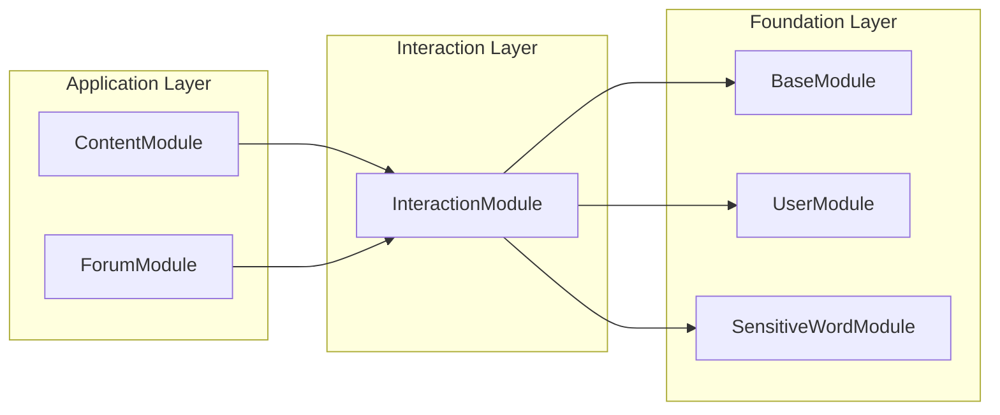
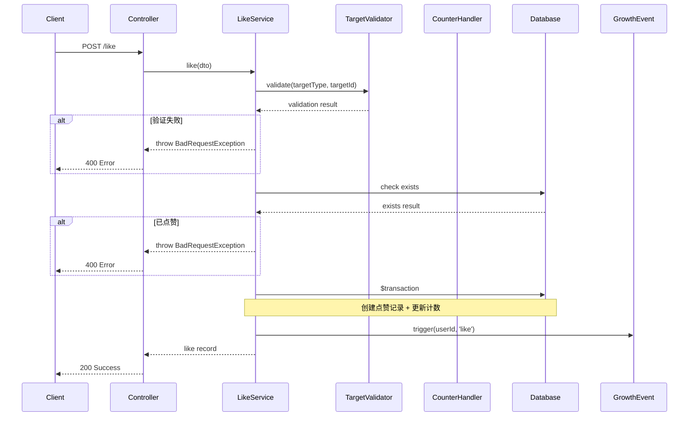
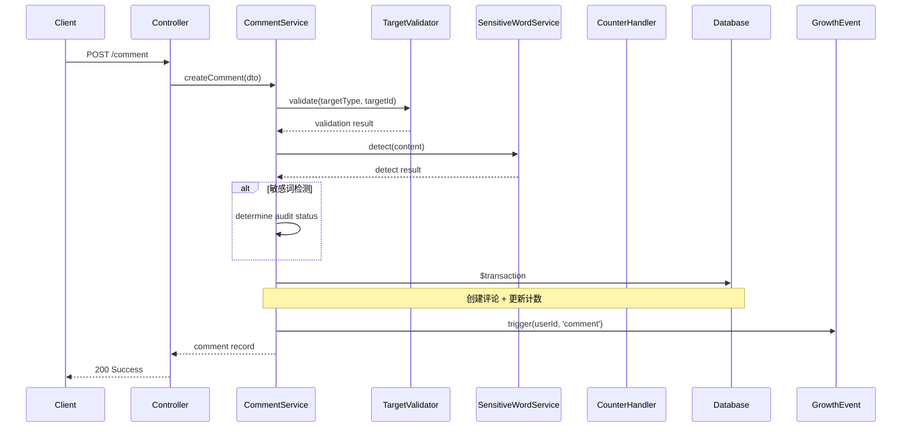

# 设计文档：统一交互模块重构

## 一、整体架构图

```mermaid
graph TB
    subgraph "API Layer"
        ContentController[ContentController]
        ForumController[ForumController]
    end
    
    subgraph "Interaction Module"
        InteractionModule[InteractionModule]
        
        subgraph "Services"
            LikeService[LikeService]
            FavoriteService[FavoriteService]
            ViewService[ViewService]
            CommentService[CommentService]
            DownloadService[DownloadService]
        end
        
        subgraph "Validators"
            TargetValidator[TargetValidatorRegistry]
            ComicValidator[ComicValidator]
            NovelValidator[NovelValidator]
            ComicChapterValidator[ComicChapterValidator]
            NovelChapterValidator[NovelChapterValidator]
            ForumTopicValidator[ForumTopicValidator]
        end
        
        subgraph "Handlers"
            CounterHandler[CounterHandlerRegistry]
            WorkCounterHandler[WorkCounterHandler]
            ComicChapterCounterHandler[ComicChapterCounterHandler]
            NovelChapterCounterHandler[NovelChapterCounterHandler]
            ForumCounterHandler[ForumCounterHandler]
        end
    end
    
    subgraph "Core Modules"
        UserModule[UserModule]
        SensitiveWordModule[SensitiveWordModule]
    end
    
    subgraph "Database"
        UserLike[(user_like)]
        UserFavorite[(user_favorite)]
        UserView[(user_view)]
        UserComment[(user_comment)]
        UserDownload[(user_download)]
    end
    
    ContentController --> LikeService
    ContentController --> FavoriteService
    ContentController --> CommentService
    ContentController --> DownloadService
    
    ForumController --> LikeService
    ForumController --> FavoriteService
    ForumController --> ViewService
    ForumController --> CommentService
    
    LikeService --> TargetValidator
    LikeService --> CounterHandler
    LikeService --> UserModule
    
    FavoriteService --> TargetValidator
    FavoriteService --> CounterHandler
    FavoriteService --> UserModule
    
    ViewService --> TargetValidator
    ViewService --> CounterHandler
    ViewService --> UserModule
    
    CommentService --> TargetValidator
    CommentService --> CounterHandler
    CommentService --> SensitiveWordModule
    CommentService --> UserModule
    
    DownloadService --> TargetValidator
    DownloadService --> CounterHandler
    DownloadService --> UserModule
    
    TargetValidator --> ComicValidator
    TargetValidator --> NovelValidator
    TargetValidator --> ComicChapterValidator
    TargetValidator --> NovelChapterValidator
    TargetValidator --> ForumTopicValidator
    
    CounterHandler --> WorkCounterHandler
    CounterHandler --> ComicChapterCounterHandler
    CounterHandler --> NovelChapterCounterHandler
    CounterHandler --> ForumCounterHandler
    
    LikeService --> UserLike
    FavoriteService --> UserFavorite
    ViewService --> UserView
    CommentService --> UserComment
    DownloadService --> UserDownload
```



## 二、分层设计

### 2.1 目录结构

遵循项目现有的 libs 模块结构规范（参考 `libs/forum`、`libs/content`、`libs/user`），每个功能子模块独立目录，内部包含 `dto/`、`*.module.ts`、`*.service.ts`、`*.constant.ts`、`index.ts`：

```
libs/interaction/
├── src/
│   │
│   ├── like/                           # 点赞模块
│   │   ├── dto/
│   │   │   ├── like.dto.ts
│   │   │   └── index.ts
│   │   ├── like.constant.ts
│   │   ├── like.module.ts
│   │   ├── like.service.ts
│   │   └── index.ts
│   │
│   ├── favorite/                       # 收藏模块
│   │   ├── dto/
│   │   │   ├── favorite.dto.ts
│   │   │   └── index.ts
│   │   ├── favorite.constant.ts
│   │   ├── favorite.module.ts
│   │   ├── favorite.service.ts
│   │   └── index.ts
│   │
│   ├── view/                           # 浏览记录模块
│   │   ├── dto/
│   │   │   ├── view.dto.ts
│   │   │   └── index.ts
│   │   ├── view.constant.ts
│   │   ├── view.module.ts
│   │   ├── view.service.ts
│   │   └── index.ts
│   │
│   ├── comment/                        # 评论模块
│   │   ├── dto/
│   │   │   ├── comment.dto.ts
│   │   │   └── index.ts
│   │   ├── comment.constant.ts
│   │   ├── comment.module.ts
│   │   ├── comment.service.ts
│   │   └── index.ts
│   │
│   ├── comment-like/                   # 评论点赞模块（独立子模块）
│   │   ├── dto/
│   │   │   ├── comment-like.dto.ts
│   │   │   └── index.ts
│   │   ├── comment-like.module.ts
│   │   ├── comment-like.service.ts
│   │   └── index.ts
│   │
│   ├── comment-report/                 # 评论举报模块（独立子模块）
│   │   ├── dto/
│   │   │   ├── comment-report.dto.ts
│   │   │   └── index.ts
│   │   ├── comment-report.constant.ts
│   │   ├── comment-report.module.ts
│   │   ├── comment-report.service.ts
│   │   └── index.ts
│   │
│   ├── download/                       # 下载模块
│   │   ├── dto/
│   │   │   ├── download.dto.ts
│   │   │   └── index.ts
│   │   ├── download.constant.ts
│   │   ├── download.module.ts
│   │   ├── download.service.ts
│   │   └── index.ts
│   │
│   ├── counter/                        # 计数处理器模块（独立子模块）
│   │   ├── counter-handler.interface.ts
│   │   ├── counter-handler.registry.ts
│   │   ├── work-counter.handler.ts      # 作品计数处理器（包含漫画和小说）
│   │   ├── comic-chapter-counter.handler.ts   # 漫画章节计数处理器
│   │   ├── novel-chapter-counter.handler.ts   # 小说章节计数处理器
│   │   ├── forum-counter.handler.ts     # 论坛计数处理器
│   │   ├── counter.module.ts
│   │   └── index.ts
│   │
│   ├── validator/                      # 目标校验器模块（独立子模块）
│   │   ├── target-validator.interface.ts
│   │   ├── target-validator.registry.ts
│   │   ├── comic.validator.ts
│   │   ├── novel.validator.ts
│   │   ├── comic-chapter.validator.ts
│   │   ├── novel-chapter.validator.ts
│   │   ├── forum-topic.validator.ts
│   │   ├── validator.module.ts
│   │   └── index.ts
│   │
│   ├── base-interaction.service.ts     # 交互服务基类（根目录）
│   ├── interaction.constant.ts         # 公共常量（根目录）
│   ├── interaction.types.ts            # 公共类型（根目录）
│   ├── interaction.module.ts           # 主模块（聚合所有子模块）
│   └── index.ts
│
├── tsconfig.lib.json
└── package.json
```

**设计原则：**
- 不使用 `common/` 目录，公共组件扁平化放置
- 每个子模块职责单一，边界清晰
- 参考 `libs/forum` 的 `reply/` 和 `reply-like/` 分离模式
- 常量和类型文件放在根目录，不创建 `constants/` 和 `types/` 子目录

### 2.2 模块依赖关系



## 三、核心组件设计

### 3.1 目标类型枚举（数字）

```typescript
/**
 * 交互目标类型枚举
 * 用于标识用户交互操作的目标对象类型
 * 
 * 注意：作品类型必须区分漫画和小说，不能使用通用的"作品"类型
 */
export enum InteractionTargetType {
  /** 漫画 - 漫画作品 */
  COMIC = 1,
  /** 小说 - 小说作品 */
  NOVEL = 2,
  /** 漫画章节 - 漫画作品的章节 */
  COMIC_CHAPTER = 3,
  /** 小说章节 - 小说作品的章节 */
  NOVEL_CHAPTER = 4,
  /** 论坛主题 - 论坛板块中的帖子 */
  FORUM_TOPIC = 5,
  // 注意：论坛回复不再作为独立目标类型，而是存储在 user_comment 表中
  // 评论点赞使用独立的 user_comment_like 表
}

/**
 * 目标类型描述映射
 */
export const TARGET_TYPE_DESC: Record<InteractionTargetType, string> = {
  [InteractionTargetType.COMIC]: '漫画',
  [InteractionTargetType.NOVEL]: '小说',
  [InteractionTargetType.COMIC_CHAPTER]: '漫画章节',
  [InteractionTargetType.NOVEL_CHAPTER]: '小说章节',
  [InteractionTargetType.FORUM_TOPIC]: '论坛主题',
}

/**
 * 目标类型分类
 * 用于判断目标类型的归属分类
 */
export enum TargetTypeCategory {
  /** 漫画类 - 漫画及其章节 */
  COMIC = 'comic',
  /** 小说类 - 小说及其章节 */
  NOVEL = 'novel',
  /** 论坛类 - 论坛主题 */
  FORUM = 'forum',
}

/**
 * 获取目标类型的分类
 */
export function getTargetTypeCategory(type: InteractionTargetType): TargetTypeCategory | null {
  switch (type) {
    case InteractionTargetType.COMIC:
    case InteractionTargetType.COMIC_CHAPTER:
      return TargetTypeCategory.COMIC
    case InteractionTargetType.NOVEL:
    case InteractionTargetType.NOVEL_CHAPTER:
      return TargetTypeCategory.NOVEL
    case InteractionTargetType.FORUM_TOPIC:
      return TargetTypeCategory.FORUM
    default:
      return null
  }
}

/**
 * 判断是否为作品类型（漫画或小说）
 */
export function isWorkType(type: InteractionTargetType): boolean {
  return type === InteractionTargetType.COMIC || type === InteractionTargetType.NOVEL
}

/**
 * 判断是否为章节类型
 */
export function isChapterType(type: InteractionTargetType): boolean {
  return type === InteractionTargetType.COMIC_CHAPTER || type === InteractionTargetType.NOVEL_CHAPTER
}

/**
 * 获取章节类型对应的作品类型
 */
export function getWorkTypeByChapter(type: InteractionTargetType): InteractionTargetType | null {
  switch (type) {
    case InteractionTargetType.COMIC_CHAPTER:
      return InteractionTargetType.COMIC
    case InteractionTargetType.NOVEL_CHAPTER:
      return InteractionTargetType.NOVEL
    default:
      return null
  }
}
```

### 3.2 操作类型枚举（数字）

```typescript
/**
 * 交互操作类型枚举
 * 用于标识用户对目标执行的操作类型
 */
export enum InteractionActionType {
  /** 点赞 - 用户对目标表示认可 */
  LIKE = 1,
  /** 取消点赞 - 用户撤回点赞操作 */
  UNLIKE = 2,
  /** 收藏 - 用户将目标加入收藏夹 */
  FAVORITE = 3,
  /** 取消收藏 - 用户从收藏夹移除目标 */
  UNFAVORITE = 4,
  /** 浏览 - 用户查看目标内容 */
  VIEW = 5,
  /** 删除浏览记录 - 用户删除自己的浏览记录 */
  DELETE_VIEW = 6,
  /** 评论 - 用户对目标发表评论 */
  COMMENT = 7,
  /** 删除评论 - 用户删除自己的评论 */
  DELETE_COMMENT = 8,
  /** 下载 - 用户下载目标内容 */
  DOWNLOAD = 9,
}
```

### 3.3 基础 DTO 设计

```typescript
import { NumberProperty, EnumProperty, StringProperty } from '@libs/base/decorators'
import { IntersectionType, PartialType, PickType } from '@nestjs/swagger'
import { BaseDto, PageDto } from '@libs/base/dto'
import { InteractionTargetType } from '../interaction.constant'

export class BaseInteractionDto extends BaseDto {
  @EnumProperty({
    description: '目标类型（1=漫画, 2=小说, 3=漫画章节, 4=小说章节, 5=论坛主题）',
    example: InteractionTargetType.COMIC,
    enum: InteractionTargetType,
  })
  targetType: InteractionTargetType

  @NumberProperty({
    description: '目标ID',
    example: 1,
  })
  targetId: number
}

// ========== 点赞 DTO ==========

export class CreateUserLikeDto extends PickType(BaseInteractionDto, [
  'targetType',
  'targetId',
]) {
  @NumberProperty({
    description: '用户ID',
    example: 1,
  })
  userId: number
}

// ========== 收藏 DTO ==========

export class CreateUserFavoriteDto extends PickType(BaseInteractionDto, [
  'targetType',
  'targetId',
]) {
  @NumberProperty({
    description: '用户ID',
    example: 1,
  })
  userId: number
}

// ========== 浏览记录 DTO ==========

export class CreateUserViewDto extends PickType(BaseInteractionDto, [
  'targetType',
  'targetId',
]) {
  @NumberProperty({
    description: '用户ID',
    example: 1,
  })
  userId: number

  @StringProperty({
    description: 'IP地址',
    example: '192.168.1.1',
    maxLength: 45,
  })
  ipAddress?: string

  @StringProperty({
    description: '设备类型（mobile/desktop/tablet）',
    example: 'mobile',
    maxLength: 20,
  })
  device?: string

  @StringProperty({
    description: '用户代理',
    example: 'Mozilla/5.0...',
    maxLength: 500,
  })
  userAgent?: string
}

// ========== 下载 DTO ==========

export class CreateUserDownloadDto extends PickType(BaseInteractionDto, [
  'targetType',
  'targetId',
]) {
  @NumberProperty({
    description: '用户ID',
    example: 1,
  })
  userId: number

  // 注意：workId 和 workType 由服务端根据 targetType 和 targetId 自动查询填充
  // 前端只需传入 targetType 和 targetId
}
```

### 3.4 目标校验器接口

类型定义放在单独的 `interaction.types.ts` 文件中：

```typescript
// libs/interaction/src/interaction.types.ts
import type { PrismaClientType } from '@libs/base/database/prisma.types'

/// 交互事务类型
export type InteractionTransaction = Omit<
  Parameters<Parameters<PrismaClientType['$transaction']>[0]>[0],
  '$extends'
>

/// 目标校验结果
export interface TargetValidationResult {
  /** 目标是否存在 */
  exists: boolean
  /** 是否已删除 */
  isDeleted: boolean
  /** 是否已发布 */
  isPublished: boolean
  /** 是否可以交互 */
  canInteract: boolean
  /** 错误消息 */
  message?: string
}

/// 目标信息
export interface TargetInfo {
  /** 目标ID */
  id: number
  /** 作者ID */
  authorId: number
  /** 其他扩展信息 */
  [key: string]: any
}

/// 目标校验器接口
export interface TargetValidator {
  /** 校验目标是否存在且可交互 */
  validate(targetId: number): Promise<TargetValidationResult>
  /** 获取目标作者ID */
  getAuthorId(targetId: number): Promise<number | null>
  /** 获取目标详细信息 */
  getTargetInfo(targetId: number): Promise<TargetInfo | null>
}
```

目标校验器注册表实现：

```typescript
// libs/interaction/src/validator/target-validator.registry.ts
import { Injectable } from '@nestjs/common'
import type { InteractionTargetType } from '../interaction.constant'
import type { TargetValidator, TargetValidationResult } from '../interaction.types'

@Injectable()
export class TargetValidatorRegistry {
  private validators = new Map<InteractionTargetType, TargetValidator>()

  register(targetType: InteractionTargetType, validator: TargetValidator): void {
    this.validators.set(targetType, validator)
  }

  get(targetType: InteractionTargetType): TargetValidator | undefined {
    return this.validators.get(targetType)
  }

  async validate(targetType: InteractionTargetType, targetId: number): Promise<TargetValidationResult> {
    const validator = this.validators.get(targetType)
    if (!validator) {
      return {
        exists: false,
        isDeleted: false,
        isPublished: false,
        canInteract: false,
        message: `不支持的目标类型: ${targetType}`,
      }
    }
    return validator.validate(targetId)
  }
}
```

### 3.5 计数处理器接口

```typescript
// libs/interaction/src/interaction.types.ts（续）

import type { InteractionTargetType } from './interaction.constant'
import type { InteractionTransaction } from './interaction.types'

/// 计数处理器接口
/// 各实现类只需实现其支持的目标类型对应的计数方法
export interface CounterHandler {
  /** 更新点赞计数 */
  updateLikeCount(tx: InteractionTransaction, targetId: number, delta: number): Promise<void>
  /** 更新收藏计数 */
  updateFavoriteCount(tx: InteractionTransaction, targetId: number, delta: number): Promise<void>
  /** 更新浏览计数 */
  updateViewCount(tx: InteractionTransaction, targetId: number, delta: number): Promise<void>
  /** 更新评论计数 */
  updateCommentCount(tx: InteractionTransaction, targetId: number, delta: number): Promise<void>
  /** 更新下载计数 */
  updateDownloadCount(tx: InteractionTransaction, targetId: number, delta: number): Promise<void>
  /** 更新作者点赞计数 */
  updateAuthorLikeCount(tx: InteractionTransaction, authorId: number, delta: number): Promise<void>
  /** 更新作者收藏计数 */
  updateAuthorFavoriteCount(tx: InteractionTransaction, authorId: number, delta: number): Promise<void>
  /** 更新作者浏览计数（可选实现） */
  updateAuthorViewCount?(tx: InteractionTransaction, authorId: number, delta: number): Promise<void>
  /** 更新作者评论计数（可选实现） */
  updateAuthorCommentCount?(tx: InteractionTransaction, authorId: number, delta: number): Promise<void>
  /** 更新作者下载计数（可选实现） */
  updateAuthorDownloadCount?(tx: InteractionTransaction, authorId: number, delta: number): Promise<void>
}

/// 计数类型
export const CounterType = {
  LIKE: 'like',
  FAVORITE: 'favorite',
  VIEW: 'view',
  COMMENT: 'comment',
  DOWNLOAD: 'download',
} as const

export type CounterType = (typeof CounterType)[keyof typeof CounterType]
```

计数处理器注册表实现：

```typescript
// libs/interaction/src/counter/counter-handler.registry.ts
import { Injectable } from '@nestjs/common'
import type { InteractionTargetType } from '../interaction.constant'
import type { CounterHandler, CounterType, InteractionTransaction } from '../interaction.types'
import { CounterType as CT } from '../interaction.types'

@Injectable()
export class CounterHandlerRegistry {
  private handlers = new Map<InteractionTargetType, CounterHandler>()

  register(targetType: InteractionTargetType, handler: CounterHandler): void {
    this.handlers.set(targetType, handler)
  }

  get(targetType: InteractionTargetType): CounterHandler | undefined {
    return this.handlers.get(targetType)
  }

  async updateCount(
    tx: InteractionTransaction,
    targetType: InteractionTargetType,
    targetId: number,
    counterType: CounterType,
    delta: number,
  ): Promise<void> {
    const handler = this.handlers.get(targetType)
    if (!handler) return

    switch (counterType) {
      case CT.LIKE:
        await handler.updateLikeCount(tx, targetId, delta)
        break
      case CT.FAVORITE:
        await handler.updateFavoriteCount(tx, targetId, delta)
        break
      case CT.VIEW:
        await handler.updateViewCount(tx, targetId, delta)
        break
      case CT.COMMENT:
        await handler.updateCommentCount(tx, targetId, delta)
        break
      case CT.DOWNLOAD:
        await handler.updateDownloadCount(tx, targetId, delta)
        break
    }
  }
}
```

## 四、数据流向图

### 4.1 点赞流程



### 4.2 评论流程



## 五、评论功能目标类型支持

### 5.1 支持的目标类型

评论功能支持以下五种目标类型：

| targetType | 类型名称 | 说明 | 目标ID对应 |
|------------|---------|------|-----------|
| 1 | COMIC | 漫画作品评论 | work.id |
| 2 | NOVEL | 小说作品评论 | work.id |
| 3 | COMIC_CHAPTER | 漫画章节评论 | work_chapter.id |
| 4 | NOVEL_CHAPTER | 小说章节评论 | work_chapter.id |
| 5 | FORUM_TOPIC | 论坛回复 | forum_topic.id |

### 5.2 评论校验器配置

```typescript
// 评论功能支持的 targetType 配置
export const COMMENT_SUPPORTED_TARGET_TYPES = [
  InteractionTargetType.COMIC,         // 漫画
  InteractionTargetType.NOVEL,         // 小说
  InteractionTargetType.COMIC_CHAPTER, // 漫画章节
  InteractionTargetType.NOVEL_CHAPTER, // 小说章节
  InteractionTargetType.FORUM_TOPIC,   // 论坛
]

/**
 * 判断目标类型是否支持评论
 */
export function isCommentSupported(type: InteractionTargetType): boolean {
  return COMMENT_SUPPORTED_TARGET_TYPES.includes(type)
}
```

## 六、异常处理策略

### 6.1 异常类型

| 异常类型 | 场景 | HTTP 状态码 |
|----------|------|-------------|
| NotFoundException | 目标不存在 | 404 |
| BadRequestException | 重复操作、参数错误 | 400 |
| ForbiddenException | 权限不足 | 403 |
| ConflictException | 并发冲突 | 409 |

## 七、索引设计

**注意：Prisma 索引不需要指定 name 参数**

### 7.1 user_like 表

| 字段 | 类型 | 说明 |
|--------|------|------|
| targetType, targetId, userId | UNIQUE | 防止重复点赞 |
| targetType, targetId | INDEX | 查询目标点赞列表 |
| userId | INDEX | 查询用户点赞记录 |
| createdAt | INDEX | 按时间排序 |

### 7.2 user_comment 表

| 字段 | 类型 | 说明 |
|--------|------|------|
| targetType, targetId | INDEX | 查询目标评论列表 |
| userId | INDEX | 查询用户评论记录 |
| createdAt | INDEX | 按时间排序 |
| auditStatus | INDEX | 筛选待审核评论 |
| deletedAt | INDEX | 筛选已删除评论 |
| targetType, targetId, createdAt | INDEX | 分页查询 |

## 八、迁移脚本设计

### 8.1 迁移命令

使用项目统一的 Prisma 迁移命令：

```bash
# 更新数据库结构（包含迁移和种子数据）
pnpm prisma:update

# 仅重置数据库（清空数据并重新填充种子数据）
pnpm prisma:reset
```

### 8.2 迁移顺序

1. 创建新表结构
2. 迁移点赞数据
3. 迁移收藏数据
4. 迁移浏览记录数据
5. 迁移评论数据（区分漫画、漫画章节、小说、小说章节、论坛）
6. 迁移下载数据
7. 验证数据完整性
8. 删除旧表

### 8.3 迁移注意事项

- 迁移前请确保备份数据库
- 迁移脚本会自动将旧表数据迁移到新表
- 作品和章节的浏览记录为新增功能，无需迁移旧数据
- 作品下载为新增功能，无需迁移旧数据

### 8.4 种子文件改造

需要更新种子文件以支持新的数据模型：

```typescript
// prisma/seed/interaction.seed.ts

/**
 * 交互模块种子数据
 * 用于开发环境测试和数据库重置
 */
export async function seedInteraction(prisma: PrismaClient) {
  // 1. 创建点赞测试数据
  await prisma.userLike.createMany({
    data: [
      { targetType: 1, targetId: 1, userId: 1 }, // 漫画点赞
      { targetType: 2, targetId: 2, userId: 1 }, // 小说点赞
      { targetType: 3, targetId: 1, userId: 1 }, // 漫画章节点赞
      { targetType: 4, targetId: 2, userId: 1 }, // 小说章节点赞
      { targetType: 5, targetId: 1, userId: 1 }, // 论坛主题点赞
    ],
  })

  // 2. 创建收藏测试数据
  await prisma.userFavorite.createMany({
    data: [
      { targetType: 1, targetId: 1, userId: 1 }, // 漫画收藏
      { targetType: 2, targetId: 2, userId: 1 }, // 小说收藏
      { targetType: 5, targetId: 1, userId: 1 }, // 论坛主题收藏
    ],
  })

  // 3. 创建浏览记录测试数据
  await prisma.userView.createMany({
    data: [
      { targetType: 1, targetId: 1, userId: 1, ipAddress: '127.0.0.1', device: 'desktop' },
      { targetType: 2, targetId: 2, userId: 1, ipAddress: '127.0.0.1', device: 'mobile' },
      { targetType: 3, targetId: 1, userId: 1, ipAddress: '127.0.0.1', device: 'desktop' },
      { targetType: 4, targetId: 2, userId: 1, ipAddress: '127.0.0.1', device: 'mobile' },
      { targetType: 5, targetId: 1, userId: 1, ipAddress: '127.0.0.1', device: 'desktop' },
    ],
  })

  // 4. 创建评论测试数据
  await prisma.userComment.createMany({
    data: [
      { targetType: 1, targetId: 1, userId: 1, content: '漫画评论', floor: 1 },
      { targetType: 2, targetId: 2, userId: 1, content: '小说评论', floor: 1 },
      { targetType: 3, targetId: 1, userId: 1, content: '漫画章节评论', floor: 1 },
      { targetType: 4, targetId: 2, userId: 1, content: '小说章节评论', floor: 1 },
      { targetType: 5, targetId: 1, userId: 1, content: '论坛回复', floor: 1 },
    ],
  })

  // 5. 创建下载测试数据
  await prisma.userDownload.createMany({
    data: [
      { targetType: 1, targetId: 1, userId: 1, workId: 1, workType: 1 }, // 漫画下载
      { targetType: 2, targetId: 2, userId: 1, workId: 2, workType: 2 }, // 小说下载
      { targetType: 3, targetId: 1, userId: 1, workId: 1, workType: 1 }, // 漫画章节下载
      { targetType: 4, targetId: 2, userId: 1, workId: 2, workType: 2 }, // 小说章节下载
    ],
  })

  // 6. 创建评论点赞测试数据
  await prisma.userCommentLike.createMany({
    data: [
      { commentId: 1, userId: 2 },
      { commentId: 2, userId: 2 },
    ],
  })
}
```

## 九、性能优化策略

### 8.1 批量查询优化

```typescript
async batchCheckUserStatus(
  targetIds: number[],
  userId: number,
  targetType: InteractionTargetType,
): Promise<Map<number, boolean>> {
  const records = await this.prisma.userLike.findMany({
    where: {
      targetType,
      targetId: { in: targetIds },
      userId,
    },
    select: { targetId: true },
  })

  return new Map(records.map((r) => [r.targetId, true]))
}
```

### 8.2 计数缓存

```typescript
@Injectable()
export class InteractionCountCache {
  constructor(private readonly cacheService: CacheService) {}

  async getLikeCount(targetType: InteractionTargetType, targetId: number): Promise<number> {
    const key = `like:${targetType}:${targetId}`
    const cached = await this.cacheService.get(key)
    if (cached !== null) return parseInt(cached, 10)

    const count = await this.prisma.userLike.count({
      where: { targetType, targetId },
    })

    await this.cacheService.set(key, count.toString(), 300) // 5分钟缓存
    return count
  }

  async incrementLikeCount(targetType: InteractionTargetType, targetId: number): Promise<void> {
    const key = `like:${targetType}:${targetId}`
    await this.cacheService.incr(key)
  }
}
```

## 十、测试策略

### 9.1 单元测试

- 每个服务的核心方法测试
- 目标校验器测试
- 计数处理器测试

### 9.2 集成测试

- 完整交互流程测试
- 事务回滚测试
- 并发操作测试

### 9.3 性能测试

- 批量查询性能
- 高并发写入性能
- 缓存命中率

## 十一、开发规范

### 11.1 TypeScript 类型定义规范

**类型推导优先原则：**
- 所有可通过 TypeScript 编译器自动推导的类型**禁止手动显式定义**
- 仅在以下情况允许手动定义类型：
  - 类型无法自动推导
  - 需明确接口契约（如公共 API 返回类型）
  - 复杂业务逻辑的类型约束

**示例：**
```typescript
// ❌ 错误：不必要的显式类型定义
const count: number = await this.prisma.userLike.count()
const list: UserLike[] = await this.prisma.userLike.findMany()

// ✅ 正确：让编译器自动推导
const count = await this.prisma.userLike.count()
const list = await this.prisma.userLike.findMany()

// ✅ 正确：需要明确接口契约时手动定义
interface LikeStatusResult {
  isLiked: boolean
  likeCount: number
}
```

### 11.2 注释规范

**JSDoc 规范：**
- 所有公共方法必须添加 JSDoc 注释
- 参数和返回值必须有明确说明

**复杂逻辑注释要求：**
以下场景必须添加详细注释说明：
- 复杂业务逻辑：说明设计思路和业务规则
- 算法实现：说明算法原理和复杂度
- 事务处理：说明事务边界、回滚条件和数据一致性保证
- 边界情况：说明潜在边界情况和处理方式

**示例：**
```typescript
/**
 * 创建点赞记录
 * 
 * 设计思路：
 * 1. 先校验目标是否存在且可交互
 * 2. 检查是否已点赞（幂等性保证）
 * 3. 在事务中创建记录并更新计数
 * 4. 触发成长事件（异步，不影响主流程）
 * 
 * @param dto 点赞参数
 * @returns 点赞记录
 * @throws BadRequestException 目标不存在或已点赞
 * 
 * 边界情况：
 * - 目标已删除：抛出 BadRequestException
 * - 目标未发布：抛出 BadRequestException
 * - 重复点赞：抛出 BadRequestException（幂等）
 */
async createLike(dto: CreateUserLikeDto) {
  // 实现逻辑...
}
```

### 11.3 项目执行流程

**严格按以下顺序执行，不可跳过或调换：**

```
┌─────────────────────────────────────────────────────────────┐
│  Step 1: Prisma 数据模型定义                                 │
│  - 定义模型字段、关系、约束                                   │
│  - 确保符合业务需求                                          │
└─────────────────────────────────────────────────────────────┘
                              ↓
┌─────────────────────────────────────────────────────────────┐
│  Step 2: 种子文件改造                                        │
│  - 更新种子数据与模型结构一致                                 │
│  - 确保测试数据完整                                          │
└─────────────────────────────────────────────────────────────┘
                              ↓
┌─────────────────────────────────────────────────────────────┐
│  Step 3: 执行数据库迁移                                      │
│  - 运行 pnpm prisma:update                                   │
│  - 确认迁移成功且数据库结构正确                               │
└─────────────────────────────────────────────────────────────┘
                              ↓
┌─────────────────────────────────────────────────────────────┐
│  Step 4: 业务代码开发                                        │
│  - 仅在数据库准备工作全部完成后开始                           │
└─────────────────────────────────────────────────────────────┘
```

### 11.4 数据库操作规范

**使用项目自定义 Prisma 插件：**

| 功能 | 使用方法 | 禁止使用 |
|------|----------|----------|
| 分页查询 | `findPagination()` | 原生 `skip` + `take` |
| 软删除 | `softDelete()` | 手动设置 `deletedAt` |
| 存在性检查 | `exists()` | `count() > 0` |
| 字段交换 | `swapField()` | 手动交换逻辑 |
| 最大排序 | `maxOrder()` | 手动查询最大值 |

**示例：**
```typescript
// ✅ 正确：使用自定义分页插件
const result = await this.prisma.userLike.findPagination({
  where: { targetType, targetId },
  page: 1,
  pageSize: 20,
})

// ❌ 错误：使用原生分页
const list = await this.prisma.userLike.findMany({
  skip: (page - 1) * pageSize,
  take: pageSize,
})

// ✅ 正确：使用存在性检查
const exists = await this.prisma.userLike.exists({
  where: { targetType, targetId, userId },
})

// ❌ 错误：使用 count 判断存在
const count = await this.prisma.userLike.count({
  where: { targetType, targetId, userId },
})
const exists = count > 0
```

### 11.5 旧代码清理规范

**清理范围：**
用户交互相关操作已抽离至 `libs/interaction/`，以下旧代码需要删除：

| 模块 | 需删除的文件/逻辑 |
|------|-------------------|
| `libs/forum` | `topic-like/`、`topic-favorite/`、`view/`、`reply-like/`、`reply/` 中的交互逻辑 |
| `libs/content/work` | `work-like`、`work-favorite`、`work-comment`、`work-chapter-download` 相关逻辑 |

**清理步骤：**
1. 在 `forum` 和 `work` 模块中接入新的 `InteractionModule`
2. 更新 Controller 使用新的服务
3. 删除旧的交互服务文件
4. 删除旧的 Prisma 模型文件
5. 更新模块导入和依赖

**接入示例：**
```typescript
// forum.module.ts
import { InteractionModule } from '@libs/interaction'

@Module({
  imports: [
    InteractionModule,  // 新增
    // 移除: ForumTopicLikeModule, ForumTopicFavoriteModule, ForumViewModule, ForumReplyLikeModule
  ],
})
export class ForumModule {}
```

### 11.6 接入改造清单

#### 11.6.1 App API 接入改造

**漫画模块 (`apps/app-api/src/modules/comic/`)**

| Controller | 接口 | 原服务方法 | 改造后服务 | targetType |
|------------|------|------------|------------|------------|
| `ComicController` | `POST /view` | `workService.incrementViewCount()` | `ViewService.createView()` | COMIC (1) |
| `ComicController` | `POST /like` | `workService.incrementLikeCount()` | `LikeService.toggleLike()` | COMIC (1) |
| `ComicController` | `GET /liked` | `workService.checkUserLiked()` | `LikeService.checkUserLiked()` | COMIC (1) |
| `ComicController` | `POST /favorite` | `workService.incrementFavoriteCount()` | `FavoriteService.toggleFavorite()` | COMIC (1) |
| `ComicController` | `GET /favorited` | `workService.checkUserFavorited()` | `FavoriteService.checkUserFavorited()` | COMIC (1) |
| `ComicController` | `GET /my/favorites` | `workService.getMyFavoritePage()` | `FavoriteService.getUserFavoritePage()` | COMIC (1) |
| `ComicController` | `GET /my/likes` | `workService.getMyLikedPage()` | `LikeService.getUserLikedPage()` | COMIC (1) |
| `ComicChapterController` | `POST /chapter/read` | `workChapterService.incrementViewCount()` | `ViewService.createView()` | COMIC_CHAPTER (3) |
| `ComicChapterController` | `POST /chapter/like` | `workChapterService.incrementLikeCount()` | `LikeService.toggleLike()` | COMIC_CHAPTER (3) |
| `ComicChapterController` | `GET /chapter/liked` | `workChapterService.checkUserLiked()` | `LikeService.checkUserLiked()` | COMIC_CHAPTER (3) |
| `ComicChapterController` | `POST /chapter/download` | `workChapterService.reportDownload()` | `DownloadService.createDownload()` | COMIC_CHAPTER (3) |
| `ComicChapterController` | `GET /chapter/downloaded` | `workChapterService.checkUserDownloaded()` | `DownloadService.checkUserDownloaded()` | COMIC_CHAPTER (3) |
| `ComicChapterController` | `GET /chapter/my/downloads` | `workChapterService.getMyDownloadedPage()` | `DownloadService.getUserDownloadPage()` | COMIC_CHAPTER (3) |
| `ComicChapterController` | `GET /chapter/my/reads` | `workChapterService.getMyReadPage()` | `ViewService.getUserViewPage()` | COMIC_CHAPTER (3) |
| `ComicChapterCommentController` | `POST /chapter/comment/create` | `workCommentService.createComment()` | `CommentService.createComment()` | COMIC_CHAPTER (3) |
| `ComicChapterCommentController` | `POST /chapter/comment/delete` | `workCommentService.deleteComment()` | `CommentService.deleteComment()` | COMIC_CHAPTER (3) |
| `ComicChapterCommentController` | `GET /chapter/comment/page` | `workCommentService.getCommentPage()` | `CommentService.getCommentPage()` | COMIC_CHAPTER (3) |
| `ComicChapterCommentController` | `POST /chapter/comment/report` | `workCommentService.createCommentReport()` | `CommentReportService.createReport()` | - |

**小说模块 (`apps/app-api/src/modules/novel/`)**

| Controller | 接口 | 原服务方法 | 改造后服务 | targetType |
|------------|------|------------|------------|------------|
| `NovelController` | `POST /view` | `workService.incrementViewCount()` | `ViewService.createView()` | NOVEL (2) |
| `NovelController` | `POST /like` | `workService.incrementLikeCount()` | `LikeService.toggleLike()` | NOVEL (2) |
| `NovelController` | `GET /liked` | `workService.checkUserLiked()` | `LikeService.checkUserLiked()` | NOVEL (2) |
| `NovelController` | `POST /favorite` | `workService.incrementFavoriteCount()` | `FavoriteService.toggleFavorite()` | NOVEL (2) |
| `NovelController` | `GET /favorited` | `workService.checkUserFavorited()` | `FavoriteService.checkUserFavorited()` | NOVEL (2) |
| `NovelController` | `GET /my/favorites` | `workService.getMyFavoritePage()` | `FavoriteService.getUserFavoritePage()` | NOVEL (2) |
| `NovelController` | `GET /my/likes` | `workService.getMyLikedPage()` | `LikeService.getUserLikedPage()` | NOVEL (2) |
| `NovelChapterController` | `POST /chapter/read` | `workChapterService.incrementViewCount()` | `ViewService.createView()` | NOVEL_CHAPTER (4) |
| `NovelChapterController` | `POST /chapter/like` | `workChapterService.incrementLikeCount()` | `LikeService.toggleLike()` | NOVEL_CHAPTER (4) |
| `NovelChapterController` | `GET /chapter/liked` | `workChapterService.checkUserLiked()` | `LikeService.checkUserLiked()` | NOVEL_CHAPTER (4) |
| `NovelChapterController` | `POST /chapter/download` | `workChapterService.reportDownload()` | `DownloadService.createDownload()` | NOVEL_CHAPTER (4) |
| `NovelChapterController` | `GET /chapter/downloaded` | `workChapterService.checkUserDownloaded()` | `DownloadService.checkUserDownloaded()` | NOVEL_CHAPTER (4) |
| `NovelChapterCommentController` | `POST /chapter/comment/create` | `workCommentService.createComment()` | `CommentService.createComment()` | NOVEL_CHAPTER (4) |
| `NovelChapterCommentController` | `POST /chapter/comment/delete` | `workCommentService.deleteComment()` | `CommentService.deleteComment()` | NOVEL_CHAPTER (4) |
| `NovelChapterCommentController` | `GET /chapter/comment/page` | `workCommentService.getCommentPage()` | `CommentService.getCommentPage()` | NOVEL_CHAPTER (4) |
| `NovelChapterCommentController` | `POST /chapter/comment/report` | `workCommentService.createCommentReport()` | `CommentReportService.createReport()` | - |

**论坛模块（待接入）**

| Controller | 接口 | 原服务方法 | 改造后服务 | targetType |
|------------|------|------------|------------|------------|
| ForumTopicController | 主题点赞 | `ForumTopicLikeService` | `LikeService.toggleLike()` | FORUM_TOPIC (5) |
| ForumTopicController | 主题收藏 | `ForumTopicFavoriteService` | `FavoriteService.toggleFavorite()` | FORUM_TOPIC (5) |
| ForumTopicController | 主题浏览 | `ForumViewService` | `ViewService.createView()` | FORUM_TOPIC (5) |
| ForumReplyController | 论坛回复 | `ForumReplyService` | `CommentService.createComment()` | FORUM_TOPIC (5) |
| ForumReplyController | 回复点赞 | `ForumReplyLikeService` | `CommentLikeService.toggleLike()` | - |

#### 11.6.2 Admin API 接入改造

**漫画章节评论管理 (`apps/admin-api/src/modules/content-management/comic/chapter-comment/`)**

| Controller | 接口 | 原服务方法 | 改造后服务 |
|------------|------|------------|------------|
| `ComicChapterCommentController` | `GET /page` | `workCommentService.getCommentManagePage()` | `CommentService.getCommentManagePage()` |
| `ComicChapterCommentController` | `GET /detail` | `workCommentService.getCommentDetail()` | `CommentService.getCommentDetail()` |
| `ComicChapterCommentController` | `POST /update-audit` | `workCommentService.updateCommentAudit()` | `CommentService.updateCommentAudit()` |
| `ComicChapterCommentController` | `POST /update-hidden` | `workCommentService.updateCommentHidden()` | `CommentService.updateCommentHidden()` |
| `ComicChapterCommentController` | `POST /delete` | `workCommentService.deleteCommentByAdmin()` | `CommentService.deleteCommentByAdmin()` |
| `ComicChapterCommentController` | `GET /report/page` | `workCommentService.getCommentReportPage()` | `CommentReportService.getReportPage()` |
| `ComicChapterCommentController` | `POST /report/handle` | `workCommentService.handleCommentReport()` | `CommentReportService.handleReport()` |

**小说章节评论管理 (`apps/admin-api/src/modules/content-management/novel/`)**

| Controller | 接口 | 原服务方法 | 改造后服务 |
|------------|------|------------|------------|
| `NovelChapterCommentController` | 同漫画章节评论 | `workCommentService.*` | `CommentService.*` / `CommentReportService.*` |

**论坛管理 (`apps/admin-api/src/modules/forum-management/`)**

| Controller | 接口 | 原服务方法 | 改造后服务 |
|------------|------|------------|------------|
| `ForumTopicController` | `POST /increment-view-count` | `forumTopicService.incrementViewCount()` | `ViewService.createView()` |

#### 11.6.3 Controller 改造示例

**改造前 (`ComicController`)：**
```typescript
@Post('like')
async likeComic(
  @Body() body: IdDto,
  @CurrentUser() user: JwtUserInfoInterface,
  @RequestMeta() meta: RequestMetaResult,
) {
  return this.workService.incrementLikeCount(
    body.id,
    user.sub,
    meta.ip,
    meta.deviceId,
  )
}
```

**改造后 (`ComicController`)：**
```typescript
import { LikeService, InteractionTargetType } from '@libs/interaction'

@Controller('app/comic')
export class ComicController {
  constructor(private readonly likeService: LikeService) {}

  @Post('like')
  async likeComic(
    @Body() body: IdDto,
    @CurrentUser() user: JwtUserInfoInterface,
  ) {
    return this.likeService.toggleLike({
      targetType: InteractionTargetType.COMIC,
      targetId: body.id,
      userId: user.sub,
    })
  }

  @Get('liked')
  async checkComicLiked(
    @Query() query: IdDto,
    @CurrentUser() user: JwtUserInfoInterface,
  ) {
    return this.likeService.checkUserLiked({
      targetType: InteractionTargetType.COMIC,
      targetId: query.id,
      userId: user.sub,
    })
  }
}
```

#### 11.6.4 Module 改造示例

**改造前 (`ComicModule`)：**
```typescript
import { WorkModule } from '@libs/content/work'

@Module({
  imports: [WorkModule],
  controllers: [ComicController, ComicChapterController, ComicChapterCommentController],
})
export class ComicModule {}
```

**改造后 (`ComicModule`)：**
```typescript
import { InteractionModule } from '@libs/interaction'
import { WorkModule } from '@libs/content/work'

@Module({
  imports: [
    InteractionModule,  // 新增：交互模块
    WorkModule,         // 保留：作品核心功能（非交互部分）
  ],
  controllers: [ComicController, ComicChapterController, ComicChapterCommentController],
})
export class ComicModule {}
```
