# 任务拆分文档：统一交互模块重构

## 一、任务依赖图

```mermaid
graph TB
    subgraph "Phase 1: 数据库定义（最高优先级）"
        T2[T2: 创建数据模型文件]
        T24[T24: 改造种子文件]
       
    end

    subgraph "Phase 2: 执行数据库迁移"
         T22[T22: 执行数据库迁移]
    end

    subgraph "Phase 3: 基础设施"
        T1[T1: 创建 interaction 模块结构]
        T3[T3: 创建常量和类型定义]
        T4[T4: 创建基础 DTO]
    end

    subgraph "Phase 4: 核心服务"
        T5[T5: 创建目标校验器]
        T6[T6: 创建计数处理器]
        T7[T7: 创建交互基类服务]
        T8[T8: 创建点赞服务]
        T9[T9: 创建收藏服务]
        T10[T10: 创建浏览记录服务]
        T11[T11: 创建评论服务]
        T12[T12: 创建评论点赞服务]
        T13[T13: 创建评论举报服务]
        T14[T14: 创建下载服务]
    end

    subgraph "Phase 5: 模块集成"
        T15[T15: 创建 InteractionModule]
        T17[T17: 更新 ContentModule 集成]
        T18[T18: 更新 ForumModule 集成]
        T19[T19: 删除旧表和旧服务]
    end

    subgraph "Phase 6: 验证测试"
        T20[T20: 编写单元测试]
        T21[T21: 编写集成测试]
        T23[T23: 验证功能完整性]
    end

    %% 数据库定义阶段（必须先完成）
    T2 --> T16 --> T22

    %% 数据库迁移成功后才能进行种子文件改造
    T22 --> T24

    %% 种子文件改造后才能进行基础设施
    T24 --> T1 --> T3 --> T4

    %% 基础设施完成后进行核心服务开发
    T4 --> T5 --> T6 --> T7
    T7 --> T8
    T7 --> T9
    T7 --> T10
    T7 --> T11
    T7 --> T14
    T2 -.-> T12
    T2 -.-> T13

    %% 核心服务完成后进行模块集成
    T8 --> T15
    T9 --> T15
    T10 --> T15
    T11 --> T15
    T12 --> T15
    T13 --> T15
    T14 --> T15

    T15 --> T17
    T15 --> T18
    T17 --> T19
    T18 --> T19

    %% 最后进行测试验证
    T19 --> T20 --> T21 --> T23
```



## 二、执行流程约束

**⚠️ 强制执行顺序：数据库优先原则**

```
┌─────────────────────────────────────────────────────────────┐
│  Phase 1: 数据库定义（必须先完成）                            │
│  - T2: 创建 Prisma 数据模型文件                              │
│  - T16: 编写数据迁移脚本                                     │
│  - T22: 执行 pnpm prisma:update 并成功迁移                   │
│                                                             │
│  🔴 阻塞条件：此阶段未完成前，禁止开始任何其他任务              │
└─────────────────────────────────────────────────────────────┘
                              ↓
┌─────────────────────────────────────────────────────────────┐
│  Phase 2: 种子文件改造                                       │
│  - T24: 改造种子文件以支持新的数据模型                        │
│  - 验证种子数据可正常插入                                     │
│                                                             │
│  🔴 阻塞条件：数据库迁移必须成功，种子文件必须可正常执行        │
└─────────────────────────────────────────────────────────────┘
                              ↓
┌─────────────────────────────────────────────────────────────┐
│  Phase 3: 基础设施                                           │
│  - T1: 创建模块结构                                          │
│  - T3: 创建常量和类型定义                                     │
│  - T4: 创建基础 DTO                                          │
│                                                             │
│  ⚠️ 仅在数据库和种子文件准备完成后开始                        │
└─────────────────────────────────────────────────────────────┘
                              ↓
┌─────────────────────────────────────────────────────────────┐
│  Phase 4: 核心服务                                           │
│  - T5-T7: 核心抽象                                           │
│  - T8-T14: 业务服务                                          │
│                                                             │
│  ⚠️ 仅在基础设施完成后开始                                    │
└─────────────────────────────────────────────────────────────┘
                              ↓
┌─────────────────────────────────────────────────────────────┐
│  Phase 5: 模块集成                                           │
│  - T15: 创建 InteractionModule                               │
│  - T17-T18: 更新 ContentModule 和 ForumModule 集成           │
│  - T19: 删除旧表和旧服务                                      │
│                                                             │
│  ⚠️ 仅在核心服务完成后开始                                    │
└─────────────────────────────────────────────────────────────┘
                              ↓
┌─────────────────────────────────────────────────────────────┐
│  Phase 6: 验证测试                                           │
│  - T20: 编写单元测试                                         │
│  - T21: 编写集成测试                                         │
│  - T23: 验证功能完整性                                       │
└─────────────────────────────────────────────────────────────┘
```

## 三、数据库迁移检查点

**执行 `pnpm prisma:update` 前必须确认：**
- [ ] 所有 Prisma 模型文件已创建（T2 完成）
- [ ] 模型关系定义正确
- [ ] 索引设计合理
- [ ] 字段注释完整
- [ ] 迁移脚本已编写（T16 完成）

**迁移成功后必须验证：**
- [ ] 数据库表结构正确
- [ ] 外键约束正常
- [ ] 索引创建成功
- [ ] 种子数据可正常插入（T24 验证）

**数据库迁移失败时的处理：**
1. 立即停止所有后续任务
2. 检查迁移脚本和模型定义
3. 修复问题后重新执行 `pnpm prisma:update`
4. 确认成功后再继续后续任务

## 四、原子任务清单

### Phase 1: 数据库定义（最高优先级）

#### T2: 创建数据模型文件

**输入契约:**
- CONSENSUS 文档中的数据模型设计
- Prisma schema 规范

**输出契约:**
- `prisma/models/app/` 目录（用户域）
- 以下模型文件:
  - `user-like.prisma`
  - `user-favorite.prisma`
  - `user-view.prisma`
  - `user-comment.prisma`
  - `user-comment-like.prisma`
  - `user-comment-report.prisma`
  - `user-download.prisma`

**实现约束:**
- 遵循现有 Prisma 模型命名规范
- **所有交互表放入 `prisma/models/app/` 目录**（用户域）
- **索引不需要指定 name 参数**
- 正确设置关联关系
- **所有字段添加详细的数据库注释**
- **targetType 使用数字类型（Int）**
- **不使用 JSON 类型的 metadata 字段**
- **浏览记录表支持五种目标类型：漫画、小说、漫画章节、小说章节、论坛主题**
- **浏览记录表不包含 duration 字段**
- **下载表支持四种目标类型：漫画、小说、漫画章节、小说章节**
- **下载表包含 targetId、workId 和 workType 字段**
- **收藏表包含 workType 字段**
- **评论表支持漫画、漫画章节、小说、小说章节、论坛五种目标类型**

**验收标准:**
- Prisma schema 编译通过（`npx prisma validate` 通过）
- 模型关系正确
- 所有字段有详细注释
- 评论功能支持五种目标类型
- **浏览记录支持删除功能**
- **浏览记录支持作品和章节**
- **下载支持作品和章节**

---

#### T16: 编写数据迁移脚本

**输入契约:**
- 旧表数据结构
- 新表数据结构
- 数据映射规则

**输出契约:**
- `prisma/migrations/` 迁移文件
- 数据迁移 SQL 脚本

**实现约束:**
- 保证数据完整性
- 支持回滚
- 记录迁移日志
- **迁移时区分漫画和小说类型**
- **work_like -> user_like 时，根据作品类型设置 targetType 为 COMIC 或 NOVEL**
- **work_chapter_like -> user_like 时，根据章节所属作品类型设置 targetType 为 COMIC_CHAPTER 或 NOVEL_CHAPTER**
- **评论数据迁移时，区分漫画作品评论、小说作品评论、漫画章节评论、小说章节评论、论坛回复**

**验收标准:**
- 迁移脚本可执行
- 数据无丢失
- 正确区分漫画和小说类型
- 评论数据正确迁移到五种目标类型

---

#### T22: 执行数据库迁移

**输入契约:**
- T2 完成的数据模型文件
- T16 完成的迁移脚本
- 数据库备份

**输出契约:**
- 成功迁移的数据库
- 迁移执行日志

**实现约束:**
- 执行 `pnpm prisma:update` 命令
- 验证迁移成功
- 确认所有表结构正确

**验收标准:**
- `pnpm prisma:update` 执行成功
- 数据库表结构正确
- 索引创建成功
- 外键约束正常

**🔴 重要：此任务未完成前，禁止开始 Phase 2 及后续任务**

---

### Phase 2: 种子文件改造

#### T24: 改造种子文件

**输入契约:**
- T22 完成的数据库结构
- 新的数据模型定义

**输出契约:**
- `prisma/seed/interaction.seed.ts` 种子文件
- 更新 `prisma/seed/index.ts` 导出

**实现约束:**
- 使用新的表名和字段
- 支持所有目标类型
- 包含测试数据覆盖所有交互类型

**验收标准:**
- `pnpm prisma:reset` 执行成功
- 种子数据可正常插入
- 所有表都有测试数据

**🔴 重要：此任务未完成前，禁止开始 Phase 3 及后续任务**

---

### Phase 3: 基础设施

#### T1: 创建 interaction 模块结构

**输入契约:**
- 项目 libs 目录结构
- NestJS 模块规范

**输出契约:**
- `libs/interaction/` 目录结构（遵循项目规范）
- 以下子目录结构：
  - `like/` 点赞模块
  - `favorite/` 收藏模块
  - `view/` 浏览记录模块
  - `comment/` 评论模块
  - `comment-like/` 评论点赞模块（独立子模块）
  - `comment-report/` 评论举报模块（独立子模块）
  - `download/` 下载模块
  - `counter/` 计数处理器模块（独立子模块）
  - `validator/` 目标校验器模块（独立子模块）
  - 根目录：`base-interaction.service.ts`、`interaction.constant.ts`、`interaction.types.ts`
- `package.json` 配置
- `tsconfig.lib.json` 配置

**实现约束:**
- 遵循项目现有模块结构（参考 `libs/forum`、`libs/content`、`libs/user`）
- 每个功能子模块独立目录，内部包含 `dto/`、`*.module.ts`、`*.service.ts`、`*.constant.ts`、`index.ts`
- **不使用 `common/` 目录**，公共组件扁平化放置
- 参考 `libs/forum` 的 `reply/` 和 `reply-like/` 分离模式
- 配置正确的路径别名

**验收标准:**
- 目录结构符合项目规范
- TypeScript 编译通过

---

#### T3: 创建常量和类型定义

**输入契约:**
- 目标类型枚举设计
- 操作类型枚举设计

**输出契约:**
- `libs/interaction/src/` 根目录文件
  - `interaction.constant.ts` (公共常量：目标类型、操作类型、审核状态、举报状态)
  - `interaction.types.ts` (公共类型定义)
  - `index.ts`

**实现约束:**
- 使用 TypeScript 数字枚举（非字符串枚举）
- 所有枚举值添加详细的 JSDoc 注释
- 作品类型必须区分 COMIC 和 NOVEL
- 导出所有必要的类型
- **评论功能支持的目标类型常量**
- **常量和类型文件放在根目录，不创建 `constants/` 和 `types/` 子目录**

**验收标准:**
- 类型定义完整
- 导出正确
- 注释详细明确

---

#### T4: 创建基础 DTO

**输入契约:**
- 交互操作的数据结构
- NestJS DTO 规范

**输出契约:**
- `libs/interaction/src/like/dto/` 目录
  - `like.dto.ts`
  - `index.ts`
- `libs/interaction/src/favorite/dto/` 目录
  - `favorite.dto.ts`
  - `index.ts`
- `libs/interaction/src/view/dto/` 目录
  - `view.dto.ts` (不包含 duration 字段)
  - `index.ts`
- `libs/interaction/src/comment/dto/` 目录
  - `comment.dto.ts`
  - `index.ts`
- `libs/interaction/src/comment-like/dto/` 目录
  - `comment-like.dto.ts`
  - `index.ts`
- `libs/interaction/src/comment-report/dto/` 目录
  - `comment-report.dto.ts`
  - `index.ts`
- `libs/interaction/src/download/dto/` 目录
  - `download.dto.ts` (包含 workId, workType 字段)
  - `index.ts`

**实现约束:**
- 使用 class-validator 装饰器
- 使用 class-transformer 装饰器
- 添加 Swagger 文档装饰器
- **完全不需要向后兼容，使用全新的 DTO 设计**
- **targetType 使用数字类型**
- **不使用 metadata 字段，拆分为具体字段**
- **评论 DTO 支持五种目标类型**
- **评论点赞和评论举报 DTO 放在独立子模块中**

**验收标准:**
- DTO 验证正确
- Swagger 文档生成正确
- 使用具体字段而非 metadata
- 评论功能支持完整

---

### Phase 4: 核心服务

#### T5: 创建目标校验器

**输入契约:**
- 目标校验器接口设计
- 各目标类型的校验逻辑

**输出契约:**
- `libs/interaction/src/validator/` 目录（独立子模块）
  - `target-validator.interface.ts`
  - `target-validator.registry.ts`
  - `comic.validator.ts`
  - `novel.validator.ts`
  - `comic-chapter.validator.ts`
  - `novel-chapter.validator.ts`
  - `forum-topic.validator.ts`
  - `validator.module.ts`
  - `index.ts`

**实现约束:**
- 实现统一的校验接口
- 支持动态注册校验器
- 返回详细的校验结果
- 漫画和小说使用独立的校验器，不使用通用"作品"校验器
- **评论点赞使用独立的 user_comment_like 表，不需要 forum-reply 校验器**
- **校验器作为独立子模块，不放在 `common/` 目录下**

**验收标准:**
- 校验逻辑正确
- 支持所有目标类型
- 漫画和小说校验器独立

---

#### T6: 创建计数处理器

**输入契约:**
- 计数处理器接口设计
- 各目标类型的计数逻辑

**输出契约:**
- `libs/interaction/src/counter/` 目录（独立子模块）
  - `counter-handler.interface.ts`
  - `counter-handler.registry.ts`
  - `work-counter.handler.ts`      # 作品计数处理器（包含漫画和小说）
  - `comic-chapter-counter.handler.ts`   # 漫画章节计数处理器
  - `novel-chapter-counter.handler.ts`   # 小说章节计数处理器
  - `forum-counter.handler.ts`     # 论坛计数处理器
  - `counter.module.ts`
  - `index.ts`

**实现约束:**
- 支持事务内更新计数
- 支持作者计数更新
- 支持批量计数更新
- 漫画和小说使用独立的计数处理器
- **计数处理器作为独立子模块，不放在 `common/` 目录下**

**验收标准:**
- 计数更新正确
- 事务支持正确
- 漫画和小说计数独立

---

#### T7: 创建交互基类服务

**输入契约:**
- BaseService 基类
- 交互操作的通用逻辑

**输出契约:**
- `libs/interaction/src/` 根目录文件
  - `base-interaction.service.ts`

**实现约束:**
- 提供通用的 CRUD 操作
- 支持事务处理
- 支持扩展点
- **基类服务放在根目录，不放在 `common/services/` 目录下**

**验收标准:**
- 基类方法完整
- 可被子类正确继承

---

#### T8: 创建点赞服务

**输入契约:**
- BaseInteractionService 基类
- 点赞业务逻辑

**输出契约:**
- `libs/interaction/src/like/` 目录
  - `like.constant.ts`
  - `like.module.ts`
  - `like.service.ts`
  - `index.ts`

**实现约束:**
- 继承 BaseInteractionService
- 实现点赞/取消点赞/toggle
- 支持批量查询用户状态
- 触发成长事件

**验收标准:**
- 点赞功能正常
- 计数更新正确
- 成长事件触发正确

---

#### T9: 创建收藏服务

**输入契约:**
- BaseInteractionService 基类
- 收藏业务逻辑

**输出契约:**
- `libs/interaction/src/favorite/` 目录
  - `favorite.constant.ts`
  - `favorite.module.ts`
  - `favorite.service.ts`
  - `index.ts`

**实现约束:**
- 继承 BaseInteractionService
- 支持按类型筛选
- 收藏作品时记录作品类型(workType字段)

**验收标准:**
- 收藏功能正常
- 作品类型记录正确

---

#### T10: 创建浏览记录服务

**输入契约:**
- BaseInteractionService 基类
- 浏览记录业务逻辑

**输出契约:**
- `libs/interaction/src/view/` 目录
  - `view.constant.ts`
  - `view.module.ts`
  - `view.service.ts`
  - `index.ts`

**实现约束:**
- **支持五种目标类型：漫画、小说、漫画章节、小说章节、论坛主题**
- 支持重复浏览记录
- 支持浏览统计
- 支持过期数据清理
- **不记录浏览时长**
- **记录 IP 地址、设备信息、用户代理等具体字段**
- **支持用户删除浏览记录**

**验收标准:**
- 浏览记录正常
- 统计功能正确
- 不包含 duration 字段
- **支持删除功能**
- **支持作品和章节浏览记录**

---

#### T11: 创建评论服务

**输入契约:**
- 评论业务逻辑
- 敏感词检测服务

**输出契约:**
- `libs/interaction/src/comment/` 目录
  - `comment.constant.ts`
  - `comment.module.ts`
  - `comment.service.ts`
  - `index.ts`

**实现约束:**
- **支持五种目标类型：漫画、漫画章节、小说、小说章节、论坛**
- 支持楼中楼回复
- 支持敏感词检测
- 支持审核流程
- 支持软删除

**验收标准:**
- 评论功能正常
- 支持漫画、漫画章节、小说、小说章节、论坛五种目标类型
- 审核流程正确
- 敏感词检测正确

---

#### T12: 创建评论点赞服务

**输入契约:**
- `user_comment_like` 表结构已定义（T2 完成）
- 评论点赞业务逻辑

**输出契约:**
- `libs/interaction/src/comment-like/` 目录（独立子模块）
  - `comment-like.module.ts`
  - `comment-like.service.ts`
  - `index.ts`

**实现约束:**
- 更新评论点赞计数
- 支持批量查询
- **仅依赖数据库表结构，不依赖 CommentService 的业务逻辑**
- **评论点赞作为独立子模块，参考 `libs/forum/reply-like/` 结构**

**依赖关系:**
- **前置依赖:** T2（数据模型）
- **并行任务:** T8-T11, T13, T14
- **后置任务:** T15

**验收标准:**
- 评论点赞功能正常

---

#### T13: 创建评论举报服务

**输入契约:**
- `user_comment` 和 `user_comment_report` 表结构已定义（T2 完成）
- 举报业务逻辑

**输出契约:**
- `libs/interaction/src/comment-report/` 目录（独立子模块）
  - `comment-report.constant.ts`
  - `comment-report.module.ts`
  - `comment-report.service.ts`
  - `index.ts`

**实现约束:**
- 支持举报创建
- 支持举报处理
- 防止重复举报
- **仅依赖数据库表结构，不依赖 CommentService 的业务逻辑**
- **评论举报作为独立子模块，参考 `libs/forum/report/` 结构**

**依赖关系:**
- **前置依赖:** T2（数据模型）
- **并行任务:** T8-T12, T14
- **后置任务:** T15

**验收标准:**
- 举报功能正常
- 处理流程正确

---

#### T14: 创建下载服务

**输入契约:**
- BaseInteractionService 基类
- 下载业务逻辑

**输出契约:**
- `libs/interaction/src/download/` 目录
  - `download.constant.ts`
  - `download.module.ts`
  - `download.service.ts`
  - `index.ts`

**实现约束:**
- 支持下载权限校验
- **支持作品下载和章节下载（targetType: 1=漫画, 2=小说, 3=漫画章节, 4=小说章节）**
- **记录 targetId、workId 和 workType 字段**
- **不使用 metadata 字段**

**验收标准:**
- 下载记录功能正常
- 正确记录作品类型
- 支持作品和章节两种下载类型

---

### Phase 5: 模块集成

#### T15: 创建 InteractionModule

**输入契约:**
- 所有服务组件
- NestJS 模块规范

**输出契约:**
- `libs/interaction/src/interaction.module.ts`
- 更新 `libs/interaction/src/index.ts`

**实现约束:**
- 正确配置依赖注入
- 导出所有公共服务

**验收标准:**
- 模块可被正确导入
- 依赖注入正确

---

#### T17: 更新 ContentModule 集成

**输入契约:**
- InteractionModule
- ContentModule 现有代码

**输出契约:**
- 更新后的 ContentModule
- 更新后的 WorkService
- 更新后的 WorkChapterService
- 更新后的 WorkCommentService
- **全新的 Controller 和 DTO（不需要向后兼容）**

**实现约束:**
- 使用新的交互服务
- **完全不需要向后兼容，可以重新设计 API 接口**
- 移除旧的交互逻辑
- **区分漫画和小说类型**
- **评论功能支持漫画、漫画章节、小说、小说章节**

**验收标准:**
- ContentModule 功能正常
- 使用新的 DTO 和 Controller
- 评论功能支持完整

---

#### T18: 更新 ForumModule 集成

**输入契约:**
- InteractionModule
- ForumModule 现有代码

**输出契约:**
- 更新后的 ForumModule
- 更新后的 ForumTopicService
- 更新后的 ForumReplyService
- 删除 ForumTopicLikeService
- 删除 ForumTopicFavoriteService
- 删除 ForumViewService
- **全新的 Controller 和 DTO（不需要向后兼容）**

**实现约束:**
- 使用新的交互服务
- **完全不需要向后兼容，可以重新设计 API 接口**
- 移除旧的交互逻辑
- **论坛回复作为评论处理（targetType=5）**

**验收标准:**
- ForumModule 功能正常
- 使用新的 DTO 和 Controller
- 论坛回复正确映射到评论表

---

#### T19: 删除旧表和旧服务

**输入契约:**
- 迁移完成确认
- 旧代码清理列表

**输出契约:**
- 删除旧的 Prisma 模型文件
- 删除旧的服务文件
- 更新 prisma schema

**实现约束:**
- 确认迁移完成后执行
- 更新所有引用

**验收标准:**
- 无旧代码残留
- 编译通过

---

### Phase 6: 验证测试

#### T20: 编写单元测试

**输入契约:**
- 服务实现代码
- 测试框架配置

**输出契约:**
- `libs/interaction/src/**/*.spec.ts`

**实现约束:**
- 覆盖核心业务逻辑
- Mock 外部依赖
- **测试评论功能对五种目标类型的支持**

**验收标准:**
- 测试覆盖率 > 80%
- 评论功能测试覆盖所有目标类型

---

#### T21: 编写集成测试

**输入契约:**
- 模块集成代码
- 测试数据库

**输出契约:**
- `test/interaction/*.e2e-spec.ts`

**实现约束:**
- 测试完整流程
- 使用测试数据库
- **测试评论功能在漫画、漫画章节、小说、小说章节、论坛场景下的表现**

**验收标准:**
- 所有测试通过
- 评论功能各场景测试通过

---

#### T23: 验证功能完整性

**输入契约:**
- 迁移后的系统
- 功能测试用例

**输出契约:**
- 功能测试报告
- 性能测试报告

**实现约束:**
- 测试所有交互功能
- 对比迁移前后性能
- **验证评论功能在漫画、漫画章节、小说、小说章节、论坛五种场景下的完整性**

**验收标准:**
- 所有功能正常
- 性能无明显下降
- 评论功能在所有目标类型上正常工作

---

## 五、任务优先级

| 优先级 | 任务 | 原因 |
|--------|------|------|
| **P0（阻塞）** | T2, T16, T22 | 数据库定义和迁移，必须最先完成 |
| **P0（阻塞）** | T24 | 种子文件改造，数据库迁移成功后进行 |
| P1 | T1-T4 | 基础设施，其他任务依赖 |
| P1 | T5-T7 | 核心抽象，服务依赖 |
| P2 | T8-T14 | 业务服务，可并行开发 |
| P2 | T15 | 模块集成 |
| P3 | T17-T19 | 集成迁移 |
| P3 | T20-T23 | 测试验证 |

## 六、风险任务

| 任务 | 风险 | 缓解措施 |
|------|------|----------|
| T2 | 数据模型设计错误 | 仔细审查 CONSENSUS 文档，与现有表结构对比 |
| T16 | 数据迁移丢失 | 备份 + 校验 + 回滚脚本 |
| T22 | 数据库迁移失败 | 分步验证，确保模型定义正确 |
| T24 | 种子文件不兼容 | 验证种子数据与模型结构一致 |
| T17-T18 | 业务逻辑遗漏 | 详细测试用例 |
| T19 | 引用遗漏 | 全局搜索 + 编译检查 |

## 七、开发规范约束

### TypeScript 类型定义

**类型推导优先原则：**
- 所有可通过编译器自动推导的类型**禁止手动显式定义**
- 仅在类型无法推导或需明确接口契约时才允许手动定义

### 注释规范

**复杂逻辑必须添加详细注释：**
- 复杂业务逻辑：说明设计思路
- 算法实现：说明原理和复杂度
- 事务处理：说明边界和回滚条件
- 边界情况：说明潜在问题

### 数据库操作规范

**必须使用项目自定义 Prisma 插件：**

| 功能 | 使用方法 | 禁止使用 |
|------|----------|----------|
| 分页查询 | `findPagination()` | 原生 `skip` + `take` |
| 软删除 | `softDelete()` | 手动设置 `deletedAt` |
| 存在性检查 | `exists()` | `count() > 0` |

## 八、旧代码清理清单

### Forum 模块需删除的文件

| 目录 | 文件 | 说明 |
|------|------|------|
| `libs/forum/src/topic-like/` | 全部 | 论坛主题点赞（已迁移至 InteractionModule） |
| `libs/forum/src/topic-favorite/` | 全部 | 论坛主题收藏（已迁移至 InteractionModule） |
| `libs/forum/src/view/` | 全部 | 论坛浏览记录（已迁移至 InteractionModule） |
| `libs/forum/src/reply-like/` | 全部 | 论坛回复点赞（已迁移至 InteractionModule） |
| `libs/forum/src/reply/` | 交互逻辑部分 | 论坛回复（评论逻辑已迁移） |

### Content 模块需删除的文件

| 目录 | 文件 | 说明 |
|------|------|------|
| `libs/content/src/work/core/` | 点赞/收藏逻辑 | 作品点赞收藏（已迁移至 InteractionModule） |
| `libs/content/src/work/chapter/` | 下载逻辑 | 章节下载（已迁移至 InteractionModule） |
| `libs/content/src/work/comment/` | 全部 | 作品评论（已迁移至 InteractionModule） |

### Prisma 模型需删除的文件

| 目录 | 文件 | 说明 |
|------|------|------|
| `prisma/models/work/` | `work-like.prisma` | 作品点赞表 |
| `prisma/models/work/` | `work-chapter-like.prisma` | 章节点赞表 |
| `prisma/models/work/` | `work-favorite.prisma` | 作品收藏表 |
| `prisma/models/work/` | `work-comment.prisma` | 作品评论表 |
| `prisma/models/work/` | `work-comment-report.prisma` | 评论举报表 |
| `prisma/models/work/` | `work-chapter-download.prisma` | 章节下载表 |
| `prisma/models/forum/` | `forum-topic-like.prisma` | 论坛主题点赞表 |
| `prisma/models/forum/` | `forum-topic-favorite.prisma` | 论坛主题收藏表 |
| `prisma/models/forum/` | `forum-view.prisma` | 论坛浏览记录表 |
| `prisma/models/forum/` | `forum-reply-like.prisma` | 论坛回复点赞表 |
| `prisma/models/forum/` | `forum-reply.prisma` | 论坛回复表 |

### 接入新模块示例

```typescript
// libs/forum/src/forum.module.ts
import { InteractionModule } from '@libs/interaction'

@Module({
  imports: [
    InteractionModule, // 新增：交互模块
    // 以下模块将在迁移完成后移除：
    // ForumTopicLikeModule,
    // ForumTopicFavoriteModule,
    // ForumViewModule,
    // ForumReplyLikeModule,
    // ForumReplyModule,
  ],
  exports: [
    InteractionModule,
  ],
})
export class ForumModule {}
```

```typescript
// libs/content/src/work/work.module.ts
import { InteractionModule } from '@libs/interaction'

@Module({
  imports: [
    InteractionModule, // 新增：交互模块
    // 以下模块将在迁移完成后移除：
    // WorkCommentModule,
  ],
  exports: [
    InteractionModule,
  ],
})
export class WorkModule {}
```
