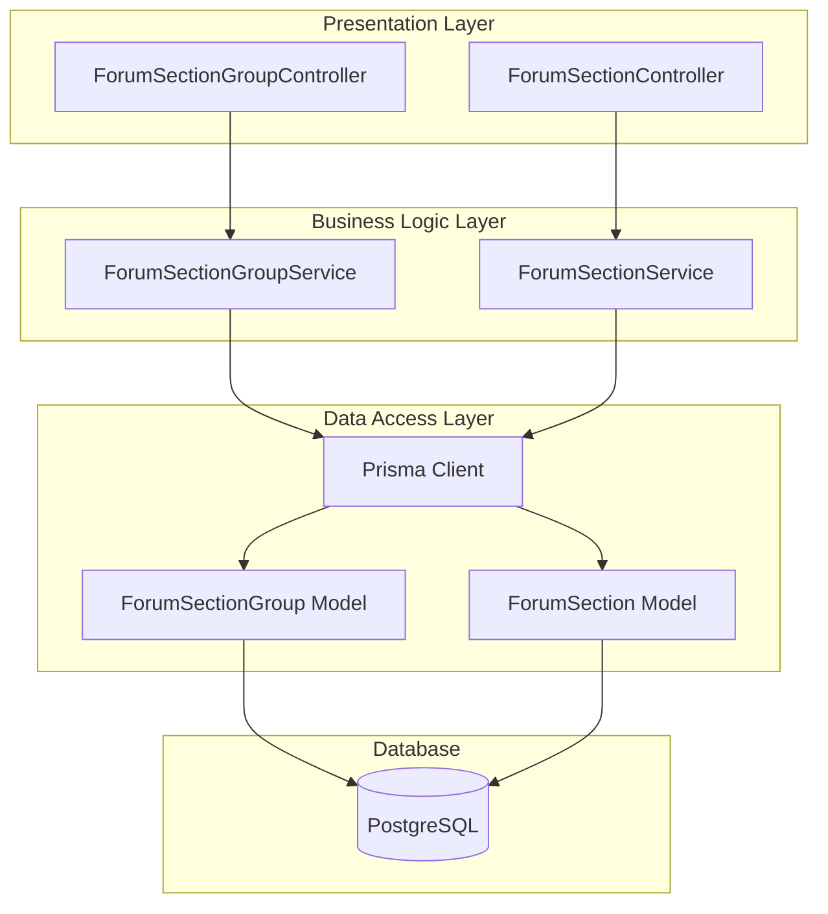
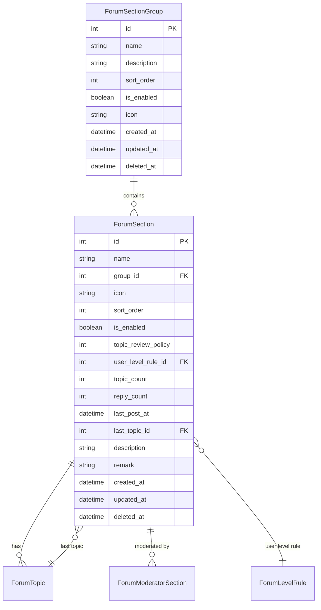
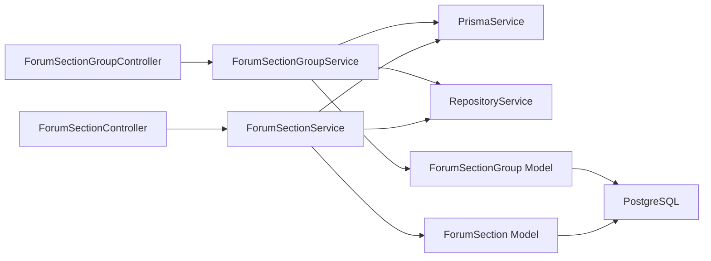
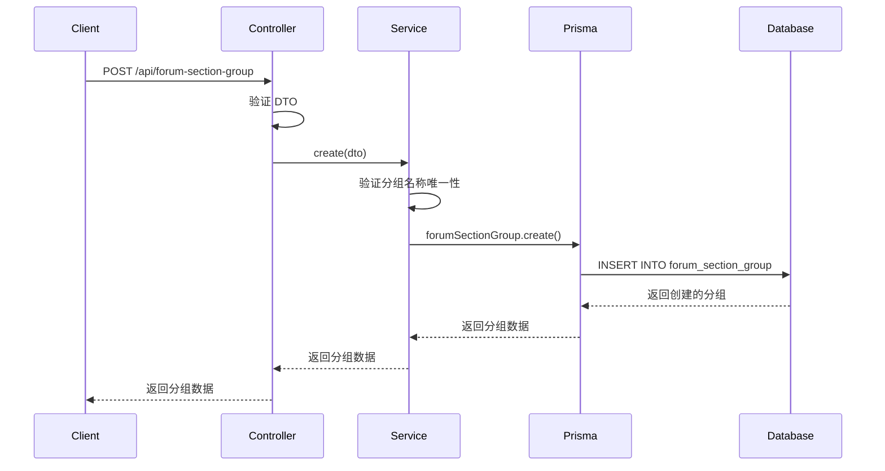
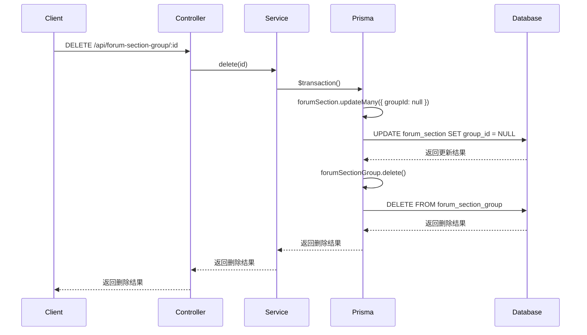
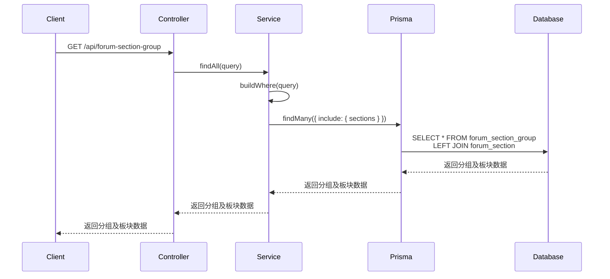

# DESIGN - 论坛板块扁平化改造

## 整体架构图

### 系统架构



### 数据模型关系图



## 分层设计

### 1. Presentation Layer（表现层）

#### ForumSectionGroupController
- **职责**: 处理板块分组的HTTP请求
- **功能**:
  - 创建分组
  - 更新分组
  - 删除分组
  - 查询分组列表
  - 查询分组详情

#### ForumSectionController
- **职责**: 处理板块的HTTP请求
- **功能**:
  - 创建板块
  - 更新板块
  - 删除板块
  - 查询板块列表
  - 查询板块详情

### 2. Business Logic Layer（业务逻辑层）

#### ForumSectionGroupService
- **职责**: 处理板块分组的业务逻辑
- **功能**:
  - 验证分组名称唯一性
  - 处理分组排序
  - 处理分组删除（关联板块的 groupId 设置为 null）
  - 查询分组及其关联的板块

#### ForumSectionService
- **职责**: 处理板块的业务逻辑
- **功能**:
  - 验证板块名称唯一性
  - 处理板块排序
  - 处理板块分组关联
  - 查询板块（支持按分组查询）
  - 更新板块统计信息

### 3. Data Access Layer（数据访问层）

#### Prisma Client
- **职责**: 提供数据库访问接口
- **功能**:
  - 执行CRUD操作
  - 处理事务
  - 优化查询

## 核心组件

### 1. 数据模型组件

#### ForumSectionGroup
```typescript
// prisma/models/forum/forum-section-group.prisma
model ForumSectionGroup {
  id          Int            @id @default(autoincrement())
  name        String         @db.VarChar(50)
  description String?        @db.VarChar(200)
  sortOrder   Int            @default(0) @map("sort_order")
  isEnabled   Boolean        @default(true) @map("is_enabled")
  icon        String?        @db.VarChar(255)
  createdAt   DateTime       @default(now()) @map("created_at") @db.Timestamptz(6)
  updatedAt   DateTime       @updatedAt @map("updated_at") @db.Timestamptz(6)
  deletedAt   DateTime?      @map("deleted_at") @db.Timestamptz(6)
  
  sections    ForumSection[]
  
  @@index([sortOrder])
  @@index([isEnabled])
  @@index([deletedAt])
  @@map("forum_section_group")
}
```

#### ForumSection
```typescript
// prisma/models/forum/forum-section.prisma
model ForumSection {
  id                Int              @id @default(autoincrement())
  name              String           @db.VarChar(50)
  groupId           Int?             @map("group_id")
  icon              String?          @db.VarChar(255)
  sortOrder         Int              @default(0) @map("sort_order")
  isEnabled         Boolean          @default(true) @map("is_enabled")
  topicReviewPolicy Int              @default(1) @map("topic_review_policy")
  userLevelRuleId   Int?             @map("user_level_rule_id")
  topicCount        Int              @default(0) @map("topic_count")
  replyCount        Int              @default(0) @map("reply_count")
  lastPostAt        DateTime?        @map("last_post_at") @db.Timestamptz(6)
  lastTopicId       Int?             @map("last_topic_id")
  description       String?          @db.VarChar(500)
  remark            String?          @db.VarChar(500)
  createdAt         DateTime         @default(now()) @map("created_at") @db.Timestamptz(6)
  updatedAt         DateTime         @updatedAt @map("updated_at") @db.Timestamptz(6)
  deletedAt         DateTime?        @map("deleted_at") @db.Timestamptz(6)
  
  group             ForumSectionGroup? @relation(fields: [groupId], references: [id])
  moderatorSections ForumModeratorSection[]
  lastTopic         ForumTopic?             @relation("LastTopic", fields: [lastTopicId], references: [id])
  userLevelRule     ForumLevelRule?         @relation(fields: [userLevelRuleId], references: [id])
  topics            ForumTopic[]
  
  @@index([sortOrder])
  @@index([isEnabled])
  @@index([topicCount])
  @@index([lastPostAt])
  @@index([createdAt])
  @@index([deletedAt])
  @@index([groupId])
  @@map("forum_section")
}
```

### 2. DTO组件

#### ForumSectionGroupDto
```typescript
// libs/forum/src/section-group/dto/forum-section-group.dto.ts
export class CreateForumSectionGroupDto {
  @ValidateString({
    description: '分组名称',
    example: '技术交流组',
    required: true,
    maxLength: 50,
  })
  name!: string

  @ValidateString({
    description: '分组描述',
    example: '技术相关的讨论',
    required: false,
    maxLength: 200,
  })
  description?: string

  @ValidateNumber({
    description: '排序权重',
    example: 1,
    required: false,
    min: 0,
  })
  sortOrder?: number

  @ValidateBoolean({
    description: '是否启用',
    example: true,
    required: false,
  })
  isEnabled?: boolean

  @ValidateString({
    description: '分组图标',
    example: 'icon-technical',
    required: false,
    maxLength: 255,
  })
  icon?: string
}

export class UpdateForumSectionGroupDto extends PartialType(CreateForumSectionGroupDto) {}

export class QueryForumSectionGroupDto extends BaseQueryDto {
  @ValidateString({
    description: '分组名称（模糊搜索）',
    example: '技术',
    required: false,
  })
  name?: string

  @ValidateBoolean({
    description: '是否启用',
    example: true,
    required: false,
  })
  isEnabled?: boolean
}

export class ForumSectionGroupResponseDto extends BaseDto {
  id!: number
  name!: string
  description?: string
  sortOrder!: number
  isEnabled!: boolean
  icon?: string
  createdAt!: string
  updatedAt!: string
  sections?: ForumSectionResponseDto[]
}
```

#### ForumSectionDto
```typescript
// libs/forum/src/section/dto/forum-section.dto.ts
export class CreateForumSectionDto {
  @ValidateString({
    description: '板块名称',
    example: '前端开发',
    required: true,
    maxLength: 50,
  })
  name!: string

  @ValidateNumber({
    description: '所属分组ID',
    example: 1,
    required: false,
  })
  groupId?: number

  @ValidateString({
    description: '板块图标',
    example: 'icon-frontend',
    required: false,
    maxLength: 255,
  })
  icon?: string

  @ValidateNumber({
    description: '排序权重',
    example: 1,
    required: false,
    min: 0,
  })
  sortOrder?: number

  @ValidateBoolean({
    description: '是否启用',
    example: true,
    required: false,
  })
  isEnabled?: boolean

  @ValidateNumber({
    description: '主题审核策略',
    example: 1,
    required: false,
    min: 1,
  })
  topicReviewPolicy?: number

  @ValidateNumber({
    description: '用户等级规则ID',
    example: 1,
    required: false,
  })
  userLevelRuleId?: number

  @ValidateString({
    description: '板块描述',
    example: '前端技术讨论与分享',
    required: false,
    maxLength: 500,
  })
  description?: string

  @ValidateString({
    description: '备注信息',
    example: '管理员备注',
    required: false,
    maxLength: 500,
  })
  remark?: string
}

export class UpdateForumSectionDto extends PartialType(CreateForumSectionDto) {}

export class QueryForumSectionDto extends BaseQueryDto {
  @ValidateString({
    description: '板块名称（模糊搜索）',
    example: '前端',
    required: false,
  })
  name?: string

  @ValidateNumber({
    description: '所属分组ID',
    example: 1,
    required: false,
  })
  groupId?: number

  @ValidateBoolean({
    description: '是否启用',
    example: true,
    required: false,
  })
  isEnabled?: boolean
}

export class ForumSectionResponseDto extends BaseDto {
  id!: number
  name!: string
  groupId?: number
  groupName?: string
  icon?: string
  sortOrder!: number
  isEnabled!: boolean
  topicReviewPolicy!: number
  userLevelRuleId?: number
  topicCount!: number
  replyCount!: number
  lastPostAt?: string
  lastTopicId?: number
  description?: string
  remark?: string
  createdAt!: string
  updatedAt!: string
}
```

### 3. Service组件

#### ForumSectionGroupService
```typescript
// libs/forum/src/section-group/forum-section-group.service.ts
@Injectable()
export class ForumSectionGroupService {
  constructor(
    private readonly prisma: PrismaService,
    private readonly repository: RepositoryService,
  ) {}

  async create(dto: CreateForumSectionGroupDto) {
    return this.prisma.forumSectionGroup.create({
      data: dto,
    })
  }

  async update(id: number, dto: UpdateForumSectionGroupDto) {
    return this.prisma.forumSectionGroup.update({
      where: { id },
      data: dto,
    })
  }

  async delete(id: number) {
    return this.prisma.$transaction(async (tx) => {
      await tx.forumSection.updateMany({
        where: { groupId: id },
        data: { groupId: null },
      })
      return tx.forumSectionGroup.delete({
        where: { id },
      })
    })
  }

  async findAll(query: QueryForumSectionGroupDto) {
    const where = this.buildWhere(query)
    const [data, total] = await Promise.all([
      this.prisma.forumSectionGroup.findMany({
        where,
        include: {
          sections: {
            where: { deletedAt: null },
            orderBy: { sortOrder: 'asc' },
          },
        },
        orderBy: { sortOrder: 'asc' },
        ...this.repository.buildPagination(query),
      }),
      this.prisma.forumSectionGroup.count({ where }),
    ])
    return { data, total }
  }

  async findOne(id: number) {
    return this.prisma.forumSectionGroup.findUnique({
      where: { id },
      include: {
        sections: {
          where: { deletedAt: null },
          orderBy: { sortOrder: 'asc' },
        },
      },
    })
  }

  private buildWhere(query: QueryForumSectionGroupDto) {
    const where: Prisma.ForumSectionGroupWhereInput = {
      deletedAt: null,
    }
    if (query.name) {
      where.name = { contains: query.name }
    }
    if (query.isEnabled !== undefined) {
      where.isEnabled = query.isEnabled
    }
    return where
  }
}
```

#### ForumSectionService
```typescript
// libs/forum/src/section/forum-section.service.ts
@Injectable()
export class ForumSectionService {
  constructor(
    private readonly prisma: PrismaService,
    private readonly repository: RepositoryService,
  ) {}

  async create(dto: CreateForumSectionDto) {
    return this.prisma.forumSection.create({
      data: dto,
    })
  }

  async update(id: number, dto: UpdateForumSectionDto) {
    return this.prisma.forumSection.update({
      where: { id },
      data: dto,
    })
  }

  async delete(id: number) {
    return this.prisma.forumSection.delete({
      where: { id },
    })
  }

  async findAll(query: QueryForumSectionDto) {
    const where = this.buildWhere(query)
    const [data, total] = await Promise.all([
      this.prisma.forumSection.findMany({
        where,
        include: {
          group: true,
        },
        orderBy: { sortOrder: 'asc' },
        ...this.repository.buildPagination(query),
      }),
      this.prisma.forumSection.count({ where }),
    ])
    return { data, total }
  }

  async findOne(id: number) {
    return this.prisma.forumSection.findUnique({
      where: { id },
      include: {
        group: true,
      },
    })
  }

  private buildWhere(query: QueryForumSectionDto) {
    const where: Prisma.ForumSectionWhereInput = {
      deletedAt: null,
    }
    if (query.name) {
      where.name = { contains: query.name }
    }
    if (query.groupId !== undefined) {
      where.groupId = query.groupId
    }
    if (query.isEnabled !== undefined) {
      where.isEnabled = query.isEnabled
    }
    return where
  }
}
```

## 模块依赖关系图



## 接口契约定义

### 板块分组接口

#### 1. 创建分组
- **URL**: `POST /api/forum-section-group`
- **请求体**:
```json
{
  "name": "技术交流组",
  "description": "技术相关的讨论",
  "sortOrder": 1,
  "isEnabled": true,
  "icon": "icon-technical"
}
```
- **响应**:
```json
{
  "code": 200,
  "message": "success",
  "data": {
    "id": 1,
    "name": "技术交流组",
    "description": "技术相关的讨论",
    "sortOrder": 1,
    "isEnabled": true,
    "icon": "icon-technical",
    "createdAt": "2024-01-01T00:00:00.000Z",
    "updatedAt": "2024-01-01T00:00:00.000Z"
  }
}
```

#### 2. 更新分组
- **URL**: `PUT /api/forum-section-group/:id`
- **请求体**:
```json
{
  "name": "技术交流组",
  "description": "技术相关的讨论（更新）",
  "sortOrder": 2,
  "isEnabled": true,
  "icon": "icon-technical"
}
```
- **响应**: 同创建分组

#### 3. 删除分组
- **URL**: `DELETE /api/forum-section-group/:id`
- **响应**:
```json
{
  "code": 200,
  "message": "success",
  "data": null
}
```

#### 4. 查询分组列表
- **URL**: `GET /api/forum-section-group`
- **查询参数**:
  - `page`: 页码（默认1）
  - `pageSize`: 每页数量（默认10）
  - `name`: 分组名称（模糊搜索）
  - `isEnabled`: 是否启用
- **响应**:
```json
{
  "code": 200,
  "message": "success",
  "data": {
    "data": [
      {
        "id": 1,
        "name": "技术交流组",
        "description": "技术相关的讨论",
        "sortOrder": 1,
        "isEnabled": true,
        "icon": "icon-technical",
        "createdAt": "2024-01-01T00:00:00.000Z",
        "updatedAt": "2024-01-01T00:00:00.000Z",
        "sections": [
          {
            "id": 1,
            "name": "前端开发",
            "groupId": 1,
            "icon": "icon-frontend",
            "sortOrder": 1,
            "isEnabled": true,
            "topicCount": 100,
            "replyCount": 1000,
            "createdAt": "2024-01-01T00:00:00.000Z",
            "updatedAt": "2024-01-01T00:00:00.000Z"
          }
        ]
      }
    ],
    "total": 1,
    "page": 1,
    "pageSize": 10
  }
}
```

#### 5. 查询分组详情
- **URL**: `GET /api/forum-section-group/:id`
- **响应**: 同查询分组列表的单个数据项

### 板块接口

#### 1. 创建板块
- **URL**: `POST /api/forum-section`
- **请求体**:
```json
{
  "name": "前端开发",
  "groupId": 1,
  "icon": "icon-frontend",
  "sortOrder": 1,
  "isEnabled": true,
  "topicReviewPolicy": 1,
  "userLevelRuleId": 1,
  "description": "前端技术讨论与分享",
  "remark": "管理员备注"
}
```
- **响应**:
```json
{
  "code": 200,
  "message": "success",
  "data": {
    "id": 1,
    "name": "前端开发",
    "groupId": 1,
    "groupName": "技术交流组",
    "icon": "icon-frontend",
    "sortOrder": 1,
    "isEnabled": true,
    "topicReviewPolicy": 1,
    "userLevelRuleId": 1,
    "topicCount": 0,
    "replyCount": 0,
    "description": "前端技术讨论与分享",
    "remark": "管理员备注",
    "createdAt": "2024-01-01T00:00:00.000Z",
    "updatedAt": "2024-01-01T00:00:00.000Z"
  }
}
```

#### 2. 更新板块
- **URL**: `PUT /api/forum-section/:id`
- **请求体**: 同创建板块
- **响应**: 同创建板块

#### 3. 删除板块
- **URL**: `DELETE /api/forum-section/:id`
- **响应**:
```json
{
  "code": 200,
  "message": "success",
  "data": null
}
```

#### 4. 查询板块列表
- **URL**: `GET /api/forum-section`
- **查询参数**:
  - `page`: 页码（默认1）
  - `pageSize`: 每页数量（默认10）
  - `name`: 板块名称（模糊搜索）
  - `groupId`: 所属分组ID
  - `isEnabled`: 是否启用
- **响应**:
```json
{
  "code": 200,
  "message": "success",
  "data": {
    "data": [
      {
        "id": 1,
        "name": "前端开发",
        "groupId": 1,
        "groupName": "技术交流组",
        "icon": "icon-frontend",
        "sortOrder": 1,
        "isEnabled": true,
        "topicReviewPolicy": 1,
        "userLevelRuleId": 1,
        "topicCount": 100,
        "replyCount": 1000,
        "description": "前端技术讨论与分享",
        "remark": "管理员备注",
        "createdAt": "2024-01-01T00:00:00.000Z",
        "updatedAt": "2024-01-01T00:00:00.000Z"
      }
    ],
    "total": 1,
    "page": 1,
    "pageSize": 10
  }
}
```

#### 5. 查询板块详情
- **URL**: `GET /api/forum-section/:id`
- **响应**: 同查询板块列表的单个数据项

## 数据流向图

### 创建分组流程


### 删除分组流程


### 查询分组列表流程


## 异常处理策略

### 1. 业务异常

#### 分组名称重复
```typescript
if (await this.prisma.forumSectionGroup.findUnique({ where: { name } })) {
  throw new ConflictException('分组名称已存在')
}
```

#### 板块名称重复
```typescript
if (await this.prisma.forumSection.findUnique({ where: { name } })) {
  throw new ConflictException('板块名称已存在')
}
```

#### 分组不存在
```typescript
const group = await this.prisma.forumSectionGroup.findUnique({ where: { id } })
if (!group) {
  throw new NotFoundException('分组不存在')
}
```

#### 板块不存在
```typescript
const section = await this.prisma.forumSection.findUnique({ where: { id } })
if (!section) {
  throw new NotFoundException('板块不存在')
}
```

#### 分组不存在
```typescript
if (dto.groupId) {
  const group = await this.prisma.forumSectionGroup.findUnique({ where: { id: dto.groupId } })
  if (!group) {
    throw new NotFoundException('分组不存在')
  }
}
```

### 2. 验证异常

#### DTO 验证
```typescript
// 使用 class-validator 自动验证
@ValidateString({
  description: '分组名称',
  example: '技术交流组',
  required: true,
  maxLength: 50,
})
name!: string
```

### 3. 数据库异常

#### 唯一约束冲突
```typescript
try {
  return this.prisma.forumSectionGroup.create({ data: dto })
} catch (error) {
  if (error.code === 'P2002') {
    throw new ConflictException('分组名称已存在')
  }
  throw error
}
```

#### 外键约束冲突
```typescript
try {
  return this.prisma.forumSection.create({ data: dto })
} catch (error) {
  if (error.code === 'P2003') {
    throw new BadRequestException('分组不存在')
  }
  throw error
}
```

### 4. 统一异常处理

```typescript
@Catch()
export class AllExceptionsFilter implements ExceptionFilter {
  catch(exception: unknown, host: ArgumentsHost) {
    const ctx = host.switchToHttp()
    const response = ctx.getResponse<Response>()
    const request = ctx.getRequest<Request>()

    let status = HttpStatus.INTERNAL_SERVER_ERROR
    let message = '服务器内部错误'
    let code = 500

    if (exception instanceof HttpException) {
      status = exception.getStatus()
      code = status
      message = exception.message
    } else if (exception instanceof Prisma.PrismaClientKnownRequestError) {
      status = HttpStatus.BAD_REQUEST
      code = 400
      message = this.handlePrismaError(exception)
    }

    response.status(status).json({
      code,
      message,
      timestamp: new Date().toISOString(),
      path: request.url,
    })
  }

  private handlePrismaError(error: Prisma.PrismaClientKnownRequestError): string {
    switch (error.code) {
      case 'P2002':
        return '数据已存在'
      case 'P2003':
        return '关联数据不存在'
      case 'P2025':
        return '记录不存在'
      default:
        return '数据库错误'
    }
  }
}
```

## 性能优化策略

### 1. 数据库索引

```prisma
// ForumSectionGroup
@@index([sortOrder])
@@index([isEnabled])
@@index([deletedAt])

// ForumSection
@@index([sortOrder])
@@index([isEnabled])
@@index([topicCount])
@@index([lastPostAt])
@@index([createdAt])
@@index([deletedAt])
@@index([groupId])
```

### 2. 查询优化

#### 避免N+1查询
```typescript
// 使用 include 预加载关联数据
const groups = await this.prisma.forumSectionGroup.findMany({
  include: {
    sections: {
      where: { deletedAt: null },
      orderBy: { sortOrder: 'asc' },
    },
  },
})
```

#### 分页查询
```typescript
const [data, total] = await Promise.all([
  this.prisma.forumSectionGroup.findMany({
    where,
    skip: (page - 1) * pageSize,
    take: pageSize,
  }),
  this.prisma.forumSectionGroup.count({ where }),
])
```

### 3. 缓存策略

#### Redis 缓存
```typescript
@Injectable()
export class ForumSectionGroupService {
  constructor(
    private readonly prisma: PrismaService,
    @Inject(CACHE_MANAGER) private readonly cache: Cache,
  ) {}

  async findAll(query: QueryForumSectionGroupDto) {
    const cacheKey = `forum-section-group:${JSON.stringify(query)}`
    const cached = await this.cache.get(cacheKey)
    if (cached) {
      return cached
    }

    const result = await this.prisma.forumSectionGroup.findMany({
      where,
      include: {
        sections: {
          where: { deletedAt: null },
          orderBy: { sortOrder: 'asc' },
        },
      },
    })

    await this.cache.set(cacheKey, result, 300)
    return result
  }
}
```

## 设计原则

### 1. 单一职责原则
- Controller 只负责处理HTTP请求
- Service 只负责业务逻辑
- Model 只负责数据定义

### 2. 开闭原则
- 通过扩展而不是修改来增加功能
- 使用装饰器和中间件来扩展功能

### 3. 依赖倒置原则
- 依赖抽象而不是具体实现
- 使用接口和依赖注入

### 4. 最小知识原则
- 模块之间只通过接口通信
- 避免直接访问内部实现

### 5. DRY原则
- 复用现有组件和模式
- 避免重复代码

## 质量门控

### 1. 架构图清晰准确
- ✅ 系统架构图完整
- ✅ 数据模型关系图清晰
- ✅ 模块依赖关系图准确
- ✅ 数据流向图完整

### 2. 接口定义完整
- ✅ 所有接口都有完整的定义
- ✅ 请求和响应格式清晰
- ✅ 错误处理策略明确

### 3. 与现有系统无冲突
- ✅ 复用现有组件和模式
- ✅ 保持代码风格一致
- ✅ 遵循现有规范

### 4. 设计可行性验证
- ✅ 技术方案可行
- ✅ 性能优化合理
- ✅ 数据迁移方案完整
