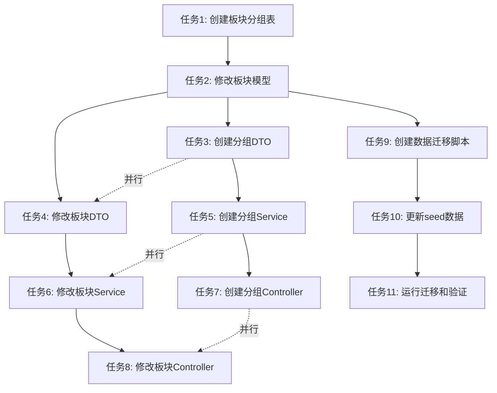

# TASK - 论坛板块扁平化改造

## 任务依赖图

## 子任务列表

### 任务1: 创建板块分组表 ForumSectionGroup

#### 输入契约
- **前置依赖**: 无
- **输入数据**: 
  - DESIGN 文档中的 ForumSectionGroup 模型定义
- **环境依赖**: 
  - Prisma CLI 已安装
  - 数据库连接正常

#### 输出契约
- **输出数据**: 
  - `prisma/models/forum/forum-section-group.prisma` 文件
- **交付物**: 
  - ForumSectionGroup Prisma 模型文件
- **验收标准**: 
  - ✅ 模型文件创建成功
  - ✅ 模型定义符合 DESIGN 文档
  - ✅ 所有字段和索引正确定义
  - ✅ 与 ForumSection 的关联关系正确

#### 实现约束
- **技术栈**: Prisma ORM
- **接口规范**: 遵循 Prisma 模型定义规范
- **质量要求**: 
  - 字段类型正确
  - 索引定义合理
  - 关联关系正确
  - 注释清晰

#### 依赖关系
- **后置任务**: 任务2（修改板块模型）
- **并行任务**: 无

---

### 任务2: 修改 ForumSection 模型 - 去掉层级字段，添加分组字段

#### 输入契约
- **前置依赖**: 任务1（创建板块分组表）
- **输入数据**: 
  - DESIGN 文档中的 ForumSection 模型定义
  - 现有的 ForumSection 模型文件
- **环境依赖**: 
  - Prisma CLI 已安装
  - 数据库连接正常

#### 输出契约
- **输出数据**: 
  - 修改后的 `prisma/models/forum/forum-section.prisma` 文件
- **交付物**: 
  - 修改后的 ForumSection Prisma 模型文件
- **验收标准**: 
  - ✅ 删除 parentId、level、path、inheritPermission 字段
  - ✅ 删除 parent 和 children 自关联关系
  - ✅ 添加 groupId 字段
  - ✅ 添加 group 关联关系
  - ✅ 添加 groupId 索引
  - ✅ 保留其他字段和关联关系不变

#### 实现约束
- **技术栈**: Prisma ORM
- **接口规范**: 遵循 Prisma 模型定义规范
- **质量要求**: 
  - 字段类型正确
  - 索引定义合理
  - 关联关系正确
  - 注释清晰

#### 依赖关系
- **后置任务**: 任务3、任务4、任务9
- **并行任务**: 无

---

### 任务3: 创建板块分组相关的 DTO

#### 输入契约
- **前置依赖**: 任务1（创建板块分组表）
- **输入数据**: 
  - DESIGN 文档中的 DTO 定义
  - 现有的 DTO 文件作为参考
- **环境依赖**: 
  - class-validator 已安装
  - class-transformer 已安装

#### 输出契约
- **输出数据**: 
  - `libs/forum/src/section-group/dto/forum-section-group.dto.ts` 文件
- **交付物**: 
  - CreateForumSectionGroupDto
  - UpdateForumSectionGroupDto
  - QueryForumSectionGroupDto
  - ForumSectionGroupResponseDto
- **验收标准**: 
  - ✅ DTO 文件创建成功
  - ✅ 所有 DTO 类定义正确
  - ✅ 验证装饰器使用正确
  - ✅ 字段描述清晰
  - ✅ 继承关系正确

#### 实现约束
- **技术栈**: TypeScript、class-validator、class-transformer
- **接口规范**: 遵循项目 DTO 规范
- **质量要求**: 
  - 使用项目现有的验证装饰器
  - 字段描述使用中文
  - 遵循现有代码风格
  - 注释清晰

#### 依赖关系
- **后置任务**: 任务5（创建分组Service）
- **并行任务**: 任务4（修改板块DTO）

---

### 任务4: 修改板块相关的 DTO

#### 输入契约
- **前置依赖**: 任务2（修改板块模型）
- **输入数据**: 
  - DESIGN 文档中的 DTO 定义
  - 现有的板块 DTO 文件
- **环境依赖**: 
  - class-validator 已安装
  - class-transformer 已安装

#### 输出契约
- **输出数据**: 
  - 修改后的 `libs/forum/src/section/dto/forum-section.dto.ts` 文件
- **交付物**: 
  - CreateForumSectionDto（添加 groupId 字段）
  - UpdateForumSectionDto（添加 groupId 字段）
  - QueryForumSectionDto（添加 groupId 字段）
  - ForumSectionResponseDto（添加 groupId、groupName 字段，删除 parentId、level、path 字段）
- **验收标准**: 
  - ✅ 删除 parentId、level、path 字段
  - ✅ 添加 groupId 字段
  - ✅ 添加 groupName 字段（用于响应）
  - ✅ 验证装饰器使用正确
  - ✅ 字段描述清晰

#### 实现约束
- **技术栈**: TypeScript、class-validator、class-transformer
- **接口规范**: 遵循项目 DTO 规范
- **质量要求**: 
  - 使用项目现有的验证装饰器
  - 字段描述使用中文
  - 遵循现有代码风格
  - 注释清晰

#### 依赖关系
- **后置任务**: 任务6（修改板块Service）
- **并行任务**: 任务3（创建分组DTO）

---

### 任务5: 创建板块分组 Service

#### 输入契约
- **前置依赖**: 任务1（创建板块分组表）、任务3（创建分组DTO）
- **输入数据**: 
  - DESIGN 文档中的 Service 定义
  - 现有的板块 Service 文件作为参考
- **环境依赖**: 
  - PrismaService 已配置
  - RepositoryService 已配置

#### 输出契约
- **输出数据**: 
  - `libs/forum/src/section-group/forum-section-group.service.ts` 文件
  - `libs/forum/src/section-group/forum-section-group.module.ts` 文件
- **交付物**: 
  - ForumSectionGroupService 类
  - ForumSectionGroupModule 模块
- **验收标准**: 
  - ✅ Service 文件创建成功
  - ✅ Module 文件创建成功
  - ✅ 实现所有 CRUD 方法
  - ✅ 实现查询分组及其关联板块的方法
  - ✅ 实现删除分组时更新关联板块的 groupId 为 null
  - ✅ 实现分组名称唯一性验证
  - ✅ 使用事务保证数据一致性
  - ✅ 代码注释清晰

#### 实现约束
- **技术栈**: NestJS、TypeScript、Prisma
- **接口规范**: 遵循 NestJS Service 规范
- **质量要求**: 
  - 复用现有的 RepositoryService
  - 使用项目现有的异常处理
  - 遵循现有代码风格
  - 代码注释使用中文

#### 依赖关系
- **后置任务**: 任务7（创建分组Controller）
- **并行任务**: 任务6（修改板块Service）

---

### 任务6: 修改板块 Service

#### 输入契约
- **前置依赖**: 任务2（修改板块模型）、任务4（修改板块DTO）
- **输入数据**: 
  - DESIGN 文档中的 Service 定义
  - 现有的板块 Service 文件
- **环境依赖**: 
  - PrismaService 已配置
  - RepositoryService 已配置

#### 输出契约
- **输出数据**: 
  - 修改后的 `libs/forum/src/section/forum-section.service.ts` 文件
- **交付物**: 
  - 修改后的 ForumSectionService 类
- **验收标准**: 
  - ✅ 删除 calculateSectionPath 方法
  - ✅ 删除 validateHierarchy 方法
  - ✅ 删除层级相关的验证逻辑
  - ✅ 添加分组存在性验证
  - ✅ 修改查询方法，支持按分组查询
  - ✅ 修改查询方法，包含 group 关联
  - ✅ 保留其他功能不变
  - ✅ 代码注释清晰

#### 实现约束
- **技术栈**: NestJS、TypeScript、Prisma
- **接口规范**: 遵循 NestJS Service 规范
- **质量要求**: 
  - 复用现有的 RepositoryService
  - 使用项目现有的异常处理
  - 遵循现有代码风格
  - 代码注释使用中文

#### 依赖关系
- **后置任务**: 任务8（修改板块Controller）
- **并行任务**: 任务5（创建分组Service）

---

### 任务7: 创建板块分组 Controller

#### 输入契约
- **前置依赖**: 任务5（创建分组Service）
- **输入数据**: 
  - DESIGN 文档中的 Controller 定义
  - 现有的板块 Controller 文件作为参考
- **环境依赖**: 
  - NestJS 已配置
  - Swagger 已配置

#### 输出契约
- **输出数据**: 
  - `libs/forum/src/section-group/forum-section-group.controller.ts` 文件
- **交付物**: 
  - ForumSectionGroupController 类
- **验收标准**: 
  - ✅ Controller 文件创建成功
  - ✅ 实现所有 CRUD 接口
  - ✅ 使用 Swagger 装饰器生成 API 文档
  - ✅ 使用验证装饰器验证请求参数
  - ✅ 使用统一的响应格式
  - ✅ 代码注释清晰

#### 实现约束
- **技术栈**: NestJS、TypeScript、Swagger
- **接口规范**: 遵循 NestJS Controller 规范
- **质量要求**: 
  - 复用现有的响应格式
  - 使用项目现有的装饰器
  - 遵循现有代码风格
  - 代码注释使用中文

#### 依赖关系
- **后置任务**: 无
- **并行任务**: 任务8（修改板块Controller）

---

### 任务8: 修改板块 Controller

#### 输入契约
- **前置依赖**: 任务6（修改板块Service）
- **输入数据**: 
  - DESIGN 文档中的 Controller 定义
  - 现有的板块 Controller 文件
- **环境依赖**: 
  - NestJS 已配置
  - Swagger 已配置

#### 输出契约
- **输出数据**: 
  - 修改后的 `libs/forum/src/section/forum-section.controller.ts` 文件
- **交付物**: 
  - 修改后的 ForumSectionController 类
- **验收标准**: 
  - ✅ 删除层级相关的接口参数
  - ✅ 添加按分组查询的接口参数
  - ✅ 修改响应 DTO，包含分组信息
  - ✅ 保留其他功能不变
  - ✅ 代码注释清晰

#### 实现约束
- **技术栈**: NestJS、TypeScript、Swagger
- **接口规范**: 遵循 NestJS Controller 规范
- **质量要求**: 
  - 复用现有的响应格式
  - 使用项目现有的装饰器
  - 遵循现有代码风格
  - 代码注释使用中文

#### 依赖关系
- **后置任务**: 无
- **并行任务**: 任务7（创建分组Controller）

---

### 任务9: 创建数据迁移脚本

#### 输入契约
- **前置依赖**: 任务1（创建板块分组表）、任务2（修改板块模型）
- **输入数据**: 
  - CONSENSUS 文档中的数据迁移方案
  - 现有的数据库迁移脚本作为参考
- **环境依赖**: 
  - Prisma CLI 已安装
  - 数据库连接正常

#### 输出契约
- **输出数据**: 
  - `prisma/migrations/xxx_migrate_section_hierarchy_to_group/migration.sql` 文件
- **交付物**: 
  - 数据迁移 SQL 脚本
- **验收标准**: 
  - ✅ 迁移脚本创建成功
  - ✅ 创建 forum_section_group 表
  - ✅ 迁移主板块（level=0）到分组
  - ✅ 更新子板块（level=1）的 groupId
  - ✅ 删除层级字段
  - ✅ 创建必要的索引
  - ✅ 保留原有数据完整性
  - ✅ 脚本可回滚

#### 实现约束
- **技术栈**: SQL、Prisma Migrate
- **接口规范**: 遵循 Prisma 迁移脚本规范
- **质量要求**: 
  - SQL 语句正确
  - 事务处理正确
  - 错误处理完善
  - 注释清晰

#### 依赖关系
- **后置任务**: 任务10（更新seed数据）
- **并行任务**: 无

---

### 任务10: 更新 seed 数据

#### 输入契约
- **前置依赖**: 任务9（创建数据迁移脚本）
- **输入数据**: 
  - DESIGN 文档中的数据模型
  - 现有的 seed 数据文件
- **环境依赖**: 
  - Prisma CLI 已安装
  - 数据库连接正常

#### 输出契约
- **输出数据**: 
  - 修改后的 `libs/base/src/database/seed/modules/forum/section.ts` 文件
  - 新增的 `libs/base/src/database/seed/modules/forum/section-group.ts` 文件
- **交付物**: 
  - 更新后的板块 seed 数据
  - 新增的板块分组 seed 数据
- **验收标准**: 
  - ✅ 板块分组 seed 数据创建成功
  - ✅ 板块 seed 数据更新成功
  - ✅ 删除层级相关的数据
  - ✅ 添加分组关联
  - ✅ 数据格式正确
  - ✅ 代码注释清晰

#### 实现约束
- **技术栈**: TypeScript、Prisma
- **接口规范**: 遵循项目 seed 数据规范
- **质量要求**: 
  - 数据格式正确
  - 遵循现有代码风格
  - 代码注释清晰

#### 依赖关系
- **后置任务**: 任务11（运行迁移和验证）
- **并行任务**: 无

---

### 任务11: 运行迁移和验证

#### 输入契约
- **前置依赖**: 任务1-任务10 全部完成
- **输入数据**: 
  - 所有修改后的代码文件
  - 数据库迁移脚本
  - seed 数据文件
- **环境依赖**: 
  - Prisma CLI 已安装
  - 数据库连接正常
  - Node.js 环境正常

#### 输出契约
- **输出数据**: 
  - 迁移执行结果
  - 验证测试结果
- **交付物**: 
  - 数据库迁移成功
  - 数据验证通过
  - 功能验证通过
- **验收标准**: 
  - ✅ Prisma generate 成功
  - ✅ Prisma migrate deploy 成功
  - ✅ Prisma seed 成功
  - ✅ 数据库表结构正确
  - ✅ 数据迁移完整
  - ✅ API 接口正常
  - ✅ 查询性能正常
  - ✅ TypeScript 编译通过
  - ✅ ESLint 检查通过

#### 实现约束
- **技术栈**: Prisma、TypeScript、Node.js
- **接口规范**: 遵循项目部署规范
- **质量要求**: 
  - 按顺序执行迁移命令
  - 验证每个步骤的结果
  - 记录测试结果
  - 处理异常情况

#### 依赖关系
- **后置任务**: 无
- **并行任务**: 无

---

## 任务执行顺序

### 第一阶段：数据模型层（任务1-2）
1. 任务1: 创建板块分组表 ForumSectionGroup
2. 任务2: 修改 ForumSection 模型

### 第二阶段：DTO层（任务3-4）
3. 任务3: 创建板块分组相关的 DTO
4. 任务4: 修改板块相关的 DTO

### 第三阶段：业务逻辑层（任务5-6）
5. 任务5: 创建板块分组 Service
6. 任务6: 修改板块 Service

### 第四阶段：表现层（任务7-8）
7. 任务7: 创建板块分组 Controller
8. 任务8: 修改板块 Controller

### 第五阶段：数据迁移层（任务9-11）
9. 任务9: 创建数据迁移脚本
10. 任务10: 更新 seed 数据
11. 任务11: 运行迁移和验证

## 质量门控

### 1. 任务覆盖完整需求
- ✅ 所有需求都有对应的任务
- ✅ 任务之间依赖关系清晰
- ✅ 任务粒度合理

### 2. 依赖关系无循环
- ✅ 任务依赖关系为有向无环图
- ✅ 任务执行顺序明确

### 3. 每个任务都可独立验证
- ✅ 每个任务都有明确的验收标准
- ✅ 每个任务都有明确的交付物
- ✅ 每个任务都有明确的输入输出

### 4. 复杂度评估合理
- ✅ 任务拆分粒度适中
- ✅ 每个任务的复杂度可控
- ✅ 任务之间的耦合度低

## 风险评估

### 1. 数据迁移风险
- **风险描述**: 现有数据可能无法完美映射到新结构
- **缓解措施**: 创建详细的迁移脚本，并在测试环境验证
- **应急预案**: 准备回滚脚本，确保可以恢复到迁移前的状态

### 2. 性能风险
- **风险描述**: 新的查询结构可能影响性能
- **缓解措施**: 添加适当的索引，优化查询逻辑
- **应急预案**: 监控查询性能，必要时进行优化

### 3. 兼容性风险
- **风险描述**: 现有API可能需要调整
- **缓解措施**: 保持API接口不变，只修改内部实现
- **应急预案**: 准备API版本兼容方案

## 下一步行动

1. 开始执行任务1：创建板块分组表 ForumSectionGroup
2. 按照任务依赖顺序依次执行后续任务
3. 每完成一个任务，立即进行验证
4. 遇到问题及时记录并寻求解决方案
5. 所有任务完成后，进行整体验收
