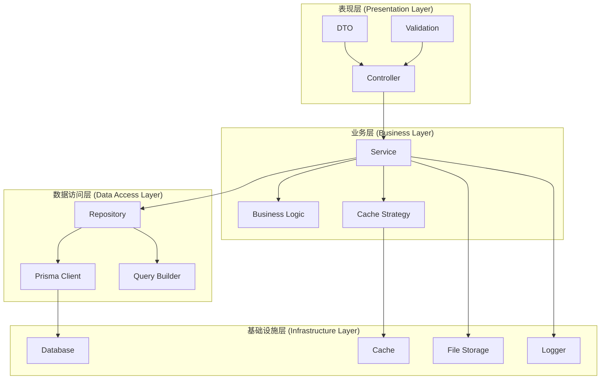
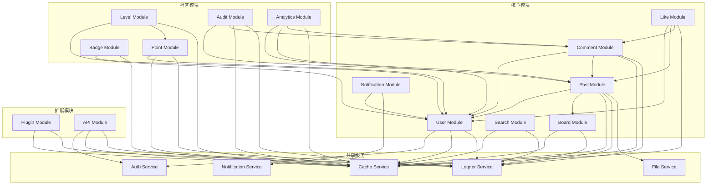
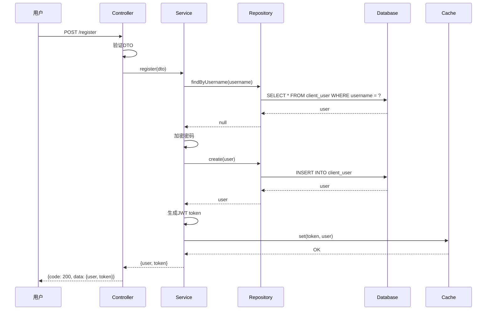
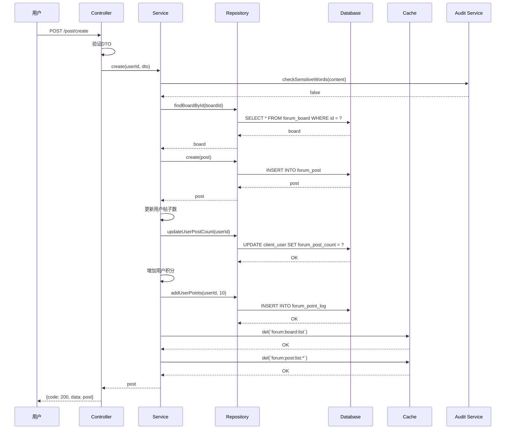
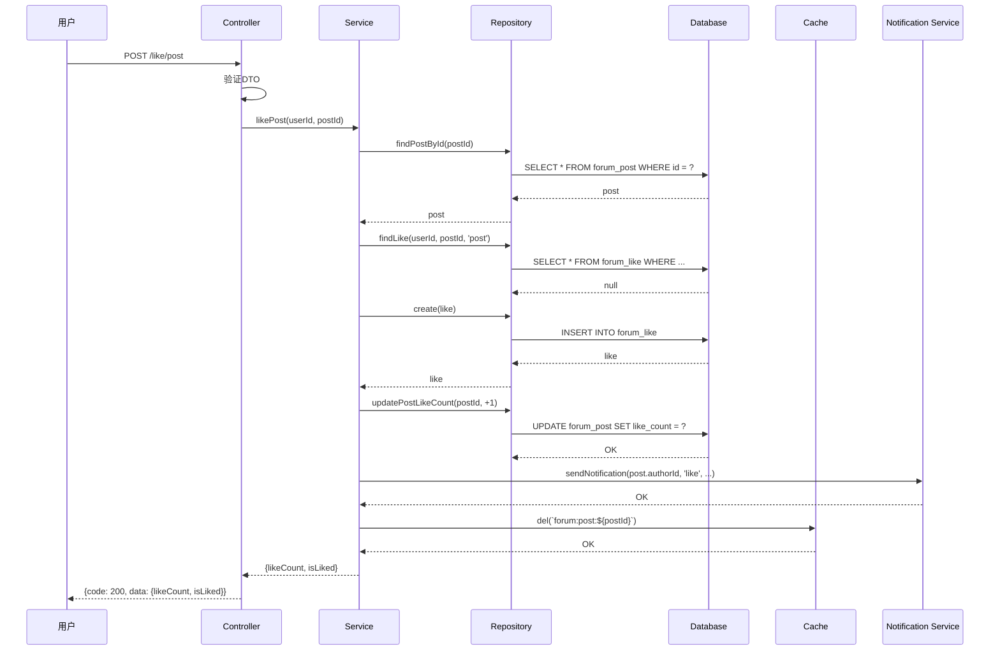
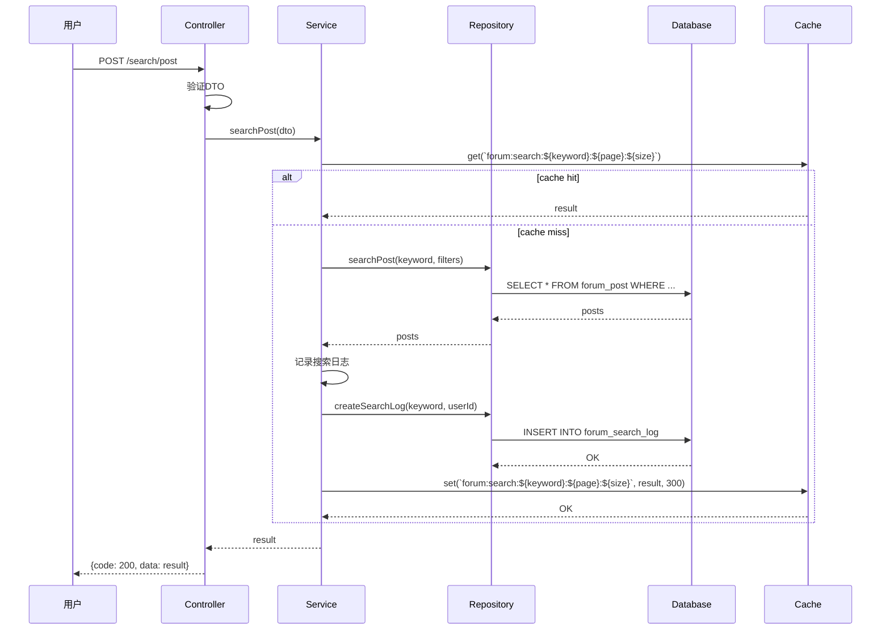
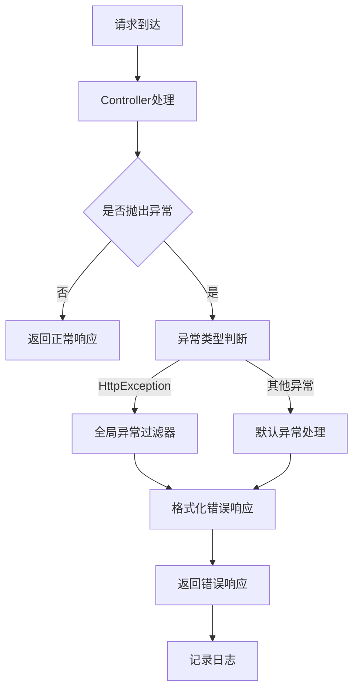
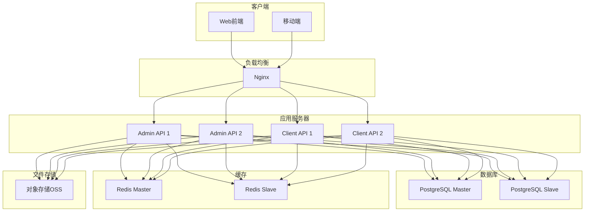

# 论坛系统接入 - 系统设计文档

## 1. 整体架构设计

### 1.1 系统架构图

```mermaid
graph TB
    subgraph "客户端层"
        A1[Web前端]
        A2[移动端]
        A3[第三方应用]
    end

    subgraph "API网关层"
        B1[Admin API网关]
        B2[Client API网关]
    end

    subgraph "应用层"
        C1[用户管理模块]
        C2[板块管理模块]
        C3[帖子管理模块]
        C4[评论管理模块]
        C5[点赞管理模块]
        C6[搜索管理模块]
        C7[通知管理模块]
        C8[积分管理模块]
        C9[等级管理模块]
        C10[徽章管理模块]
        C11[审核管理模块]
        C12[分析管理模块]
        C13[插件管理模块]
        C14[开放API模块]
    end

    subgraph "服务层"
        D1[认证服务]
        D2[权限服务]
        D3[缓存服务]
        D4[日志服务]
        D5[文件服务]
        D6[通知服务]
    end

    subgraph "数据层"
        E1[(PostgreSQL)]
        E2[(Redis)]
        E3[(对象存储)]
    end

    A1 --> B2
    A2 --> B2
    A3 --> B2
    B1 --> C1
    B1 --> C2
    B1 --> C3
    B1 --> C4
    B1 --> C8
    B1 --> C9
    B1 --> C10
    B1 --> C11
    B1 --> C12
    B1 --> C13
    B2 --> C1
    B2 --> C2
    B2 --> C3
    B2 --> C4
    B2 --> C5
    B2 --> C6
    B2 --> C7
    B2 --> C8
    B2 --> C9
    B2 --> C10
    B2 --> C14

    C1 --> D1
    C1 --> D2
    C2 --> D2
    C3 --> D3
    C3 --> D5
    C4 --> D3
    C5 --> D3
    C6 --> D3
    C7 --> D6
    C8 --> D3
    C9 --> D3
    C10 --> D3
    C11 --> D3
    C12 --> D3
    C13 --> D3
    C14 --> D1

    C1 --> E1
    C2 --> E1
    C3 --> E1
    C4 --> E1
    C5 --> E1
    C6 --> E1
    C7 --> E1
    C8 --> E1
    C9 --> E1
    C10 --> E1
    C11 --> E1
    C12 --> E1
    C13 --> E1
    C14 --> E1

    C3 --> E2
    C4 --> E2
    C5 --> E2
    C6 --> E2
    C7 --> E2
    C8 --> E2
    C9 --> E2
    C10 --> E2
    C11 --> E2
    C12 --> E2

    C3 --> E3
```



### 1.2 分层架构



## 2. 核心组件设计

### 2.1 模块结构

```
apps/
├── admin-api/
│   └── src/modules/forum/
│       ├── user/
│       │   ├── core/
│       │   │   ├── user.module.ts
│       │   │   ├── user.controller.ts
│       │   │   ├── user.service.ts
│       │   │   └── dto/
│       │   │       ├── create-user.dto.ts
│       │   │       ├── update-user.dto.ts
│       │   │       └── query-user.dto.ts
│       │   └── constants/
│       │       └── user.constant.ts
│       ├── board/
│       │   ├── core/
│       │   │   ├── board.module.ts
│       │   │   ├── board.controller.ts
│       │   │   ├── board.service.ts
│       │   │   └── dto/
│       │   │       ├── create-board.dto.ts
│       │   │       ├── update-board.dto.ts
│       │   │       └── query-board.dto.ts
│       │   └── constants/
│       │       └── board.constant.ts
│       ├── post/
│       │   ├── core/
│       │   │   ├── post.module.ts
│       │   │   ├── post.controller.ts
│       │   │   ├── post.service.ts
│       │   │   └── dto/
│       │   │       ├── create-post.dto.ts
│       │   │       ├── update-post.dto.ts
│       │   │       └── query-post.dto.ts
│       │   └── constants/
│       │       └── post.constant.ts
│       ├── comment/
│       │   ├── core/
│       │   │   ├── comment.module.ts
│       │   │   ├── comment.controller.ts
│       │   │   ├── comment.service.ts
│       │   │   └── dto/
│       │   │       ├── create-comment.dto.ts
│       │   │       └── query-comment.dto.ts
│       │   └── constants/
│       │       └── comment.constant.ts
│       ├── like/
│       │   ├── core/
│       │   │   ├── like.module.ts
│       │   │   ├── like.controller.ts
│       │   │   ├── like.service.ts
│       │   │   └── dto/
│       │   │       └── like.dto.ts
│       │   └── constants/
│       │       └── like.constant.ts
│       ├── search/
│       │   ├── core/
│       │   │   ├── search.module.ts
│       │   │   ├── search.controller.ts
│       │   │   ├── search.service.ts
│       │   │   └── dto/
│       │   │       └── search.dto.ts
│       │   └── constants/
│       │       └── search.constant.ts
│       ├── notification/
│       │   ├── core/
│       │   │   ├── notification.module.ts
│       │   │   ├── notification.controller.ts
│       │   │   ├── notification.service.ts
│       │   │   └── dto/
│       │   │       └── notification.dto.ts
│       │   └── constants/
│       │       └── notification.constant.ts
│       ├── point/
│       │   ├── core/
│       │   │   ├── point.module.ts
│       │   │   ├── point.controller.ts
│       │   │   ├── point.service.ts
│       │   │   └── dto/
│       │   │       └── point.dto.ts
│       │   └── constants/
│       │       └── point.constant.ts
│       ├── level/
│       │   ├── core/
│       │   │   ├── level.module.ts
│       │   │   ├── level.controller.ts
│       │   │   ├── level.service.ts
│       │   │   └── dto/
│       │   │       └── level.dto.ts
│       │   └── constants/
│       │       └── level.constant.ts
│       ├── badge/
│       │   ├── core/
│       │   │   ├── badge.module.ts
│       │   │   ├── badge.controller.ts
│       │   │   ├── badge.service.ts
│       │   │   └── dto/
│       │   │       └── badge.dto.ts
│       │   └── constants/
│       │       └── badge.constant.ts
│       ├── audit/
│       │   ├── core/
│       │   │   ├── audit.module.ts
│       │   │   ├── audit.controller.ts
│       │   │   ├── audit.service.ts
│       │   │   └── dto/
│       │   │       └── audit.dto.ts
│       │   └── constants/
│       │       └── audit.constant.ts
│       ├── analytics/
│       │   ├── core/
│       │   │   ├── analytics.module.ts
│       │   │   ├── analytics.controller.ts
│       │   │   ├── analytics.service.ts
│       │   │   └── dto/
│       │   │       └── analytics.dto.ts
│       │   └── constants/
│       │       └── analytics.constant.ts
│       ├── plugin/
│       │   ├── core/
│       │   │   ├── plugin.module.ts
│       │   │   ├── plugin.controller.ts
│       │   │   ├── plugin.service.ts
│       │   │   └── dto/
│       │   │       └── plugin.dto.ts
│       │   └── constants/
│       │       └── plugin.constant.ts
│       └── api/
│           ├── core/
│           │   ├── api.module.ts
│           │   ├── api.controller.ts
│           │   ├── api.service.ts
│           │   └── dto/
│           │       └── api.dto.ts
│           └── constants/
│               └── api.constant.ts
└── client-api/
    └── src/modules/forum/
        ├── user/
        │   ├── core/
        │   │   ├── user.module.ts
        │   │   ├── user.controller.ts
        │   │   ├── user.service.ts
        │   │   └── dto/
        │   │       ├── register.dto.ts
        │   │       ├── login.dto.ts
        │   │       ├── update-profile.dto.ts
        │   │       └── query-user.dto.ts
        │   └── constants/
        │       └── user.constant.ts
        ├── board/
        │   ├── core/
        │   │   ├── board.module.ts
        │   │   ├── board.controller.ts
        │   │   ├── board.service.ts
        │   │   └── dto/
        │   │       └── query-board.dto.ts
        │   └── constants/
        │       └── board.constant.ts
        ├── post/
        │   ├── core/
        │   │   ├── post.module.ts
        │   │   ├── post.controller.ts
        │   │   ├── post.service.ts
        │   │   └── dto/
        │   │       ├── create-post.dto.ts
        │   │       ├── update-post.dto.ts
        │   │       └── query-post.dto.ts
        │   └── constants/
        │       └── post.constant.ts
        ├── comment/
        │   ├── core/
        │   │   ├── comment.module.ts
        │   │   ├── comment.controller.ts
        │   │   ├── comment.service.ts
        │   │   └── dto/
        │   │       ├── create-comment.dto.ts
        │   │       └── query-comment.dto.ts
        │   └── constants/
        │       └── comment.constant.ts
        ├── like/
        │   ├── core/
        │   │   ├── like.module.ts
        │   │   ├── like.controller.ts
        │   │   ├── like.service.ts
        │   │   └── dto/
        │   │       └── like.dto.ts
        │   └── constants/
        │       └── like.constant.ts
        ├── search/
        │   ├── core/
        │   │   ├── search.module.ts
        │   │   ├── search.controller.ts
        │   │   ├── search.service.ts
        │   │   └── dto/
        │   │       └── search.dto.ts
        │   └── constants/
        │       └── search.constant.ts
        ├── notification/
        │   ├── core/
        │   │   ├── notification.module.ts
        │   │   ├── notification.controller.ts
        │   │   ├── notification.service.ts
        │   │   └── dto/
        │   │       └── notification.dto.ts
        │   └── constants/
        │       └── notification.constant.ts
        ├── point/
        │   ├── core/
        │   │   ├── point.module.ts
        │   │   ├── point.controller.ts
        │   │   ├── point.service.ts
        │   │   └── dto/
        │   │       └── point.dto.ts
        │   └── constants/
        │       └── point.constant.ts
        ├── level/
        │   ├── core/
        │   │   ├── level.module.ts
        │   │   ├── level.controller.ts
        │   │   ├── level.service.ts
        │   │   └── dto/
        │   │       └── level.dto.ts
        │   └── constants/
        │       └── level.constant.ts
        ├── badge/
        │   ├── core/
        │   │   ├── badge.module.ts
        │   │   ├── badge.controller.ts
        │   │   ├── badge.service.ts
        │   │   └── dto/
        │   │       └── badge.dto.ts
        │   └── constants/
        │       └── badge.constant.ts
        └── api/
            ├── core/
            │   ├── api.module.ts
            │   ├── api.controller.ts
            │   ├── api.service.ts
            │   └── dto/
            │       └── api.dto.ts
            └── constants/
                └── api.constant.ts
```

### 2.2 核心模块说明

#### 2.2.1 用户管理模块 (User Module)

**职责**:
- 用户注册、登录
- 用户个人资料管理
- 用户角色管理
- 用户权限控制

**核心组件**:
- `UserController`: 处理用户相关请求
- `UserService`: 实现用户业务逻辑
- `UserRepository`: 封装用户数据访问

**关键接口**:
- `POST /register`: 用户注册
- `POST /login`: 用户登录
- `GET /profile`: 获取个人资料
- `POST /update`: 更新个人资料

#### 2.2.2 板块管理模块 (Board Module)

**职责**:
- 板块分类管理
- 板块信息维护
- 版主管理

**核心组件**:
- `BoardController`: 处理板块相关请求
- `BoardService`: 实现板块业务逻辑
- `BoardRepository`: 封装板块数据访问

**关键接口**:
- `GET /list`: 获取板块列表
- `GET /:id`: 获取板块详情
- `POST /create`: 创建板块（管理后台）
- `POST /update`: 更新板块（管理后台）
- `POST /delete`: 删除板块（管理后台）

#### 2.2.3 帖子管理模块 (Post Module)

**职责**:
- 帖子发布、编辑、删除
- 帖子查看、列表查询
- 帖子推荐、热门推荐

**核心组件**:
- `PostController`: 处理帖子相关请求
- `PostService`: 实现帖子业务逻辑
- `PostRepository`: 封装帖子数据访问

**关键接口**:
- `GET /list`: 获取帖子列表
- `GET /:id`: 获取帖子详情
- `POST /create`: 发布帖子
- `POST /update`: 更新帖子
- `POST /delete`: 删除帖子

#### 2.2.4 评论管理模块 (Comment Module)

**职责**:
- 评论发布、回复、删除
- 评论列表查询

**核心组件**:
- `CommentController`: 处理评论相关请求
- `CommentService`: 实现评论业务逻辑
- `CommentRepository`: 封装评论数据访问

**关键接口**:
- `GET /list`: 获取评论列表
- `POST /create`: 发布评论
- `POST /delete`: 删除评论

#### 2.2.5 点赞管理模块 (Like Module)

**职责**:
- 帖子点赞、取消点赞
- 评论点赞、取消点赞
- 点赞数统计

**核心组件**:
- `LikeController`: 处理点赞相关请求
- `LikeService`: 实现点赞业务逻辑
- `LikeRepository`: 封装点赞数据访问

**关键接口**:
- `POST /post`: 点赞帖子
- `POST /comment`: 点赞评论
- `POST /cancel`: 取消点赞

#### 2.2.6 搜索管理模块 (Search Module)

**职责**:
- 帖子全文搜索
- 用户搜索
- 热门搜索

**核心组件**:
- `SearchController`: 处理搜索相关请求
- `SearchService`: 实现搜索业务逻辑
- `SearchRepository`: 封装搜索数据访问

**关键接口**:
- `POST /post`: 搜索帖子
- `POST /user`: 搜索用户
- `GET /hot`: 热门搜索

#### 2.2.7 通知管理模块 (Notification Module)

**职责**:
- 评论通知
- 点赞通知
- 通知列表查询
- 通知已读/未读状态

**核心组件**:
- `NotificationController`: 处理通知相关请求
- `NotificationService`: 实现通知业务逻辑
- `NotificationRepository`: 封装通知数据访问

**关键接口**:
- `GET /list`: 获取通知列表
- `POST /read`: 标记已读
- `POST /read-all`: 全部已读

#### 2.2.8 积分管理模块 (Point Module)

**职责**:
- 积分获取、消费
- 积分记录查询
- 积分排行榜

**核心组件**:
- `PointController`: 处理积分相关请求
- `PointService`: 实现积分业务逻辑
- `PointRepository`: 封装积分数据访问

**关键接口**:
- `GET /balance`: 获取积分余额
- `GET /log`: 获取积分记录
- `GET /rank`: 获取积分排行

#### 2.2.9 等级管理模块 (Level Module)

**职责**:
- 用户等级管理
- 等级权益配置
- 等级升级通知

**核心组件**:
- `LevelController`: 处理等级相关请求
- `LevelService`: 实现等级业务逻辑
- `LevelRepository`: 封装等级数据访问

**关键接口**:
- `GET /list`: 获取等级列表
- `GET /current`: 获取当前等级
- `POST /create`: 创建等级（管理后台）
- `POST /update`: 更新等级（管理后台）

#### 2.2.10 徽章管理模块 (Badge Module)

**职责**:
- 徽章管理
- 徽章获取
- 徽章展示

**核心组件**:
- `BadgeController`: 处理徽章相关请求
- `BadgeService`: 实现徽章业务逻辑
- `BadgeRepository`: 封装徽章数据访问

**关键接口**:
- `GET /list`: 获取徽章列表
- `GET /my`: 获取我的徽章
- `POST /create`: 创建徽章（管理后台）
- `POST /update`: 更新徽章（管理后台）

#### 2.2.11 审核管理模块 (Audit Module)

**职责**:
- 敏感词过滤
- 人工审核
- 审核记录

**核心组件**:
- `AuditController`: 处理审核相关请求
- `AuditService`: 实现审核业务逻辑
- `AuditRepository`: 封装审核数据访问

**关键接口**:
- `GET /list`: 获取审核列表
- `POST /approve`: 通过审核
- `POST /reject`: 拒绝审核

#### 2.2.12 分析管理模块 (Analytics Module)

**职责**:
- 社区活跃度统计
- 用户行为分析
- 内容统计分析

**核心组件**:
- `AnalyticsController`: 处理分析相关请求
- `AnalyticsService`: 实现分析业务逻辑
- `AnalyticsRepository`: 封装分析数据访问

**关键接口**:
- `GET /user`: 用户分析
- `GET /content`: 内容分析
- `GET /activity`: 活跃度分析

#### 2.2.13 插件管理模块 (Plugin Module)

**职责**:
- 插件管理
- 插件加载
- 插件配置

**核心组件**:
- `PluginController`: 处理插件相关请求
- `PluginService`: 实现插件业务逻辑
- `PluginRepository`: 封装插件数据访问

**关键接口**:
- `GET /list`: 获取插件列表
- `POST /install`: 安装插件
- `POST /uninstall`: 卸载插件
- `POST /config`: 插件配置

#### 2.2.14 开放API模块 (API Module)

**职责**:
- 开放API接口
- API密钥管理
- API调用限制

**核心组件**:
- `ApiController`: 处理API相关请求
- `ApiService`: 实现API业务逻辑
- `ApiRepository`: 封装API数据访问

**关键接口**:
- `POST /auth`: API认证
- `GET /posts`: 获取帖子列表

## 3. 模块依赖关系

### 3.1 模块依赖图



### 3.2 依赖关系说明

#### 3.2.1 核心模块依赖

- **User Module**: 依赖 Auth Service、Cache Service、Logger Service
- **Board Module**: 依赖 Cache Service、Logger Service
- **Post Module**: 依赖 User Module、Board Module、Cache Service、Logger Service、File Service
- **Comment Module**: 依赖 User Module、Post Module、Cache Service、Logger Service
- **Like Module**: 依赖 User Module、Post Module、Comment Module、Cache Service
- **Search Module**: 依赖 Cache Service、Logger Service
- **Notification Module**: 依赖 User Module、Notification Service

#### 3.2.2 社区模块依赖

- **Point Module**: 依赖 User Module、Cache Service、Logger Service
- **Level Module**: 依赖 User Module、Point Module、Cache Service
- **Badge Module**: 依赖 User Module、Cache Service
- **Audit Module**: 依赖 Post Module、Comment Module、Cache Service、Logger Service
- **Analytics Module**: 依赖 User Module、Post Module、Comment Module、Cache Service

#### 3.2.3 扩展模块依赖

- **Plugin Module**: 依赖 Cache Service、Logger Service
- **API Module**: 依赖 Auth Service、Cache Service、Logger Service

## 4. 接口契约定义

### 4.1 接口规范

#### 4.1.1 请求规范

**请求头**:
```
Content-Type: application/json
Authorization: Bearer {token}
```

**请求体**:
```typescript
{
  "field1": "value1",
  "field2": "value2"
}
```

**查询参数**:
```
?page=1&size=20&sort=createdAt&order=desc
```

#### 4.1.2 响应规范

**成功响应**:
```typescript
{
  "code": 200,
  "message": "success",
  "data": {
    // 响应数据
  }
}
```

**错误响应**:
```typescript
{
  "code": 400,
  "message": "error message",
  "errors": [
    {
      "field": "field1",
      "message": "error message"
    }
  ]
}
```

**分页响应**:
```typescript
{
  "code": 200,
  "message": "success",
  "data": {
    "list": [],
    "total": 100,
    "page": 1,
    "size": 20
  }
}
```

### 4.2 核心接口定义

#### 4.2.1 用户管理接口

**用户注册**
```
POST /client/forum/user/register
```

**请求体**:
```typescript
{
  "username": "string",
  "email": "string",
  "password": "string",
  "nickname": "string"
}
```

**响应**:
```typescript
{
  "code": 200,
  "message": "注册成功",
  "data": {
    "userId": 1,
    "username": "string",
    "email": "string",
    "nickname": "string",
    "token": "string"
  }
}
```

**用户登录**
```
POST /client/forum/user/login
```

**请求体**:
```typescript
{
  "username": "string",
  "password": "string"
}
```

**响应**:
```typescript
{
  "code": 200,
  "message": "登录成功",
  "data": {
    "userId": 1,
    "username": "string",
    "nickname": "string",
    "token": "string"
  }
}
```

**获取个人资料**
```
GET /client/forum/user/profile
```

**响应**:
```typescript
{
  "code": 200,
  "message": "success",
  "data": {
    "userId": 1,
    "username": "string",
    "email": "string",
    "nickname": "string",
    "avatar": "string",
    "forumRole": "user",
    "forumLevel": 1,
    "forumPoints": 100,
    "forumPostCount": 10,
    "forumCommentCount": 50,
    "forumLikeCount": 100,
    "forumFollowCount": 20,
    "forumFollowerCount": 30,
    "forumCreatedAt": "2024-01-01T00:00:00Z"
  }
}
```

#### 4.2.2 板块管理接口

**获取板块列表**
```
GET /client/forum/board/list
```

**响应**:
```typescript
{
  "code": 200,
  "message": "success",
  "data": {
    "list": [
      {
        "boardId": 1,
        "name": "string",
        "description": "string",
        "icon": "string",
        "sort": 1,
        "postCount": 100,
        "moderators": [
          {
            "userId": 1,
            "username": "string",
            "nickname": "string",
            "avatar": "string"
          }
        ]
      }
    ]
  }
}
```

#### 4.2.3 帖子管理接口

**发布帖子**
```
POST /client/forum/post/create
```

**请求体**:
```typescript
{
  "boardId": 1,
  "title": "string",
  "content": "string",
  "tags": ["tag1", "tag2"],
  "images": ["url1", "url2"]
}
```

**响应**:
```typescript
{
  "code": 200,
  "message": "发布成功",
  "data": {
    "postId": 1,
    "title": "string",
    "content": "string",
    "createdAt": "2024-01-01T00:00:00Z"
  }
}
```

**获取帖子列表**
```
GET /client/forum/post/list?boardId=1&page=1&size=20&sort=createdAt&order=desc
```

**响应**:
```typescript
{
  "code": 200,
  "message": "success",
  "data": {
    "list": [
      {
        "postId": 1,
        "title": "string",
        "content": "string",
        "author": {
          "userId": 1,
          "username": "string",
          "nickname": "string",
          "avatar": "string"
        },
        "board": {
          "boardId": 1,
          "name": "string"
        },
        "tags": ["tag1", "tag2"],
        "images": ["url1", "url2"],
        "viewCount": 100,
        "likeCount": 50,
        "commentCount": 20,
        "createdAt": "2024-01-01T00:00:00Z"
      }
    ],
    "total": 100,
    "page": 1,
    "size": 20
  }
}
```

**获取帖子详情**
```
GET /client/forum/post/:id
```

**响应**:
```typescript
{
  "code": 200,
  "message": "success",
  "data": {
    "postId": 1,
    "title": "string",
    "content": "string",
    "author": {
      "userId": 1,
      "username": "string",
      "nickname": "string",
      "avatar": "string",
      "forumLevel": 1,
      "forumPoints": 100
    },
    "board": {
      "boardId": 1,
      "name": "string"
    },
    "tags": ["tag1", "tag2"],
    "images": ["url1", "url2"],
    "viewCount": 100,
    "likeCount": 50,
    "commentCount": 20,
    "isLiked": false,
    "createdAt": "2024-01-01T00:00:00Z",
    "updatedAt": "2024-01-01T00:00:00Z"
  }
}
```

#### 4.2.4 评论管理接口

**发布评论**
```
POST /client/forum/comment/create
```

**请求体**:
```typescript
{
  "postId": 1,
  "parentId": null,
  "content": "string"
}
```

**响应**:
```typescript
{
  "code": 200,
  "message": "评论成功",
  "data": {
    "commentId": 1,
    "content": "string",
    "createdAt": "2024-01-01T00:00:00Z"
  }
}
```

**获取评论列表**
```
GET /client/forum/comment/list?postId=1&page=1&size=20
```

**响应**:
```typescript
{
  "code": 200,
  "message": "success",
  "data": {
    "list": [
      {
        "commentId": 1,
        "content": "string",
        "author": {
          "userId": 1,
          "username": "string",
          "nickname": "string",
          "avatar": "string"
        },
        "parentId": null,
        "likeCount": 10,
        "isLiked": false,
        "createdAt": "2024-01-01T00:00:00Z"
      }
    ],
    "total": 20,
    "page": 1,
    "size": 20
  }
}
```

#### 4.2.5 点赞管理接口

**点赞帖子**
```
POST /client/forum/like/post
```

**请求体**:
```typescript
{
  "postId": 1
}
```

**响应**:
```typescript
{
  "code": 200,
  "message": "点赞成功",
  "data": {
    "likeCount": 51,
    "isLiked": true
  }
}
```

**取消点赞**
```
POST /client/forum/like/cancel
```

**请求体**:
```typescript
{
  "targetType": "post",
  "targetId": 1
}
```

**响应**:
```typescript
{
  "code": 200,
  "message": "取消成功",
  "data": {
    "likeCount": 50,
    "isLiked": false
  }
}
```

#### 4.2.6 搜索管理接口

**搜索帖子**
```
POST /client/forum/search/post
```

**请求体**:
```typescript
{
  "keyword": "string",
  "boardId": 1,
  "tags": ["tag1"],
  "page": 1,
  "size": 20
}
```

**响应**:
```typescript
{
  "code": 200,
  "message": "success",
  "data": {
    "list": [
      {
        "postId": 1,
        "title": "string",
        "content": "string",
        "author": {
          "userId": 1,
          "username": "string",
          "nickname": "string",
          "avatar": "string"
        },
        "board": {
          "boardId": 1,
          "name": "string"
        },
        "tags": ["tag1", "tag2"],
        "viewCount": 100,
        "likeCount": 50,
        "commentCount": 20,
        "createdAt": "2024-01-01T00:00:00Z"
      }
    ],
    "total": 50,
    "page": 1,
    "size": 20
  }
}
```

**热门搜索**
```
GET /client/forum/search/hot
```

**响应**:
```typescript
{
  "code": 200,
  "message": "success",
  "data": {
    "list": [
      {
        "keyword": "string",
        "searchCount": 100
      }
    ]
  }
}
```

#### 4.2.7 通知管理接口

**获取通知列表**
```
GET /client/forum/notification/list?page=1&size=20
```

**响应**:
```typescript
{
  "code": 200,
  "message": "success",
  "data": {
    "list": [
      {
        "notificationId": 1,
        "type": "comment",
        "title": "string",
        "content": "string",
        "isRead": false,
        "createdAt": "2024-01-01T00:00:00Z"
      }
    ],
    "total": 10,
    "page": 1,
    "size": 20
  }
}
```

**标记已读**
```
POST /client/forum/notification/read
```

**请求体**:
```typescript
{
  "notificationId": 1
}
```

**响应**:
```typescript
{
  "code": 200,
  "message": "标记成功"
}
```

**全部已读**
```
POST /client/forum/notification/read-all
```

**响应**:
```typescript
{
  "code": 200,
  "message": "标记成功"
}
```

#### 4.2.8 积分管理接口

**获取积分余额**
```
GET /client/forum/point/balance
```

**响应**:
```typescript
{
  "code": 200,
  "message": "success",
  "data": {
    "balance": 100,
    "level": 1
  }
}
```

**获取积分记录**
```
GET /client/forum/point/log?page=1&size=20
```

**响应**:
```typescript
{
  "code": 200,
  "message": "success",
  "data": {
    "list": [
      {
        "logId": 1,
        "type": "earn",
        "amount": 10,
        "description": "发布帖子",
        "createdAt": "2024-01-01T00:00:00Z"
      }
    ],
    "total": 50,
    "page": 1,
    "size": 20
  }
}
```

**获取积分排行**
```
GET /client/forum/point/rank?page=1&size=20
```

**响应**:
```typescript
{
  "code": 200,
  "message": "success",
  "data": {
    "list": [
      {
        "rank": 1,
        "userId": 1,
        "username": "string",
        "nickname": "string",
        "avatar": "string",
        "points": 1000
      }
    ],
    "total": 100,
    "page": 1,
    "size": 20
  }
}
```

## 5. 数据流向图

### 5.1 用户注册流程



### 5.2 发布帖子流程



### 5.3 点赞帖子流程



### 5.4 搜索帖子流程



## 6. 异常处理策略

### 6.1 异常分类

#### 6.1.1 客户端异常

- **400 Bad Request**: 请求参数错误
- **401 Unauthorized**: 未授权
- **403 Forbidden**: 权限不足
- **404 Not Found**: 资源不存在
- **409 Conflict**: 资源冲突
- **422 Unprocessable Entity**: 请求格式正确但语义错误
- **429 Too Many Requests**: 请求过于频繁

#### 6.1.2 服务端异常

- **500 Internal Server Error**: 服务器内部错误
- **502 Bad Gateway**: 网关错误
- **503 Service Unavailable**: 服务不可用
- **504 Gateway Timeout**: 网关超时

### 6.2 异常处理机制

#### 6.2.1 全局异常过滤器

```typescript
// src/common/filters/http-exception.filter.ts
@Catch()
export class HttpExceptionFilter implements ExceptionFilter {
  catch(exception: unknown, host: ArgumentsHost) {
    const ctx = host.switchToHttp();
    const response = ctx.getResponse<Response>();
    const request = ctx.getRequest<Request>();

    let status = HttpStatus.INTERNAL_SERVER_ERROR;
    let message = 'Internal server error';
    let errors: any[] = [];

    if (exception instanceof HttpException) {
      status = exception.getStatus();
      const exceptionResponse = exception.getResponse();
      if (typeof exceptionResponse === 'string') {
        message = exceptionResponse;
      } else if (typeof exceptionResponse === 'object') {
        message = (exceptionResponse as any).message || message;
        errors = (exceptionResponse as any).errors || [];
      }
    }

    response.status(status).json({
      code: status,
      message,
      errors,
      timestamp: new Date().toISOString(),
      path: request.url,
    });
  }
}
```

#### 6.2.2 业务异常

```typescript
// src/common/exceptions/business.exception.ts
export class BusinessException extends HttpException {
  constructor(message: string, code: number = 400) {
    super(
      {
        code,
        message,
      },
      code,
    );
  }
}

// 使用示例
throw new BusinessException('用户名已存在', 409);
```

#### 6.2.3 验证异常

```typescript
// src/common/exceptions/validation.exception.ts
export class ValidationException extends BadRequestException {
  constructor(errors: ValidationError[]) {
    super({
      code: 400,
      message: 'Validation failed',
      errors: errors.map(error => ({
        field: error.property,
        message: Object.values(error.constraints || {}).join(', '),
      })),
    });
  }
}
```

### 6.3 异常处理流程



### 6.4 常见异常场景

#### 6.4.1 用户注册异常

- **用户名已存在**: 抛出 `BusinessException`，状态码 409
- **邮箱已存在**: 抛出 `BusinessException`，状态码 409
- **密码格式错误**: 抛出 `ValidationException`，状态码 400

#### 6.4.2 用户登录异常

- **用户名不存在**: 抛出 `BusinessException`，状态码 401
- **密码错误**: 抛出 `BusinessException`，状态码 401
- **账号被禁用**: 抛出 `BusinessException`，状态码 403

#### 6.4.3 帖子发布异常

- **板块不存在**: 抛出 `BusinessException`，状态码 404
- **内容包含敏感词**: 抛出 `BusinessException`，状态码 422
- **发布频率过高**: 抛出 `BusinessException`，状态码 429

#### 6.4.4 权限异常

- **未登录**: 抛出 `UnauthorizedException`，状态码 401
- **权限不足**: 抛出 `ForbiddenException`，状态码 403
- **不是帖子作者**: 抛出 `ForbiddenException`，状态码 403

### 6.5 日志记录

#### 6.5.1 错误日志

```typescript
// 记录错误日志
this.logger.error(
  `Error occurred: ${exception.message}`,
  exception.stack,
  context,
);
```

#### 6.5.2 访问日志

```typescript
// 记录访问日志
this.logger.log(
  `${method} ${url} - ${status} - ${duration}ms`,
  context,
);
```

#### 6.5.3 业务日志

```typescript
// 记录业务日志
this.logger.log(
  `User ${userId} created post ${postId}`,
  'PostService',
);
```

## 7. 性能优化策略

### 7.1 数据库优化

#### 7.1.1 索引优化

```prisma
// 帖子表索引
model ForumPost {
  id          Int      @id @default(autoincrement())
  title       String
  content     String
  authorId    Int
  boardId     Int
  createdAt   DateTime @default(now())
  updatedAt   DateTime @updatedAt
  deletedAt   DateTime?

  @@index([authorId])
  @@index([boardId])
  @@index([createdAt])
  @@index([deletedAt])
}
```

#### 7.1.2 查询优化

- 使用 `select` 只查询需要的字段
- 使用 `include` 预加载关联数据
- 使用 `where` 条件过滤数据
- 使用 `take` 和 `skip` 实现分页

### 7.2 缓存优化

#### 7.2.1 缓存策略

- **热点数据**: 长期缓存（1小时）
- **用户数据**: 短期缓存（5分钟）
- **列表数据**: 中期缓存（30分钟）
- **配置数据**: 长期缓存（1小时）

#### 7.2.2 缓存失效

- **主动失效**: 数据更新时主动删除缓存
- **被动失效**: 缓存过期自动失效
- **定时刷新**: 定时任务刷新热点数据

### 7.3 并发优化

#### 7.3.1 数据库连接池

```typescript
// prisma/schema.prisma
datasource db {
  provider = "postgresql"
  url      = env("DATABASE_URL")
  connection_limit = 20
}
```

#### 7.3.2 Redis连接池

```typescript
// cache-manager配置
cacheManager.register('forum', {
  store: redisStore,
  host: process.env.REDIS_HOST,
  port: parseInt(process.env.REDIS_PORT),
  ttl: 3600,
  max: 100,
});
```

### 7.4 代码优化

#### 7.4.1 异步处理

- 使用 `async/await` 处理异步操作
- 使用 `Promise.all` 并行处理多个异步操作
- 使用 `Promise.race` 竞速处理多个异步操作

#### 7.4.2 批量操作

- 使用批量插入提高性能
- 使用批量更新减少数据库交互
- 使用批量查询减少数据库往返

## 8. 安全策略

### 8.1 认证安全

#### 8.1.1 JWT认证

```typescript
// JWT配置
{
  secret: process.env.FORUM_JWT_SECRET,
  expiresIn: '7d',
  algorithm: 'HS256',
}
```

#### 8.1.2 密码加密

```typescript
// 使用bcrypt加密密码
const salt = await bcrypt.genSalt(10);
const hashedPassword = await bcrypt.hash(password, salt);
```

### 8.2 授权安全

#### 8.2.1 角色权限

```typescript
// 角色守卫
@Injectable()
export class ForumRoleGuard implements CanActivate {
  canActivate(context: ExecutionContext): boolean {
    const request = context.switchToHttp().getRequest();
    const user = request.user;
    const requiredRoles = this.reflector.get<string[]>(
      'roles',
      context.getHandler(),
    );

    return requiredRoles.includes(user.forumRole);
  }
}
```

#### 8.2.2 资源权限

```typescript
// 资源守卫
@Injectable()
export class ForumResourceGuard implements CanActivate {
  canActivate(context: ExecutionContext): boolean {
    const request = context.switchToHttp().getRequest();
    const user = request.user;
    const resourceId = request.params.id;

    // 检查用户是否有权限访问该资源
    return this.checkPermission(user.id, resourceId);
  }
}
```

### 8.3 防护安全

#### 8.3.1 XSS防护

```typescript
// 使用DOMPurify过滤富文本
import DOMPurify from 'dompurify';

const cleanContent = DOMPurify.sanitize(content);
```

#### 8.3.2 CSRF防护

```typescript
// 使用@nestjs/throttler限制请求频率
@Throttle(10, 60) // 每分钟最多10次请求
async createPost(@Body() dto: CreatePostDto) {
  // ...
}
```

#### 8.3.3 SQL注入防护

```typescript
// 使用Prisma ORM参数化查询
const posts = await prisma.forumPost.findMany({
  where: {
    title: {
      contains: keyword,
    },
  },
});
```

### 8.4 防刷机制

#### 8.4.1 频率限制

```typescript
// 使用@nestjs/throttler限制请求频率
@Throttle(10, 60) // 每分钟最多10次请求
async createPost(@Body() dto: CreatePostDto) {
  // ...
}
```

#### 8.4.2 验证码

```typescript
// 使用验证码防止恶意注册
import { CaptchaService } from '../services/captcha.service';

async register(@Body() dto: RegisterDto) {
  // 验证验证码
  const isValid = await this.captchaService.verify(dto.captcha);
  if (!isValid) {
    throw new BusinessException('验证码错误');
  }

  // ...
}
```

#### 8.4.3 IP限制

```typescript
// 使用IP限制防止恶意访问
import { IpFilterService } from '../services/ip-filter.service';

async createPost(@Body() dto: CreatePostDto, @Ip() ip: string) {
  // 检查IP是否被封禁
  const isBlocked = await this.ipFilterService.isBlocked(ip);
  if (isBlocked) {
    throw new BusinessException('IP已被封禁');
  }

  // ...
}
```

## 9. 监控与日志

### 9.1 性能监控

#### 9.1.1 响应时间监控

```typescript
// 记录API响应时间
const startTime = Date.now();
// ... 处理请求
const duration = Date.now() - startTime;
this.logger.log(`API response time: ${duration}ms`);
```

#### 9.1.2 数据库查询监控

```typescript
// 记录数据库查询时间
const startTime = Date.now();
const result = await prisma.forumPost.findMany();
const duration = Date.now() - startTime;
this.logger.log(`Database query time: ${duration}ms`);
```

### 9.2 日志记录

#### 9.2.1 访问日志

```typescript
// 记录访问日志
this.logger.log(
  `${method} ${url} - ${status} - ${duration}ms - ${ip}`,
  'AccessLog',
);
```

#### 9.2.2 错误日志

```typescript
// 记录错误日志
this.logger.error(
  `Error occurred: ${exception.message}`,
  exception.stack,
  context,
);
```

#### 9.2.3 业务日志

```typescript
// 记录业务日志
this.logger.log(
  `User ${userId} created post ${postId}`,
  'BusinessLog',
);
```

## 10. 部署架构

### 10.1 部署架构图



### 10.2 部署流程

1. **代码构建**: 使用 `npm run build` 构建项目
2. **数据库迁移**: 使用 `npx prisma migrate deploy` 执行数据库迁移
3. **应用部署**: 使用 Docker 或 PM2 部署应用
4. **负载均衡**: 使用 Nginx 配置负载均衡
5. **监控告警**: 使用 Prometheus + Grafana 监控系统

## 11. 下一步行动

1. **创建TASK文档**: 基于DESIGN文档创建任务文档
2. **开始开发**: 按照TASK文档开始开发
3. **编写测试**: 编写单元测试和集成测试
4. **性能测试**: 进行性能测试和优化
5. **安全测试**: 进行安全测试和加固
