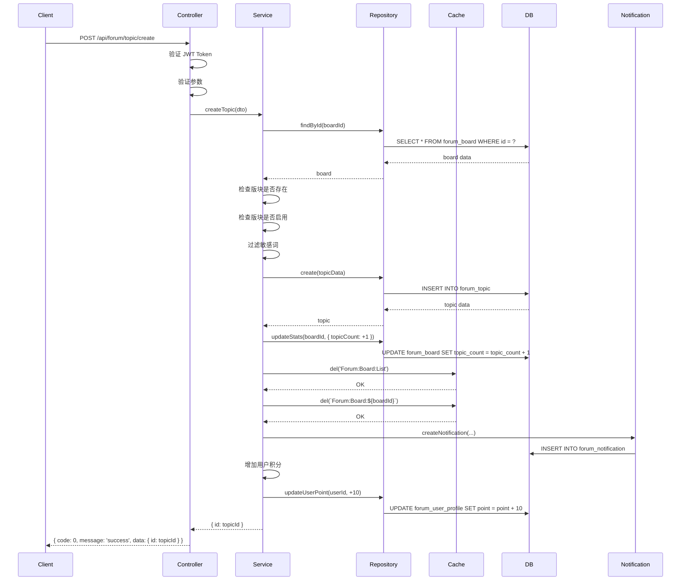
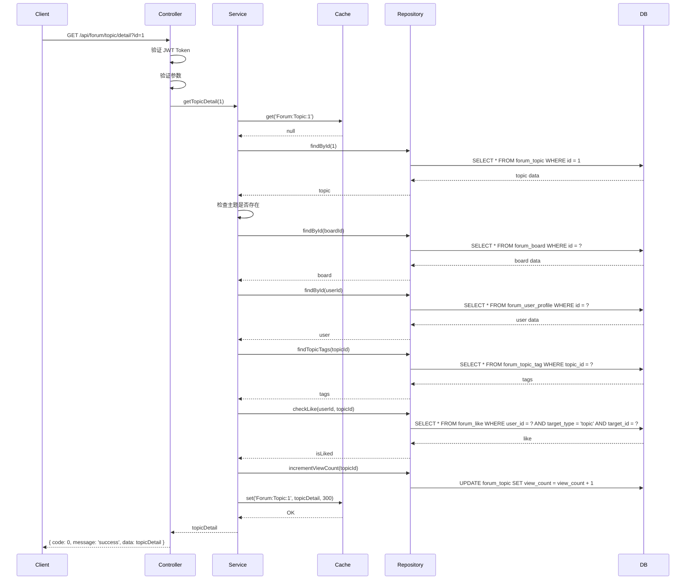
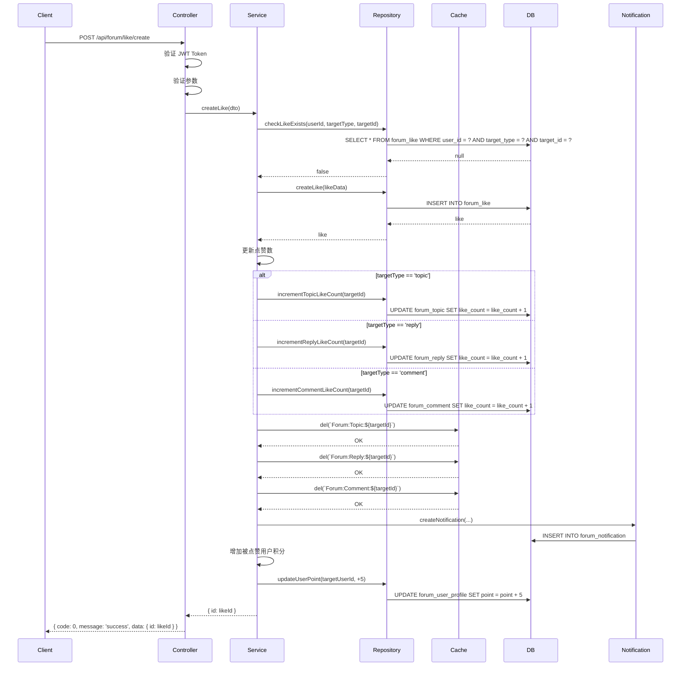
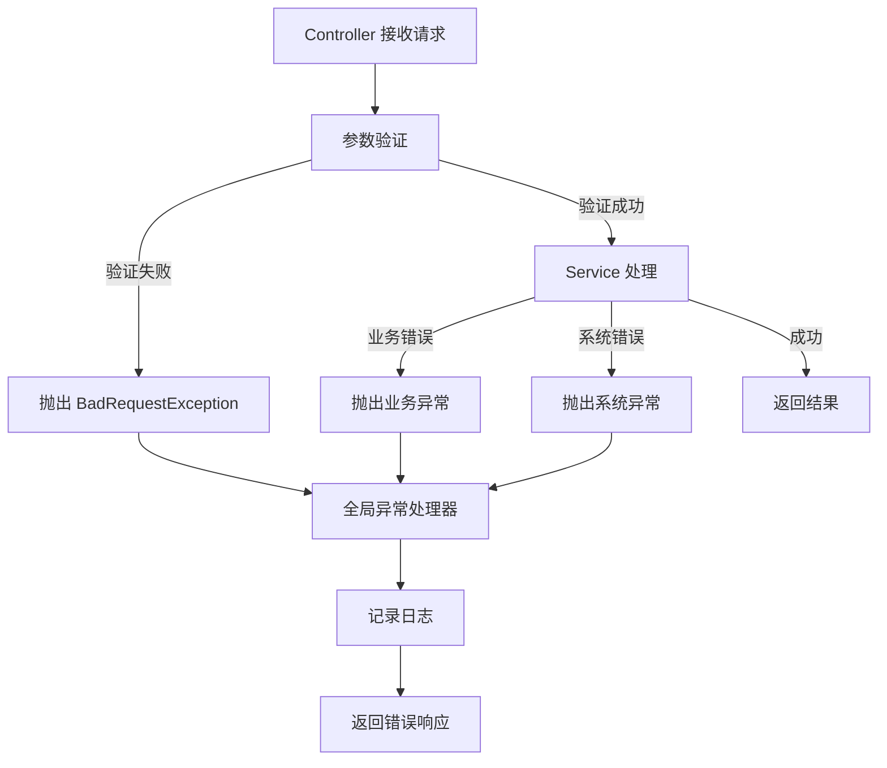

# 论坛系统集成 - 系统架构设计文档

## 1. 整体架构设计

### 1.1 系统架构图

```mermaid
graph TB
    subgraph "客户端层"
        A1[Web Client]
        A2[Mobile Client]
    end
    
    subgraph "API 网关层"
        B1[Admin API Gateway]
        B2[Client API Gateway]
    end
    
    subgraph "应用层"
        subgraph "管理端模块"
            C1[Board Controller]
            C2[Topic Controller]
            C3[Reply Controller]
            C4[Comment Controller]
            C5[Moderator Controller]
            C6[Audit Controller]
            C7[Report Controller]
            C8[User Controller]
            C9[Point Controller]
            C10[Badge Controller]
            C11[Level Controller]
            C12[Analytics Controller]
        end
        
        subgraph "客户端模块"
            D1[Board Controller]
            D2[Topic Controller]
            D3[Reply Controller]
            D4[Comment Controller]
            D5[Like Controller]
            D6[Search Controller]
            D7[Notification Controller]
            D8[User Controller]
            D9[Point Controller]
            D10[Badge Controller]
        end
    end
    
    subgraph "业务逻辑层"
        subgraph "管理端服务"
            E1[Board Service]
            E2[Topic Service]
            E3[Reply Service]
            E4[Comment Service]
            E5[Moderator Service]
            E6[Audit Service]
            E7[Report Service]
            E8[User Service]
            E9[Point Service]
            E10[Badge Service]
            E11[Level Service]
            E12[Analytics Service]
        end
        
        subgraph "客户端服务"
            F1[Board Service]
            F2[Topic Service]
            F3[Reply Service]
            F4[Comment Service]
            F5[Like Service]
            F6[Search Service]
            F7[Notification Service]
            F8[User Service]
            F9[Point Service]
            F10[Badge Service]
        end
        
        subgraph "共享服务"
            G1[Cache Service]
            G2[Upload Service]
            G3[Notification Service]
            G4[Search Service]
            G5[Audit Service]
        end
    end
    
    subgraph "数据访问层"
        subgraph "Repository"
            H1[Board Repository]
            H2[Topic Repository]
            H3[Reply Repository]
            H4[Comment Repository]
            H5[Like Repository]
            H6[User Repository]
            H7[Point Repository]
            H8[Badge Repository]
            H9[Level Repository]
            H10[Moderator Repository]
            H11[Audit Repository]
            H12[Report Repository]
            H13[Notification Repository]
        end
    end
    
    subgraph "数据存储层"
        I1[(PostgreSQL)]
        I2[(Redis)]
        I3[(File Storage)]
    end
    
    A1 --> B1
    A2 --> B2
    B1 --> C1
    B1 --> C2
    B1 --> C3
    B1 --> C4
    B1 --> C5
    B1 --> C6
    B1 --> C7
    B1 --> C8
    B1 --> C9
    B1 --> C10
    B1 --> C11
    B1 --> C12
    
    B2 --> D1
    B2 --> D2
    B2 --> D3
    B2 --> D4
    B2 --> D5
    B2 --> D6
    B2 --> D7
    B2 --> D8
    B2 --> D9
    B2 --> D10
    
    C1 --> E1
    C2 --> E2
    C3 --> E3
    C4 --> E4
    C5 --> E5
    C6 --> E6
    C7 --> E7
    C8 --> E8
    C9 --> E9
    C10 --> E10
    C11 --> E11
    C12 --> E12
    
    D1 --> F1
    D2 --> F2
    D3 --> F3
    D4 --> F4
    D5 --> F5
    D6 --> F6
    D7 --> F7
    D8 --> F8
    D9 --> F9
    D10 --> F10
    
    E1 --> G1
    E2 --> G1
    E3 --> G1
    E4 --> G1
    E5 --> G1
    E6 --> G1
    E7 --> G1
    E8 --> G1
    E9 --> G1
    E10 --> G1
    E11 --> G1
    E12 --> G1
    
    F1 --> G1
    F2 --> G1
    F3 --> G1
    F4 --> G1
    F5 --> G1
    F6 --> G1
    F7 --> G1
    F8 --> G1
    F9 --> G1
    F10 --> G1
    
    E2 --> G3
    E3 --> G3
    E4 --> G3
    E6 --> G3
    F2 --> G3
    F3 --> G3
    F4 --> G3
    F7 --> G3
    
    E2 --> G4
    E12 --> G4
    F6 --> G4
    
    E2 --> G5
    E3 --> G5
    E6 --> G5
    
    E1 --> H1
    E2 --> H2
    E3 --> H3
    E4 --> H4
    E5 --> H10
    E6 --> H11
    E7 --> H12
    E8 --> H6
    E9 --> H7
    E10 --> H8
    E11 --> H9
    E12 --> H13
    E5 --> H5
    E5 --> H5
    E5 --> H5
    
    F1 --> H1
    F2 --> H2
    F3 --> H3
    F4 --> H4
    F5 --> H5
    F8 --> H6
    F9 --> H7
    F10 --> H8
    F7 --> H13
    
    H1 --> I1
    H2 --> I1
    H3 --> I1
    H4 --> I1
    H5 --> I1
    H6 --> I1
    H7 --> I1
    H8 --> I1
    H9 --> I1
    H10 --> I1
    H11 --> I1
    H12 --> I1
    H13 --> I1
    
    G1 --> I2
    G2 --> I3
    G4 --> I2
```



### 1.2 分层架构说明

#### 1.2.1 客户端层
- **Web Client**: 浏览器端应用
- **Mobile Client**: 移动端应用
- **职责**: 用户界面展示和用户交互

#### 1.2.2 API 网关层
- **Admin API Gateway**: 管理端 API 网关
- **Client API Gateway**: 客户端 API 网关
- **职责**: 请求路由、认证授权、限流控制

#### 1.2.3 应用层
- **Controller**: 接收 HTTP 请求，参数验证，调用 Service
- **职责**: 请求处理、参数验证、响应封装

#### 1.2.4 业务逻辑层
- **Service**: 业务逻辑处理，调用 Repository 和共享服务
- **职责**: 业务逻辑、事务管理、数据转换

#### 1.2.5 数据访问层
- **Repository**: 数据库访问，封装 Prisma 操作
- **职责**: 数据库操作、数据查询、数据持久化

#### 1.2.6 数据存储层
- **PostgreSQL**: 关系型数据库
- **Redis**: 缓存数据库
- **File Storage**: 文件存储
- **职责**: 数据存储、数据检索、文件存储

## 2. 分层设计和核心组件

### 2.1 Controller 层设计

#### 2.1.1 Controller 层职责
- 接收 HTTP 请求
- 参数验证（使用 class-validator）
- 调用 Service 层方法
- 封装响应数据
- 异常处理

#### 2.1.2 Controller 层设计原则
1. 单一职责：每个 Controller 只负责一个模块
2. 轻量级：不包含业务逻辑
3. 统一响应：使用统一的响应格式
4. 异常处理：统一异常处理机制
5. 文档注解：使用 Swagger 注解生成 API 文档

#### 2.1.3 Controller 层示例

```typescript
@Controller('forum/board')
@ApiTags('论坛版块管理')
export class BoardController {
  constructor(private readonly boardService: BoardService) {}

  @Post('/create')
  @ApiDoc({
    summary: '创建版块',
    model: IdDto,
  })
  async create(@Body() body: CreateBoardDto) {
    return this.boardService.createBoard(body)
  }

  @Get('/page')
  @ApiPageDoc({
    summary: '分页查询版块列表',
    model: BoardDto,
  })
  async getPage(@Query() query: QueryBoardDto) {
    return this.boardService.getBoardPage(query)
  }

  @Get('/detail')
  @ApiDoc({
    summary: '获取版块详情',
    model: BoardDetailDto,
  })
  async getDetail(@Query() query: IdDto) {
    return this.boardService.getBoardDetail(query.id)
  }

  @Post('/update')
  @ApiDoc({
    summary: '更新版块信息',
    model: IdDto,
  })
  async update(@Body() body: UpdateBoardDto) {
    return this.boardService.updateBoard(body)
  }

  @Post('/update-status')
  @ApiDoc({
    summary: '更新版块状态',
    model: IdDto,
  })
  async updateStatus(@Body() body: UpdateBoardStatusDto) {
    return this.boardService.updateBoardStatus(body)
  }

  @Post('/delete')
  @ApiDoc({
    summary: '删除版块',
    model: IdDto,
  })
  async delete(@Body() body: IdDto) {
    return this.boardService.deleteBoard(body.id)
  }
}
```

### 2.2 Service 层设计

#### 2.2.1 Service 层职责
- 业务逻辑处理
- 事务管理
- 数据转换
- 调用 Repository 层
- 调用共享服务

#### 2.2.2 Service 层设计原则
1. 单一职责：每个 Service 只负责一个业务模块
2. 事务管理：使用 Prisma 事务保证数据一致性
3. 错误处理：抛出业务异常
4. 数据验证：验证业务规则
5. 缓存管理：管理缓存策略

#### 2.2.3 Service 层示例

```typescript
@Injectable()
export class BoardService {
  constructor(
    private readonly prisma: PrismaService,
    private readonly cacheService: CacheService,
  ) {}

  async createBoard(createBoardDto: CreateBoardDto) {
    const { name, description, icon, sortOrder } = createBoardDto

    const existingBoard = await this.prisma.forumBoard.findFirst({
      where: { name, deletedAt: null },
    })

    if (existingBoard) {
      throw new BadRequestException('版块名称已存在')
    }

    const board = await this.prisma.forumBoard.create({
      data: {
        name,
        description,
        icon,
        sortOrder: sortOrder ?? 0,
      },
    })

    await this.cacheService.del('Forum:Board:List')

    return { id: board.id }
  }

  async getBoardPage(queryBoardDto: QueryBoardDto) {
    const { page = 1, pageSize = 20, keyword, isEnabled } = queryBoardDto

    const where: any = { deletedAt: null }

    if (keyword) {
      where.name = { contains: keyword }
    }

    if (isEnabled !== undefined) {
      where.isEnabled = isEnabled
    }

    const [total, boards] = await Promise.all([
      this.prisma.forumBoard.count({ where }),
      this.prisma.forumBoard.findMany({
        where,
        skip: (page - 1) * pageSize,
        take: pageSize,
        orderBy: { sortOrder: 'asc' },
      }),
    ])

    return {
      total,
      page,
      pageSize,
      data: boards,
    }
  }

  async getBoardDetail(id: number) {
    const cacheKey = `Forum:Board:${id}`

    const cached = await this.cacheService.get(cacheKey)
    if (cached) {
      return cached
    }

    const board = await this.prisma.forumBoard.findFirst({
      where: { id, deletedAt: null },
    })

    if (!board) {
      throw new NotFoundException('版块不存在')
    }

    await this.cacheService.set(cacheKey, board, 1800)

    return board
  }

  async updateBoard(updateBoardDto: UpdateBoardDto) {
    const { id, name, description, icon, sortOrder } = updateBoardDto

    const board = await this.prisma.forumBoard.findFirst({
      where: { id, deletedAt: null },
    })

    if (!board) {
      throw new NotFoundException('版块不存在')
    }

    if (name && name !== board.name) {
      const existingBoard = await this.prisma.forumBoard.findFirst({
        where: { name, deletedAt: null, id: { not: id } },
      })

      if (existingBoard) {
        throw new BadRequestException('版块名称已存在')
      }
    }

    await this.prisma.forumBoard.update({
      where: { id },
      data: {
        name: name ?? board.name,
        description: description ?? board.description,
        icon: icon ?? board.icon,
        sortOrder: sortOrder ?? board.sortOrder,
      },
    })

    await this.cacheService.del(`Forum:Board:${id}`)
    await this.cacheService.del('Forum:Board:List')

    return { id }
  }

  async updateBoardStatus(updateBoardStatusDto: UpdateBoardStatusDto) {
    const { id, isEnabled } = updateBoardStatusDto

    const board = await this.prisma.forumBoard.findFirst({
      where: { id, deletedAt: null },
    })

    if (!board) {
      throw new NotFoundException('版块不存在')
    }

    await this.prisma.forumBoard.update({
      where: { id },
      data: { isEnabled },
    })

    await this.cacheService.del(`Forum:Board:${id}`)
    await this.cacheService.del('Forum:Board:List')

    return { id }
  }

  async deleteBoard(id: number) {
    const board = await this.prisma.forumBoard.findFirst({
      where: { id, deletedAt: null },
    })

    if (!board) {
      throw new NotFoundException('版块不存在')
    }

    const topicCount = await this.prisma.forumTopic.count({
      where: { boardId: id, deletedAt: null },
    })

    if (topicCount > 0) {
      throw new BadRequestException('版块下还有主题，无法删除')
    }

    await this.prisma.forumBoard.update({
      where: { id },
      data: { deletedAt: new Date() },
    })

    await this.cacheService.del(`Forum:Board:${id}`)
    await this.cacheService.del('Forum:Board:List')

    return { id }
  }
}
```

### 2.3 Repository 层设计

#### 2.3.1 Repository 层职责
- 封装数据库操作
- 提供数据查询接口
- 处理数据库事务
- 优化查询性能

#### 2.3.2 Repository 层设计原则
1. 单一职责：每个 Repository 只负责一个实体
2. 查询优化：使用索引和优化查询
3. 事务管理：使用 Prisma 事务
4. 错误处理：抛出数据库异常

#### 2.3.3 Repository 层示例

```typescript
@Injectable()
export class BoardRepository {
  constructor(private readonly prisma: PrismaService) {}

  async create(data: CreateBoardDto) {
    return this.prisma.forumBoard.create({ data })
  }

  async findById(id: number) {
    return this.prisma.forumBoard.findFirst({
      where: { id, deletedAt: null },
    })
  }

  async findMany(params: {
    skip?: number
    take?: number
    where?: any
    orderBy?: any
  }) {
    return this.prisma.forumBoard.findMany(params)
  }

  async count(where?: any) {
    return this.prisma.forumBoard.count({ where })
  }

  async update(id: number, data: UpdateBoardDto) {
    return this.prisma.forumBoard.update({
      where: { id },
      data,
    })
  }

  async softDelete(id: number) {
    return this.prisma.forumBoard.update({
      where: { id },
      data: { deletedAt: new Date() },
    })
  }

  async existsByName(name: string, excludeId?: number) {
    return this.prisma.forumBoard.findFirst({
      where: {
        name,
        deletedAt: null,
        ...(excludeId && { id: { not: excludeId } }),
      },
    })
  }

  async updateStats(id: number, data: { topicCount?: number; replyCount?: number }) {
    return this.prisma.forumBoard.update({
      where: { id },
      data,
    })
  }

  async updateLastTopic(id: number, data: { lastTopicId?: number; lastTopicTitle?: string; lastTopicAt?: Date }) {
    return this.prisma.forumBoard.update({
      where: { id },
      data,
    })
  }
}
```

### 2.4 共享服务设计

#### 2.4.1 CacheService

```typescript
@Injectable()
export class CacheService {
  constructor(
    @Inject('CACHE') private readonly cache: Keyv,
  ) {}

  async get<T>(key: string): Promise<T | null> {
    return this.cache.get(key)
  }

  async set(key: string, value: any, ttl?: number): Promise<void> {
    await this.cache.set(key, value, ttl)
  }

  async del(key: string): Promise<void> {
    await this.cache.delete(key)
  }

  async delPattern(pattern: string): Promise<void> {
    const keys = await this.cache.get<string[]>(pattern)
    if (keys) {
      await Promise.all(keys.map(key => this.cache.delete(key)))
    }
  }

  async clear(): Promise<void> {
    await this.cache.clear()
  }
}
```

#### 2.4.2 UploadService

```typescript
@Injectable()
export class UploadService {
  constructor(
    private readonly configService: ConfigService,
  ) {}

  async uploadImage(file: Express.Multer.File): Promise<string> {
    const bucket = this.configService.get('OSS_BUCKET')
    const region = this.configService.get('OSS_REGION')
    const accessKeyId = this.configService.get('OSS_ACCESS_KEY_ID')
    const accessKeySecret = this.configService.get('OSS_ACCESS_KEY_SECRET')

    const client = new OSS({
      region,
      accessKeyId,
      accessKeySecret,
      bucket,
    })

    const fileName = `forum/images/${Date.now()}-${file.originalname}`

    const result = await client.put(fileName, file.buffer)

    return result.url
  }

  async uploadFile(file: Express.Multer.File): Promise<string> {
    const bucket = this.configService.get('OSS_BUCKET')
    const region = this.configService.get('OSS_REGION')
    const accessKeyId = this.configService.get('OSS_ACCESS_KEY_ID')
    const accessKeySecret = this.configService.get('OSS_ACCESS_KEY_SECRET')

    const client = new OSS({
      region,
      accessKeyId,
      accessKeySecret,
      bucket,
    })

    const fileName = `forum/files/${Date.now()}-${file.originalname}`

    const result = await client.put(fileName, file.buffer)

    return result.url
  }
}
```

#### 2.4.3 NotificationService

```typescript
@Injectable()
export class NotificationService {
  constructor(
    private readonly prisma: PrismaService,
  ) {}

  async createNotification(params: {
    userId: number
    type: string
    title: string
    content: string
    targetType?: string
    targetId?: number
  }) {
    const { userId, type, title, content, targetType, targetId } = params

    await this.prisma.forumNotification.create({
      data: {
        userId,
        type,
        title,
        content,
        targetType,
        targetId,
        isRead: false,
      },
    })

    await this.cacheService.del(`Forum:Notification:Unread:${userId}`)
  }

  async getNotificationPage(userId: number, params: { page?: number; pageSize?: number; isRead?: boolean }) {
    const { page = 1, pageSize = 20, isRead } = params

    const where: any = { userId, deletedAt: null }

    if (isRead !== undefined) {
      where.isRead = isRead
    }

    const [total, notifications] = await Promise.all([
      this.prisma.forumNotification.count({ where }),
      this.prisma.forumNotification.findMany({
        where,
        skip: (page - 1) * pageSize,
        take: pageSize,
        orderBy: { createdAt: 'desc' },
      }),
    ])

    return {
      total,
      page,
      pageSize,
      data: notifications,
    }
  }

  async getUnreadCount(userId: number): Promise<number> {
    const cacheKey = `Forum:Notification:Unread:${userId}`

    const cached = await this.cacheService.get<number>(cacheKey)
    if (cached !== null) {
      return cached
    }

    const count = await this.prisma.forumNotification.count({
      where: { userId, isRead: false, deletedAt: null },
    })

    await this.cacheService.set(cacheKey, count, 60)

    return count
  }

  async markAsRead(userId: number, id: number) {
    await this.prisma.forumNotification.updateMany({
      where: { id, userId },
      data: { isRead: true },
    })

    await this.cacheService.del(`Forum:Notification:Unread:${userId}`)
  }

  async markAllAsRead(userId: number) {
    await this.prisma.forumNotification.updateMany({
      where: { userId, isRead: false },
      data: { isRead: true },
    })

    await this.cacheService.del(`Forum:Notification:Unread:${userId}`)
  }

  async deleteNotification(userId: number, id: number) {
    await this.prisma.forumNotification.updateMany({
      where: { id, userId },
      data: { deletedAt: new Date() },
    })
  }
}
```

#### 2.4.4 SearchService

```typescript
@Injectable()
export class SearchService {
  constructor(
    private readonly prisma: PrismaService,
    private readonly cacheService: CacheService,
  ) {}

  async searchTopics(params: {
    keyword: string
    boardId?: number
    tagIds?: number[]
    startDate?: Date
    endDate?: Date
    page?: number
    pageSize?: number
  }) {
    const { keyword, boardId, tagIds, startDate, endDate, page = 1, pageSize = 20 } = params

    const cacheKey = `Forum:Search:${hash(JSON.stringify(params))}`

    const cached = await this.cacheService.get(cacheKey)
    if (cached) {
      return cached
    }

    const where: any = {
      deletedAt: null,
      auditStatus: 'approved',
    }

    if (keyword) {
      where.OR = [
        { title: { contains: keyword } },
        { content: { contains: keyword } },
      ]
    }

    if (boardId) {
      where.boardId = boardId
    }

    if (tagIds && tagIds.length > 0) {
      where.tags = {
        some: {
          tagId: { in: tagIds },
        },
      }
    }

    if (startDate) {
      where.createdAt = { ...where.createdAt, gte: startDate }
    }

    if (endDate) {
      where.createdAt = { ...where.createdAt, lte: endDate }
    }

    const [total, topics] = await Promise.all([
      this.prisma.forumTopic.count({ where }),
      this.prisma.forumTopic.findMany({
        where,
        skip: (page - 1) * pageSize,
        take: pageSize,
        orderBy: { createdAt: 'desc' },
        include: {
          board: true,
          user: true,
          tags: {
            include: {
              tag: true,
            },
          },
        },
      }),
    ])

    const result = {
      total,
      page,
      pageSize,
      data: topics,
    }

    await this.cacheService.set(cacheKey, result, 60)

    return result
  }

  async searchUsers(params: {
    keyword: string
    page?: number
    pageSize?: number
  }) {
    const { keyword, page = 1, pageSize = 20 } = params

    const where: any = {
      deletedAt: null,
    }

    if (keyword) {
      where.OR = [
        { nickname: { contains: keyword } },
      ]
    }

    const [total, users] = await Promise.all([
      this.prisma.forumUserProfile.count({ where }),
      this.prisma.forumUserProfile.findMany({
        where,
        skip: (page - 1) * pageSize,
        take: pageSize,
        orderBy: { point: 'desc' },
      }),
    ])

    return {
      total,
      page,
      pageSize,
      data: users,
    }
  }

  async getHotSearch(): Promise<string[]> {
    const cacheKey = 'Forum:Search:Hot'

    const cached = await this.cacheService.get<string[]>(cacheKey)
    if (cached) {
      return cached
    }

    const hotSearches = await this.prisma.forumTopic.findMany({
      where: {
        deletedAt: null,
        auditStatus: 'approved',
        createdAt: {
          gte: new Date(Date.now() - 7 * 24 * 60 * 60 * 1000),
        },
      },
      orderBy: { viewCount: 'desc' },
      take: 10,
      select: { title: true },
    })

    const result = hotSearches.map(topic => topic.title)

    await this.cacheService.set(cacheKey, result, 600)

    return result
  }
}
```

#### 2.4.5 AuditService

```typescript
@Injectable()
export class AuditService {
  constructor(
    private readonly prisma: PrismaService,
    private readonly cacheService: CacheService,
  ) {}

  async createAudit(params: {
    targetType: string
    targetId: number
    status: string
    reason?: string
    auditorId?: number
  }) {
    const { targetType, targetId, status, reason, auditorId } = params

    await this.prisma.forumAudit.create({
      data: {
        targetType,
        targetId,
        status,
        reason,
        auditorId,
      },
    })
  }

  async approveTopic(topicId: number, auditorId: number, reason?: string) {
    await this.prisma.$transaction(async (tx) => {
      await tx.forumTopic.update({
        where: { id: topicId },
        data: { auditStatus: 'approved' },
      })

      await tx.forumAudit.create({
        data: {
          targetType: 'topic',
          targetId: topicId,
          status: 'approved',
          reason,
          auditorId,
        },
      })
    })

    await this.cacheService.del(`Forum:Topic:${topicId}`)
  }

  async rejectTopic(topicId: number, auditorId: number, reason: string) {
    await this.prisma.$transaction(async (tx) => {
      await tx.forumTopic.update({
        where: { id: topicId },
        data: { auditStatus: 'rejected' },
      })

      await tx.forumAudit.create({
        data: {
          targetType: 'topic',
          targetId: topicId,
          status: 'rejected',
          reason,
          auditorId,
        },
      })
    })

    await this.cacheService.del(`Forum:Topic:${topicId}`)
  }

  async approveReply(replyId: number, auditorId: number, reason?: string) {
    await this.prisma.$transaction(async (tx) => {
      await tx.forumReply.update({
        where: { id: replyId },
        data: { auditStatus: 'approved' },
      })

      await tx.forumAudit.create({
        data: {
          targetType: 'reply',
          targetId: replyId,
          status: 'approved',
          reason,
          auditorId,
        },
      })
    })

    await this.cacheService.del(`Forum:Reply:${replyId}`)
  }

  async rejectReply(replyId: number, auditorId: number, reason: string) {
    await this.prisma.$transaction(async (tx) => {
      await tx.forumReply.update({
        where: { id: replyId },
        data: { auditStatus: 'rejected' },
      })

      await tx.forumAudit.create({
        data: {
          targetType: 'reply',
          targetId: replyId,
          status: 'rejected',
          reason,
          auditorId,
        },
      })
    })

    await this.cacheService.del(`Forum:Reply:${replyId}`)
  }

  async getAuditPage(params: {
    targetType?: string
    status?: string
    page?: number
    pageSize?: number
  }) {
    const { targetType, status, page = 1, pageSize = 20 } = params

    const where: any = {}

    if (targetType) {
      where.targetType = targetType
    }

    if (status) {
      where.status = status
    }

    const [total, audits] = await Promise.all([
      this.prisma.forumAudit.count({ where }),
      this.prisma.forumAudit.findMany({
        where,
        skip: (page - 1) * pageSize,
        take: pageSize,
        orderBy: { createdAt: 'desc' },
        include: {
          auditor: true,
        },
      }),
    ])

    return {
      total,
      page,
      pageSize,
      data: audits,
    }
  }
}
```

## 3. 模块依赖关系图

```mermaid
graph TD
    subgraph "管理端模块"
        A[ForumModule]
        B[BoardModule]
        C[TopicModule]
        D[ReplyModule]
        E[CommentModule]
        F[ModeratorModule]
        G[AuditModule]
        H[ReportModule]
        I[UserModule]
        J[PointModule]
        K[BadgeModule]
        L[LevelModule]
        M[AnalyticsModule]
    end
    
    subgraph "客户端模块"
        N[ForumModule]
        O[BoardModule]
        P[TopicModule]
        Q[ReplyModule]
        R[CommentModule]
        S[LikeModule]
        T[SearchModule]
        U[NotificationModule]
        V[UserModule]
        W[PointModule]
        X[BadgeModule]
    end
    
    subgraph "共享模块"
        Y[ForumSharedModule]
        Z[CacheModule]
        AA[UploadModule]
        AB[NotificationModule]
        AC[SearchModule]
        AD[AuditModule]
    end
    
    subgraph "基础模块"
        AE[BaseModule]
        AF[PrismaModule]
        AG[AuthModule]
    end
    
    A --> B
    A --> C
    A --> D
    A --> E
    A --> F
    A --> G
    A --> H
    A --> I
    A --> J
    A --> K
    A --> L
    A --> M
    
    N --> O
    N --> P
    N --> Q
    N --> R
    N --> S
    N --> T
    N --> U
    N --> V
    N --> W
    N --> X
    
    B --> Y
    C --> Y
    D --> Y
    E --> Y
    F --> Y
    G --> Y
    H --> Y
    I --> Y
    J --> Y
    K --> Y
    L --> Y
    M --> Y
    
    O --> Y
    P --> Y
    Q --> Y
    R --> Y
    S --> Y
    T --> Y
    U --> Y
    V --> Y
    W --> Y
    X --> Y
    
    Y --> Z
    Y --> AA
    Y --> AB
    Y --> AC
    Y --> AD
    
    Y --> AE
    Y --> AF
    Y --> AG
```



## 4. 接口契约定义

### 4.1 请求响应格式

#### 4.1.1 统一响应格式

```typescript
export interface ApiResponse<T = any> {
  code: number
  message: string
  data: T
}

export interface PageResponse<T = any> {
  total: number
  page: number
  pageSize: number
  data: T[]
}
```

#### 4.1.2 错误码定义

```typescript
export enum ForumErrorCode {
  BOARD_NOT_FOUND = 40001,
  BOARD_NAME_EXISTS = 40002,
  BOARD_HAS_TOPICS = 40003,
  
  TOPIC_NOT_FOUND = 40101,
  TOPIC_IS_LOCKED = 40102,
  TOPIC_IS_DELETED = 40103,
  
  REPLY_NOT_FOUND = 40201,
  REPLY_IS_DELETED = 40202,
  
  COMMENT_NOT_FOUND = 40301,
  COMMENT_IS_DELETED = 40302,
  
  USER_NOT_FOUND = 40401,
  USER_IS_BANNED = 40402,
  
  MODERATOR_NOT_FOUND = 40501,
  MODERATOR_ALREADY_EXISTS = 40502,
  
  AUDIT_NOT_FOUND = 40601,
  
  REPORT_NOT_FOUND = 40701,
  REPORT_ALREADY_HANDLED = 40702,
  
  POINT_NOT_ENOUGH = 40801,
  
  BADGE_NOT_FOUND = 40901,
  BADGE_ALREADY_GRANTED = 40902,
  
  LEVEL_NOT_FOUND = 41001,
  
  NOTIFICATION_NOT_FOUND = 41101,
  
  SEARCH_KEYWORD_TOO_SHORT = 41201,
}
```

### 4.2 DTO 定义

#### 4.2.1 版块相关 DTO

```typescript
export class CreateBoardDto {
  @ApiProperty({ description: '版块名称' })
  @IsString()
  @Length(1, 100)
  name: string

  @ApiProperty({ description: '版块描述', required: false })
  @IsString()
  @IsOptional()
  description?: string

  @ApiProperty({ description: '版块图标', required: false })
  @IsString()
  @IsOptional()
  icon?: string

  @ApiProperty({ description: '排序', required: false })
  @IsNumber()
  @IsOptional()
  sortOrder?: number
}

export class UpdateBoardDto {
  @ApiProperty({ description: '版块ID' })
  @IsNumber()
  id: number

  @ApiProperty({ description: '版块名称', required: false })
  @IsString()
  @Length(1, 100)
  @IsOptional()
  name?: string

  @ApiProperty({ description: '版块描述', required: false })
  @IsString()
  @IsOptional()
  description?: string

  @ApiProperty({ description: '版块图标', required: false })
  @IsString()
  @IsOptional()
  icon?: string

  @ApiProperty({ description: '排序', required: false })
  @IsNumber()
  @IsOptional()
  sortOrder?: number
}

export class UpdateBoardStatusDto {
  @ApiProperty({ description: '版块ID' })
  @IsNumber()
  id: number

  @ApiProperty({ description: '是否启用' })
  @IsBoolean()
  isEnabled: boolean
}

export class QueryBoardDto {
  @ApiProperty({ description: '页码', required: false })
  @IsNumber()
  @IsOptional()
  page?: number

  @ApiProperty({ description: '每页数量', required: false })
  @IsNumber()
  @IsOptional()
  pageSize?: number

  @ApiProperty({ description: '关键词', required: false })
  @IsString()
  @IsOptional()
  keyword?: string

  @ApiProperty({ description: '是否启用', required: false })
  @IsBoolean()
  @IsOptional()
  isEnabled?: boolean
}

export class BoardDto {
  @ApiProperty({ description: '版块ID' })
  id: number

  @ApiProperty({ description: '版块名称' })
  name: string

  @ApiProperty({ description: '版块描述' })
  description: string

  @ApiProperty({ description: '版块图标' })
  icon: string

  @ApiProperty({ description: '排序' })
  sortOrder: number

  @ApiProperty({ description: '是否启用' })
  isEnabled: boolean

  @ApiProperty({ description: '主题数' })
  topicCount: number

  @ApiProperty({ description: '回复数' })
  replyCount: number

  @ApiProperty({ description: '最后主题ID' })
  lastTopicId: number

  @ApiProperty({ description: '最后主题标题' })
  lastTopicTitle: string

  @ApiProperty({ description: '最后主题时间' })
  lastTopicAt: Date

  @ApiProperty({ description: '创建时间' })
  createdAt: Date

  @ApiProperty({ description: '更新时间' })
  updatedAt: Date
}

export class BoardDetailDto extends BoardDto {}
```

#### 4.2.2 主题相关 DTO

```typescript
export class CreateTopicDto {
  @ApiProperty({ description: '版块ID' })
  @IsNumber()
  boardId: number

  @ApiProperty({ description: '主题标题' })
  @IsString()
  @Length(1, 200)
  title: string

  @ApiProperty({ description: '主题内容' })
  @IsString()
  @Length(1, 10000)
  content: string

  @ApiProperty({ description: '标签ID列表', required: false })
  @IsArray()
  @IsNumber({}, { each: true })
  @IsOptional()
  tagIds?: number[]
}

export class UpdateTopicDto {
  @ApiProperty({ description: '主题ID' })
  @IsNumber()
  id: number

  @ApiProperty({ description: '主题标题', required: false })
  @IsString()
  @Length(1, 200)
  @IsOptional()
  title?: string

  @ApiProperty({ description: '主题内容', required: false })
  @IsString()
  @Length(1, 10000)
  @IsOptional()
  content?: string

  @ApiProperty({ description: '标签ID列表', required: false })
  @IsArray()
  @IsNumber({}, { each: true })
  @IsOptional()
  tagIds?: number[]
}

export class QueryTopicDto {
  @ApiProperty({ description: '页码', required: false })
  @IsNumber()
  @IsOptional()
  page?: number

  @ApiProperty({ description: '每页数量', required: false })
  @IsNumber()
  @IsOptional()
  pageSize?: number

  @ApiProperty({ description: '版块ID', required: false })
  @IsNumber()
  @IsOptional()
  boardId?: number

  @ApiProperty({ description: '用户ID', required: false })
  @IsNumber()
  @IsOptional()
  userId?: number

  @ApiProperty({ description: '关键词', required: false })
  @IsString()
  @IsOptional()
  keyword?: string

  @ApiProperty({ description: '是否置顶', required: false })
  @IsBoolean()
  @IsOptional()
  isPinned?: boolean

  @ApiProperty({ description: '是否加精', required: false })
  @IsBoolean()
  @IsOptional()
  isEssence?: boolean

  @ApiProperty({ description: '审核状态', required: false })
  @IsString()
  @IsOptional()
  auditStatus?: string

  @ApiProperty({ description: '排序方式', required: false })
  @IsString()
  @IsOptional()
  sortBy?: 'createdAt' | 'viewCount' | 'replyCount' | 'likeCount'

  @ApiProperty({ description: '排序方向', required: false })
  @IsString()
  @IsOptional()
  sortOrder?: 'asc' | 'desc'
}

export class TopicDto {
  @ApiProperty({ description: '主题ID' })
  id: number

  @ApiProperty({ description: '版块ID' })
  boardId: number

  @ApiProperty({ description: '用户ID' })
  userId: number

  @ApiProperty({ description: '主题标题' })
  title: string

  @ApiProperty({ description: '主题内容' })
  content: string

  @ApiProperty({ description: '是否置顶' })
  isPinned: boolean

  @ApiProperty({ description: '是否加精' })
  isEssence: boolean

  @ApiProperty({ description: '是否锁定' })
  isLocked: boolean

  @ApiProperty({ description: '是否需要审核' })
  isAudit: boolean

  @ApiProperty({ description: '审核状态' })
  auditStatus: string

  @ApiProperty({ description: '浏览量' })
  viewCount: number

  @ApiProperty({ description: '回复数' })
  replyCount: number

  @ApiProperty({ description: '点赞数' })
  likeCount: number

  @ApiProperty({ description: '最后回复时间' })
  lastReplyAt: Date

  @ApiProperty({ description: '最后回复ID' })
  lastReplyId: number

  @ApiProperty({ description: '创建时间' })
  createdAt: Date

  @ApiProperty({ description: '更新时间' })
  updatedAt: Date
}

export class TopicDetailDto extends TopicDto {
  @ApiProperty({ description: '版块信息' })
  board: BoardDto

  @ApiProperty({ description: '用户信息' })
  user: any

  @ApiProperty({ description: '标签列表' })
  tags: any[]

  @ApiProperty({ description: '是否已点赞' })
  isLiked: boolean
}
```

## 5. 数据流向图

### 5.1 创建主题数据流



### 5.2 查询主题数据流



### 5.3 点赞数据流



## 6. 异常处理策略

### 6.1 异常分类

#### 6.1.1 业务异常
- **BadRequestException**: 请求参数错误
- **NotFoundException**: 资源不存在
- **ForbiddenException**: 权限不足
- **ConflictException**: 资源冲突

#### 6.1.2 系统异常
- **InternalServerErrorException**: 服务器内部错误
- **ServiceUnavailableException**: 服务不可用
- **GatewayTimeoutException**: 网关超时

### 6.2 异常处理流程



### 6.3 全局异常处理器

```typescript
@Catch()
export class GlobalExceptionFilter implements ExceptionFilter {
  catch(exception: unknown, host: ArgumentsHost) {
    const ctx = host.switchToHttp()
    const response = ctx.getResponse<Response>()
    const request = ctx.getRequest<Request>()

    let status = HttpStatus.INTERNAL_SERVER_ERROR
    let message = '服务器内部错误'
    let code = 50000

    if (exception instanceof HttpException) {
      status = exception.getStatus()
      const exceptionResponse = exception.getResponse()
      
      if (typeof exceptionResponse === 'string') {
        message = exceptionResponse
      } else if (typeof exceptionResponse === 'object') {
        message = (exceptionResponse as any).message || message
        code = (exceptionResponse as any).code || status
      }
    } else if (exception instanceof Prisma.PrismaClientKnownRequestError) {
      status = HttpStatus.BAD_REQUEST
      message = '数据库操作失败'
      code = 50001
    } else if (exception instanceof Prisma.PrismaClientUnknownRequestError) {
      status = HttpStatus.INTERNAL_SERVER_ERROR
      message = '数据库未知错误'
      code = 50002
    } else if (exception instanceof Prisma.PrismaClientRustPanicError) {
      status = HttpStatus.INTERNAL_SERVER_ERROR
      message = '数据库崩溃'
      code = 50003
    } else if (exception instanceof Prisma.PrismaClientInitializationError) {
      status = HttpStatus.SERVICE_UNAVAILABLE
      message = '数据库连接失败'
      code = 50004
    }

    this.logger.error(
      `${request.method} ${request.url}`,
      exception instanceof Error ? exception.stack : exception,
    )

    response.status(status).json({
      code,
      message,
      data: null,
      timestamp: new Date().toISOString(),
      path: request.url,
    })
  }
}
```

### 6.4 业务异常定义

```typescript
export class ForumException extends HttpException {
  constructor(code: number, message: string, status: HttpStatus = HttpStatus.BAD_REQUEST) {
    super(
      {
        code,
        message,
      },
      status,
    )
  }
}

export class BoardNotFoundException extends ForumException {
  constructor() {
    super(ForumErrorCode.BOARD_NOT_FOUND, '版块不存在', HttpStatus.NOT_FOUND)
  }
}

export class BoardNameExistsException extends ForumException {
  constructor() {
    super(ForumErrorCode.BOARD_NAME_EXISTS, '版块名称已存在', HttpStatus.BAD_REQUEST)
  }
}

export class BoardHasTopicsException extends ForumException {
  constructor() {
    super(ForumErrorCode.BOARD_HAS_TOPICS, '版块下还有主题，无法删除', HttpStatus.BAD_REQUEST)
  }
}

export class TopicNotFoundException extends ForumException {
  constructor() {
    super(ForumErrorCode.TOPIC_NOT_FOUND, '主题不存在', HttpStatus.NOT_FOUND)
  }
}

export class TopicIsLockedException extends ForumException {
  constructor() {
    super(ForumErrorCode.TOPIC_IS_LOCKED, '主题已锁定', HttpStatus.FORBIDDEN)
  }
}

export class TopicIsDeletedException extends ForumException {
  constructor() {
    super(ForumErrorCode.TOPIC_IS_DELETED, '主题已删除', HttpStatus.GONE)
  }
}

export class ReplyNotFoundException extends ForumException {
  constructor() {
    super(ForumErrorCode.REPLY_NOT_FOUND, '回复不存在', HttpStatus.NOT_FOUND)
  }
}

export class ReplyIsDeletedException extends ForumException {
  constructor() {
    super(ForumErrorCode.REPLY_IS_DELETED, '回复已删除', HttpStatus.GONE)
  }
}

export class CommentNotFoundException extends ForumException {
  constructor() {
    super(ForumErrorCode.COMMENT_NOT_FOUND, '评论不存在', HttpStatus.NOT_FOUND)
  }
}

export class CommentIsDeletedException extends ForumException {
  constructor() {
    super(ForumErrorCode.COMMENT_IS_DELETED, '评论已删除', HttpStatus.GONE)
  }
}

export class UserNotFoundException extends ForumException {
  constructor() {
    super(ForumErrorCode.USER_NOT_FOUND, '用户不存在', HttpStatus.NOT_FOUND)
  }
}

export class UserIsBannedException extends ForumException {
  constructor() {
    super(ForumErrorCode.USER_IS_BANNED, '用户已被封禁', HttpStatus.FORBIDDEN)
  }
}

export class ModeratorNotFoundException extends ForumException {
  constructor() {
    super(ForumErrorCode.MODERATOR_NOT_FOUND, '版主不存在', HttpStatus.NOT_FOUND)
  }
}

export class ModeratorAlreadyExistsException extends ForumException {
  constructor() {
    super(ForumErrorCode.MODERATOR_ALREADY_EXISTS, '版主已存在', HttpStatus.CONFLICT)
  }
}

export class AuditNotFoundException extends ForumException {
  constructor() {
    super(ForumErrorCode.AUDIT_NOT_FOUND, '审核记录不存在', HttpStatus.NOT_FOUND)
  }
}

export class ReportNotFoundException extends ForumException {
  constructor() {
    super(ForumErrorCode.REPORT_NOT_FOUND, '举报记录不存在', HttpStatus.NOT_FOUND)
  }
}

export class ReportAlreadyHandledException extends ForumException {
  constructor() {
    super(ForumErrorCode.REPORT_ALREADY_HANDLED, '举报已处理', HttpStatus.CONFLICT)
  }
}

export class PointNotEnoughException extends ForumException {
  constructor() {
    super(ForumErrorCode.POINT_NOT_ENOUGH, '积分不足', HttpStatus.BAD_REQUEST)
  }
}

export class BadgeNotFoundException extends ForumException {
  constructor() {
    super(ForumErrorCode.BADGE_NOT_FOUND, '徽章不存在', HttpStatus.NOT_FOUND)
  }
}

export class BadgeAlreadyGrantedException extends ForumException {
  constructor() {
    super(ForumErrorCode.BADGE_ALREADY_GRANTED, '徽章已授予', HttpStatus.CONFLICT)
  }
}

export class LevelNotFoundException extends ForumException {
  constructor() {
    super(ForumErrorCode.LEVEL_NOT_FOUND, '等级不存在', HttpStatus.NOT_FOUND)
  }
}

export class NotificationNotFoundException extends ForumException {
  constructor() {
    super(ForumErrorCode.NOTIFICATION_NOT_FOUND, '通知不存在', HttpStatus.NOT_FOUND)
  }
}

export class SearchKeywordTooShortException extends ForumException {
  constructor() {
    super(ForumErrorCode.SEARCH_KEYWORD_TOO_SHORT, '搜索关键词太短', HttpStatus.BAD_REQUEST)
  }
}
```

---

**文档版本**: v1.0  
**创建时间**: 2026-01-03  
**最后更新**: 2026-01-03  
**状态**: 已确认
