# 论坛系统集成 - 原子任务拆分文档

## 1. 任务拆分原则

### 1.1 拆分原则
1. **原子性**: 每个任务都是独立的，可以单独完成和测试
2. **可控性**: 每个任务的复杂度都在可控范围内
3. **可测性**: 每个任务都有明确的验收标准
4. **依赖性**: 任务之间的依赖关系清晰明确
5. **并行性**: 尽量支持并行开发，提高开发效率

### 1.2 任务分类
- **基础设施任务**: 数据库设计、共享模块开发
- **管理端任务**: 管理端功能开发
- **客户端任务**: 客户端功能开发
- **安全任务**: 安全防护和优化
- **测试任务**: 单元测试、集成测试
- **部署任务**: 部署脚本和验证

## 2. 任务依赖图

```mermaid
graph TD
    subgraph "基础设施"
        T1[1. 数据库模型设计]
        T2[2. 数据库迁移脚本]
        T3[3. 数据库种子数据]
        T4[4. 共享模块 - CacheService]
        T5[5. 共享模块 - UploadService]
        T6[6. 共享模块 - NotificationService]
        T7[7. 共享模块 - SearchService]
        T8[8. 共享模块 - AuditService]
        T9[9. 共享模块 - DTO 和异常]
    end
    
    subgraph "管理端 - 基础功能"
        T10[10. 管理端 - 版块模块]
        T11[11. 管理端 - 主题模块]
        T12[12. 管理端 - 回复模块]
        T13[13. 管理端 - 评论模块]
        T14[14. 管理端 - 点赞模块]
    end
    
    subgraph "管理端 - 管理功能"
        T15[15. 管理端 - 版主模块]
        T16[16. 管理端 - 审核模块]
        T17[17. 管理端 - 举报模块]
        T18[18. 管理端 - 用户模块]
    end
    
    subgraph "管理端 - 激励系统"
        T19[19. 管理端 - 积分模块]
        T20[20. 管理端 - 等级模块]
        T21[21. 管理端 - 徽章模块]
    end
    
    subgraph "管理端 - 数据分析"
        T22[22. 管理端 - 数据分析模块]
    end
    
    subgraph "客户端 - 基础功能"
        T23[23. 客户端 - 版块模块]
        T24[24. 客户端 - 主题模块]
        T25[25. 客户端 - 回复模块]
        T26[26. 客户端 - 评论模块]
        T27[27. 客户端 - 点赞模块]
    end
    
    subgraph "客户端 - 高级功能"
        T28[28. 客户端 - 搜索模块]
        T29[29. 客户端 - 通知模块]
        T30[30. 客户端 - 用户中心]
        T31[31. 客户端 - 积分查询]
        T32[32. 客户端 - 徽章展示]
    end
    
    subgraph "安全和优化"
        T33[33. 安全防护 - XSS 防护]
        T34[34. 安全防护 - CSRF 防护]
        T35[35. 安全防护 - 防刷屏]
        T36[36. 安全防护 - 反垃圾]
        T37[37. 性能优化 - 缓存策略]
        T38[38. 性能优化 - 数据库优化]
    end
    
    subgraph "测试和部署"
        T39[39. 单元测试]
        T40[40. 集成测试]
        T41[41. 部署脚本]
        T42[42. 部署验证]
    end
    
    T1 --> T2
    T2 --> T3
    T1 --> T9
    T4 --> T10
    T4 --> T11
    T4 --> T12
    T4 --> T13
    T4 --> T14
    T5 --> T10
    T5 --> T11
    T5 --> T12
    T5 --> T13
    T5 --> T14
    T6 --> T11
    T6 --> T12
    T6 --> T13
    T6 --> T29
    T7 --> T11
    T7 --> T28
    T8 --> T11
    T8 --> T12
    T8 --> T16
    T9 --> T10
    T9 --> T11
    T9 --> T12
    T9 --> T13
    T9 --> T14
    T9 --> T15
    T9 --> T16
    T9 --> T17
    T9 --> T18
    T9 --> T19
    T9 --> T20
    T9 --> T21
    T9 --> T22
    T9 --> T23
    T9 --> T24
    T9 --> T25
    T9 --> T26
    T9 --> T27
    T9 --> T28
    T9 --> T29
    T9 --> T30
    T9 --> T31
    T9 --> T32
    
    T10 --> T11
    T11 --> T12
    T12 --> T13
    T13 --> T14
    
    T10 --> T15
    T11 --> T16
    T12 --> T16
    T16 --> T17
    T10 --> T18
    T11 --> T18
    T12 --> T18
    T18 --> T19
    T19 --> T20
    T20 --> T21
    T10 --> T22
    T11 --> T22
    T12 --> T22
    
    T10 --> T23
    T11 --> T24
    T12 --> T25
    T13 --> T26
    T14 --> T27
    T24 --> T28
    T11 --> T29
    T12 --> T29
    T13 --> T29
    T18 --> T30
    T19 --> T31
    T21 --> T32
    
    T10 --> T33
    T11 --> T33
    T12 --> T33
    T13 --> T33
    T14 --> T33
    T23 --> T33
    T24 --> T33
    T25 --> T33
    T26 --> T33
    T27 --> T33
    
    T10 --> T34
    T11 --> T34
    T12 --> T34
    T13 --> T34
    T14 --> T34
    T23 --> T34
    T24 --> T34
    T25 --> T34
    T26 --> T34
    T27 --> T34
    
    T11 --> T35
    T12 --> T35
    T13 --> T35
    T24 --> T35
    T25 --> T35
    T26 --> T35
    
    T11 --> T36
    T12 --> T36
    T24 --> T36
    T25 --> T36
    
    T10 --> T37
    T11 --> T37
    T12 --> T37
    T13 --> T37
    T14 --> T37
    T23 --> T37
    T24 --> T37
    T25 --> T37
    T26 --> T37
    T27 --> T37
    T28 --> T37
    T29 --> T37
    
    T10 --> T38
    T11 --> T38
    T12 --> T38
    T13 --> T38
    T14 --> T38
    T23 --> T38
    T24 --> T38
    T25 --> T38
    T26 --> T38
    T27 --> T38
    
    T10 --> T39
    T11 --> T39
    T12 --> T39
    T13 --> T39
    T14 --> T39
    T15 --> T39
    T16 --> T39
    T17 --> T39
    T18 --> T39
    T19 --> T39
    T20 --> T39
    T21 --> T39
    T22 --> T39
    T23 --> T39
    T24 --> T39
    T25 --> T39
    T26 --> T39
    T27 --> T39
    T28 --> T39
    T29 --> T39
    T30 --> T39
    T31 --> T39
    T32 --> T39
    
    T39 --> T40
    T40 --> T41
    T41 --> T42
```

## 3. 原子任务清单

### 3.1 基础设施任务

#### 任务 1: 数据库模型设计

**输入契约**:
- 前置依赖: 无
- 输入数据: CONSENSUS 文档中的数据库设计需求
- 环境依赖: Prisma 7.2.0

**输出契约**:
- 输出数据: Prisma 模型文件
- 交付物: `prisma/models/forum/*.prisma` 文件
- 验收标准:
  - 所有数据表模型定义完整
  - 字段类型和约束正确
  - 关系定义正确
  - 索引定义合理
  - 软删除字段已添加

**实现约束**:
- 技术栈: Prisma 7.2.0
- 接口规范: 遵循 Prisma 模型定义规范
- 质量要求: 模型命名规范，字段命名规范

**依赖关系**:
- 后置任务: 任务 2（数据库迁移脚本）
- 并行任务: 无

---

#### 任务 2: 数据库迁移脚本

**输入契约**:
- 前置依赖: 任务 1（数据库模型设计）
- 输入数据: Prisma 模型文件
- 环境依赖: Prisma 7.2.0、PostgreSQL

**输出契约**:
- 输出数据: Prisma 迁移文件
- 交付物: `prisma/migrations/*` 文件
- 验收标准:
  - 迁移脚本可以成功执行
  - 数据库表结构正确创建
  - 索引正确创建
  - 外键约束正确创建

**实现约束**:
- 技术栈: Prisma 7.2.0
- 接口规范: 遵循 Prisma 迁移规范
- 质量要求: 迁移脚本可回滚

**依赖关系**:
- 后置任务: 任务 3（数据库种子数据）
- 并行任务: 无

---

#### 任务 3: 数据库种子数据

**输入契约**:
- 前置依赖: 任务 2（数据库迁移脚本）
- 输入数据: Prisma 模型文件
- 环境依赖: Prisma 7.2.0、PostgreSQL

**输出契约**:
- 输出数据: Prisma 种子文件
- 交付物: `prisma/seed.ts` 文件
- 验收标准:
  - 种子数据可以成功插入
  - 测试数据完整且合理
  - 数据关系正确

**实现约束**:
- 技术栈: Prisma 7.2.0
- 接口规范: 遵循 Prisma 种子规范
- 质量要求: 种子数据真实可用

**依赖关系**:
- 后置任务: 任务 10-32（各功能模块）
- 并行任务: 无

---

#### 任务 4: 共享模块 - CacheService

**输入契约**:
- 前置依赖: 无
- 输入数据: DESIGN 文档中的缓存策略设计
- 环境依赖: NestJS 11.x、Redis、Keyv

**输出契约**:
- 输出数据: CacheService 服务类
- 交付物: `libs/forum/src/services/cache.service.ts` 文件
- 验收标准:
  - 支持基本的缓存操作（get、set、del）
  - 支持批量删除（delPattern）
  - 支持清除所有缓存（clear）
  - 支持过期时间设置
  - 使用 `Forum:` 命名空间

**实现约束**:
- 技术栈: NestJS 11.x、Redis、Keyv
- 接口规范: 遵循 NestJS 服务规范
- 质量要求: 代码简洁，错误处理完善

**依赖关系**:
- 后置任务: 任务 10-32（各功能模块）
- 并行任务: 任务 5、6、7、8、9

---

#### 任务 5: 共享模块 - UploadService

**输入契约**:
- 前置依赖: 无
- 输入数据: DESIGN 文档中的上传服务设计
- 环境依赖: NestJS 11.x、OSS

**输出契约**:
- 输出数据: UploadService 服务类
- 交付物: `libs/forum/src/services/upload.service.ts` 文件
- 验收标准:
  - 支持图片上传
  - 支持文件上传
  - 文件名自动生成
  - 返回文件 URL

**实现约束**:
- 技术栈: NestJS 11.x、OSS
- 接口规范: 遵循 NestJS 服务规范
- 质量要求: 错误处理完善，支持多种文件类型

**依赖关系**:
- 后置任务: 任务 10-32（各功能模块）
- 并行任务: 任务 4、6、7、8、9

---

#### 任务 6: 共享模块 - NotificationService

**输入契约**:
- 前置依赖: 无
- 输入数据: DESIGN 文档中的通知服务设计
- 环境依赖: NestJS 11.x、Prisma

**输出契约**:
- 输出数据: NotificationService 服务类
- 交付物: `libs/forum/src/services/notification.service.ts` 文件
- 验收标准:
  - 支持创建通知
  - 支持分页查询通知
  - 支持获取未读通知数
  - 支持标记为已读
  - 支持全部标记为已读
  - 支持删除通知

**实现约束**:
- 技术栈: NestJS 11.x、Prisma
- 接口规范: 遵循 NestJS 服务规范
- 质量要求: 代码简洁，缓存使用合理

**依赖关系**:
- 后置任务: 任务 11、12、13、29
- 并行任务: 任务 4、5、7、8、9

---

#### 任务 7: 共享模块 - SearchService

**输入契约**:
- 前置依赖: 无
- 输入数据: DESIGN 文档中的搜索服务设计
- 环境依赖: NestJS 11.x、Prisma

**输出契约**:
- 输出数据: SearchService 服务类
- 交付物: `libs/forum/src/services/search.service.ts` 文件
- 验收标准:
  - 支持搜索主题（关键词、标签、版块、时间）
  - 支持搜索用户
  - 支持获取热门搜索
  - 使用缓存优化性能

**实现约束**:
- 技术栈: NestJS 11.x、Prisma
- 接口规范: 遵循 NestJS 服务规范
- 质量要求: 查询优化，缓存使用合理

**依赖关系**:
- 后置任务: 任务 11、28
- 并行任务: 任务 4、5、6、8、9

---

#### 任务 8: 共享模块 - AuditService

**输入契约**:
- 前置依赖: 无
- 输入数据: DESIGN 文档中的审核服务设计
- 环境依赖: NestJS 11.x、Prisma

**输出契约**:
- 输出数据: AuditService 服务类
- 交付物: `libs/forum/src/services/audit.service.ts` 文件
- 验收标准:
  - 支持创建审核记录
  - 支持通过审核
  - 支持拒绝审核
  - 支持分页查询审核记录
  - 使用事务保证数据一致性

**实现约束**:
- 技术栈: NestJS 11.x、Prisma
- 接口规范: 遵循 NestJS 服务规范
- 质量要求: 事务使用正确，错误处理完善

**依赖关系**:
- 后置任务: 任务 11、12、16
- 并行任务: 任务 4、5、6、7、9

---

#### 任务 9: 共享模块 - DTO 和异常

**输入契约**:
- 前置依赖: 无
- 输入数据: CONSENSUS 文档中的接口契约定义
- 环境依赖: NestJS 11.x、class-validator

**输出契约**:
- 输出数据: DTO 类和异常类
- 交付物: `libs/forum/src/dto/*.ts` 和 `libs/forum/src/exceptions/*.ts` 文件
- 验收标准:
  - 所有 DTO 定义完整
  - 所有异常定义完整
  - 使用 class-validator 进行验证
  - Swagger 注解完整

**实现约束**:
- 技术栈: NestJS 11.x、class-validator
- 接口规范: 遵循 NestJS DTO 规范
- 质量要求: 命名规范，验证规则合理

**依赖关系**:
- 后置任务: 任务 10-32（各功能模块）
- 并行任务: 任务 4、5、6、7、8

---

### 3.2 管理端 - 基础功能任务

#### 任务 10: 管理端 - 版块模块

**输入契约**:
- 前置依赖: 任务 4、5、9
- 输入数据: DESIGN 文档中的版块模块设计
- 环境依赖: NestJS 11.x、Prisma、Redis

**输出契约**:
- 输出数据: 版块模块完整代码
- 交付物: `apps/admin-api/src/modules/forum/board/*` 文件
- 验收标准:
  - 支持创建版块
  - 支持分页查询版块列表
  - 支持获取版块详情
  - 支持更新版块信息
  - 支持更新版块状态
  - 支持删除版块
  - 使用缓存优化性能
  - API 文档完整

**实现约束**:
- 技术栈: NestJS 11.x、Prisma、Redis
- 接口规范: 遵循 NestJS 模块规范
- 质量要求: 代码规范，错误处理完善

**依赖关系**:
- 后置任务: 任务 11、15、22、23
- 并行任务: 无

---

#### 任务 11: 管理端 - 主题模块

**输入契约**:
- 前置依赖: 任务 4、5、6、7、8、9、10
- 输入数据: DESIGN 文档中的主题模块设计
- 环境依赖: NestJS 11.x、Prisma、Redis

**输出契约**:
- 输出数据: 主题模块完整代码
- 交付物: `apps/admin-api/src/modules/forum/topic/*` 文件
- 验收标准:
  - 支持创建主题
  - 支持分页查询主题列表
  - 支持获取主题详情
  - 支持更新主题信息
  - 支持置顶/取消置顶
  - 支持加精/取消加精
  - 支持锁定/取消锁定
  - 支持审核主题
  - 支持删除主题
  - 使用缓存优化性能
  - API 文档完整

**实现约束**:
- 技术栈: NestJS 11.x、Prisma、Redis
- 接口规范: 遵循 NestJS 模块规范
- 质量要求: 代码规范，错误处理完善

**依赖关系**:
- 后置任务: 任务 12、16、22、24
- 并行任务: 无

---

#### 任务 12: 管理端 - 回复模块

**输入契约**:
- 前置依赖: 任务 4、5、6、8、9、11
- 输入数据: DESIGN 文档中的回复模块设计
- 环境依赖: NestJS 11.x、Prisma、Redis

**输出契约**:
- 输出数据: 回复模块完整代码
- 交付物: `apps/admin-api/src/modules/forum/reply/*` 文件
- 验收标准:
  - 支持分页查询回复列表
  - 支持获取回复详情
  - 支持更新回复信息
  - 支持审核回复
  - 支持删除回复
  - 使用缓存优化性能
  - API 文档完整

**实现约束**:
- 技术栈: NestJS 11.x、Prisma、Redis
- 接口规范: 遵循 NestJS 模块规范
- 质量要求: 代码规范，错误处理完善

**依赖关系**:
- 后置任务: 任务 13、16、22、25
- 并行任务: 无

---

#### 任务 13: 管理端 - 评论模块

**输入契约**:
- 前置依赖: 任务 4、5、6、9、12
- 输入数据: DESIGN 文档中的评论模块设计
- 环境依赖: NestJS 11.x、Prisma、Redis

**输出契约**:
- 输出数据: 评论模块完整代码
- 交付物: `apps/admin-api/src/modules/forum/comment/*` 文件
- 验收标准:
  - 支持分页查询评论列表
  - 支持获取评论详情
  - 支持更新评论信息
  - 支持删除评论
  - 使用缓存优化性能
  - API 文档完整

**实现约束**:
- 技术栈: NestJS 11.x、Prisma、Redis
- 接口规范: 遵循 NestJS 模块规范
- 质量要求: 代码规范，错误处理完善

**依赖关系**:
- 后置任务: 任务 14、22、26
- 并行任务: 无

---

#### 任务 14: 管理端 - 点赞模块

**输入契约**:
- 前置依赖: 任务 4、5、9、13
- 输入数据: DESIGN 文档中的点赞模块设计
- 环境依赖: NestJS 11.x、Prisma、Redis

**输出契约**:
- 输出数据: 点赞模块完整代码
- 交付物: `apps/admin-api/src/modules/forum/like/*` 文件
- 验收标准:
  - 支持分页查询点赞列表
  - 支持获取点赞详情
  - 支持删除点赞
  - 使用缓存优化性能
  - API 文档完整

**实现约束**:
- 技术栈: NestJS 11.x、Prisma、Redis
- 接口规范: 遵循 NestJS 模块规范
- 质量要求: 代码规范，错误处理完善

**依赖关系**:
- 后置任务: 任务 22、27
- 并行任务: 无

---

### 3.3 管理端 - 管理功能任务

#### 任务 15: 管理端 - 版主模块

**输入契约**:
- 前置依赖: 任务 4、5、9、10
- 输入数据: DESIGN 文档中的版主模块设计
- 环境依赖: NestJS 11.x、Prisma、Redis

**输出契约**:
- 输出数据: 版主模块完整代码
- 交付物: `apps/admin-api/src/modules/forum/moderator/*` 文件
- 验收标准:
  - 支持任命版主
  - 支持分页查询版主列表
  - 支持更新版主信息
  - 支持撤职版主
  - 使用缓存优化性能
  - API 文档完整

**实现约束**:
- 技术栈: NestJS 11.x、Prisma、Redis
- 接口规范: 遵循 NestJS 模块规范
- 质量要求: 代码规范，错误处理完善

**依赖关系**:
- 后置任务: 任务 22
- 并行任务: 无

---

#### 任务 16: 管理端 - 审核模块

**输入契约**:
- 前置依赖: 任务 4、5、8、9、11、12
- 输入数据: DESIGN 文档中的审核模块设计
- 环境依赖: NestJS 11.x、Prisma、Redis

**输出契约**:
- 输出数据: 审核模块完整代码
- 交付物: `apps/admin-api/src/modules/forum/audit/*` 文件
- 验收标准:
  - 支持分页查询审核列表
  - 支持通过审核
  - 支持拒绝审核
  - 使用缓存优化性能
  - API 文档完整

**实现约束**:
- 技术栈: NestJS 11.x、Prisma、Redis
- 接口规范: 遵循 NestJS 模块规范
- 质量要求: 代码规范，错误处理完善

**依赖关系**:
- 后置任务: 任务 22
- 并行任务: 无

---

#### 任务 17: 管理端 - 举报模块

**输入契约**:
- 前置依赖: 任务 4、5、9、16
- 输入数据: DESIGN 文档中的举报模块设计
- 环境依赖: NestJS 11.x、Prisma、Redis

**输出契约**:
- 输出数据: 举报模块完整代码
- 交付物: `apps/admin-api/src/modules/forum/report/*` 文件
- 验收标准:
  - 支持分页查询举报列表
  - 支持处理举报
  - 使用缓存优化性能
  - API 文档完整

**实现约束**:
- 技术栈: NestJS 11.x、Prisma、Redis
- 接口规范: 遵循 NestJS 模块规范
- 质量要求: 代码规范，错误处理完善

**依赖关系**:
- 后置任务: 任务 22
- 并行任务: 无

---

#### 任务 18: 管理端 - 用户模块

**输入契约**:
- 前置依赖: 任务 4、5、9、10、11、12
- 输入数据: DESIGN 文档中的用户模块设计
- 环境依赖: NestJS 11.x、Prisma、Redis

**输出契约**:
- 输出数据: 用户模块完整代码
- 交付物: `apps/admin-api/src/modules/forum/user/*` 文件
- 验收标准:
  - 支持分页查询用户列表
  - 支持获取用户详情
  - 支持更新用户信息
  - 支持封禁用户
  - 支持解封用户
  - 使用缓存优化性能
  - API 文档完整

**实现约束**:
- 技术栈: NestJS 11.x、Prisma、Redis
- 接口规范: 遵循 NestJS 模块规范
- 质量要求: 代码规范，错误处理完善

**依赖关系**:
- 后置任务: 任务 19、22、30
- 并行任务: 无

---

### 3.4 管理端 - 激励系统任务

#### 任务 19: 管理端 - 积分模块

**输入契约**:
- 前置依赖: 任务 4、5、9、18
- 输入数据: DESIGN 文档中的积分模块设计
- 环境依赖: NestJS 11.x、Prisma、Redis

**输出契约**:
- 输出数据: 积分模块完整代码
- 交付物: `apps/admin-api/src/modules/forum/point/*` 文件
- 验收标准:
  - 支持分页查询积分记录
  - 支持调整用户积分
  - 支持分页查询积分规则
  - 支持创建积分规则
  - 支持更新积分规则
  - 支持删除积分规则
  - 使用缓存优化性能
  - API 文档完整

**实现约束**:
- 技术栈: NestJS 11.x、Prisma、Redis
- 接口规范: 遵循 NestJS 模块规范
- 质量要求: 代码规范，错误处理完善

**依赖关系**:
- 后置任务: 任务 20、22、31
- 并行任务: 无

---

#### 任务 20: 管理端 - 等级模块

**输入契约**:
- 前置依赖: 任务 4、5、9、19
- 输入数据: DESIGN 文档中的等级模块设计
- 环境依赖: NestJS 11.x、Prisma、Redis

**输出契约**:
- 输出数据: 等级模块完整代码
- 交付物: `apps/admin-api/src/modules/forum/level/*` 文件
- 验收标准:
  - 支持分页查询等级列表
  - 支持创建等级
  - 支持更新等级
  - 支持删除等级
  - 使用缓存优化性能
  - API 文档完整

**实现约束**:
- 技术栈: NestJS 11.x、Prisma、Redis
- 接口规范: 遵循 NestJS 模块规范
- 质量要求: 代码规范，错误处理完善

**依赖关系**:
- 后置任务: 任务 21、22
- 并行任务: 无

---

#### 任务 21: 管理端 - 徽章模块

**输入契约**:
- 前置依赖: 任务 4、5、9、20
- 输入数据: DESIGN 文档中的徽章模块设计
- 环境依赖: NestJS 11.x、Prisma、Redis

**输出契约**:
- 输出数据: 徽章模块完整代码
- 交付物: `apps/admin-api/src/modules/forum/badge/*` 文件
- 验收标准:
  - 支持分页查询徽章列表
  - 支持创建徽章
  - 支持更新徽章
  - 支持删除徽章
  - 支持授予徽章
  - 支持撤销徽章
  - 使用缓存优化性能
  - API 文档完整

**实现约束**:
- 技术栈: NestJS 11.x、Prisma、Redis
- 接口规范: 遵循 NestJS 模块规范
- 质量要求: 代码规范，错误处理完善

**依赖关系**:
- 后置任务: 任务 22、32
- 并行任务: 无

---

### 3.5 管理端 - 数据分析任务

#### 任务 22: 管理端 - 数据分析模块

**输入契约**:
- 前置依赖: 任务 4、5、9、10、11、12、13、14、15、16、17、18、19、20、21
- 输入数据: DESIGN 文档中的数据分析模块设计
- 环境依赖: NestJS 11.x、Prisma、Redis

**输出契约**:
- 输出数据: 数据分析模块完整代码
- 交付物: `apps/admin-api/src/modules/forum/analytics/*` 文件
- 验收标准:
  - 支持获取概览数据
  - 支持获取活跃度数据
  - 支持获取内容数据
  - 支持获取用户数据
  - 支持获取版块数据
  - 使用缓存优化性能
  - API 文档完整

**实现约束**:
- 技术栈: NestJS 11.x、Prisma、Redis
- 接口规范: 遵循 NestJS 模块规范
- 质量要求: 代码规范，错误处理完善

**依赖关系**:
- 后置任务: 任务 39
- 并行任务: 无

---

### 3.6 客户端 - 基础功能任务

#### 任务 23: 客户端 - 版块模块

**输入契约**:
- 前置依赖: 任务 4、5、9、10
- 输入数据: DESIGN 文档中的版块模块设计
- 环境依赖: NestJS 11.x、Prisma、Redis

**输出契约**:
- 输出数据: 版块模块完整代码
- 交付物: `apps/client-api/src/modules/forum/board/*` 文件
- 验收标准:
  - 支持获取版块列表
  - 支持获取版块详情
  - 使用缓存优化性能
  - API 文档完整

**实现约束**:
- 技术栈: NestJS 11.x、Prisma、Redis
- 接口规范: 遵循 NestJS 模块规范
- 质量要求: 代码规范，错误处理完善

**依赖关系**:
- 后置任务: 任务 39
- 并行任务: 无

---

#### 任务 24: 客户端 - 主题模块

**输入契约**:
- 前置依赖: 任务 4、5、6、7、9、11
- 输入数据: DESIGN 文档中的主题模块设计
- 环境依赖: NestJS 11.x、Prisma、Redis

**输出契约**:
- 输出数据: 主题模块完整代码
- 交付物: `apps/client-api/src/modules/forum/topic/*` 文件
- 验收标准:
  - 支持分页查询主题列表
  - 支持获取主题详情
  - 支持发布主题
  - 支持更新主题
  - 支持删除主题
  - 使用缓存优化性能
  - API 文档完整

**实现约束**:
- 技术栈: NestJS 11.x、Prisma、Redis
- 接口规范: 遵循 NestJS 模块规范
- 质量要求: 代码规范，错误处理完善

**依赖关系**:
- 后置任务: 任务 39
- 并行任务: 无

---

#### 任务 25: 客户端 - 回复模块

**输入契约**:
- 前置依赖: 任务 4、5、6、9、12
- 输入数据: DESIGN 文档中的回复模块设计
- 环境依赖: NestJS 11.x、Prisma、Redis

**输出契约**:
- 输出数据: 回复模块完整代码
- 交付物: `apps/client-api/src/modules/forum/reply/*` 文件
- 验收标准:
  - 支持分页查询回复列表
  - 支持回复主题
  - 支持更新回复
  - 支持删除回复
  - 使用缓存优化性能
  - API 文档完整

**实现约束**:
- 技术栈: NestJS 11.x、Prisma、Redis
- 接口规范: 遵循 NestJS 模块规范
- 质量要求: 代码规范，错误处理完善

**依赖关系**:
- 后置任务: 任务 39
- 并行任务: 无

---

#### 任务 26: 客户端 - 评论模块

**输入契约**:
- 前置依赖: 任务 4、5、6、9、13
- 输入数据: DESIGN 文档中的评论模块设计
- 环境依赖: NestJS 11.x、Prisma、Redis

**输出契约**:
- 输出数据: 评论模块完整代码
- 交付物: `apps/client-api/src/modules/forum/comment/*` 文件
- 验收标准:
  - 支持分页查询评论列表
  - 支持评论回复
  - 支持删除评论
  - 使用缓存优化性能
  - API 文档完整

**实现约束**:
- 技术栈: NestJS 11.x、Prisma、Redis
- 接口规范: 遵循 NestJS 模块规范
- 质量要求: 代码规范，错误处理完善

**依赖关系**:
- 后置任务: 任务 39
- 并行任务: 无

---

#### 任务 27: 客户端 - 点赞模块

**输入契约**:
- 前置依赖: 任务 4、5、9、14
- 输入数据: DESIGN 文档中的点赞模块设计
- 环境依赖: NestJS 11.x、Prisma、Redis

**输出契约**:
- 输出数据: 点赞模块完整代码
- 交付物: `apps/client-api/src/modules/forum/like/*` 文件
- 验收标准:
  - 支持点赞
  - 支持取消点赞
  - 支持检查是否已点赞
  - 使用缓存优化性能
  - API 文档完整

**实现约束**:
- 技术栈: NestJS 11.x、Prisma、Redis
- 接口规范: 遵循 NestJS 模块规范
- 质量要求: 代码规范，错误处理完善

**依赖关系**:
- 后置任务: 任务 39
- 并行任务: 无

---

### 3.7 客户端 - 高级功能任务

#### 任务 28: 客户端 - 搜索模块

**输入契约**:
- 前置依赖: 任务 4、5、7、9、11
- 输入数据: DESIGN 文档中的搜索模块设计
- 环境依赖: NestJS 11.x、Prisma、Redis

**输出契约**:
- 输出数据: 搜索模块完整代码
- 交付物: `apps/client-api/src/modules/forum/search/*` 文件
- 验收标准:
  - 支持搜索主题
  - 支持搜索用户
  - 支持获取热门搜索
  - 使用缓存优化性能
  - API 文档完整

**实现约束**:
- 技术栈: NestJS 11.x、Prisma、Redis
- 接口规范: 遵循 NestJS 模块规范
- 质量要求: 代码规范，错误处理完善

**依赖关系**:
- 后置任务: 任务 39
- 并行任务: 无

---

#### 任务 29: 客户端 - 通知模块

**输入契约**:
- 前置依赖: 任务 4、5、6、9、11、12、13
- 输入数据: DESIGN 文档中的通知模块设计
- 环境依赖: NestJS 11.x、Prisma、Redis

**输出契约**:
- 输出数据: 通知模块完整代码
- 交付物: `apps/client-api/src/modules/forum/notification/*` 文件
- 验收标准:
  - 支持分页查询通知列表
  - 支持获取未读通知数
  - 支持标记为已读
  - 支持全部标记为已读
  - 支持删除通知
  - 使用缓存优化性能
  - API 文档完整

**实现约束**:
- 技术栈: NestJS 11.x、Prisma、Redis
- 接口规范: 遵循 NestJS 模块规范
- 质量要求: 代码规范，错误处理完善

**依赖关系**:
- 后置任务: 任务 39
- 并行任务: 无

---

#### 任务 30: 客户端 - 用户中心

**输入契约**:
- 前置依赖: 任务 4、5、9、18
- 输入数据: DESIGN 文档中的用户中心设计
- 环境依赖: NestJS 11.x、Prisma、Redis

**输出契约**:
- 输出数据: 用户中心完整代码
- 交付物: `apps/client-api/src/modules/forum/user/*` 文件
- 验收标准:
  - 支持获取用户档案
  - 支持更新用户档案
  - 支持获取用户发布的主题
  - 支持获取用户的回复
  - 支持获取用户的点赞
  - 使用缓存优化性能
  - API 文档完整

**实现约束**:
- 技术栈: NestJS 11.x、Prisma、Redis
- 接口规范: 遵循 NestJS 模块规范
- 质量要求: 代码规范，错误处理完善

**依赖关系**:
- 后置任务: 任务 39
- 并行任务: 无

---

#### 任务 31: 客户端 - 积分查询

**输入契约**:
- 前置依赖: 任务 4、5、9、19
- 输入数据: DESIGN 文档中的积分查询设计
- 环境依赖: NestJS 11.x、Prisma、Redis

**输出契约**:
- 输出数据: 积分查询完整代码
- 交付物: `apps/client-api/src/modules/forum/point/*` 文件
- 验收标准:
  - 支持获取积分余额
  - 支持获取积分记录
  - 支持获取积分排行榜
  - 使用缓存优化性能
  - API 文档完整

**实现约束**:
- 技术栈: NestJS 11.x、Prisma、Redis
- 接口规范: 遵循 NestJS 模块规范
- 质量要求: 代码规范，错误处理完善

**依赖关系**:
- 后置任务: 任务 39
- 并行任务: 无

---

#### 任务 32: 客户端 - 徽章展示

**输入契约**:
- 前置依赖: 任务 4、5、9、21
- 输入数据: DESIGN 文档中的徽章展示设计
- 环境依赖: NestJS 11.x、Prisma、Redis

**输出契约**:
- 输出数据: 徽章展示完整代码
- 交付物: `apps/client-api/src/modules/forum/badge/*` 文件
- 验收标准:
  - 支持获取徽章列表
  - 支持获取我的徽章
  - 使用缓存优化性能
  - API 文档完整

**实现约束**:
- 技术栈: NestJS 11.x、Prisma、Redis
- 接口规范: 遵循 NestJS 模块规范
- 质量要求: 代码规范，错误处理完善

**依赖关系**:
- 后置任务: 任务 39
- 并行任务: 无

---

### 3.8 安全和优化任务

#### 任务 33: 安全防护 - XSS 防护

**输入契约**:
- 前置依赖: 任务 10-14、23-27
- 输入数据: CONSENSUS 文档中的安全防护需求
- 环境依赖: NestJS 11.x

**输出契约**:
- 输出数据: XSS 防护中间件和过滤器
- 交付物: `libs/forum/src/middlewares/xss.middleware.ts` 文件
- 验收标准:
  - 输入内容过滤
  - 输出内容转义
  - CSP 策略配置
  - 富文本安全处理

**实现约束**:
- 技术栈: NestJS 11.x、sanitize-html
- 接口规范: 遵循 NestJS 中间件规范
- 质量要求: 防护有效，不影响正常使用

**依赖关系**:
- 后置任务: 任务 39
- 并行任务: 任务 34、35、36

---

#### 任务 34: 安全防护 - CSRF 防护

**输入契约**:
- 前置依赖: 任务 10-14、23-27
- 输入数据: CONSENSUS 文档中的安全防护需求
- 环境依赖: NestJS 11.x

**输出契约**:
- 输出数据: CSRF 防护中间件和守卫
- 交付物: `libs/forum/src/guards/csrf.guard.ts` 文件
- 验收标准:
  - CSRF Token 生成和验证
  - SameSite Cookie 配置
  - Referer 检查

**实现约束**:
- 技术栈: NestJS 11.x、@fastify/csrf-protection
- 接口规范: 遵循 NestJS 守卫规范
- 质量要求: 防护有效，不影响正常使用

**依赖关系**:
- 后置任务: 任务 39
- 并行任务: 任务 33、35、36

---

#### 任务 35: 安全防护 - 防刷屏

**输入契约**:
- 前置依赖: 任务 11-13、24-26
- 输入数据: CONSENSUS 文档中的安全防护需求
- 环境依赖: NestJS 11.x、Redis

**输出契约**:
- 输出数据: 防刷屏中间件和拦截器
- 交付物: `libs/forum/src/interceptors/throttle.interceptor.ts` 文件
- 验收标准:
  - 发帖频率限制（1分钟最多1次）
  - 回复频率限制（10秒最多1次）
  - 评论频率限制（10秒最多1次）
  - 点赞频率限制（1秒最多1次）
  - IP 限流
  - 用户限流

**实现约束**:
- 技术栈: NestJS 11.x、@nestjs/throttler
- 接口规范: 遵循 NestJS 拦截器规范
- 质量要求: 限制合理，不影响正常使用

**依赖关系**:
- 后置任务: 任务 39
- 并行任务: 任务 33、34、36

---

#### 任务 36: 安全防护 - 反垃圾

**输入契约**:
- 前置依赖: 任务 11-13、24-26
- 输入数据: CONSENSUS 文档中的安全防护需求
- 环境依赖: NestJS 11.x

**输出契约**:
- 输出数据: 反垃圾服务和中间件
- 交付物: `libs/forum/src/services/anti-spam.service.ts` 文件
- 验收标准:
  - 敏感词过滤
  - 内容重复检测
  - 垃圾内容识别
  - 预留 AI 反垃圾接口

**实现约束**:
- 技术栈: NestJS 11.x
- 接口规范: 遵循 NestJS 服务规范
- 质量要求: 过滤有效，误判率低

**依赖关系**:
- 后置任务: 任务 39
- 并行任务: 任务 33、34、35

---

#### 任务 37: 性能优化 - 缓存策略

**输入契约**:
- 前置依赖: 任务 10-32
- 输入数据: DESIGN 文档中的缓存策略设计
- 环境依赖: NestJS 11.x、Redis

**输出契约**:
- 输出数据: 缓存策略优化代码
- 交付物: 各模块的缓存优化代码
- 验收标准:
  - 版块列表缓存（1小时）
  - 版块详情缓存（30分钟）
  - 热门主题缓存（10分钟）
  - 主题详情缓存（5分钟）
  - 用户档案缓存（10分钟）
  - 用户统计缓存（10分钟）
  - 搜索结果缓存（1分钟）
  - 统计数据缓存（15分钟）
  - 缓存命中率 > 80%

**实现约束**:
- 技术栈: NestJS 11.x、Redis
- 接口规范: 遵循 NestJS 缓存规范
- 质量要求: 缓存策略合理，性能提升明显

**依赖关系**:
- 后置任务: 任务 39
- 并行任务: 任务 38

---

#### 任务 38: 性能优化 - 数据库优化

**输入契约**:
- 前置依赖: 任务 10-32
- 输入数据: CONSENSUS 文档中的性能要求
- 环境依赖: Prisma 7.2.0、PostgreSQL

**输出契约**:
- 输出数据: 数据库优化代码
- 交付物: 数据库优化脚本和代码
- 验收标准:
  - 无 N+1 查询
  - 索引优化
  - 查询优化
  - 论坛列表页响应时间 < 500ms
  - 主题详情页响应时间 < 300ms
  - 搜索响应时间 < 1s

**实现约束**:
- 技术栈: Prisma 7.2.0、PostgreSQL
- 接口规范: 遵循 Prisma 查询规范
- 质量要求: 查询效率高，性能提升明显

**依赖关系**:
- 后置任务: 任务 39
- 并行任务: 任务 37

---

### 3.9 测试和部署任务

#### 任务 39: 单元测试

**输入契约**:
- 前置依赖: 任务 10-38
- 输入数据: 所有模块代码
- 环境依赖: Jest、NestJS 11.x

**输出契约**:
- 输出数据: 单元测试代码
- 交付物: `*.spec.ts` 文件
- 验收标准:
  - 所有 Service 层代码有单元测试
  - 测试覆盖率 > 80%
  - 所有测试通过

**实现约束**:
- 技术栈: Jest、NestJS 11.x
- 接口规范: 遵循 Jest 测试规范
- 质量要求: 测试用例完整，测试覆盖率达标

**依赖关系**:
- 后置任务: 任务 40
- 并行任务: 无

---

#### 任务 40: 集成测试

**输入契约**:
- 前置依赖: 任务 39
- 输入数据: 所有模块代码和单元测试
- 环境依赖: Jest、NestJS 11.x、PostgreSQL、Redis

**输出契约**:
- 输出数据: 集成测试代码
- 交付物: `*.e2e-spec.ts` 文件
- 验收标准:
  - 所有 API 有集成测试
  - 测试覆盖率 > 70%
  - 所有测试通过

**实现约束**:
- 技术栈: Jest、NestJS 11.x
- 接口规范: 遵循 Jest 测试规范
- 质量要求: 测试用例完整，测试覆盖率达标

**依赖关系**:
- 后置任务: 任务 41
- 并行任务: 无

---

#### 任务 41: 部署脚本

**输入契约**:
- 前置依赖: 任务 40
- 输入数据: 所有模块代码和测试
- 环境依赖: Docker、Kubernetes

**输出契约**:
- 输出数据: 部署脚本和配置
- 交付物: Dockerfile、docker-compose.yml、k8s 配置文件
- 验收标准:
  - Docker 镜像可以成功构建
  - docker-compose 可以成功启动
  - k8s 配置正确
  - 环境变量配置完整

**实现约束**:
- 技术栈: Docker、Kubernetes
- 接口规范: 遵循 Docker 和 Kubernetes 规范
- 质量要求: 部署脚本可靠，易于维护

**依赖关系**:
- 后置任务: 任务 42
- 并行任务: 无

---

#### 任务 42: 部署验证

**输入契约**:
- 前置依赖: 任务 41
- 输入数据: 部署脚本和配置
- 环境依赖: 测试环境、生产环境

**输出契约**:
- 输出数据: 部署验证报告
- 交付物: 部署验证文档
- 验收标准:
  - 数据库迁移成功
  - 数据库种子数据成功
  - 应用启动成功
  - 健康检查通过
  - API 可以正常访问
  - 缓存正常工作
  - 日志正常输出
  - 性能指标达标

**实现约束**:
- 技术栈: 无特殊要求
- 接口规范: 无
- 质量要求: 验证完整，报告详细

**依赖关系**:
- 后置任务: 无
- 并行任务: 无

---

## 4. 任务执行顺序

### 4.1 第一阶段：基础设施（任务 1-9）
- 顺序执行：任务 1 → 任务 2 → 任务 3
- 并行执行：任务 4、5、6、7、8、9

### 4.2 第二阶段：管理端基础功能（任务 10-14）
- 顺序执行：任务 10 → 任务 11 → 任务 12 → 任务 13 → 任务 14

### 4.3 第三阶段：管理端管理功能（任务 15-18）
- 并行执行：任务 15、16、17、18

### 4.4 第四阶段：管理端激励系统（任务 19-21）
- 顺序执行：任务 19 → 任务 20 → 任务 21

### 4.5 第五阶段：管理端数据分析（任务 22）
- 顺序执行：任务 22

### 4.6 第六阶段：客户端基础功能（任务 23-27）
- 并行执行：任务 23、24、25、26、27

### 4.7 第七阶段：客户端高级功能（任务 28-32）
- 并行执行：任务 28、29、30、31、32

### 4.8 第八阶段：安全和优化（任务 33-38）
- 并行执行：任务 33、34、35、36
- 并行执行：任务 37、38

### 4.9 第九阶段：测试和部署（任务 39-42）
- 顺序执行：任务 39 → 任务 40 → 任务 41 → 任务 42

## 5. 任务优先级

### 5.1 高优先级任务
- 任务 1-3：数据库设计和迁移
- 任务 4-9：共享模块开发
- 任务 10-14：管理端基础功能
- 任务 23-27：客户端基础功能

### 5.2 中优先级任务
- 任务 15-18：管理端管理功能
- 任务 19-21：管理端激励系统
- 任务 28-32：客户端高级功能

### 5.3 低优先级任务
- 任务 22：管理端数据分析
- 任务 33-38：安全和优化
- 任务 39-42：测试和部署

## 6. 任务风险评估

### 6.1 高风险任务
- 任务 11：主题模块（功能复杂，依赖多）
- 任务 24：客户端主题模块（功能复杂，依赖多）
- 任务 37：缓存策略（性能优化，影响大）
- 任务 38：数据库优化（性能优化，影响大）

### 6.2 中风险任务
- 任务 1：数据库模型设计（设计复杂，影响大）
- 任务 7：搜索服务（性能优化，影响大）
- 任务 35：防刷屏（用户体验，影响大）
- 任务 36：反垃圾（用户体验，影响大）

### 6.3 低风险任务
- 任务 4-6、8-9：共享模块（功能简单，依赖少）
- 任务 10、12-14、15-21、23、25-27、29-32：各功能模块（功能明确，依赖清晰）
- 任务 33-34：安全防护（功能明确，影响小）
- 任务 39-42：测试和部署（流程明确，风险可控）

---

**文档版本**: v1.0  
**创建时间**: 2026-01-03  
**最后更新**: 2026-01-03  
**状态**: 已确认
