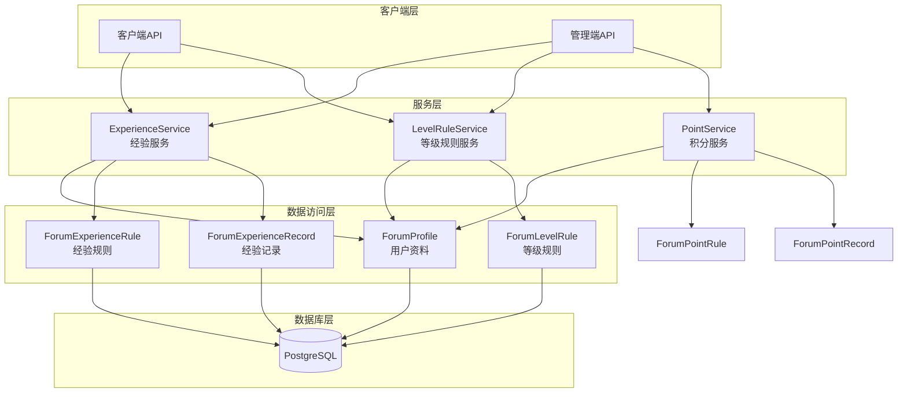
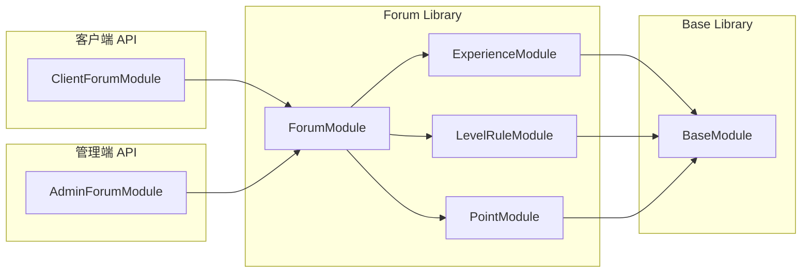
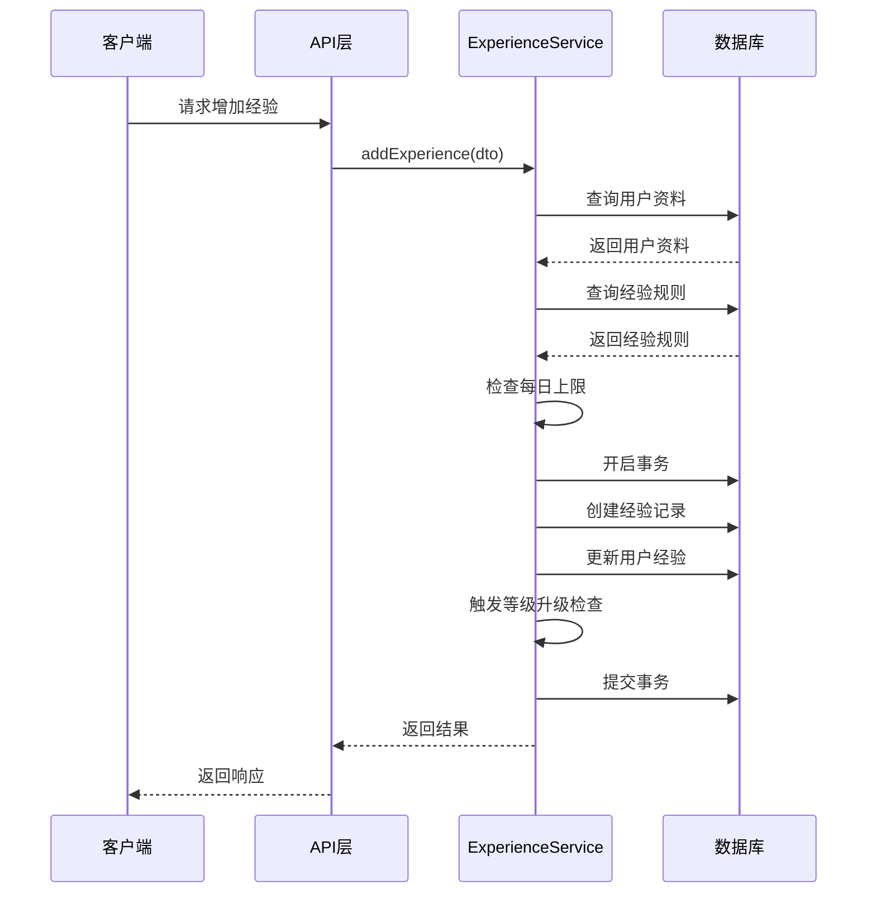
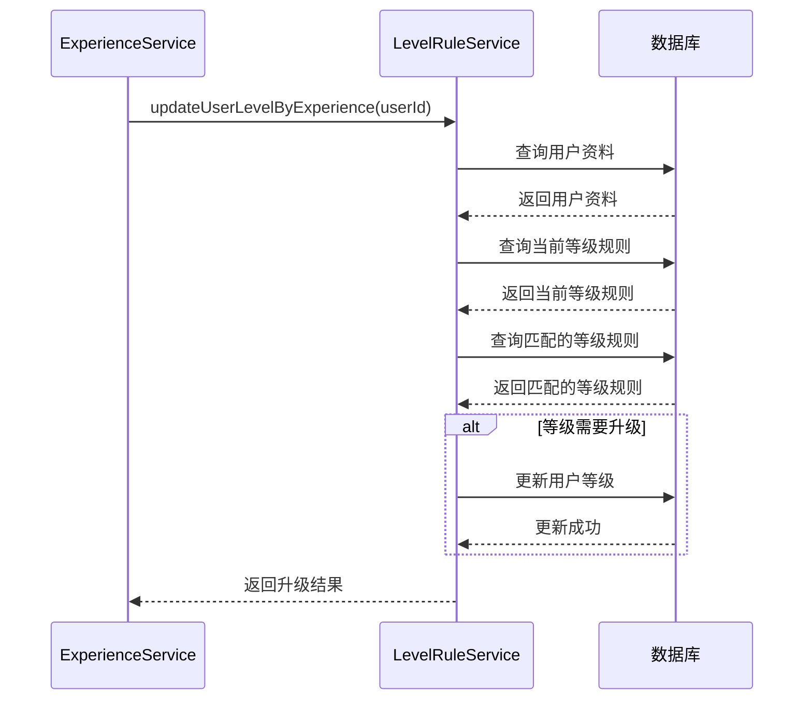
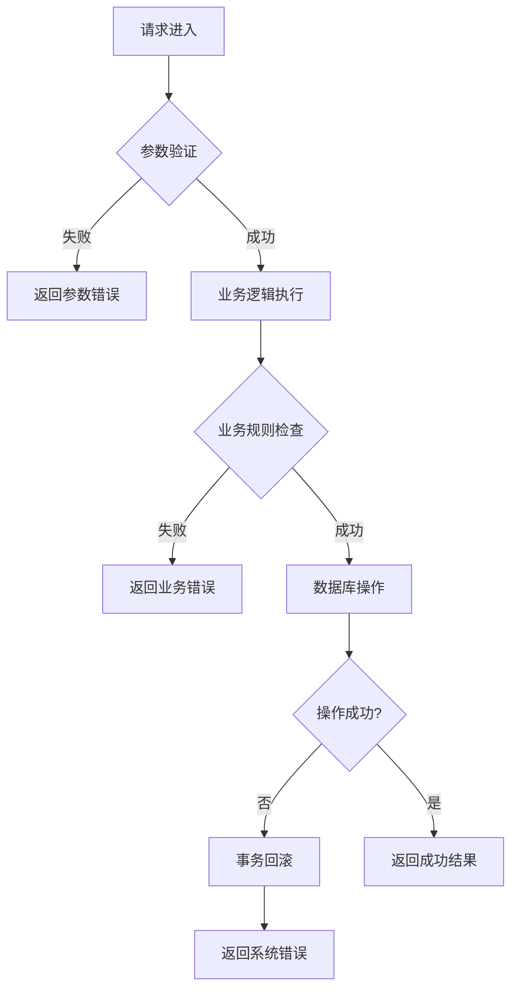

# DESIGN_论坛经验系统优化

## 一、系统架构设计

### 1.1 整体架构图



### 1.2 分层设计

#### 1.2.1 API 层
- **管理端 API** (`apps/admin-api/src/modules/forum-management/experience/`)
  - 经验规则 CRUD
  - 经验记录查询
  - 用户经验统计

- **客户端 API** (`apps/app-api/src/modules/forum/experience/`)
  - 用户经验信息查询

#### 1.2.2 服务层 (`libs/forum/src/experience/`)
- **ExperienceService**: 经验服务
  - 增加经验
  - 经验规则管理
  - 经验记录查询
  - 用户经验统计

#### 1.2.3 数据访问层 (`prisma/models/forum/`)
- **ForumProfile**: 用户资料表（新增 experience 字段）
- **ForumExperienceRule**: 经验规则表
- **ForumExperienceRecord**: 经验记录表
- **ForumLevelRule**: 等级规则表（修改 requiredPoints 为 requiredExperience）

## 二、核心组件设计

### 2.1 数据模型设计

#### 2.1.1 ForumProfile 表修改
```prisma
model ForumProfile {
  /// 主键ID
  id                      Int                         @id @default(autoincrement())
  /// 关联的用户ID
  userId                  Int                         @unique @map("user_id")
  /// 论坛积分
  points                  Int                         @default(0)
  /// 论坛经验值（新增字段）
  experience              Int                         @default(0)
  /// 等级ID
  levelId                 Int                         @map("level_id")
  // ... 其他字段保持不变
}
```

#### 2.1.2 ForumExperienceRule 表（新增）
```prisma
model ForumExperienceRule {
  /// 主键ID
  id                 Int            @id @default(autoincrement())
  /// 规则名称
  name               String         @db.VarChar(50)
  /// 规则类型（1=发表主题, 2=发表回复, 3=主题被点赞, 4=回复被点赞, 5=主题被收藏, 6=每日签到）
  type               Int            @db.SmallInt
  /// 经验值变化
  experience         Int            @default(0)
  /// 每日上限（0=无限制）
  dailyLimit         Int            @default(0)
  /// 是否启用
  isEnabled          Boolean        @default(true) @map("is_enabled")
  /// 备注
  remark             String?        @db.VarChar(500)
  /// 创建时间
  createdAt          DateTime       @default(now()) @map("created_at")
  /// 更新时间
  updatedAt          DateTime       @updatedAt @map("updated_at")

  /// 关联的经验记录
  records            ForumExperienceRecord[]

  @@map("forum_experience_rule")
}
```

#### 2.1.3 ForumExperienceRecord 表（新增）
```prisma
model ForumExperienceRecord {
  /// 主键ID
  id                 Int            @id @default(autoincrement())
  /// 关联的用户ID
  profileId          Int            @map("profile_id")
  /// 关联的规则ID
  ruleId             Int            @map("rule_id")
  /// 经验值变化
  experience         Int            @default(0)
  /// 变化前经验值
  beforeExperience   Int            @map("before_experience")
  /// 变化后经验值
  afterExperience    Int            @map("after_experience")
  /// 备注
  remark             String?        @db.VarChar(500)
  /// 创建时间
  createdAt          DateTime       @default(now()) @map("created_at")

  /// 关联的用户资料
  profile            ForumProfile   @relation(fields: [profileId], references: [id], onDelete: Cascade)
  /// 关联的规则
  rule               ForumExperienceRule @relation(fields: [ruleId], references: [id], onDelete: Cascade)

  @@index([profileId])
  @@index([ruleId])
  @@index([createdAt])
  @@map("forum_experience_record")
}
```

#### 2.1.4 ForumLevelRule 表修改
```prisma
model ForumLevelRule {
  /// 主键ID
  id                 Int            @id @default(autoincrement())
  /// 等级名称
  name               String         @db.VarChar(20)
  /// 等级描述
  description        String?        @db.VarChar(200)
  /// 所需经验值（修改字段名）
  requiredExperience Int            @map("required_experience")
  /// 等级图标
  icon               String?        @db.VarChar(200)
  /// 等级颜色
  color              String?        @db.VarChar(20)
  /// 是否启用
  isEnabled          Boolean        @default(true) @map("is_enabled")
  /// 排序
  order              Int            @default(0)
  /// 每日主题发布限制
  dailyTopicLimit    Int            @default(0) @map("daily_topic_limit")
  /// 每日回复限制
  dailyReplyLimit    Int            @default(0) @map("daily_reply_limit")
  /// 发布间隔（秒）
  postInterval       Int            @default(0) @map("post_interval")
  /// 最大文件大小（MB）
  maxFileSize        Int            @default(0) @map("max_file_size")
  /// 创建时间
  createdAt          DateTime       @default(now()) @map("created_at")
  /// 更新时间
  updatedAt          DateTime       @updatedAt @map("updated_at")

  /// 关联的用户资料
  profiles           ForumProfile[]

  @@index([isEnabled])
  @@map("forum_level_rule")
}
```

### 2.2 服务层设计

#### 2.2.1 ExperienceService 设计
```typescript
@Injectable()
export class ExperienceService extends BaseService {
  /**
   * 增加经验值
   * @param addExperienceDto 增加经验的数据
   * @returns 增加经验的结果
   */
  async addExperience(addExperienceDto: AddExperienceDto)

  /**
   * 创建经验规则
   * @param createExperienceRuleDto 创建规则的数据
   * @returns 创建的规则信息
   */
  async createExperienceRule(createExperienceRuleDto: CreateExperienceRuleDto)

  /**
   * 分页查询经验规则列表
   * @param queryExperienceRuleDto 查询条件
   * @returns 分页的规则列表
   */
  async getExperienceRulePage(queryExperienceRuleDto: QueryExperienceRuleDto)

  /**
   * 获取经验规则详情
   * @param id 规则ID
   * @returns 规则详情信息
   */
  async getExperienceRuleDetail(id: number)

  /**
   * 更新经验规则
   * @param updateExperienceRuleDto 更新规则的数据
   * @returns 更新后的规则信息
   */
  async updateExperienceRule(updateExperienceRuleDto: UpdateExperienceRuleDto)

  /**
   * 分页查询经验记录列表
   * @param queryExperienceRecordDto 查询条件
   * @returns 分页的记录列表
   */
  async getExperienceRecordPage(queryExperienceRecordDto: QueryExperienceRecordDto)

  /**
   * 获取经验记录详情
   * @param id 记录ID
   * @returns 记录详情信息
   */
  async getExperienceRecordDetail(id: number)

  /**
   * 获取用户经验统计
   * @param profileId 用户ID
   * @returns 经验统计信息
   */
  async getUserExperienceStats(profileId: number)

  /**
   * 根据规则类型增加经验
   * @param profileId 用户ID
   * @param ruleType 规则类型
   * @param remark 备注
   * @returns 操作结果
   */
  async addExperienceByRuleType(
    profileId: number,
    ruleType: ExperienceRuleTypeEnum,
    remark?: string,
  )
}
```

#### 2.2.2 LevelRuleService 修改
```typescript
@Injectable()
export class LevelRuleService extends BaseService {
  /**
   * 根据经验值更新用户等级（修改方法）
   * @param userId 用户ID
   * @returns 等级更新结果
   */
  async updateUserLevelByExperience(userId: number)

  /**
   * 根据经验值获取用户等级（新增方法）
   * @param experience 经验值
   * @returns 等级规则
   */
  async getLevelByExperience(experience: number)
}
```

### 2.3 DTO 设计

#### 2.3.1 ExperienceRule DTO
```typescript
// 基础 DTO
export class BaseExperienceRuleDto extends BaseDto {
  name!: string
  type!: ExperienceRuleTypeEnum
  experience!: number
  dailyLimit!: number
  isEnabled!: boolean
  remark?: string
}

// 创建 DTO
export class CreateExperienceRuleDto extends OmitType(
  BaseExperienceRuleDto,
  OMIT_BASE_FIELDS,
) {}

// 更新 DTO
export class UpdateExperienceRuleDto extends IntersectionType(
  PartialType(CreateExperienceRuleDto),
  IdDto,
) {}

// 查询 DTO
export class QueryExperienceRuleDto extends IntersectionType(
  PageDto,
  PartialType(PickType(BaseExperienceRuleDto, ['name', 'type', 'isEnabled'])),
) {}
```

#### 2.3.2 ExperienceRecord DTO
```typescript
// 基础 DTO
export class BaseExperienceRecordDto extends BaseDto {
  profileId!: number
  ruleId?: number
  experience!: number
  beforeExperience!: number
  afterExperience!: number
  remark?: string
}

// 查询 DTO
export class QueryExperienceRecordDto extends IntersectionType(
  PageDto,
  PartialType(PickType(BaseExperienceRecordDto, ['ruleId'])),
) {
  profileId!: number
}

// 增加经验 DTO
export class AddExperienceDto {
  profileId!: number
  ruleType!: ExperienceRuleTypeEnum
  remark?: string
}
```

#### 2.3.3 ExperienceRuleTypeEnum
```typescript
export enum ExperienceRuleTypeEnum {
  CREATE_TOPIC = 1,      // 发表主题
  CREATE_REPLY = 2,      // 发表回复
  TOPIC_LIKED = 3,       // 主题被点赞
  REPLY_LIKED = 4,       // 回复被点赞
  TOPIC_FAVORITED = 5,   // 主题被收藏
  DAILY_CHECKIN = 6,    // 每日签到
}
```

## 三、模块依赖关系图



## 四、接口契约定义

### 4.1 管理端 API

#### 4.1.1 经验规则管理
```typescript
// 创建经验规则
POST /forum/experience-rule
Body: CreateExperienceRuleDto
Response: BaseExperienceRuleDto

// 查询经验规则列表
GET /forum/experience-rule
Query: QueryExperienceRuleDto
Response: PaginationResult<BaseExperienceRuleDto>

// 获取经验规则详情
GET /forum/experience-rule/:id
Response: BaseExperienceRuleDto

// 更新经验规则
PATCH /forum/experience-rule
Body: UpdateExperienceRuleDto
Response: BaseExperienceRuleDto

// 删除经验规则
DELETE /forum/experience-rule/:id
Response: { success: boolean }
```

#### 4.1.2 经验记录查询
```typescript
// 查询经验记录列表
GET /forum/experience-record
Query: QueryExperienceRecordDto
Response: PaginationResult<BaseExperienceRecordDto>

// 获取经验记录详情
GET /forum/experience-record/:id
Response: BaseExperienceRecordDto & { profile: ForumProfile, rule: ForumExperienceRule }
```

#### 4.1.3 用户经验统计
```typescript
// 获取用户经验统计
GET /forum/experience/stats/:profileId
Response: {
  currentExperience: number
  todayEarned: number
  level: ForumLevelRule
}
```

### 4.2 客户端 API

#### 4.2.1 用户经验信息
```typescript
// 获取用户经验信息
GET /forum/experience/:profileId
Response: {
  currentExperience: number
  level: ForumLevelRule
  nextLevel: ForumLevelRule | null
  progress: number // 0-100
}
```

## 五、数据流向图

### 5.1 增加经验流程


### 5.2 等级升级流程


## 六、异常处理策略

### 6.1 业务异常
- **用户资料不存在**: `BadRequestException('用户资料不存在')`
- **经验规则不存在**: `BadRequestException('经验规则不存在')`
- **经验规则配置错误**: `BadRequestException('经验规则配置错误')`
- **今日经验已达上限**: `BadRequestException('今日经验已达上限')`
- **经验记录不存在**: `BadRequestException('经验记录不存在')`

### 6.2 系统异常
- **数据库连接失败**: 使用全局异常处理器捕获
- **事务失败**: 自动回滚，返回错误信息
- **并发冲突**: 使用数据库事务和乐观锁处理

### 6.3 异常处理流程


## 七、数据库索引设计

### 7.1 ForumExperienceRule 表
```prisma
@@index([type])
@@index([isEnabled])
```

### 7.2 ForumExperienceRecord 表
```prisma
@@index([profileId])
@@index([ruleId])
@@index([createdAt])
@@index([profileId, createdAt])
```

### 7.3 ForumLevelRule 表
```prisma
@@index([isEnabled])
@@index([requiredExperience])
```

### 7.4 ForumProfile 表
```prisma
@@index([experience])
@@index([levelId])
```

## 八、性能优化策略

### 8.1 查询优化
- 使用索引加速查询
- 分页查询避免全表扫描
- 使用 select 只查询必要字段

### 8.2 缓存策略
- 经验规则缓存（使用 Redis）
- 用户等级信息缓存
- 缓存失效策略：规则更新时清除缓存

### 8.3 批量操作
- 批量增加经验（如批量导入用户）
- 批量查询经验记录

## 九、安全设计

### 9.1 权限控制
- 管理端 API 需要管理员权限
- 客户端 API 需要用户身份验证
- 用户只能查询自己的经验信息

### 9.2 数据验证
- 使用 class-validator 进行参数验证
- 验证经验值范围（不能为负数）
- 验证每日上限（不能为负数）

### 9.3 防刷机制
- 每日上限限制
- IP 限制
- 频率限制（使用 @Throttle 装饰器）

## 十、扩展性设计

### 10.1 经验规则扩展
- 支持自定义规则类型
- 支持动态配置经验值
- 支持条件触发（如连续签到）

### 10.2 等级系统扩展
- 支持多维度等级计算
- 支持等级特权配置
- 支持等级徽章系统

### 10.3 数据统计扩展
- 支持经验增长趋势分析
- 支持用户活跃度分析
- 支持经验来源分析
