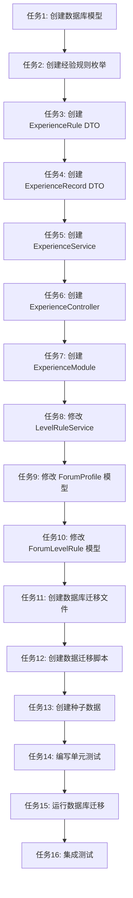

# TASK_论坛经验系统优化

## 一、任务依赖图

## 二、原子任务列表

### 任务1: 创建数据库模型
**优先级**: 高
**状态**: 待执行

**输入契约**:
- 前置依赖: 无
- 输入数据: DESIGN 文档中的数据模型定义
- 环境依赖: Prisma CLI 已安装

**输出契约**:
- 输出数据:
  - `prisma/models/forum/forum-experience-rule.prisma` 文件
  - `prisma/models/forum/forum-experience-record.prisma` 文件
- 交付物: 完整的 Prisma 模型定义文件
- 验收标准:
  - 模型字段完整且符合设计文档
  - 关联关系正确配置
  - 索引配置合理

**实现约束**:
- 技术栈: Prisma ORM
- 接口规范: 遵循现有 Prisma 模型命名规范
- 质量要求: 字段注释完整，类型定义准确

**依赖关系**:
- 后置任务: 任务2、任务9、任务10
- 并行任务: 无

---

### 任务2: 创建经验规则枚举
**优先级**: 高
**状态**: 待执行

**输入契约**:
- 前置依赖: 任务1
- 输入数据: DESIGN 文档中的枚举定义
- 环境依赖: 无

**输出契约**:
- 输出数据: `libs/forum/src/experience/experience.constant.ts` 文件
- 交付物: 完整的经验规则枚举定义
- 验收标准:
  - 枚举值完整且符合设计文档
  - 枚举命名符合项目规范
  - 包含完整的注释

**实现约束**:
- 技术栈: TypeScript
- 接口规范: 参考现有 ForumPointRuleTypeEnum 实现
- 质量要求: 代码风格一致，注释清晰

**依赖关系**:
- 后置任务: 任务3
- 并行任务: 无

---

### 任务3: 创建 ExperienceRule DTO
**优先级**: 高
**状态**: 待执行

**输入契约**:
- 前置依赖: 任务2
- 输入数据: DESIGN 文档中的 DTO 定义
- 环境依赖: 无

**输出契约**:
- 输出数据:
  - `libs/forum/src/experience/dto/experience-rule.dto.ts` 文件
- 交付物: 完整的经验规则 DTO 定义
- 验收标准:
  - DTO 类完整且符合设计文档
  - 使用正确的装饰器（@ValidateNumber, @ValidateString 等）
  - 继承关系正确
  - Swagger 文档注释完整

**实现约束**:
- 技术栈: TypeScript + class-validator + @nestjs/swagger
- 接口规范: 参考现有 PointRule DTO 实现
- 质量要求: 验证规则完整，注释清晰

**依赖关系**:
- 后置任务: 任务4
- 并行任务: 无

---

### 任务4: 创建 ExperienceRecord DTO
**优先级**: 高
**状态**: 待执行

**输入契约**:
- 前置依赖: 任务3
- 输入数据: DESIGN 文档中的 DTO 定义
- 环境依赖: 无

**输出契约**:
- 输出数据:
  - `libs/forum/src/experience/dto/experience-record.dto.ts` 文件
- 交付物: 完整的经验记录 DTO 定义
- 验收标准:
  - DTO 类完整且符合设计文档
  - 使用正确的装饰器
  - 继承关系正确
  - Swagger 文档注释完整

**实现约束**:
- 技术栈: TypeScript + class-validator + @nestjs/swagger
- 接口规范: 参考现有 PointRecord DTO 实现
- 质量要求: 验证规则完整，注释清晰

**依赖关系**:
- 后置任务: 任务5
- 并行任务: 无

---

### 任务5: 创建 ExperienceService
**优先级**: 高
**状态**: 待执行

**输入契约**:
- 前置依赖: 任务4
- 输入数据: DESIGN 文档中的服务定义
- 环境依赖: Prisma Client 已生成

**输出契约**:
- 输出数据:
  - `libs/forum/src/experience/experience.service.ts` 文件
- 交付物: 完整的经验服务实现
- 验收标准:
  - 所有方法实现完整
  - 事务处理正确
  - 异常处理完善
  - 代码注释完整
  - 符合现有代码风格

**实现约束**:
- 技术栈: NestJS + Prisma
- 接口规范: 参考现有 PointService 实现
- 质量要求:
  - 使用事务确保数据一致性
  - 完善的错误处理
  - 代码可读性高
  - 遵循 SOLID 原则

**依赖关系**:
- 后置任务: 任务6
- 并行任务: 任务8

---

### 任务6: 创建 ExperienceController
**优先级**: 高
**状态**: 待执行

**输入契约**:
- 前置依赖: 任务5
- 输入数据: DESIGN 文档中的 API 定义
- 环境依赖: 无

**输出契约**:
- 输出数据:
  - `libs/forum/src/experience/experience.controller.ts` 文件
- 交付物: 完整的经验控制器实现
- 验收标准:
  - 所有接口实现完整
  - 路由定义正确
  - 参数验证完善
  - Swagger 文档注释完整
  - 权限控制正确

**实现约束**:
- 技术栈: NestJS
- 接口规范: 参考现有 PointController 实现
- 质量要求:
  - RESTful API 设计
  - 完善的参数验证
  - 清晰的错误响应
  - 完整的 Swagger 文档

**依赖关系**:
- 后置任务: 任务7
- 并行任务: 无

---

### 任务7: 创建 ExperienceModule
**优先级**: 高
**状态**: 待执行

**输入契约**:
- 前置依赖: 任务6
- 输入数据: DESIGN 文档中的模块定义
- 环境依赖: 无

**输出契约**:
- 输出数据:
  - `libs/forum/src/experience/experience.module.ts` 文件
- 交付物: 完整的经验模块定义
- 验收标准:
  - 模块配置正确
  - 依赖注入正确
  - 导出正确

**实现约束**:
- 技术栈: NestJS
- 接口规范: 参考现有 PointModule 实现
- 质量要求: 模块结构清晰

**依赖关系**:
- 后置任务: 无
- 并行任务: 无

---

### 任务8: 修改 LevelRuleService
**优先级**: 高
**状态**: 待执行

**输入契约**:
- 前置依赖: 任务1
- 输入数据: DESIGN 文档中的服务修改定义
- 环境依赖: 无

**输出契约**:
- 输出数据:
  - 修改后的 `libs/forum/src/level-rule/level-rule.service.ts` 文件
- 交付物: 修改后的等级规则服务
- 验收标准:
  - updateUserLevelByPoints 方法改为 updateUserLevelByExperience
  - 新增 getLevelByExperience 方法
  - 保持向后兼容
  - 代码注释更新

**实现约束**:
- 技术栈: NestJS + Prisma
- 接口规范: 保持现有接口签名
- 质量要求:
  - 向后兼容
  - 代码风格一致
  - 注释完整

**依赖关系**:
- 后置任务: 无
- 并行任务: 任务5

---

### 任务9: 修改 ForumProfile 模型
**优先级**: 高
**状态**: 待执行

**输入契约**:
- 前置依赖: 任务1
- 输入数据: DESIGN 文档中的模型修改定义
- 环境依赖: 无

**输出契约**:
- 输出数据:
  - 修改后的 `prisma/models/forum/forum-profile.prisma` 文件
- 交付物: 修改后的用户资料模型
- 验收标准:
  - 新增 experience 字段
  - 字段类型正确
  - 默认值正确
  - 注释完整

**实现约束**:
- 技术栈: Prisma ORM
- 接口规范: 遵循现有 Prisma 模型规范
- 质量要求: 字段定义准确，注释完整

**依赖关系**:
- 后置任务: 任务11
- 并行任务: 任务10

---

### 任务10: 修改 ForumLevelRule 模型
**优先级**: 高
**状态**: 待执行

**输入契约**:
- 前置依赖: 任务1
- 输入数据: DESIGN 文档中的模型修改定义
- 环境依赖: 无

**输出契约**:
- 输出数据:
  - 修改后的 `prisma/models/forum/forum-level-rule.prisma` 文件
- 交付物: 修改后的等级规则模型
- 验收标准:
  - requiredPoints 改为 requiredExperience
  - 字段类型正确
  - 注释更新

**实现约束**:
- 技术栈: Prisma ORM
- 接口规范: 遵循现有 Prisma 模型规范
- 质量要求: 字段定义准确，注释完整

**依赖关系**:
- 后置任务: 任务11
- 并行任务: 任务9

---

### 任务11: 创建数据库迁移文件
**优先级**: 高
**状态**: 待执行

**输入契约**:
- 前置依赖: 任务9、任务10
- 输入数据: 修改后的 Prisma 模型文件
- 环境依赖: Prisma CLI 已安装

**输出契约**:
- 输出数据: `prisma/migrations/` 目录下的迁移文件
- 交付物: 完整的数据库迁移文件
- 验收标准:
  - 迁移文件生成成功
  - SQL 语句正确
  - 包含数据迁移逻辑

**实现约束**:
- 技术栈: Prisma Migrate
- 接口规范: 遵循 Prisma 迁移规范
- 质量要求: 迁移逻辑正确，可回滚

**依赖关系**:
- 后置任务: 任务12
- 并行任务: 无

---

### 任务12: 创建数据迁移脚本
**优先级**: 高
**状态**: 待执行

**输入契约**:
- 前置依赖: 任务11
- 输入数据: 现有用户数据
- 环境依赖: 无

**输出契约**:
- 输出数据: `scripts/migrate-experience.ts` 文件
- 交付物: 完整的数据迁移脚本
- 验收标准:
  - 将现有积分转换为经验值
  - 保持用户等级不变
  - 错误处理完善
  - 日志记录完整

**实现约束**:
- 技术栈: TypeScript + Prisma
- 接口规范: 遵循现有脚本规范
- 质量要求:
  - 数据迁移准确
  - 错误处理完善
  - 可回滚

**依赖关系**:
- 后置任务: 任务15
- 并行任务: 任务13

---

### 任务13: 创建种子数据
**优先级**: 中
**状态**: 待执行

**输入契约**:
- 前置依赖: 任务1
- 输入数据: DESIGN 文档中的种子数据定义
- 环境依赖: 无

**输出契约**:
- 输出数据:
  - `prisma/seed/modules/forum/experience.ts` 文件
- 交付物: 完整的经验规则种子数据
- 验收标准:
  - 包含所有经验规则类型
  - 规则配置合理
  - 符合最佳实践

**实现约束**:
- 技术栈: TypeScript + Prisma
- 接口规范: 参考现有种子数据实现
- 质量要求: 数据配置合理，注释清晰

**依赖关系**:
- 后置任务: 任务15
- 并行任务: 任务12

---

### 任务14: 编写单元测试
**优先级**: 中
**状态**: 待执行

**输入契约**:
- 前置依赖: 任务5
- 输入数据: ExperienceService 实现
- 环境依赖: Jest 测试框架已配置

**输出契约**:
- 输出数据:
  - `libs/forum/src/experience/experience.service.spec.ts` 文件
- 交付物: 完整的单元测试
- 验收标准:
  - 覆盖所有公共方法
  - 测试用例完整
  - 边界条件测试
  - 异常情况测试
  - 测试覆盖率 > 80%

**实现约束**:
- 技术栈: Jest
- 接口规范: 参考现有测试实现
- 质量要求: 测试用例完整，可读性高

**依赖关系**:
- 后置任务: 任务16
- 并行任务: 无

---

### 任务15: 运行数据库迁移
**优先级**: 高
**状态**: 待执行

**输入契约**:
- 前置依赖: 任务12、任务13
- 输入数据: 迁移文件和种子数据
- 环境依赖: 数据库连接正常

**输出契约**:
- 输出数据: 数据库迁移执行结果
- 交付物: 成功的数据库迁移
- 验收标准:
  - 数据库表创建成功
  - 数据迁移成功
  - 种子数据插入成功
  - 无错误日志

**实现约束**:
- 技术栈: Prisma Migrate
- 接口规范: 遵循 Prisma 迁移流程
- 质量要求: 迁移成功，数据完整

**依赖关系**:
- 后置任务: 任务16
- 并行任务: 无

---

### 任务16: 集成测试
**优先级**: 高
**状态**: 待执行

**输入契约**:
- 前置依赖: 任务14、任务15
- 输入数据: 完整的实现
- 环境依赖: 测试环境已配置

**输出契约**:
- 输出数据: 测试报告
- 交付物: 完整的集成测试
- 验收标准:
  - 所有测试通过
  - 功能完整性验证
  - 性能测试通过
  - 兼容性测试通过

**实现约束**:
- 技术栈: Jest + Supertest
- 接口规范: 参考现有集成测试实现
- 质量要求: 测试覆盖全面

**依赖关系**:
- 后置任务: 无
- 并行任务: 无

---

## 三、任务执行顺序

### 第一阶段：基础模型和常量（任务1-2）
1. 任务1: 创建数据库模型
2. 任务2: 创建经验规则枚举

### 第二阶段：DTO 定义（任务3-4）
3. 任务3: 创建 ExperienceRule DTO
4. 任务4: 创建 ExperienceRecord DTO

### 第三阶段：服务层实现（任务5-8）
5. 任务5: 创建 ExperienceService
6. 任务8: 修改 LevelRuleService（可与任务5并行）

### 第四阶段：控制器和模块（任务6-7）
7. 任务6: 创建 ExperienceController
8. 任务7: 创建 ExperienceModule

### 第五阶段：模型修改和迁移（任务9-13）
9. 任务9: 修改 ForumProfile 模型
10. 任务10: 修改 ForumLevelRule 模型
11. 任务11: 创建数据库迁移文件
12. 任务12: 创建数据迁移脚本
13. 任务13: 创建种子数据

### 第六阶段：测试和部署（任务14-16）
14. 任务14: 编写单元测试
15. 任务15: 运行数据库迁移
16. 任务16: 集成测试

## 四、风险评估

### 4.1 高风险任务
- **任务11**: 数据库迁移文件创建
  - 风险: 迁移文件可能包含错误
  - 应对: 充分测试，准备回滚方案

- **任务12**: 数据迁移脚本
  - 风险: 数据迁移可能失败或数据不一致
  - 应对: 充分测试，备份原始数据

### 4.2 中风险任务
- **任务5**: ExperienceService 实现
  - 风险: 事务处理可能有问题
  - 应对: 充分测试，参考现有实现

- **任务8**: LevelRuleService 修改
  - 风险: 可能影响现有功能
  - 应对: 保持向后兼容，充分测试

### 4.3 低风险任务
- 任务1-4: 模型和 DTO 定义
- 任务6-7: 控制器和模块
- 任务13: 种子数据
- 任务14-16: 测试

## 五、质量门控

### 5.1 每个任务完成后的检查
- [ ] 代码符合项目规范
- [ ] 代码注释完整
- [ ] 通过 lint 检查
- [ ] 通过 type-check 检查
- [ ] 单元测试通过（如适用）

### 5.2 阶段性检查
- [ ] 第一阶段完成后：模型和枚举定义正确
- [ ] 第二阶段完成后：DTO 定义完整且验证规则正确
- [ ] 第三阶段完成后：服务层功能完整且错误处理完善
- [ ] 第四阶段完成后：API 接口完整且文档清晰
- [ ] 第五阶段完成后：数据库迁移成功且数据完整
- [ ] 第六阶段完成后：所有测试通过

### 5.3 最终验收
- [ ] 所有需求已实现
- [ ] 所有测试通过
- [ ] 代码质量符合标准
- [ ] 文档完整准确
- [ ] 性能指标达标
- [ ] 兼容性验证通过
