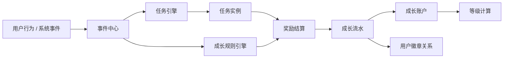
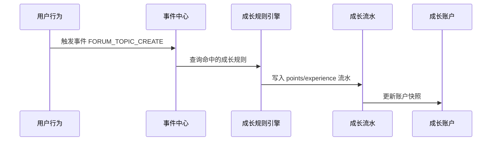
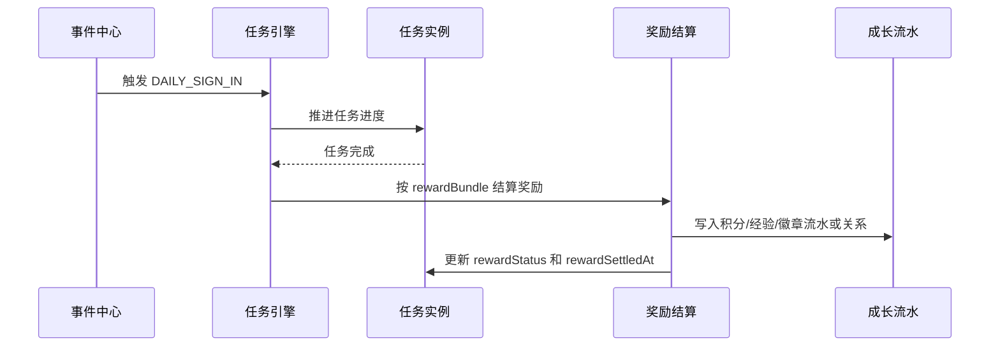
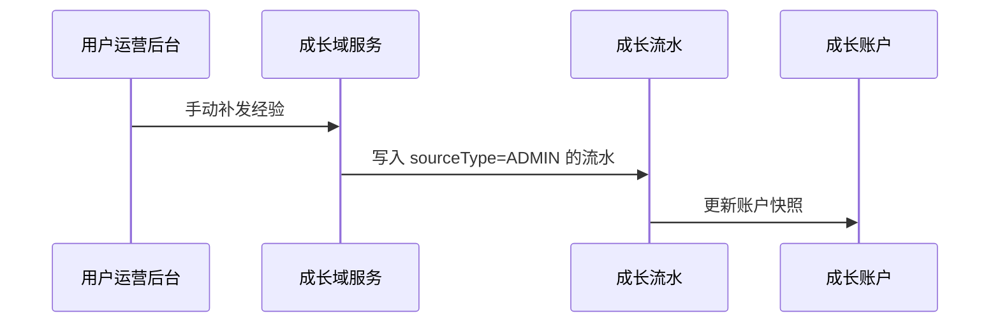
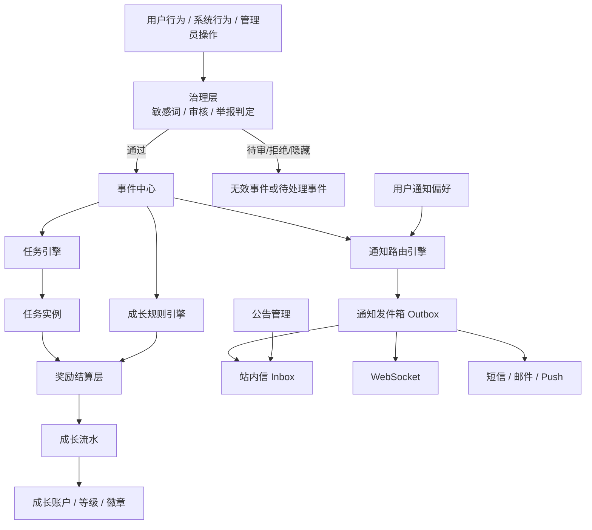

# 任务、奖励、成长、通知与事件系统全量梳理

## 1. 文档目的

本文用于梳理当前项目中任务模块、奖励配置、积分、经验、等级、徽章、通知、公告、消息监控、审核治理、审计日志等能力的领域边界，并给出一套适合后续持续演进的目标模型。

本文重点回答 7 个问题：

1. 当前设计哪里合理，哪里只是“能跑”
2. 任务、奖励、成长之间应该如何建模
3. 通知、公告、站内信、消息监控分别属于什么层级
4. 项目里哪些页面已经接通业务能力，哪些仍是 API-only、占位页或静态演示
5. 事件、审核、敏感词、举报、审计日志之间应该如何分层
6. 后续如果扩展活动、运营补发、商城兑换、消息推送，应该如何兼容
7. 如何在不大拆大改的前提下，逐步从现状迁移到目标模型

## 2. 当前项目现状

### 2.1 当前已有模块

从 `apps/web-ele` 的页面和 API 定义看，当前系统已经具备以下能力：

- 任务管理
  - 任务模板管理：`apps/web-ele/src/views/system-manager/tasks`
  - 任务领取记录：`apps/web-ele/src/views/system-manager/tasks/task-assignment-modal.vue`
- 用户成长管理
  - 积分规则：`apps/web-ele/src/views/user-growth/points`
  - 经验规则：`apps/web-ele/src/views/user-growth/experience`
  - 等级规则：`apps/web-ele/src/views/user-growth/level-rules`
  - 徽章管理：`apps/web-ele/src/views/user-growth/badges`
- 用户运营入口
  - 手动加积分、扣积分、加经验、发徽章：`apps/web-ele/src/views/user-manager/profile/components/user-operation-modal.vue`

### 2.2 当前设计中合理的部分

- 任务模板和任务领取记录分开建模，这个方向是正确的
- 积分、经验、等级、徽章被归类到统一的 `user-growth` 模块，方向也合理
- 任务实例中已有 `cycleKey`、`taskSnapshot`、`progress`、`status` 等字段，说明已经具备“模板”和“实例”分离意识

### 2.3 当前设计的主要问题

#### 问题 1：成长事件字典已经漂移

前端当前维护的成长类型常量只覆盖部分事件：

- `apps/web-ele/src/views/user-growth/model/constants.ts`

但后端 DTO 已经支持更多规则类型：

- `apps/web-ele/src/api/types/growth.d.ts`
- `apps/web-ele/src/api/types/appUsers.d.ts`

这会导致：

- 前端无法完整配置所有规则类型
- 用户运营弹窗里也无法完整使用所有可用事件类型
- 前后端枚举语义失真，后续维护风险持续升高

#### 问题 2：任务奖励还不是结构化模型

当前任务的奖励通过 `rewardConfig` 字段承载，且表现为自由文本字符串：

- `apps/web-ele/src/api/types/task.d.ts`
- `apps/web-ele/src/views/system-manager/tasks/model/shared.ts`

这意味着：

- 奖励内容无法被前端稳定理解
- 无法校验奖励类型是否合法
- 无法与积分、经验、徽章等已有实体建立强关联
- 后续统计、审计、失败重试、幂等控制都不稳定

#### 问题 3：任务完成与奖励结算之间没有显式闭环

当前任务领取记录只有：

- 进度
- 状态
- 周期实例键
- 任务快照

但缺少以下关键字段：

- 奖励是否已结算
- 奖励在什么时间结算
- 奖励对应哪些流水
- 是否已经执行过发奖幂等校验

这会让“为什么这个任务没发奖”或“是否重复发奖”难以审计。

#### 问题 4：领域边界有交叉

现在的规则定义在 `user-growth`，但用户实际的积分/经验/徽章查询和人工操作入口又放在 `app-users` 侧。

这类布局短期可用，但长期会导致：

- 成长系统和用户管理系统互相借模型
- 运营入口承担了领域能力
- API 归属越来越模糊

#### 问题 5：积分规则与经验规则高度重复

当前积分规则和经验规则几乎是两套镜像结构：

- 规则类型
- 增减值
- 日上限
- 总上限
- 启用状态
- 备注

这种设计短期直观，但长期会造成：

- 字段新增要改两遍
- 运营配置体验不一致
- 规则统计能力难统一

## 3. 目标设计原则

推荐未来按以下原则收敛：

1. 事件是入口，任务和成长都是事件驱动
2. 奖励不是孤立模块，而是任务系统与成长系统之间的结算层
3. 任务负责“是否完成”，成长负责“如何记账”
4. 所有积分、经验变化都必须落到统一流水
5. 用户当前积分、经验、等级属于账户快照，不应成为唯一真实来源
6. 后台“用户运营”只是能力入口，不应承担领域定义职责

## 4. 推荐总体架构

可以把整个系统拆成 3 层：

- 触发层：用户行为、系统事件、后台运营动作
- 判定层：任务完成判定、成长规则匹配、奖励计算
- 记账层：积分/经验流水、徽章发放、等级更新、账户聚合

## 5. 推荐领域模型

### 5.1 EventType

统一所有成长和任务触发原因的事件字典。

建议字段：

| 字段 | 说明 |
| --- | --- |
| `code` | 事件编码，如 `FORUM_TOPIC_CREATE` |
| `name` | 中文名称 |
| `category` | 分类，如 forum / work / chapter / social / admin |
| `targetType` | 目标类型，如 topic / chapter / badge |
| `isEnabled` | 是否启用 |
| `remark` | 备注 |

职责：

- 成为前后端统一的“单一事实源”
- 供任务触发条件、成长规则、人工补发共用

当前项目里前端 `growthTypeOptions` 应逐步替换为该模型的派生数据。

### 5.2 TaskDefinition

任务模板，定义“任务是什么”和“如何完成”。

建议保留现有字段：

- `id`
- `code`
- `title`
- `type`
- `status`
- `isEnabled`
- `claimMode`
- `completeMode`
- `priority`
- `publishStartAt`
- `publishEndAt`
- `targetCount`
- `cover`
- `description`

建议新增或调整：

- `triggerEventCode`
- `repeatPolicy`
- `completionRule`
- `rewardBundleId`

建议移除自由文本奖励依赖：

- 用结构化奖励关联替换 `rewardConfig`

### 5.3 TaskAssignment

用户在某一周期下的一次任务实例。

当前已有的思路基本正确，建议扩展为：

| 字段 | 说明 |
| --- | --- |
| `id` | 主键 |
| `taskId` | 任务模板 ID |
| `userId` | 用户 ID |
| `cycleKey` | 周期实例键 |
| `status` | `PENDING / IN_PROGRESS / COMPLETED / EXPIRED` |
| `progress` | 当前进度 |
| `target` | 目标值 |
| `claimedAt` | 领取时间 |
| `completedAt` | 完成时间 |
| `expiredAt` | 过期时间 |
| `taskSnapshot` | 任务快照 |
| `context` | 补充上下文 |
| `rewardStatus` | `PENDING / SUCCESS / FAILED / SKIPPED` |
| `rewardSettledAt` | 奖励结算时间 |
| `rewardLedgerIds` | 关联流水 ID 列表 |
| `idempotencyKey` | 防重复结算幂等键 |
| `version` | 乐观锁版本 |

### 5.4 RewardBundle

奖励包，表示一个任务完成后可发放的一组奖励。

建议字段：

| 字段 | 说明 |
| --- | --- |
| `id` | 主键 |
| `name` | 奖励包名称 |
| `business` | 业务域 |
| `isEnabled` | 是否启用 |
| `remark` | 备注 |

### 5.5 RewardItem

奖励包中的单个奖励项。

建议字段：

| 字段 | 说明 |
| --- | --- |
| `id` | 主键 |
| `bundleId` | 奖励包 ID |
| `rewardType` | `POINTS / EXPERIENCE / BADGE / COUPON / ITEM` |
| `amount` | 数量 |
| `badgeId` | 徽章 ID，可空 |
| `couponId` | 优惠券 ID，可空 |
| `conditionJson` | 条件扩展，可空 |
| `sortOrder` | 排序 |

这样一个任务可以天然支持：

- 奖励积分
- 奖励经验
- 奖励徽章
- 奖励未来的新资产类型

### 5.6 GrowthRule

非任务型成长规则。也就是“某事件发生后，直接对成长产生影响”的规则。

推荐统一抽象，不再把积分规则和经验规则当作完全独立的领域对象。

建议字段：

| 字段 | 说明 |
| --- | --- |
| `id` | 主键 |
| `eventCode` | 关联事件编码 |
| `business` | 业务域 |
| `pointsDelta` | 积分变化 |
| `experienceDelta` | 经验变化 |
| `dailyLimit` | 每日上限 |
| `totalLimit` | 总上限 |
| `isEnabled` | 是否启用 |
| `remark` | 备注 |

这样有几个好处：

- 一套规则可以同时决定积分和经验
- 后台配置更统一
- 后续做统计、导入、版本控制更容易

如果 UI 层仍想分成“积分规则页”和“经验规则页”，也可以只是同一模型的不同视图。

### 5.7 GrowthLedger

所有成长变化的统一流水。

这是整个设计里最重要的实体，推荐所有成长变更都必须进入流水。

建议字段：

| 字段 | 说明 |
| --- | --- |
| `id` | 主键 |
| `userId` | 用户 ID |
| `sourceType` | `EVENT / TASK / ADMIN / EXCHANGE / SYSTEM` |
| `sourceId` | 来源记录 ID |
| `eventCode` | 事件编码 |
| `pointsDelta` | 积分变化 |
| `experienceDelta` | 经验变化 |
| `beforePoints` | 变更前积分 |
| `afterPoints` | 变更后积分 |
| `beforeExperience` | 变更前经验 |
| `afterExperience` | 变更后经验 |
| `remark` | 备注 |
| `targetType` | 关联目标类型 |
| `targetId` | 关联目标 ID |
| `idempotencyKey` | 幂等键 |
| `createdAt` | 创建时间 |

建议统一覆盖这些场景：

- 普通事件成长奖励
- 任务完成奖励
- 管理员手动补发
- 管理员手动扣减
- 商城兑换或消费

### 5.8 GrowthAccount

用户成长账户快照，用于高频读。

建议字段：

| 字段 | 说明 |
| --- | --- |
| `userId` | 用户 ID |
| `currentPoints` | 当前积分 |
| `currentExperience` | 当前经验 |
| `currentLevelId` | 当前等级 |
| `badgeCount` | 徽章数量 |
| `updatedAt` | 更新时间 |

建议定位：

- 作为查询快照
- 不作为唯一真实来源
- 真实来源应为 `GrowthLedger + UserBadgeRelation + LevelRule`

### 5.9 LevelRule

等级规则属于成长域的聚合配置。

你们当前模型方向已经比较完整，建议继续保留：

- `requiredExperience`
- `sortOrder`
- `loginDays`
- `discount`
- `dailyTopicLimit`
- `dailyReplyCommentLimit`
- `dailyLikeLimit`
- `dailyFavoriteLimit`
- `workCollectionLimit`
- `blacklistLimit`
- `postInterval`

建议增加明确定位：

- 它是“成长结果的派生规则”
- 不直接参与记账
- 主要作用是做等级判定和权限限制

### 5.10 BadgeDefinition 与 UserBadgeRelation

当前徽章设计建议拆成两个概念：

#### BadgeDefinition

定义徽章本身：

- 名称
- 图标
- 类型
- 事件键
- 业务域
- 是否启用

#### UserBadgeRelation

定义用户持有关系：

- `userId`
- `badgeId`
- `sourceType`
- `sourceId`
- `createdAt`
- `revokedAt`

这样可以更清楚地区分：

- “系统里有哪些徽章”
- “某个用户为什么拥有这个徽章”

## 6. 推荐模块边界

推荐最终按以下边界组织：

### 6.1 任务域

职责：

- 任务模板配置
- 任务触发条件
- 任务进度推进
- 任务完成判定
- 奖励结算触发

包含：

- `TaskDefinition`
- `TaskAssignment`
- `RewardBundle`
- `RewardItem`

### 6.2 成长域

职责：

- 成长规则配置
- 积分 / 经验记账
- 等级计算
- 徽章定义和发放
- 用户成长账户聚合

包含：

- `EventType`
- `GrowthRule`
- `GrowthLedger`
- `GrowthAccount`
- `LevelRule`
- `BadgeDefinition`
- `UserBadgeRelation`

### 6.3 用户运营入口

职责：

- 作为后台人工操作入口
- 调用任务域或成长域能力
- 不直接承担领域定义

建议：

- 人工加积分，本质是创建一条 `GrowthLedger`
- 手动发徽章，本质是新增 `UserBadgeRelation`
- 不建议在 `app-users` 下长期维护另一套平行规则模型

## 7. 推荐业务流

### 7.1 普通事件驱动成长

例如用户发帖：

### 7.2 任务完成后发奖励

例如完成签到任务：

### 7.3 后台手动补发

例如管理员手动加经验：

## 8. 推荐数据表草案

以下为建议的数据表集合：

| 表名 | 作用 |
| --- | --- |
| `event_type` | 统一事件字典 |
| `task_definition` | 任务模板 |
| `task_assignment` | 任务实例 |
| `reward_bundle` | 奖励包 |
| `reward_item` | 奖励项 |
| `growth_rule` | 成长规则 |
| `growth_ledger` | 积分/经验流水 |
| `growth_account` | 用户成长账户快照 |
| `level_rule` | 等级规则 |
| `badge_definition` | 徽章定义 |
| `user_badge_relation` | 用户徽章关系 |

如果你们短期不想动表结构太大，也可以采用渐进版本：

- 第一步先补 `task_assignment.reward_status`
- 第二步把 `rewardConfig` 从纯文本切到结构化 JSON
- 第三步再拆 `reward_bundle` 和 `reward_item`

## 9. 与当前代码的映射建议

### 9.1 当前可直接保留的部分

- `system-manager/tasks` 页面结构可以保留
- `user-growth/level-rules` 页面结构可以保留
- `user-growth/badges` 页面结构可以保留
- `TaskAssignment` 当前已有的实例化思路可以保留

### 9.2 当前需要优先收敛的部分

#### 优先级 P0：统一事件字典

现状：

- 前端 `growthTypeOptions` 与后端支持枚举不一致

建议：

- 由后端提供事件类型列表接口或共享常量
- 前端所有规则选择、人工补发选择全部基于统一来源

#### 优先级 P1：结构化任务奖励

现状：

- `rewardConfig` 仅为文本字段

建议：

- 至少先定义稳定 JSON schema
- 后续再落地成独立表

#### 优先级 P1：补全任务奖励结算状态

现状：

- 任务记录里没有奖励结算状态

建议：

- 在任务实例里补充 `rewardStatus`、`rewardSettledAt`、`idempotencyKey`

#### 优先级 P2：统一积分规则与经验规则

现状：

- 两套规则高度重复

建议：

- 领域层统一为 `GrowthRule`
- UI 可暂时继续保留双页面

#### 优先级 P2：把用户运营从“平行模型”收回为“能力入口”

现状：

- `app-users` 里承接了部分成长领域动作

建议：

- 后续把 API 设计统一为“用户运营调用成长域服务”
- 不再让 `app-users` 长期持有独立成长语义

## 10. 建议迁移路径

### 阶段 1：止血

目标：先把当前最容易出错的地方收住。

任务：

- 统一事件类型字典
- 修正前端事件枚举覆盖范围
- 为任务实例补奖励结算字段
- 明确积分规则是否允许删除

### 阶段 2：结构化

目标：把关键自由文本改成结构化配置。

任务：

- 为 `rewardConfig` 定义 JSON schema
- 表单增加结构化编辑能力
- 后端开始校验奖励内容合法性

### 阶段 3：抽象统一

目标：统一成长规则模型。

任务：

- 抽象 `GrowthRule`
- 逐步收敛积分规则和经验规则
- 统一统计与导出接口

### 阶段 4：闭环化

目标：形成完整的任务奖励引擎。

任务：

- 引入 `RewardBundle / RewardItem`
- 所有奖励写入统一流水
- 用户账户改为流水聚合快照

## 11. 任务/成长视角结论

当前项目的设计不能说完全不合理，但更准确的判断是：

- 任务系统：已经具备模板与实例分离基础
- 成长系统：已经具备积分、经验、等级、徽章管理基础
- 奖励系统：目前还只是“字段层存在”，尚未成为真正可审计、可扩展、可复用的结算层

推荐的最终收敛方式不是把“任务、奖励、积分、经验”当成并列平铺的后台栏目，而是形成下面这条主链路：

`事件 -> 任务/规则判定 -> 奖励结算 -> 成长流水 -> 账户与等级展示`

如果后续继续演进，最值得优先投入的不是再加更多页面，而是先把：

- 事件字典
- 奖励结构
- 统一流水
- 任务奖励结算状态

这四件事收稳。

## 12. 项目全景地图

### 12.1 路由级模块地图

从 `apps/web-ele/src/router/routes/modules` 看，当前后台已经形成 9 组一级能力。它们并不是同一层级的领域模块，有些是业务域，有些是治理层，有些是观测层，还有一部分只是演示态 UI。

| 分组 | 主要模块 | 当前角色 | 与事件/通知/奖励的关系 | 现状判断 |
| --- | --- | --- | --- | --- |
| Dashboard | `analytics`、`workspace` | 门户与工作台 | 更像首页展示，不是领域真源 | 偏展示层 |
| 内容管理 | 漫画、小说、作者、分类、标签 | 内容主数据后台 | 是大量内容事件的上游生产域，但后台暂未把这些行为事件显式化 | 业务域已落地，事件层未显式化 |
| 论坛管理 | 帖子、版主、版主申请、板块、话题 | 社区主业务后台 | 是论坛互动事件和审核事件的核心来源 | 业务域较完整 |
| 用户管理 | 用户信息、会员、签到、任务、积分、经验、等级、徽章 | 用户成长与运营后台 | 是任务、成长、奖励、人工补发的直接操作入口 | 核心，但边界有混用 |
| 综合管理 | 表情、举报、敏感词、敏感词统计 | 治理与风控后台 | 决定事件是否有效、是否隐藏、是否进入审核 | 治理层部分已落地 |
| APP 管理 | 公告、协议、页面配置、系统配置 | 客户端内容与配置后台 | 公告属于广播内容通知；页面配置可作为通知跳转目标 | 公告已落地，消息中心未并入 |
| 系统管理 | 个人中心、系统配置、数据字典、系统用户、系统状态 | 管理后台基础设施 | 提供审核策略、短信配置、站点配置等底座 | 基础层已落地，部分为演示 |
| 日志管理 | 登录日志、操作日志 | 技术审计后台 | 记录后台操作行为，但不是业务事件流水 | 观测层已落地 |
| 统计管理 | 漫画统计、小说统计、论坛统计 | 业务统计看板 | 消费业务数据，但不是事件中心本身 | 读模型层 |

### 12.2 按成熟度分层

如果按“是否真正接上业务能力”来看，当前项目大致可以分成四层：

| 层级 | 代表模块 | 判断 |
| --- | --- | --- |
| 已完整接入 | 公告管理、任务管理、积分规则、经验规则、等级规则、徽章管理、用户运营弹窗、敏感词管理、敏感词统计、帖子审核、版主申请审核、系统配置、审计日志 | 页面、API、DTO、交互闭环基本存在 |
| 半接入 | 用户个人通知设置、顶部通知铃铛、系统状态页告警、统计页 | 有页面或展示，但业务链路不完整，部分是静态数据 |
| API-only | 消息 outbox 监控、WS 监控 | DTO 和 API 已经出现，但后台没有路由和页面承接 |
| 占位/待建设 | 签到管理、举报管理 | 已有路由入口，但页面还是占位 |

这层判断很重要，因为很多“看上去已经有”的能力，其实只是：

- DTO 已经生成了，但 UI 没接
- 页面已经放出来了，但数据是静态演示
- 路由已经开了，但业务还没真正实现

## 13. 通知与消息系统现状

### 13.1 公告管理：这是“广播内容通知”，不是“消息中心”

当前项目里通知相关最完整的模块其实是公告：

- 路由：`apps/web-ele/src/router/routes/modules/app-manager.ts`
- 页面：`apps/web-ele/src/views/app-manager/announcement/index.vue`
- API：`apps/web-ele/src/api/core/announcement.ts`
- DTO：`apps/web-ele/src/api/types/announcement.d.ts`

它已经具备：

- 公告类型：平台、活动、维护、更新、政策
- 优先级
- 发布状态
- 发布时间窗
- 关联页面 `pageId`
- 是否置顶
- 是否弹窗展示
- 富文本内容、摘要、封面背景图

所以它更像：

- APP 端公共广播内容
- 一种运营内容发布能力
- 通知域里的“广播型渠道”

它不像：

- 面向单个用户的站内信
- 任务完成通知
- 点赞/评论触发的社交通知
- 可追踪已读未读的消息中心

结论：

- 公告模块已经存在，但它属于 `Announcement / Broadcast Content`
- 它不应该和“用户消息中心”“任务提醒”“站内信投递 outbox”混为一谈

### 13.2 消息中心监控：后端投递基础设施已经露头，但后台没接住

当前代码里已经有两组很明确的消息监控 API：

- `messageMonitorOutboxSummaryApi`
- `messageMonitorWsSummaryApi`

对应文件：

- `apps/web-ele/src/api/core/message.ts`
- `apps/web-ele/src/api/types/message.d.ts`

从 DTO 看，后端消息基础设施至少已经考虑过：

- outbox 待处理、处理中、失败、重试
- 最老待处理消息滞留时间
- 错误分布 TopN
- 按域和状态分布
- WebSocket ack 成功率
- ack 延迟
- reconnect 次数
- resync 补偿成功率

这说明后端视角里已经不是“发个站内信文本”那么简单，而是存在：

- 可靠投递
- 重试机制
- WebSocket 实时消息
- 补偿同步
- 运维监控

但问题是：

- 当前后台路由里没有消息中心或消息监控页面
- `apps/web-ele/src/api/core/index.ts` 已经导出了这些 API，但没有页面消费它们
- 也没有任何地方展示 outbox 积压、WS 成功率、失败原因

结论：

- 消息基础设施很可能已经在后端出现
- 但管理端目前还没有“消息中心/通知中心”的管理与观测入口

### 13.3 用户通知偏好：现在只是 UI 壳子

用户个人中心里有一个“新消息提醒”页签：

- 页面：`apps/web-ele/src/views/_core/profile/index.vue`
- 子页：`apps/web-ele/src/views/_core/profile/notification-setting.vue`

当前只定义了 3 个开关：

- `accountPassword`
- `systemMessage`
- `todoTask`

文案分别对应：

- 其他用户的消息以站内信通知
- 系统消息以站内信通知
- 待办任务以站内信通知

但这部分存在三个明显问题：

1. 字段命名和业务语义不一致  
   `accountPassword` 这个字段名看起来像“账户密码”，但描述却是“其他用户的消息通知”。

2. 没有任何 API 调用  
   搜索结果显示它只是把 schema 传给 `ProfileNotificationSetting` 组件，没有取数、保存、提交。

3. 没有和真实消息链路关联  
   即使用户切换开关，也不会影响任务、系统消息、社交通知的投递。

结论：

- 当前“通知偏好设置”是演示型页面，不是实际可用的通知偏好系统

### 13.4 顶部通知铃铛与系统状态告警：目前也是静态演示

`apps/web-ele/src/layouts/basic.vue` 里顶部通知使用的是本地 `ref`：

- 初始通知数组直接写在前端
- 读已读、删除、全部已读都是本地状态处理
- 没有任何 API
- 没有未读数接口
- 没有消息详情接口

`apps/web-ele/src/views/system-manager/server-status/index.vue` 也同样明确写着：

- “系统状态页（静态数据演示）”
- 告警、服务状态、Notification 服务状态、维护窗口等都来自本地静态常量

所以这两块都不能算真正的通知系统，只能算：

- 后台 UI 组件示意
- 未来通知中心的视觉原型

### 13.5 短信与外部通道：有配置底座，没有通知编排

系统配置已经提供：

- 阿里云密钥配置
- 短信服务 Endpoint
- 短信签名
- 验证码长度
- 验证码过期时间
- 联系邮箱

对应文件：

- `apps/web-ele/src/views/system-manager/system-config/modules/model/shared.ts`
- `apps/web-ele/src/api/types/system.d.ts`

但当前它更偏：

- 验证码/账号安全类基础配置
- 站点运营配置

还不是：

- 通知模板配置
- 渠道路由策略
- 用户偏好驱动的多通道通知

结论：

- 通知渠道底座已经有短信入口
- 但尚未上升为通知域模型

## 14. 项目里的事件体系现状

### 14.1 当前唯一成型的“业务事件字典”实际上藏在成长规则里

目前项目里最像“统一业务事件枚举”的东西，不在任务模块，也不在通知模块，而是在成长规则 DTO 的 `ruleType` 注释里：

- `apps/web-ele/src/api/types/growth.d.ts`
- `apps/web-ele/src/api/types/appUsers.d.ts`

它已经覆盖了非常广的业务面：

- 论坛事件：`1~16`
- 漫画作品事件：`100~104`
- 小说作品事件：`200~204`
- 漫画章节事件：`300~306`
- 小说章节事件：`400~406`
- 徽章与成就：`600~602`
- 社交关系：`700~703`
- 举报处理结果：`800~801`

这意味着从“领域事实”角度看，项目其实已经默认存在一套业务事件中心，只是现在：

- 这套字典挂在成长规则 DTO 上
- 前端只维护了部分常量
- 任务模块没有显式复用它
- 通知模块也没有显式复用它
- 审核/举报/消息中心没有围绕它统一建模

也就是说，事件已经存在，但没有被提升成一等公民。

### 14.2 事件生产者与当前消费者

项目里的事件生产者很多，但消费者目前比较分散：

| 事件来源 | 典型事件 | 当前后台可见模块 | 当前主要消费者 |
| --- | --- | --- | --- |
| 论坛域 | 发帖、回复、点赞、收藏、评论、举报、被评论 | 帖子管理、帖子详情、审核、标签、版主申请 | 成长规则、用户统计、审核治理 |
| 内容域 | 漫画/小说浏览、点赞、收藏、评论、举报、章节阅读/购买/下载/兑换 | 漫画管理、小说管理、统计页 | 事件只体现在 DTO 枚举里，后台没有显式事件管理 |
| 用户域 | 完善资料、上传头像、关注、被关注、分享、邀请 | 用户详情、关注数量修复、用户运营 | 成长规则和用户成长账户 |
| 管理员域 | 补发积分、扣减积分、补经验、发徽章、删内容、审内容 | 用户运营、系统管理、日志管理 | 成长记录、审计日志 |
| 广播内容域 | 发布公告、取消发布、弹窗公告 | 公告管理 | APP 端公告展示 |
| 治理域 | 敏感词命中、审核通过、审核拒绝、举报处理 | 敏感词管理、敏感词统计、帖子审核、版主申请审核 | 决定业务事件是否有效、是否继续传播 |
| 技术消息域 | outbox 积压、WS ack、重连、补偿 | 仅 API 合同 | 运维监控，尚无后台页面 |

当前最大的问题不是“没有事件”，而是：

- 生产者多
- 消费者也有
- 但中间缺少统一的事件中心、结算层和通知路由层

### 14.3 治理层不是事件层，但会决定事件是否生效

项目里和“事件是否成立”最相关的不是任务模块，而是治理模块：

- 敏感词管理：`apps/web-ele/src/views/forum/sensitive-word/index.vue`
- 敏感词统计：`apps/web-ele/src/views/forum/sensitive-word-statistics/index.vue`
- 内容审核策略：`apps/web-ele/src/views/system-manager/system-config/modules/model/shared.ts`
- 帖子审核：`apps/web-ele/src/views/forum/topic/index.vue`
- 版主申请审核：`apps/web-ele/src/views/forum/moderator-application/index.vue`
- 举报管理：`apps/web-ele/src/views/forum/reports/index.vue`（目前占位）

这层的作用不是给奖励，也不是给通知，而是先判定：

- 内容是否合法
- 是否隐藏
- 是否待审核
- 是否通过
- 举报是否有效

一旦这层没有被建模进主链路，就会出现典型问题：

- 用户明明发帖了，但因敏感词待审核，是否应该立即加分
- 举报提交后，应该在“提交举报时”加分，还是在“举报判定有效时”加分
- 审核拒绝内容是否还应该触发任务进度
- 待审核内容是否应该推送给版主/管理员

结论：

- 治理层是事件链路里的“闸门”
- 不应该只作为独立后台页面存在

### 14.4 审计与监控不是业务流水

当前项目还有两套容易被误当成“事件流水”的东西：

1. 审计日志  
   `apps/web-ele/src/api/core/audit.ts` + `apps/web-ele/src/api/types/audit.d.ts`

2. 消息监控摘要  
   `apps/web-ele/src/api/core/message.ts` + `apps/web-ele/src/api/types/message.d.ts`

它们很重要，但它们分别回答的是不同问题：

- 审计日志：后台管理员做了什么
- 消息监控：通知投递系统当前健康不健康

它们不回答：

- 某个业务事件是否成立
- 某个任务奖励是否已经结算
- 某个用户为什么收到了这条站内信
- 某个通知是否已读、已送达、已 ack

所以后续一定要区分：

- `Audit Log`：技术与管理操作审计
- `Business Event`：业务事件事实
- `Growth Ledger`：成长变更流水
- `Notification Delivery`：通知投递流水

## 15. 目标架构：把通知补进闭环

### 15.1 推荐主链路

这张图里最重要的补充有两个：

1. 通知不再是“页面上多一个消息模块”  
   它应该是事件中心的下游消费者。

2. 治理层前置  
   不是所有行为都直接进入奖励和通知，很多行为要先过敏感词、审核、举报判定。

### 15.2 推荐领域边界

| 领域 | 核心职责 | 当前代码里的对应雏形 | 当前缺口 |
| --- | --- | --- | --- |
| Event | 统一事件字典、事件载荷、业务来源、目标对象 | `growth.d.ts` 里的 `ruleType` 注释 | 没有独立模块、没有共享常量源 |
| Governance | 敏感词、审核、举报判定、隐藏策略 | 敏感词管理、系统配置审核策略、帖子审核 | 举报管理仍占位，未回写主链路 |
| Task | 任务定义、实例、进度、周期、领取模式 | `tasks` 页面和 DTO | 奖励仍是文本，未和结算层解耦 |
| Reward Settlement | 统一结算奖励、幂等、失败重试 | 只有 `rewardConfig` 雏形 | 还没有成为独立层 |
| Growth | 积分、经验、等级、徽章、成长流水 | `user-growth`、用户运营 | 规则重复，流水口径分散 |
| Notification | 模板、偏好、路由、outbox、投递、已读未读 | 公告、消息监控 API、通知设置 UI | 还没有统一通知域 |
| Observability | 审计、投递监控、统计大盘 | 日志管理、消息监控 DTO、统计页 | 与业务流水边界还没拉开 |

### 15.3 通知领域推荐核心实体

| 实体 | 作用 | 建议关键字段 |
| --- | --- | --- |
| `EventType` | 统一事件定义 | `code`、`business`、`label`、`sourceType`、`targetType`、`isEnabled` |
| `EventEnvelope` | 业务事件实例 | `eventId`、`eventCode`、`actorId`、`subjectId`、`targetId`、`payload`、`occurredAt`、`validState` |
| `NotificationTemplate` | 消息模板 | `templateKey`、`titleTemplate`、`bodyTemplate`、`route`、`channelMask`、`business` |
| `NotificationPreference` | 用户通知偏好 | `userId`、`systemEnabled`、`taskEnabled`、`socialEnabled`、`marketingEnabled`、`channelConfig` |
| `NotificationOutbox` | 统一待投递消息池 | `eventId`、`receiverId`、`channel`、`status`、`retryCount`、`nextRetryAt`、`idempotencyKey` |
| `NotificationDelivery` | 渠道投递结果 | `outboxId`、`channel`、`provider`、`providerMessageId`、`deliveredAt`、`ackAt`、`errorText` |
| `NotificationInbox` | 站内信读模型 | `userId`、`title`、`body`、`payload`、`route`、`isRead`、`readAt`、`outboxId` |
| `Announcement` | 广播内容通知 | `announcementType`、`pageId`、`isPublished`、`showAsPopup`、`publishStartTime`、`publishEndTime` |

### 15.4 公告和站内信的推荐边界

为了避免以后继续混淆，建议明确区分：

| 类型 | 面向对象 | 生命周期 | 是否需要已读未读 | 当前对应模块 |
| --- | --- | --- | --- | --- |
| 公告 `Announcement` | 全体用户或平台范围 | 以发布周期和置顶规则为主 | 通常不强调单用户已读 | 公告管理 |
| 站内信 `Inbox Message` | 单个用户或用户分组 | 以投递、已读、删除为主 | 强依赖已读未读 | 目前缺失 |
| 实时消息 `Realtime Event` | 当前在线用户 | 以 WS ack、重连、补偿为主 | 更偏送达确认 | 目前只有监控 DTO |
| 任务提醒 `Task Reminder` | 符合条件的单个用户 | 通常依赖任务实例状态 | 需要防重复通知 | 目前只有文案，没有链路 |

## 16. 数据模型补充草案

### 16.1 `event_type`

建议用于取代当前散落在前端常量和 DTO 注释里的枚举定义。

建议字段：

- `id`
- `code`
- `label`
- `business`
- `sourceType`
- `targetType`
- `isEnabled`
- `remark`

### 16.2 `event_record`

如果后续需要可审计的业务事件中心，可以引入轻量事件实例表。

建议字段：

- `id`
- `eventCode`
- `actorId`
- `subjectId`
- `targetId`
- `targetType`
- `payload`
- `validState`
- `governanceResult`
- `occurredAt`
- `createdAt`

备注：

- 高吞吐业务未必需要所有事件长期落库
- 但任务、奖励、通知的关键事件建议至少具备可追踪能力

### 16.3 `notification_template`

建议字段：

- `id`
- `templateKey`
- `business`
- `scene`
- `titleTemplate`
- `bodyTemplate`
- `route`
- `channelMask`
- `isEnabled`
- `remark`

### 16.4 `notification_preference`

建议字段：

- `id`
- `userId`
- `systemEnabled`
- `taskEnabled`
- `socialEnabled`
- `marketingEnabled`
- `inboxEnabled`
- `wsEnabled`
- `smsEnabled`
- `pushEnabled`
- `configJson`
- `updatedAt`

建议说明：

- 当前 `accountPassword` 这类字段名不建议继续沿用
- 偏好项应该按“消息类型”与“通道类型”拆开

### 16.5 `notification_outbox`

建议字段：

- `id`
- `eventId`
- `templateKey`
- `receiverId`
- `channel`
- `status`
- `retryCount`
- `maxRetryCount`
- `nextRetryAt`
- `errorText`
- `payload`
- `idempotencyKey`
- `createdAt`
- `updatedAt`

建议状态：

- `PENDING`
- `PROCESSING`
- `SUCCESS`
- `FAILED`
- `CANCELLED`

这张表和当前 `message.d.ts` 的 outbox 监控摘要可以形成自然对应。

### 16.6 `notification_delivery`

建议字段：

- `id`
- `outboxId`
- `channel`
- `provider`
- `providerMessageId`
- `requestPayload`
- `responsePayload`
- `deliveredAt`
- `ackAt`
- `errorText`
- `createdAt`

建议说明：

- WS ack、短信发送回执、Push 送达状态都可以沉到这一层
- 当前 `MessageWsMonitorSummaryDto` 的很多指标都应该从这一层聚合

### 16.7 `notification_inbox`

建议字段：

- `id`
- `userId`
- `title`
- `body`
- `summary`
- `route`
- `payload`
- `outboxId`
- `eventId`
- `isRead`
- `readAt`
- `deletedAt`
- `createdAt`

它代表的就是未来真正的“站内信中心”。

### 16.8 `announcement`

这张表当前其实已经存在 DTO 形态，建议继续保留为广播内容模型，而不是硬塞进 `notification_inbox`：

- 它面向的是公共发布
- 它和页面配置 `pageId` 有天然耦合
- 它有发布时间窗、置顶、弹窗等内容运营属性

## 17. 更完整的改造优先级

### 优先级 P0：把“真假能力”标清楚

目标：先避免团队对当前系统成熟度产生误判。

建议动作：

- 把文档、路由、页面状态梳理清楚
- 标记 `check-in`、`forum/reports` 为占位功能
- 标记 `layouts/basic.vue` 通知铃铛为静态演示
- 标记 `server-status` 告警为静态演示
- 标记 `notification-setting.vue` 为 UI-only

### 优先级 P0：统一业务事件字典

目标：让任务、成长、通知、治理都说同一种“事件语言”。

建议动作：

- 从后端输出统一事件类型字典
- 前端不再手写 `growthTypeOptions`
- 人工加积分、加经验、任务配置、通知模板全部复用同一事件定义

### 优先级 P1：把通知域最基本的“可观测性”接上后台

目标：先让已有后端消息能力可被管理端看到。

建议动作：

- 新增消息监控页面
- 展示 outbox 积压、失败 TopN、WS ack 成功率、重试情况
- 形成“消息中心/投递监控”入口

### 优先级 P1：补齐通知偏好持久化

目标：把个人通知设置从演示态变成可用功能。

建议动作：

- 引入真实的偏好 DTO 和保存接口
- 按消息类型与通道类型重命名字段
- 与任务提醒、系统消息、社交通知建立映射

### 优先级 P1：结构化任务奖励与任务结算状态

目标：把任务从“配置页”提升到“可结算、可审计”的任务引擎。

建议动作：

- `rewardConfig` 从自由文本改为稳定 JSON schema
- 任务实例补齐 `rewardStatus`、`rewardSettledAt`、`idempotencyKey`
- 奖励结果统一写入成长流水

### 优先级 P1：把用户运营动作收口

目标：人工补发不再成为绕开领域模型的平行入口。

建议动作：

- 用户运营页继续保留
- 但底层统一走成长域/通知域服务
- 手动发积分、经验、徽章、通知都带来源类型和幂等键

### 优先级 P2：建立通知 outbox / inbox 闭环

目标：把“消息 API”“消息偏好”“消息 UI”真正串起来。

建议动作：

- 建 `NotificationTemplate`
- 建 `NotificationPreference`
- 建 `NotificationOutbox`
- 建 `NotificationInbox`
- 顶部通知铃铛改为读取真实 inbox 数据

### 优先级 P2：把治理层接回主链路

目标：审核和举报不再只是后台页面动作，而是主业务链的一部分。

建议动作：

- 举报管理落地正式页面
- `800/801` 事件纳入统一事件字典
- 审核通过/拒绝明确影响任务、奖励、通知是否触发
- 敏感词命中与审核结果形成可追踪治理结果

### 优先级 P3：补齐签到、任务提醒、社交通知

目标：把当前已经在枚举和文案里出现、但页面仍缺失的功能补全。

建议动作：

- 落地签到管理真实页面
- 基于任务实例状态触发任务提醒
- 接入关注、评论、点赞等社交通知
- 区分广播公告与个体站内信

## 18. 全量补充结论

把通知、事件、治理、审计一起纳入后，当前项目更准确的判断是：

- 它不是“没有设计”，而是已经长出了多条支线
- 这些支线分别在任务、成长、公告、审核、日志、消息监控里各自发展
- 现在最大的问题不是功能少，而是缺一层统一抽象把它们串起来

当前最像主轴的其实应该是：

`治理 -> 事件 -> 任务/成长规则 -> 奖励结算 -> 成长账户`

而通知应该并行挂在事件之后：

`治理 -> 事件 -> 通知路由 -> outbox -> inbox / ws / sms`

如果只看页面数量，项目已经不算小；但如果看领域闭环，它还处于：

- 业务后台很多
- 统一事件层不足
- 通知域刚露出后端基础设施
- 治理层已经成型但还没接回主链路

因此最推荐的收敛方式不是继续堆更多“并列栏目”，而是逐步形成 7 个清晰层次：

1. 治理层
2. 事件层
3. 任务层
4. 奖励结算层
5. 成长层
6. 通知层
7. 观测层

只要这 7 层收拢清楚，后面无论扩展：

- 活动任务
- 商城兑换
- 签到体系
- 版主通知
- 社交通知
- 短信提醒
- Push 推送

都会比现在稳定很多。

---

文档落地点：

- `docs/task-growth-reward-domain-design.md`
